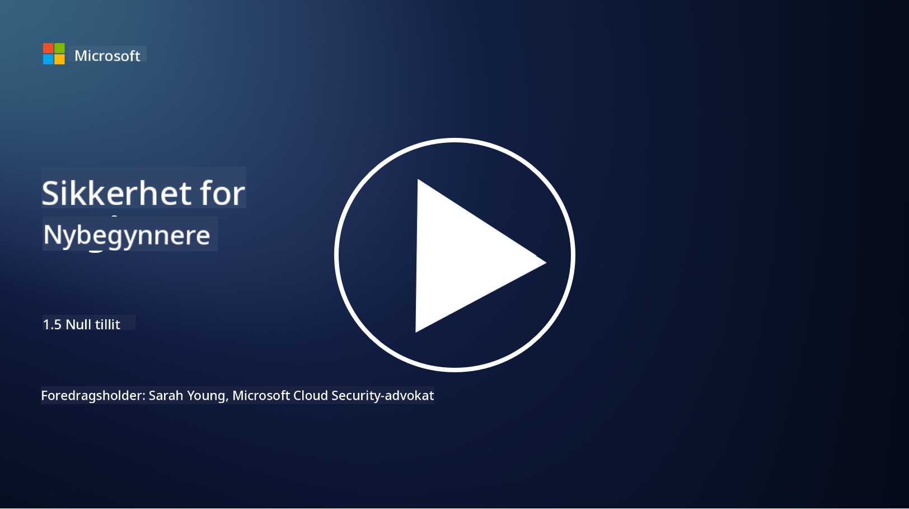
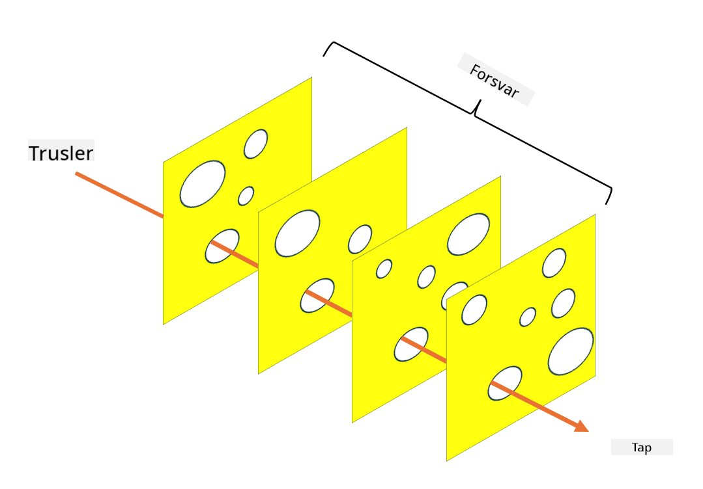

<!--
CO_OP_TRANSLATOR_METADATA:
{
  "original_hash": "75f77f972d2233c584f87c1eb96c983b",
  "translation_date": "2025-09-03T23:48:00+00:00",
  "source_file": "1.5 Zero trust.md",
  "language_code": "no"
}
-->
# Null tillit

"Null tillit" er et begrep som ofte brukes i sikkerhetsmiljøer i dag. Men hva betyr det egentlig, er det bare et moteord? I denne leksjonen skal vi dykke ned i hva null tillit faktisk innebærer.

## Introduksjon

- I denne leksjonen skal vi dekke:

- Hva er null tillit?

- Hvordan skiller null tillit seg fra tradisjonelle sikkerhetsarkitekturer?

- Hva er dybdeforsvar?

## Null tillit

Null tillit er en cybersikkerhetstilnærming som utfordrer den tradisjonelle ideen om "stol på, men verifiser" ved å anta at ingen enhet, enten den er innenfor eller utenfor en organisasjons nettverk, skal ha iboende tillit. I stedet går null tillit inn for å verifisere hver bruker, enhet og applikasjon som prøver å få tilgang til ressurser, uavhengig av deres plassering. Hovedprinsippet i null tillit er å minimere "angrepsflaten" og redusere den potensielle effekten av sikkerhetsbrudd.

I en null tillit-modell vektlegges følgende prinsipper:

1. **Verifiser identitet**: Autentisering og autorisering brukes strengt på alle brukere og enheter, uavhengig av deres plassering. Husk at en identitet ikke nødvendigvis er menneskelig; det kan være en enhet, en applikasjon osv.

2. **Minste privilegium**: Brukere og enheter får kun den minimale tilgangen som er nødvendig for å utføre oppgavene sine, noe som reduserer potensielle skader ved kompromittering.

3. **Mikrosegmentering**: Nettverksressurser deles opp i mindre segmenter for å begrense lateral bevegelse i nettverket ved et brudd.

4. **Kontinuerlig overvåking**: Løpende overvåking og analyse av bruker- og enhetsatferd utføres for å oppdage avvik og potensielle trusler. Moderne overvåkingsteknikker bruker også maskinlæring, AI og trusselintelligens for å gi ytterligere detaljer og kontekst til overvåkingen.

5. **Datakryptering**: Data krypteres både under overføring og i hvile for å forhindre uautorisert tilgang.

6. **Streng tilgangskontroll**: Tilgangskontroller håndheves basert på kontekst, som brukerroller, enhetens helse og nettverksplassering.

Microsoft deler null tillit inn i fem søyler, som vi vil diskutere i en senere leksjon.

## Forskjeller fra tradisjonelle sikkerhetsarkitekturer

Null tillit skiller seg fra tradisjonelle sikkerhetsarkitekturer, som perimeterbaserte modeller, på flere måter:

1. **Perimeter vs. identitetsfokusert**: Tradisjonelle modeller fokuserer på å sikre nettverkets perimeter og antar at interne brukere og enheter kan stole på når de først er innenfor. Null tillit antar derimot at trusler kan oppstå både innenfor og utenfor nettverket og håndhever strenge identitetsbaserte kontroller.

2. **Implisitt vs. eksplisitt tillit**: Tradisjonelle modeller stoler implisitt på enheter og brukere innenfor nettverket til det motsatte er bevist. Null tillit verifiserer eksplisitt identiteter og overvåker kontinuerlig for avvik.

3. **Flatt vs. segmentert nettverk**: Tradisjonelle arkitekturer involverer ofte flate nettverk der interne brukere har bred tilgang. Null tillit går inn for å segmentere nettverket i mindre, isolerte soner for å begrense potensielle brudd.

4. **Reaktiv vs. proaktiv**: Tradisjonell sikkerhet er ofte avhengig av reaktive tiltak som perimeterbrannmurer og inntrengingsdeteksjon. Null tillit tar en proaktiv tilnærming ved å anta at brudd er sannsynlige og minimere deres innvirkning.

## Dybdeforsvar

Dybdeforsvar, også kjent som lagdelt sikkerhet, er en cybersikkerhetsstrategi som innebærer å implementere flere lag med sikkerhetskontroller og tiltak for å beskytte en organisasjons eiendeler. Målet er å skape overlappende lag med forsvar slik at hvis ett lag blir brutt, kan andre fortsatt gi beskyttelse. Hvert lag fokuserer på en annen aspekt av sikkerhet og øker den samlede sikkerhetsposisjonen til en organisasjon.

Dybdeforsvar involverer en kombinasjon av tekniske, prosedyremessige og fysiske sikkerhetstiltak. Disse kan inkludere brannmurer, inntrengingsdeteksjonssystemer, tilgangskontroller, kryptering, brukeropplæring, sikkerhetspolicyer og mer. Ideen er å skape flere barrierer som samlet gjør det vanskelig for angripere å trenge gjennom en organisasjons systemer og nettverk. Dette kalles også noen ganger "sveitserost"-modellen, som også brukes i ulykkesforebygging i andre industrier (f.eks. transport).

## Videre lesing

[Hva er null tillit?](https://learn.microsoft.com/security/zero-trust/zero-trust-overview?WT.mc_id=academic-96948-sayoung)

[Utvikling av null tillit – Microsofts posisjonsdokument](https://query.prod.cms.rt.microsoft.com/cms/api/am/binary/RWJJdT?WT.mc_id=academic-96948-sayoung)

[Null tillit og BeyondCorp Google Cloud | Google Cloud Blog](https://cloud.google.com/blog/topics/developers-practitioners/zero-trust-and-beyondcorp-google-cloud)

---

**Ansvarsfraskrivelse**:  
Dette dokumentet er oversatt ved hjelp av AI-oversettelsestjenesten [Co-op Translator](https://github.com/Azure/co-op-translator). Selv om vi tilstreber nøyaktighet, vennligst vær oppmerksom på at automatiske oversettelser kan inneholde feil eller unøyaktigheter. Det originale dokumentet på sitt opprinnelige språk bør anses som den autoritative kilden. For kritisk informasjon anbefales profesjonell menneskelig oversettelse. Vi er ikke ansvarlige for eventuelle misforståelser eller feiltolkninger som oppstår ved bruk av denne oversettelsen.