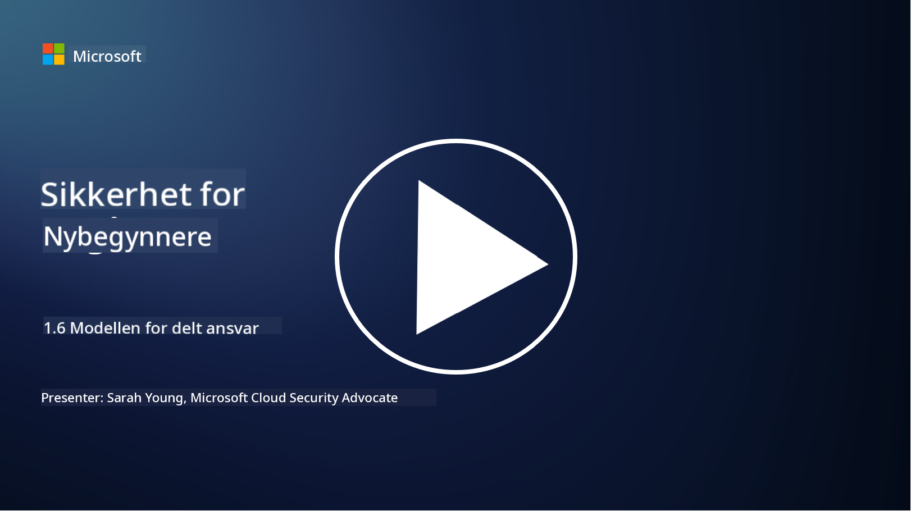

<!--
CO_OP_TRANSLATOR_METADATA:
{
  "original_hash": "a48db640d80c786b928ca178c414f084",
  "translation_date": "2025-09-04T00:26:44+00:00",
  "source_file": "1.6 Shared responsibility model.md",
  "language_code": "no"
}
-->
# Modellen for delt ansvar

Delt ansvar er et nyere konsept innen IT som oppstod med fremveksten av skytjenester. Fra et cybersikkerhetsperspektiv er det avgjørende å forstå hvem som leverer hvilke sikkerhetskontroller, slik at det ikke oppstår hull i forsvarssystemet.

## Introduksjon

I denne leksjonen skal vi dekke:

 - Hva er delt ansvar i konteksten av cybersikkerhet?
   
 - Hva er forskjellen i delt ansvar for sikkerhetskontroller mellom IaaS, PaaS og SaaS?

 - Hvor kan du finne ut hvilke sikkerhetskontroller din skyplattform tilbyr?

 - Hva betyr "stol på, men verifiser"?

## Hva er delt ansvar i konteksten av cybersikkerhet?

Delt ansvar innen cybersikkerhet refererer til fordelingen av sikkerhetsansvar mellom en skytjenesteleverandør (CSP) og kundene deres. I skytjenestemiljøer, som Infrastructure as a Service (IaaS), Platform as a Service (PaaS) og Software as a Service (SaaS), har både CSP og kunden roller i å sikre data, applikasjoner og systemer.

## Hva er forskjellen i delt ansvar for sikkerhetskontroller mellom IaaS, PaaS og SaaS?

Fordelingen av ansvar avhenger vanligvis av typen skytjeneste som brukes:

 - **IaaS (Infrastructure as a Service)**: CSP leverer den grunnleggende infrastrukturen (servere, nettverk, lagring), mens kunden er ansvarlig for å administrere operativsystemer, applikasjoner og sikkerhetskonfigurasjoner på denne infrastrukturen.
   
 - **PaaS (Platform as a Service):** CSP tilbyr en plattform der kunder kan bygge og distribuere applikasjoner. CSP administrerer den underliggende infrastrukturen, mens kunden fokuserer på applikasjonsutvikling og datasikkerhet.

 - **SaaS (Software as a Service)**: CSP leverer fullt funksjonelle applikasjoner som er tilgjengelige over internett. I dette tilfellet er CSP ansvarlig for applikasjonens sikkerhet og infrastruktur, mens kunden administrerer brukeradgang og databruk.

Å forstå delt ansvar er viktig fordi det tydeliggjør hvilke sikkerhetsaspekter som dekkes av CSP og hvilke kunden må ta seg av. Dette bidrar til å unngå misforståelser og sikrer at sikkerhetstiltak implementeres helhetlig.

## Hvor kan du finne ut hvilke sikkerhetskontroller din skyplattform tilbyr?

For å finne ut hvilke sikkerhetskontroller din skyplattform tilbyr, må du referere til dokumentasjonen og ressursene fra skytjenesteleverandøren. Disse inkluderer:

 - **CSPs nettsted og dokumentasjon**: CSPs nettsted vil ha informasjon om sikkerhetsfunksjonene og kontrollene som tilbys som en del av tjenestene deres. CSP-er tilbyr vanligvis detaljert dokumentasjon som forklarer deres sikkerhetspraksis, kontroller og anbefalinger. Dette kan inkludere whitepapers, sikkerhetsguider og teknisk dokumentasjon.
   
 - **Sikkerhetsvurderinger og revisjoner**: De fleste CSP-er får sine sikkerhetskontroller vurdert av uavhengige sikkerhetseksperter og organisasjoner. Disse vurderingene kan gi innsikt i kvaliteten på CSPs sikkerhetstiltak. Noen ganger fører dette til at CSP får en sikkerhetssertifisering (se neste punkt).
   
 - **Sikkerhetssertifiseringer**: De fleste CSP-er oppnår sertifiseringer som ISO:27001, SOC 2 og FedRAMP, osv. Disse sertifiseringene viser at leverandøren oppfyller spesifikke sikkerhets- og samsvarsstandarder.

Husk at detaljnivået og tilgjengeligheten av informasjon kan variere mellom skyleverandører. Sørg alltid for at du konsulterer offisielle og oppdaterte ressurser fra skytjenesteleverandøren for å ta informerte beslutninger om sikkerheten til dine skybaserte eiendeler.

## Hva betyr "stol på, men verifiser"?

I konteksten av å bruke en CSP, tredjepartsprogramvare eller andre IT-sikkerhetstjenester, kan en organisasjon i utgangspunktet stole på leverandørens påstander om sikkerhetstiltak. Men for å virkelig sikre sikkerheten til sine data og systemer, bør de verifisere disse påstandene gjennom sikkerhetsvurderinger, penetrasjonstesting og en gjennomgang av den eksterne partens sikkerhetskontroller før de fullt ut integrerer programvaren eller tjenesten i sine operasjoner. Alle individer og organisasjoner bør søke å stole på, men verifisere sikkerhetskontroller som de ikke er ansvarlige for.

## Delt ansvar innen en organisasjon

Husk at delt ansvar for sikkerhet innen en organisasjon også må tas i betraktning for ulike team. Sikkerhetsteamet vil sjelden implementere alle kontrollene selv og må samarbeide med driftsteam, utviklere og andre deler av virksomheten for å implementere alle sikkerhetskontroller som trengs for å holde en organisasjon sikker.

## Videre lesing
- [Shared responsibility in the cloud - Microsoft Azure | Microsoft Learn](https://learn.microsoft.com/azure/security/fundamentals/shared-responsibility?WT.mc_id=academic-96948-sayoung)
- [What is shared responsibility model? – Definition from TechTarget.com](https://www.techtarget.com/searchcloudcomputing/definition/shared-responsibility-model)
- [The shared responsibility model explained and what it means for cloud security | CSO Online](https://www.csoonline.com/article/570779/the-shared-responsibility-model-explained-and-what-it-means-for-cloud-security.html)
- [Shared Responsibility for Cloud Security: What You Need to Know (cisecurity.org)](https://www.cisecurity.org/insights/blog/shared-responsibility-cloud-security-what-you-need-to-know)

---

**Ansvarsfraskrivelse**:  
Dette dokumentet er oversatt ved hjelp av AI-oversettelsestjenesten [Co-op Translator](https://github.com/Azure/co-op-translator). Selv om vi streber etter nøyaktighet, vær oppmerksom på at automatiserte oversettelser kan inneholde feil eller unøyaktigheter. Det originale dokumentet på sitt opprinnelige språk bør anses som den autoritative kilden. For kritisk informasjon anbefales profesjonell menneskelig oversettelse. Vi er ikke ansvarlige for misforståelser eller feiltolkninger som oppstår ved bruk av denne oversettelsen.