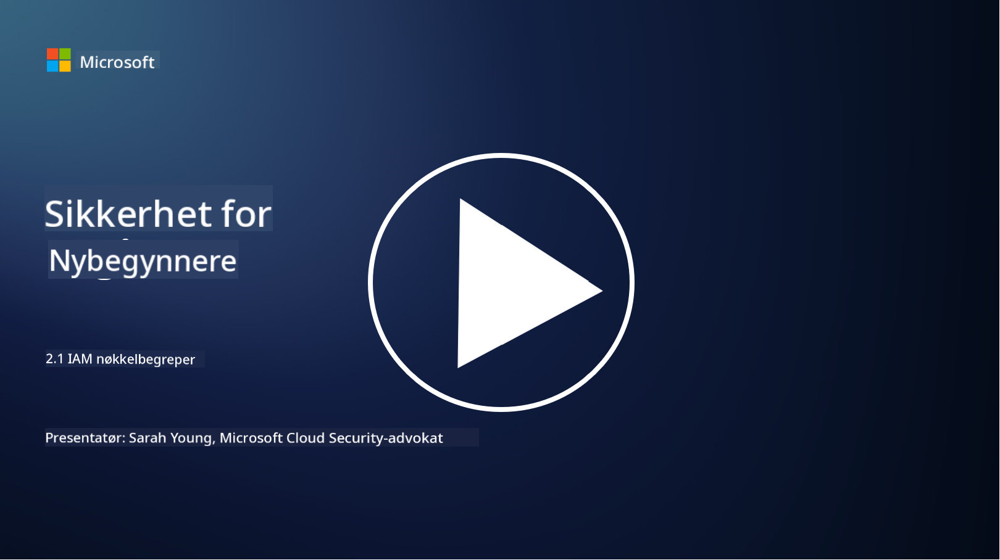

<!--
CO_OP_TRANSLATOR_METADATA:
{
  "original_hash": "2e3864e3d579f0dbb4ac2ec8c5f82acf",
  "translation_date": "2025-09-03T22:40:42+00:00",
  "source_file": "2.1 IAM key concepts.md",
  "language_code": "no"
}
-->
# IAM nøkkelkonsepter

Har du noen gang logget inn på en datamaskin eller en nettside? Selvfølgelig har du det! Det betyr at du allerede har brukt identitetskontroller i hverdagen din. Identitets- og tilgangsstyring (IAM) er en viktig del av sikkerhet, og vi skal lære mer om det i de neste leksjonene.

**Introduksjon**

I denne leksjonen skal vi dekke:

- Hva mener vi med identitets- og tilgangsstyring (IAM) i
  sammenheng med cybersikkerhet?
  
- Hva er prinsippet om minst privilegium?
  
- Hva er arbeidsdeling?
  
- Hva er autentisering og autorisasjon?

## Hva mener vi med identitets- og tilgangsstyring (IAM) i sammenheng med cybersikkerhet?

Identitets- og tilgangsstyring (IAM) refererer til et sett med prosesser, teknologier og retningslinjer som implementeres for å sikre at de riktige personene har passende tilgang til ressurser i en organisasjons digitale miljø. IAM innebærer administrasjon av digitale identiteter (brukere, ansatte, partnere) og deres tilgang til systemer, applikasjoner, data og nettverk. Hovedmålet med IAM er å styrke sikkerheten, forenkle brukeradgang og sikre samsvar med organisasjonens retningslinjer og regler. IAM-løsninger inkluderer vanligvis brukerautentisering, autorisasjon, identitetsprovisjonering, tilgangskontroll og administrasjon av brukerens livssyklus (sørge for at kontoer blir slettet når de ikke lenger brukes).

## Hva er prinsippet om minst privilegium?

Prinsippet om minst privilegium er et grunnleggende konsept som går ut på å gi brukere og systemer kun de minimumsrettighetene som er nødvendige for å utføre deres tiltenkte oppgaver eller roller. Dette prinsippet bidrar til å begrense potensielle skader som kan oppstå ved et sikkerhetsbrudd eller en intern trussel. Ved å følge prinsippet om minst privilegium reduserer organisasjoner angrepsflaten og minimerer risikoen for uautorisert tilgang, databrudd og utilsiktet misbruk av rettigheter. I praksis betyr dette at brukere kun får tilgang til de spesifikke ressursene og funksjonalitetene som er nødvendige for deres arbeidsoppgaver, og ikke mer. For eksempel, hvis du bare trenger å lese et dokument, ville det være unødvendig å gi deg full administratortilgang til det dokumentet.

## Hva er arbeidsdeling?

Arbeidsdeling er et prinsipp som har som mål å forhindre interessekonflikter og redusere risikoen for svindel og feil ved å fordele kritiske oppgaver og ansvar blant ulike personer i en organisasjon. I sammenheng med cybersikkerhet innebærer arbeidsdeling å sikre at ingen enkeltperson har kontroll over alle aspekter av en kritisk prosess eller et system. Målet er å skape et system med kontrollmekanismer som hindrer at én person kan utføre både oppsett- og godkjenningsstadiene av en prosess. For eksempel, i finansielle systemer kan dette innebære at personen som registrerer transaksjoner i systemet ikke skal være den samme som godkjenner disse transaksjonene. Dette reduserer risikoen for uautoriserte eller svindelaktige handlinger som går ubemerket hen.

## Hva er autentisering og autorisasjon?

Autentisering og autorisasjon er to grunnleggende konsepter innen cybersikkerhet som spiller en avgjørende rolle i å sikre sikkerheten og integriteten til datasystemer og informasjon. De brukes ofte sammen for å kontrollere tilgang til ressurser og beskytte sensitiv informasjon.

**1. Autentisering**: Autentisering er prosessen med å verifisere identiteten til en bruker, et system eller en enhet som forsøker å få tilgang til et datasystem eller en spesifikk ressurs. Det sikrer at den påståtte identiteten er ekte og korrekt. Autentiseringsmetoder involverer vanligvis bruk av én eller flere av følgende faktorer:
    
   a. Noe du vet: Dette inkluderer passord, PIN-koder eller annen hemmelig kunnskap som kun den autoriserte brukeren skal ha.
    
   b. Noe du har: Dette innebærer fysiske tokens eller enheter som smartkort, sikkerhetstokens eller mobiltelefoner som brukes for å bekrefte brukerens identitet.
    
   c. Noe du er: Dette refererer til biometriske faktorer som fingeravtrykk, ansiktsgjenkjenning eller netthinneskanninger som er unike for en person.
    

Autentiseringsmekanismer brukes for å bekrefte at en bruker er den de utgir seg for å være før de får tilgang til et system eller en ressurs. Det hjelper med å forhindre uautorisert tilgang og sikrer at kun legitime brukere kan utføre handlinger i et system.

**2. Autorisasjon**: Autorisasjon er prosessen med å gi eller nekte spesifikke tillatelser og privilegier til autentiserte brukere eller enheter etter at deres identitet er bekreftet. Det avgjør hvilke handlinger eller operasjoner en bruker har lov til å utføre i et system eller på spesifikke ressurser. Autorisasjon er ofte basert på forhåndsdefinerte retningslinjer, tilgangskontrollregler og roller som er tildelt brukere.

Autorisasjon kan betraktes som svaret på spørsmålet: "Hva kan en autentisert bruker gjøre?" Det innebærer å definere og håndheve tilgangskontrollregler for å beskytte sensitiv data og ressurser mot uautorisert tilgang eller endring.

**Oppsummert:**

- Autentisering bekrefter identiteten til brukere eller enheter.
- Autorisasjon avgjør hvilke handlinger og ressurser autentiserte brukere har lov til å få tilgang til eller manipulere.

## Videre lesing

- [Describe identity concepts - Training | Microsoft Learn](https://learn.microsoft.com/training/modules/describe-identity-principles-concepts/?WT.mc_id=academic-96948-sayoung)
- [Introduction to identity - Microsoft Entra | Microsoft Learn](https://learn.microsoft.com/azure/active-directory/fundamentals/identity-fundamental-concepts?WT.mc_id=academic-96948-sayoung)
- [What is Identity Access Management (IAM)? | Microsoft Security](https://www.microsoft.com/security/business/security-101/what-is-identity-access-management-iam?WT.mc_id=academic-96948-sayoung)
- [What is IAM? Identity and access management explained | CSO Online](https://www.csoonline.com/article/518296/what-is-iam-identity-and-access-management-explained.html)
- [What is IAM? (auth0.com)](https://auth0.com/blog/what-is-iam/)
- [Security+: implementing Identity and Access Management (IAM) controls [updated 2021] | Infosec (infosecinstitute.com)](https://resources.infosecinstitute.com/certifications/securityplus/security-implementing-identity-and-access-management-iam-controls/)
- [least privilege - Glossary | CSRC (nist.gov)](https://csrc.nist.gov/glossary/term/least_privilege)
- [Security: The Principle of Least Privilege (POLP) - Microsoft Community Hub](https://techcommunity.microsoft.com/t5/azure-sql-blog/security-the-principle-of-least-privilege-polp/ba-p/2067390?WT.mc_id=academic-96948-sayoung)
- [Principle of least privilege | CERT NZ](https://www.cert.govt.nz/it-specialists/critical-controls/principle-of-least-privilege/)
- [Why is separation of duties required by NIST 800-171 and CMMC? - (totem.tech)](https://www.totem.tech/cmmc-separation-of-duties/)

---

**Ansvarsfraskrivelse**:  
Dette dokumentet er oversatt ved hjelp av AI-oversettelsestjenesten [Co-op Translator](https://github.com/Azure/co-op-translator). Selv om vi streber etter nøyaktighet, vær oppmerksom på at automatiserte oversettelser kan inneholde feil eller unøyaktigheter. Det originale dokumentet på sitt opprinnelige språk bør anses som den autoritative kilden. For kritisk informasjon anbefales profesjonell menneskelig oversettelse. Vi er ikke ansvarlige for eventuelle misforståelser eller feiltolkninger som oppstår ved bruk av denne oversettelsen.