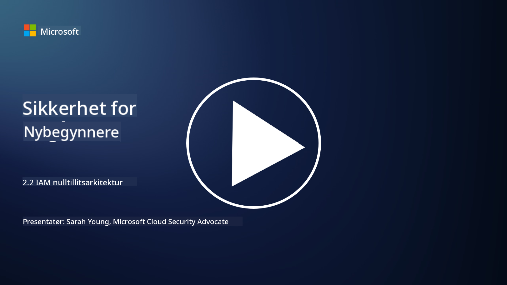

<!--
CO_OP_TRANSLATOR_METADATA:
{
  "original_hash": "4774a978af123f72ebb872199c4c4d4f",
  "translation_date": "2025-09-03T23:41:27+00:00",
  "source_file": "2.2 IAM zero trust architecture.md",
  "language_code": "no"
}
-->
# IAM null tillit-arkitektur

Identitet er en viktig del av å implementere en null tillit-arkitektur og bygge en perimeter for ethvert IT-miljø. I denne delen skal vi utforske hvorfor det er viktig å bruke identitetskontroller for å implementere null tillit.

## Introduksjon

I denne leksjonen skal vi dekke:

 - Hvorfor trenger vi å bruke identitet som vår perimeter i moderne IT-miljøer?
   
 - Hvordan skiller dette seg fra tradisjonelle IT-arkitekturer?

 - Hvordan brukes identitet til å implementere en null tillit-arkitektur?

## Hvorfor trenger vi å bruke identitet som vår perimeter i moderne IT-miljøer?

I moderne IT-miljøer blir det tradisjonelle konseptet med en fysisk perimeter (ved bruk av verktøy som brannmurer og nettverksgrenser) som den primære forsvarslinjen mot cybertrusler mindre effektivt på grunn av økende teknologisk kompleksitet, fremveksten av fjernarbeid og adopsjonen av skytjenester. I stedet beveger organisasjoner seg mot å bruke identitet som den nye perimeteren. Dette betyr at sikkerheten dreier seg om å verifisere og administrere identiteten til brukere, enheter og applikasjoner som forsøker å få tilgang til ressurser, uavhengig av deres fysiske plassering.

Her er hvorfor det er avgjørende å bruke identitet som perimeter i moderne IT-miljøer:

**Fjernarbeid**: Med fjernarbeid og mobile enheter som blir normen, kan brukere få tilgang til ressurser fra ulike steder og enheter. Den tradisjonelle perimeter-tilnærmingen fungerer ikke når brukere ikke lenger er begrenset til et fysisk kontor.

**Sky- og hybride miljøer**: Organisasjoner adopterer i økende grad skytjenester og hybride miljøer. Data og applikasjoner er ikke lenger utelukkende plassert innenfor organisasjonens lokaler, noe som gjør tradisjonelle perimeterforsvar mindre relevante.

**Null tillit-sikkerhet**: Konseptet med null tillit-sikkerhet antar at ingen enhet, enten innenfor eller utenfor nettverket, skal automatisk bli stolt på. Identitet blir grunnlaget for å verifisere tilgangsforespørsler, uavhengig av hvor de kommer fra.

**Trussellandskap**: Cybertrusler utvikler seg, og angripere finner måter å omgå tradisjonelle perimeterforsvar. Phishing, sosial manipulering og interne trusler utnytter ofte menneskelige svakheter i stedet for å prøve å bryte nettverksperimetere.

**Datadrevet tilnærming**: Beskyttelse av sensitiv data er avgjørende. Ved å fokusere på identitet kan organisasjoner kontrollere hvem som har tilgang til hvilken data, og dermed redusere risikoen for databrudd.

## Hvordan skiller dette seg fra tradisjonelle IT-arkitekturer?

Tradisjonelle IT-arkitekturer var sterkt avhengige av perimeterbaserte sikkerhetsmodeller, der brannmurer og nettverksgrenser spilte en betydelig rolle i å holde trusler ute. De viktigste forskjellene mellom tradisjonelle og identitetsfokuserte tilnærminger er:

|      Aspekt                 |      Tradisjonelle IT-arkitekturer                                                               |      Identitetsfokusert tilnærming                                                                       |
|-----------------------------|--------------------------------------------------------------------------------------------------|----------------------------------------------------------------------------------------------------------|
|     Fokus                   |     Perimeterfokus: Avhengig av perimeterforsvar som brannmurer og   tilgangskontroll.           |     Fokus på identitetsverifisering: Skift fra nettverksgrenser til verifisering   av bruker/enhetsidentitet. |
|     Plassering              |     Plasseringsavhengighet: - Sikkerhet knyttet til fysiske kontorlokasjoner og   nettverksgrenser. |     Plasseringsuavhengighet: Sikkerhet ikke knyttet til spesifikke lokasjoner; tilgang   fra hvor som helst. |
|     Tillitsantakelse        |     Antatt tillit: Tillit antas innenfor nettverksperimeteret for   brukere/enheter.             |     Null tillit-tilnærming: Tillit antas aldri; tilgang verifiseres basert   på identitet og kontekst.     |
|     Enhetsbetraktning       |     Enhetsmangfold: Antok at enheter innenfor nettverksperimeteret var   sikre.                  |     Enhetsbevissthet: Tar hensyn til enhetens helse og sikkerhetsstatus,   uavhengig av plassering.        |
|     Databeskyttelse         |     Databeskyttelse: Fokusert på å sikre nettverksperimetere for databeskyttelse.                |     Datadrevet beskyttelse: Fokus på å kontrollere datatilgang basert på   identitet og datasensitivitet. |

## Hvordan brukes identitet til å implementere en null tillit-arkitektur?

I en null tillit-arkitektur er det grunnleggende prinsippet å aldri automatisk stole på noen enhet, uavhengig av om den er innenfor eller utenfor nettverksperimeteret. Identitet spiller en sentral rolle i å implementere en null tillit-tilnærming ved å muliggjøre kontinuerlig verifisering av enheter som forsøker å få tilgang til ressurser. Moderne identitetssikkerhetskontroller sørger for at hver bruker, enhet, applikasjon og tjeneste som søker tilgang til ressurser, må identifiseres og autentiseres grundig før tilgang gis. Dette innebærer å verifisere deres digitale identitet gjennom metoder som brukernavn/passord-kombinasjoner, multifaktorautentisering (MFA), biometriske løsninger og andre sterke autentiseringsmekanismer.

## Videre lesing

- [Securing identity with Zero Trust | Microsoft Learn](https://learn.microsoft.com/security/zero-trust/deploy/identity?WT.mc_id=academic-96948-sayoung)
- [Zero Trust Principles and Guidance for Identity and Access | CSA (cloudsecurityalliance.org)](https://cloudsecurityalliance.org/artifacts/zero-trust-principles-and-guidance-for-iam/)
- [Zero Trust Identity Controls - Essentials Series - Episode 2 - YouTube](https://www.youtube.com/watch?v=fQZQznIKcGM&list=PLXtHYVsvn_b_gtX1-NB62wNervQx1Fhp4&index=13)

---

**Ansvarsfraskrivelse**:  
Dette dokumentet er oversatt ved hjelp av AI-oversettelsestjenesten [Co-op Translator](https://github.com/Azure/co-op-translator). Selv om vi tilstreber nøyaktighet, vennligst vær oppmerksom på at automatiske oversettelser kan inneholde feil eller unøyaktigheter. Det originale dokumentet på sitt opprinnelige språk bør anses som den autoritative kilden. For kritisk informasjon anbefales profesjonell menneskelig oversettelse. Vi er ikke ansvarlige for eventuelle misforståelser eller feiltolkninger som oppstår ved bruk av denne oversettelsen.