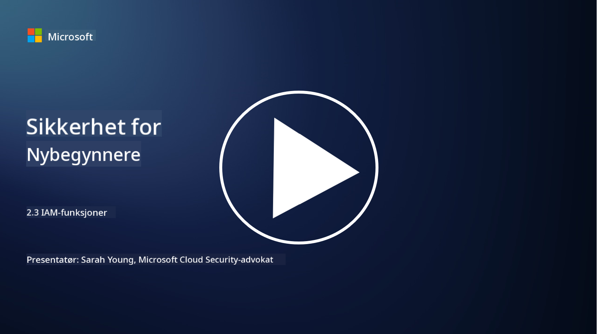

<!--
CO_OP_TRANSLATOR_METADATA:
{
  "original_hash": "bf0b8a54f2c69951744df5a94bc923f7",
  "translation_date": "2025-09-04T01:56:13+00:00",
  "source_file": "2.3 IAM capabilities.md",
  "language_code": "no"
}
-->
# IAM-funksjoner

I denne delen skal vi gå gjennom flere detaljer om de sentrale verktøyene og funksjonene som brukes i identitetssikkerhet.

## Introduksjon

I denne leksjonen skal vi dekke:

 - Hva er en katalogtjeneste?
      
     
    
 - Hvilke funksjoner kan brukes for å sikre identiteter?
>
>        Multifaktorautentisering (MFA)
> 
>        Single Sign-On (SSO)
> 
>        Rollebasert tilgangskontroll (RBAC)
> 
>        Adaptiv autentisering
> 
>        Biometrisk autentisering
> 
>        Administrasjon av privilegert tilgang (PAM)
> 
>        Identitetsstyring og administrasjon (IGA)
> 
>        Atferdsanalyse

## Hva er en katalogtjeneste?

En katalogtjeneste er en spesialisert database som lagrer og administrerer informasjon om nettverksressurser, inkludert brukere, grupper, enheter, applikasjoner og andre objekter. Den fungerer som et sentralisert lager for data relatert til identitet og tilgang, og gjør det mulig for organisasjoner å effektivt administrere og kontrollere brukerautentisering, autorisasjon og andre sikkerhetsrelaterte oppgaver.

Katalogtjenester spiller en avgjørende rolle i moderne IT-miljøer ved å gi et fundament for løsninger innen identitets- og tilgangsstyring (IAM). De muliggjør sikker tilgang til ressurser, håndhever tilgangspolicyer og forenkler administrative oppgaver. En av de mest kjente katalogtjenestene er Microsoft Active Directory, men det finnes også andre løsninger som LDAP (Lightweight Directory Access Protocol) kataloger som har lignende funksjoner.

Nøkkelfunksjoner og egenskaper ved en katalogtjeneste i sammenheng med cybersikkerhet inkluderer:

 - **Brukerautentisering**: Katalogtjenester validerer brukerinformasjon (som brukernavn og passord) for å sikre at kun autoriserte brukere får tilgang til nettverket og dets ressurser.
 - **Brukerautorisasjon**: De bestemmer nivået av tilgang hver bruker har basert på deres rolle, gruppemedlemskap og andre attributter. Dette sikrer at brukere kun får tilgang til ressursene de har rett til.
 - **Gruppeadministrasjon**: Katalogtjenester lar administratorer organisere brukere i logiske grupper, noe som forenkler administrasjonen av tilgangskontroll. Tillatelser kan tildeles grupper i stedet for individuelle brukere.
 - **Passordpolicyer**: De håndhever regler for passordkompleksitet og utløp, noe som styrker sikkerheten til brukerkontoer.
 - **Single Sign-On (SSO)**: Noen katalogtjenester støtter SSO, som gjør det mulig for brukere å få tilgang til flere applikasjoner og tjenester med ett sett med legitimasjon.
 - **Sentralisert brukeradministrasjon**: Katalogtjenester sentraliserer brukerinformasjon, noe som gjør det enklere å administrere brukerkontoer, profiler og attributter fra ett sted.
 - **Revisjon og logging**: De kan registrere brukerautentisering og tilgangsaktiviteter, noe som hjelper med sikkerhetsrevisjoner og samsvar.

## Hvilke funksjoner kan brukes for å sikre identiteter?

**Multifaktorautentisering (MFA)**

MFA krever at brukere gir flere former for bekreftelse før tilgang gis. Dette inkluderer vanligvis noe brukeren vet (passord), noe brukeren har (smarttelefon eller sikkerhetstoken), og noe brukeren er (biometriske data som fingeravtrykk eller ansiktsgjenkjenning).

**Single Sign-On (SSO)**

SSO lar brukere få tilgang til flere applikasjoner og systemer med ett sett med legitimasjon. Dette forbedrer brukeropplevelsen og reduserer risikoen forbundet med å administrere flere passord.

**Rollebasert tilgangskontroll (RBAC)**

RBAC tildeler tillatelser basert på forhåndsdefinerte roller. Brukere får tilgang basert på rollene de har i organisasjonen.

**Adaptiv autentisering**

Adaptiv autentisering vurderer risikofaktorer som lokasjon, enhet, tidspunkt for tilgang og brukeradferd for dynamisk å justere nivået av autentisering som kreves. Hvis en forespørsel virker mistenkelig, kan ytterligere autentiseringstrinn utløses.

**Biometrisk autentisering**

Biometrisk autentisering bruker unike biologiske egenskaper som fingeravtrykk, ansiktstrekk, stemmemønstre og til og med atferdsmønstre som skrivehastighet for identitetsverifisering.

**Administrasjon av privilegert tilgang (PAM)**

PAM fokuserer på å sikre tilgang til kritiske systemer og data ved å håndheve strenge kontroller på privilegerte kontoer. Det inkluderer funksjoner som tilgang ved behov og sesjonsovervåking.

**Identitetsstyring og administrasjon (IGA)**

IGA-løsninger administrerer brukeridentiteter og deres tilgang til ressurser gjennom hele livssyklusen. Dette inkluderer onboarding, provisjonering, rollebasert tilgangskontroll og deprovisjonering.

**Atferdsanalyse**

Atferdsanalyse overvåker brukeradferd og etablerer grunnleggende mønstre. Avvik fra normen kan utløse varsler for videre undersøkelser.

# Videre lesing
- [Azure Active Directory fundamentals documentation - Microsoft Entra | Microsoft Learn](https://learn.microsoft.com/azure/active-directory/fundamentals/?WT.mc_id=academic-96948-sayoung)
- [What is Azure Active Directory? - Microsoft Entra | Microsoft Learn](https://learn.microsoft.com/azure/active-directory/fundamentals/whatis?WT.mc_id=academic-96948-sayoung)
- [Manage your multi-cloud identity infrastructure with Microsoft Entra - YouTube](https://www.youtube.com/watch?v=9qQiq3wTS2Y&list=PLXtHYVsvn_b_gtX1-NB62wNervQx1Fhp4&index=18)

---

**Ansvarsfraskrivelse**:  
Dette dokumentet er oversatt ved hjelp av AI-oversettelsestjenesten [Co-op Translator](https://github.com/Azure/co-op-translator). Selv om vi tilstreber nøyaktighet, vennligst vær oppmerksom på at automatiske oversettelser kan inneholde feil eller unøyaktigheter. Det originale dokumentet på sitt opprinnelige språk bør anses som den autoritative kilden. For kritisk informasjon anbefales profesjonell menneskelig oversettelse. Vi er ikke ansvarlige for eventuelle misforståelser eller feiltolkninger som oppstår ved bruk av denne oversettelsen.