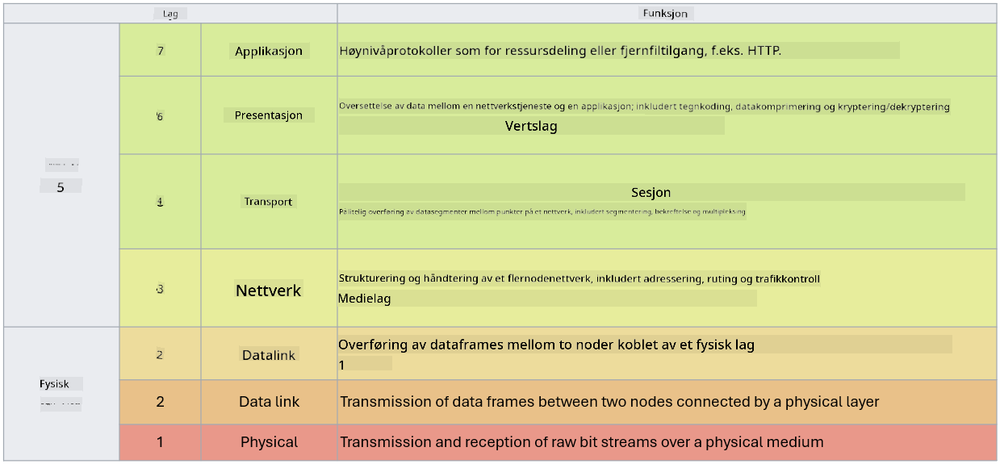

<!--
CO_OP_TRANSLATOR_METADATA:
{
  "original_hash": "252724eceeb183fb9018f88c5e1a3f0c",
  "translation_date": "2025-09-04T01:46:59+00:00",
  "source_file": "3.1 Networking key concepts.md",
  "language_code": "no"
}
-->
# Nøkkelkonsepter innen nettverk

Hvis du har jobbet med IT, er det sannsynlig at du har vært borti nettverkskonsepter. Selv om vi bruker identitet som vår primære perimeterkontroll i moderne miljøer, betyr ikke dette at nettverkskontroller er overflødige. Selv om dette er et omfattende tema, vil vi i denne leksjonen dekke noen sentrale nettverkskonsepter.

I denne leksjonen skal vi gå gjennom:

 - Hva er IP-adressering?
   
 - Hva er OSI-modellen?

 - Hva er TCP/UDP?

 - Hva er portnumre?

 - Hva er kryptering i hvile og under overføring?

## Hva er IP-adressering?

IP-adressering, eller Internet Protocol-adressering, er en numerisk etikett som tildeles hver enhet som er koblet til et datanettverk som bruker Internett-protokollen for kommunikasjon. Den fungerer som en unik identifikator for enheter i et nettverk, slik at de kan sende og motta data over internett eller andre sammenkoblede nettverk. Det finnes to hovedversjoner av IP-adressering: IPv4 (Internet Protocol versjon 4) og IPv6 (Internet Protocol versjon 6). En IP-adresse representeres vanligvis i enten IPv4-format (f.eks. 192.168.1.1) eller IPv6-format (f.eks. 2001:0db8:85a3:0000:0000:8a2e:0370:7334).

## Hva er OSI-modellen?

OSI-modellen (Open Systems Interconnection) er et konseptuelt rammeverk som standardiserer funksjonene til et kommunikasjonssystem i syv distinkte lag. Hvert lag utfører spesifikke oppgaver og kommuniserer med tilstøtende lag for å sikre effektiv og pålitelig datakommunikasjon mellom enheter i et nettverk. Lagene, fra bunn til topp, er som følger:

 1. Fysisk lag
    
 2. Datalink-lag

 3. Nettverkslag

 4. Transportlag

 5. Sesjonslag

 6. Presentasjonslag

 7. Applikasjonslag

OSI-modellen gir en felles referanse for å forstå hvordan nettverksprotokoller og teknologier samhandler, uavhengig av spesifikke maskinvare- eller programvareimplementasjoner.

_ref: https://en.wikipedia.org/wiki/OSI_model_

## Hva er TCP/UDP?

TCP (Transmission Control Protocol) og UDP (User Datagram Protocol) er to grunnleggende transportlagsprotokoller som brukes i datanettverk for å muliggjøre kommunikasjon mellom enheter over internett eller i et lokalt nettverk. De er ansvarlige for å dele opp data i pakker for overføring og deretter sette sammen disse pakkene til de opprinnelige dataene på mottakersiden. De skiller seg imidlertid i sine egenskaper og bruksområder.

**TCP (Transmission Control Protocol)**:

TCP er en tilkoblingsorientert protokoll som gir pålitelig og ordnet datalevering mellom enheter. Den oppretter en forbindelse mellom sender og mottaker før datautvekslingen begynner. TCP sørger for at datapakker ankommer i riktig rekkefølge og kan håndtere retransmisjon av tapte pakker for å garantere dataintegritet og fullstendighet. Dette gjør TCP egnet for applikasjoner som krever pålitelig datalevering, som nettsurfing, e-post, filoverføring (FTP) og databasekommunikasjon.

**UDP (User Datagram Protocol)**:

UDP er en tilkoblingsløs protokoll som tilbyr raskere dataoverføring, men som ikke gir samme nivå av pålitelighet som TCP. Den oppretter ikke en formell forbindelse før data sendes og inkluderer ikke mekanismer for å bekrefte eller sende tapte pakker på nytt. UDP er egnet for applikasjoner der hastighet og effektivitet er viktigere enn garantert levering, som sanntidskommunikasjon, strømming av media, nettspill og DNS-forespørsler.

Oppsummert prioriterer TCP pålitelighet og ordnet levering, noe som gjør den egnet for applikasjoner som krever datanøyaktighet, mens UDP vektlegger hastighet og effektivitet, noe som gjør den passende for applikasjoner der mindre datatap eller rekkefølgeendringer er akseptable i bytte mot redusert forsinkelse. Valget mellom TCP og UDP avhenger av de spesifikke kravene til applikasjonen eller tjenesten som brukes.

## Hva er portnumre?

I nettverk er et portnummer en numerisk identifikator som brukes til å skille mellom ulike tjenester eller applikasjoner som kjører på en enkelt enhet i et nettverk. Porter hjelper med å rute innkommende data til riktig applikasjon. Portnumre er 16-bits usignerte heltall, noe som betyr at de varierer fra 0 til 65535. De er delt inn i tre områder:

- Velkjente porter (0-1023): Reservert for standardtjenester som HTTP (port 80) og FTP (port 21).

- Registrerte porter (1024-49151): Brukes for applikasjoner og tjenester som ikke er en del av det velkjente området, men som er offisielt registrert.

- Dynamiske/private porter (49152-65535): Tilgjengelige for midlertidig eller privat bruk av applikasjoner.

## Hva er kryptering i hvile og under overføring?

Kryptering er prosessen med å konvertere data til et sikkert format for å beskytte det mot uautorisert tilgang eller manipulering. Kryptering kan brukes på data både "i hvile" (når det er lagret på en enhet eller server) og "under overføring" (når det overføres mellom enheter eller over nettverk).

Kryptering i hvile: Dette innebærer å kryptere data som er lagret på enheter, servere eller lagringssystemer. Selv om en angriper får fysisk tilgang til lagringsmediet, kan de ikke få tilgang til dataene uten krypteringsnøklene. Dette er avgjørende for å beskytte sensitiv informasjon i tilfelle enhetstyveri, datainnbrudd eller uautorisert tilgang.

Kryptering under overføring: Dette innebærer å kryptere data mens det reiser mellom enheter eller over nettverk. Dette forhindrer avlytting og uautorisert avskjæring av data under overføring. Vanlige protokoller for kryptering under overføring inkluderer HTTPS for nettkommunikasjon og TLS/SSL for å sikre ulike typer nettverkstrafikk.

## Videre lesing
- [Hvordan fungerer IP-adresser? (howtogeek.com)](https://www.howtogeek.com/341307/how-do-ip-addresses-work/)
- [Forstå IP-adresser: En introduksjonsguide (geekflare.com)](https://geekflare.com/understanding-ip-address/)
- [Hva er OSI-modellen? De 7 lagene i OSI forklart (techtarget.com)](https://www.techtarget.com/searchnetworking/definition/OSI)
- [OSI-modellen – De 7 lagene i nettverk forklart på enkelt språk (freecodecamp.org)](https://www.freecodecamp.org/news/osi-model-networking-layers-explained-in-plain-english/)
- [TCP/IP-protokoller - IBM Dokumentasjon](https://www.ibm.com/docs/en/aix/7.3?topic=protocol-tcpip-protocols)
- [Vanlige porter jukselapp: Den ultimate listen over porter og protokoller (stationx.net)](https://www.stationx.net/common-ports-cheat-sheet/)
- [Azure Data Encryption-at-Rest - Azure Security | Microsoft Learn](https://learn.microsoft.com/azure/security/fundamentals/encryption-atrest?WT.mc_id=academic-96948-sayoung)

---

**Ansvarsfraskrivelse**:  
Dette dokumentet er oversatt ved hjelp av AI-oversettelsestjenesten [Co-op Translator](https://github.com/Azure/co-op-translator). Selv om vi tilstreber nøyaktighet, vennligst vær oppmerksom på at automatiske oversettelser kan inneholde feil eller unøyaktigheter. Det originale dokumentet på sitt opprinnelige språk bør anses som den autoritative kilden. For kritisk informasjon anbefales profesjonell menneskelig oversettelse. Vi er ikke ansvarlige for eventuelle misforståelser eller feiltolkninger som oppstår ved bruk av denne oversettelsen.