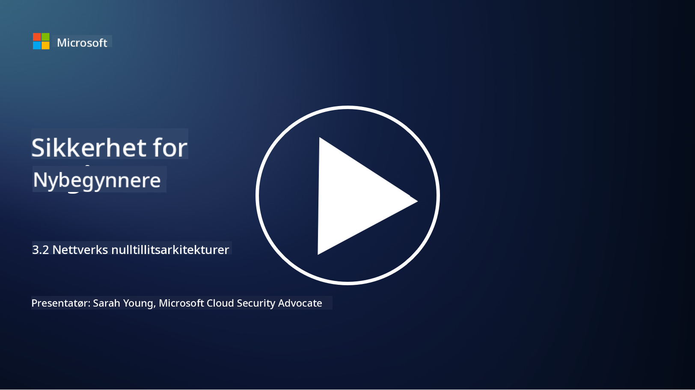

<!--
CO_OP_TRANSLATOR_METADATA:
{
  "original_hash": "680d6e14d9d33fc471c22f44679713f8",
  "translation_date": "2025-09-04T00:38:48+00:00",
  "source_file": "3.2 Networking zero trust architecture.md",
  "language_code": "no"
}
-->
# Nettverksarkitekturer for null tillit

Nettverket gir et viktig lag i null tillit-kontroller. I denne leksjonen skal vi lære mer om dette:

- Hva er nettverkssegmentering?  
- Hvordan hjelper nettverkssegmentering med å implementere null tillit?  
- Hva er ende-til-ende-kryptering?

## Hva er nettverkssegmentering?

Nettverkssegmentering er praksisen med å dele et nettverk inn i mindre, isolerte segmenter eller subnett. Hvert segment er isolert fra de andre, og tilgang mellom segmentene kontrolleres og begrenses basert på spesifikke sikkerhetspolicyer. Nettverkssegmentering brukes for å forbedre sikkerheten ved å begrense konsekvensene av potensielle brudd og redusere angriperes mulighet for lateral bevegelse i nettverket.

Ved å implementere nettverkssegmentering kan en organisasjon opprette "soner" som skiller ulike typer brukere, applikasjoner og data. Dette reduserer angrepsflaten og minimerer potensielle skader forårsaket av en sikkerhetshendelse. Nettverkssegmentering kan oppnås gjennom teknologier som virtuelle LAN-er (VLAN-er), brannmurer og tilgangskontroller.

## Hvordan hjelper nettverkssegmentering med å implementere null tillit?

Nettverkssegmentering er nært knyttet til prinsippene i null tillit-modellen. I en null tillit-arkitektur hjelper nettverkssegmentering med å håndheve prinsippet om "minste privilegium" ved å sikre at brukere og enheter kun har tilgang til de spesifikke ressursene og tjenestene de trenger for å utføre sine oppgaver. Ved å dele nettverket inn i mindre soner kan organisasjoner implementere strenge tilgangskontroller, isolere kritiske eiendeler og forhindre lateral bevegelse av angripere.

Nettverkssegmentering bidrar også til å håndheve identitetsbaserte tilgangskontroller, der brukere og enheter autentiseres og autoriseres grundig før de får tilgang til spesifikke segmenter. Dette forhindrer uautorisert tilgang til sensitive ressurser og reduserer konsekvensene av kompromitterte legitimasjoner.

## Hva er ende-til-ende-kryptering?

Ende-til-ende (E2E) kryptering er et sikkerhetstiltak som sikrer at data forblir kryptert gjennom hele reisen fra avsender til mottaker. I denne prosessen krypteres data ved avsenderens ende, og kun mottakeren har dekrypteringsnøkkelen for å låse opp og lese dataene. Krypterings- og dekrypteringsprosessene skjer ved endepunktene, noe som gjør det svært vanskelig for uautoriserte parter, inkludert tjenesteleverandører og mellommenn, å få tilgang til dataene i klartekst.

E2E-kryptering gir et høyt nivå av konfidensialitet og sikkerhet for datatransmisjon, selv om dataene passerer gjennom ulike mellomliggende systemer eller nettverk. Det brukes ofte i sikre meldingsapper, e-posttjenester og andre kommunikasjonsplattformer for å beskytte sensitiv informasjon mot avlytting og uautorisert tilgang.

Denne krypteringsmetoden sikrer at selv om angripere klarer å få tilgang til dataene under overføring, vil de kun se kryptert innhold som er meningsløst uten dekrypteringsnøkkelen. Ende-til-ende-kryptering spiller en viktig rolle i å beskytte brukerens personvern og forhindre at sensitiv informasjon blir eksponert for uautoriserte parter.

## Hva er SASE?

SASE står for "Secure Access Service Edge" og er et rammeverk og en arkitektur innen cybersikkerhet som kombinerer nettverkssikkerhet og bredbåndsnettverksfunksjoner (WAN) i én skybasert tjeneste. SASE er designet for å gi sikker og skalerbar tilgang til nettverksressurser, applikasjoner og data for fjern- og mobile brukere, samtidig som det forenkler nettverksadministrasjon og reduserer kompleksiteten i tradisjonelle nettverks- og sikkerhetsarkitekturer.

Nøkkelfunksjoner og komponenter i SASE inkluderer:

1. **Skybasert:** SASE leveres som en skytjeneste, noe som betyr at sikkerhets- og nettverksfunksjoner tilbys fra skyen i stedet for å være avhengig av tradisjonell maskinvare og enheter på stedet.  

2. **Integrasjon av sikkerhet og nettverk:** SASE integrerer ulike sikkerhetstjenester som sikre nettportaler (SWG), brannmur som en tjeneste (FWaaS), datatapforebygging (DLP), null tillit-nettverkstilgang (ZTNA) og WAN-optimalisering med bredbåndsnettverksfunksjoner. Denne integrasjonen bidrar til å effektivisere sikkerhets- og nettverksoperasjoner.  

3. **Null tillit:** SASE opererer basert på prinsippet om null tillit, som innebærer strenge tilgangskontroller og policyer for minste privilegium. Brukere og enheter er ikke betrodd som standard og må autentiseres og autoriseres før de får tilgang til ressurser.  

4. **Identitetsfokusert:** SASE fokuserer på bruker- og enhetsidentiteter som grunnlag for tilgangskontroll. Identitets- og kontekstbaserte policyer brukes for å bestemme tilgangstillatelser, og disse policyene tilpasses dynamisk basert på brukeradferd og kontekst.  

5. **Skalerbarhet og fleksibilitet:** SASE kan enkelt skaleres for å håndtere et stort antall brukere og enheter, noe som gjør det egnet for organisasjoner med varierte og utviklende nettverks- og sikkerhetsbehov.  

SASE er spesielt relevant i den moderne æraen med fjernarbeid og skyadopsjon, da det gir en omfattende og smidig tilnærming til å sikre og administrere nettverkstilgang. Det hjelper organisasjoner med å tilpasse seg endrede sikkerhets- og nettverkskrav, samtidig som det opprettholder et sterkt fokus på brukerorienterte og null tillit-sikkerhetsmodeller.

## Videre lesing

- [What Is Network Segmentation? - Cisco](https://www.cisco.com/c/en/us/products/security/what-is-network-segmentation.html#~benefits)  
- [What Is Micro-Segmentation? - Cisco](https://www.cisco.com/c/en/us/products/security/what-is-microsegmentation.html)  
- [Implementing Network Segmentation and Segregation | Cyber.gov.au](https://www.cyber.gov.au/resources-business-and-government/maintaining-devices-and-systems/system-hardening-and-administration/network-hardening/implementing-network-segmentation-and-segregation)  
- [What Is Network Segmentation and Why It Matters | CompTIA](https://www.comptia.org/blog/security-awareness-training-network-segmentation)  
- [Network Segmentation: Concepts and Practices (cmu.edu)](https://insights.sei.cmu.edu/blog/network-segmentation-concepts-and-practices/)  
- [Secure networks with Zero Trust | Microsoft Learn](https://learn.microsoft.com/security/zero-trust/deploy/networks?WT.mc_id=academic-96948-sayoung)  
- [What is end-to-end encryption? | IBM](https://www.ibm.com/topics/end-to-end-encryption)  
- [What Is End-to-End Encryption, and Why Does It Matter? (howtogeek.com)](https://www.howtogeek.com/711656/what-is-end-to-end-encryption-and-why-does-it-matter/)  
- [Definition of Secure Access Service Edge (SASE) - Gartner Information Technology Glossary](https://www.gartner.com/en/information-technology/glossary/secure-access-service-edge-sase)  
- [What Is Secure Access Service Edge (SASE)? | Microsoft Security](https://www.microsoft.com/security/business/security-101/what-is-sase?WT.mc_id=academic-96948-sayoung)  

---

**Ansvarsfraskrivelse**:  
Dette dokumentet er oversatt ved hjelp av AI-oversettelsestjenesten [Co-op Translator](https://github.com/Azure/co-op-translator). Selv om vi tilstreber nøyaktighet, vennligst vær oppmerksom på at automatiske oversettelser kan inneholde feil eller unøyaktigheter. Det originale dokumentet på sitt opprinnelige språk bør anses som den autoritative kilden. For kritisk informasjon anbefales profesjonell menneskelig oversettelse. Vi er ikke ansvarlige for eventuelle misforståelser eller feiltolkninger som oppstår ved bruk av denne oversettelsen.