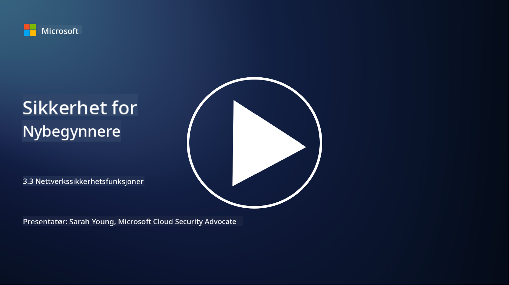

<!--
CO_OP_TRANSLATOR_METADATA:
{
  "original_hash": "c3aba077bb98eebc925dd58d870229ab",
  "translation_date": "2025-09-03T23:34:05+00:00",
  "source_file": "3.3 Network security capabilities.md",
  "language_code": "no"
}
-->
# Nettverkssikkerhetsfunksjoner

I denne leksjonen skal vi lære om følgende funksjoner som kan brukes for å sikre et nettverk:

 - Tradisjonelle brannmurer
 - Webapplikasjonsbrannmurer
 - Skybaserte sikkerhetsgrupper
 - CDN
 - Lastbalanserere
 - Bastion-verter
 - VPN-er
 - DDoS-beskyttelse

## Tradisjonelle brannmurer

Tradisjonelle brannmurer er sikkerhetsenheter som kontrollerer og overvåker innkommende og utgående nettverkstrafikk basert på forhåndsdefinerte sikkerhetsregler. De fungerer som en barriere mellom et pålitelig internt nettverk og upålitelige eksterne nettverk, og filtrerer trafikk for å forhindre uautorisert tilgang og potensielle trusler.

## Webapplikasjonsbrannmurer

Webapplikasjonsbrannmurer (WAF) er spesialiserte brannmurer designet for å beskytte webapplikasjoner mot ulike angrep, som SQL-injeksjon, cross-site scripting og andre sårbarheter. De analyserer HTTP-forespørsler og -svar for å identifisere og blokkere skadelig trafikk som retter seg mot webapplikasjoner.

## Skybaserte sikkerhetsgrupper

Sikkerhetsgrupper er en grunnleggende nettverkssikkerhetsfunksjon som tilbys av skytjenesteleverandører. De fungerer som virtuelle brannmurer som kontrollerer innkommende og utgående trafikk til og fra skyressurser, som virtuelle maskiner (VM-er) og instanser. Sikkerhetsgrupper lar organisasjoner definere regler som bestemmer hvilke typer trafikk som er tillatt og nektet, og gir et ekstra lag med beskyttelse for skybaserte løsninger.

## Content Delivery Network (CDN)

Et Content Delivery Network er et distribuert nettverk av servere plassert på ulike geografiske steder. CDN-er hjelper med å forbedre ytelsen og tilgjengeligheten til nettsteder ved å cache innhold og levere det fra servere som er nærmere brukeren. De gir også en viss grad av beskyttelse mot DDoS-angrep ved å distribuere trafikk over flere serverlokasjoner.

## Lastbalanserere

Lastbalanserere fordeler innkommende nettverkstrafikk over flere servere for å optimalisere ressursutnyttelse, sikre høy tilgjengelighet og forbedre applikasjonsytelsen. De hjelper med å forhindre serveroverbelastning og opprettholde effektive responstider, noe som styrker nettverkets motstandskraft.

## Bastion-verter

Bastion-verter er svært sikre og isolerte servere som gir kontrollert tilgang til et nettverk fra et eksternt, upålitelig nettverk (som internett). De fungerer som inngangspunkter for administratorer som ønsker å få sikker tilgang til interne systemer. Bastion-verter er vanligvis konfigurert med sterke sikkerhetstiltak for å minimere angrepsflaten.

## Virtuelle private nettverk (VPN-er)

VPN-er oppretter krypterte tunneler mellom en brukers enhet og en ekstern server, og sikrer sikker og privat kommunikasjon over potensielt usikre nettverk som internett. VPN-er brukes ofte for å gi fjernbrukere tilgang til interne nettverk, slik at de kan få tilgang til ressurser som om de fysisk var på samme nettverk.

## DDoS-beskyttelsesverktøy

DDoS (Distributed Denial of Service)-beskyttelsesverktøy og -tjenester er designet for å redusere effekten av DDoS-angrep, der flere kompromitterte enheter oversvømmer et nettverk eller en tjeneste for å overbelaste det. DDoS-beskyttelsesløsninger identifiserer og filtrerer ut skadelig trafikk, slik at legitim trafikk fortsatt kan nå sin tiltenkte destinasjon.

## Videre lesing

- [What Is a Firewall? - Cisco](https://www.cisco.com/c/en/us/products/security/firewalls/what-is-a-firewall.html#~types-of-firewalls)
- [What Does a Firewall Actually Do? (howtogeek.com)](https://www.howtogeek.com/144269/htg-explains-what-firewalls-actually-do/)
- [What is a Firewall? How Firewalls Work & Types of Firewalls (kaspersky.com)](https://www.kaspersky.com/resource-center/definitions/firewall)
- [Network security group - how it works | Microsoft Learn](https://learn.microsoft.com/azure/virtual-network/network-security-group-how-it-works)
- [Introduction to Azure Content Delivery Network (CDN) - Training | Microsoft Learn](https://learn.microsoft.com/training/modules/intro-to-azure-content-delivery-network/?WT.mc_id=academic-96948-sayoung)
- [What is a content delivery network (CDN)? - Azure | Microsoft Learn](https://learn.microsoft.com/azure/cdn/cdn-overview?WT.mc_id=academic-96948-sayoung)
- [What Is Load Balancing? How Load Balancers Work (nginx.com)](https://www.nginx.com/resources/glossary/load-balancing/)
- [Bastion hosts vs. VPNs · Tailscale](https://tailscale.com/learn/bastion-hosts-vs-vpns/)
- [What is VPN? How It Works, Types of VPN (kaspersky.com)](https://www.kaspersky.com/resource-center/definitions/what-is-a-vpn)
- [Introduction to Azure DDoS Protection - Training | Microsoft Learn](https://learn.microsoft.com/training/modules/introduction-azure-ddos-protection/?WT.mc_id=academic-96948-sayoung)
- [What Is a DDoS Attack? | Microsoft Security](https://www.microsoft.com/security/business/security-101/what-is-a-ddos-attack?WT.mc_id=academic-96948-sayoung)

---

**Ansvarsfraskrivelse**:  
Dette dokumentet er oversatt ved hjelp av AI-oversettelsestjenesten [Co-op Translator](https://github.com/Azure/co-op-translator). Selv om vi tilstreber nøyaktighet, vær oppmerksom på at automatiske oversettelser kan inneholde feil eller unøyaktigheter. Det originale dokumentet på sitt opprinnelige språk bør anses som den autoritative kilden. For kritisk informasjon anbefales profesjonell menneskelig oversettelse. Vi er ikke ansvarlige for misforståelser eller feiltolkninger som oppstår ved bruk av denne oversettelsen.