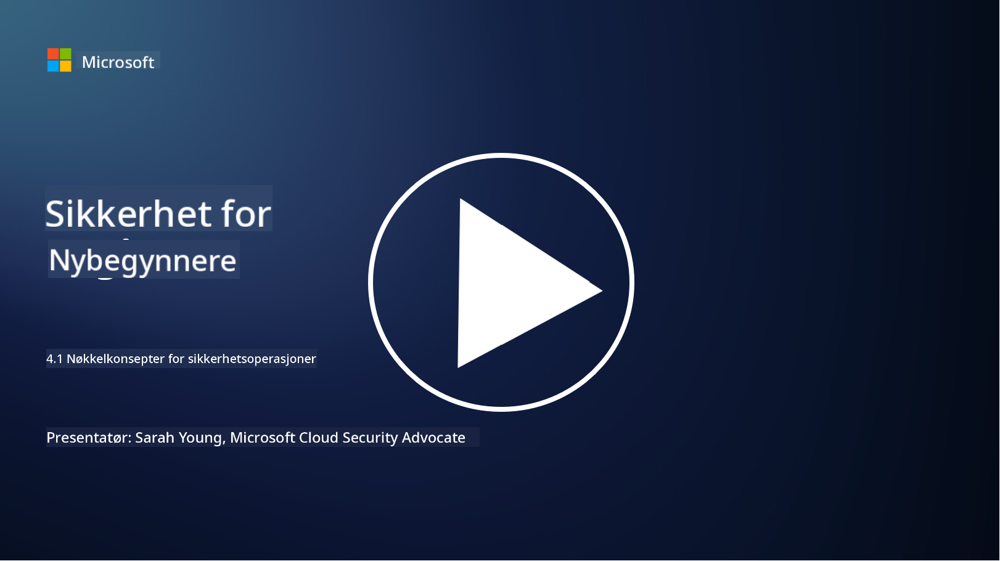

<!--
CO_OP_TRANSLATOR_METADATA:
{
  "original_hash": "6a55b31df9eebf550d040cef0ef7dff3",
  "translation_date": "2025-09-04T02:03:21+00:00",
  "source_file": "4.1 SecOps key concepts.md",
  "language_code": "no"
}
-->
# Nøkkelkonsepter for sikkerhetsoperasjoner

Sikkerhetsoperasjoner er en kritisk del av en organisasjons overordnede sikkerhetsfunksjon. I denne leksjonen skal vi lære mer om dette:

 - Hva er en sikkerhetsoperasjonsfunksjon i en bedrift?
   
 - Hvilke former kan sikkerhetsoperasjoner ta?
   
   - Hvordan skiller sikkerhetsoperasjoner seg fra tradisjonelle IT-operasjoner?

## Hva er en sikkerhetsoperasjonsfunksjon i en bedrift?

En sikkerhetsoperasjonsfunksjon i en bedrift refererer til et dedikert team eller avdeling som har ansvar for å overvåke, oppdage, undersøke og håndtere cybersikkerhetstrusler og -hendelser. Hovedmålet med en sikkerhetsoperasjonsfunksjon er å sikre konfidensialitet, integritet og tilgjengelighet av organisasjonens digitale eiendeler ved proaktivt å identifisere og redusere sikkerhetsrisikoer og effektivt håndtere sikkerhetshendelser.

## Hvilke former kan sikkerhetsoperasjoner ta?

Sikkerhetsoperasjoner kan ta ulike former avhengig av organisasjonens størrelse og kompleksitet. Noen vanlige former inkluderer:

**Security Operations Center (SOC):** Et sentralisert team som har ansvar for døgnkontinuerlig overvåking, analyse og respons på sikkerhetshendelser. SOC-er bruker ofte avanserte verktøy og teknologier for å identifisere og håndtere trusler i sanntid.

**Incident Response Team:** Et spesialisert team som fokuserer på å håndtere sikkerhetshendelser og brudd. De gjennomfører undersøkelser, koordinerer responsarbeid og legger til rette for gjenoppretting.

**Threat Hunting Team:** Et team som proaktivt leter etter tegn på avanserte trusler og skjulte sårbarheter som kanskje ikke oppdages av tradisjonelle sikkerhetsverktøy.

**Red Team/Blue Team:** Red team simulerer angrep for å identifisere sårbarheter, mens blue team forsvarer mot disse angrepene. Begge teamene samarbeider for å forbedre sikkerhetstiltakene.

**Managed Security Services Provider (MSSP):** Noen organisasjoner outsourcer sine sikkerhetsoperasjoner til tredjepartsleverandører som spesialiserer seg på sikkerhetsovervåking og hendelseshåndtering.

## Hvordan skiller sikkerhetsoperasjoner seg fra tradisjonelle IT-operasjoner?

Sikkerhetsoperasjoner og tradisjonelle IT-operasjoner er relaterte, men forskjellige funksjoner:

**Fokus:** IT-operasjoner fokuserer på å administrere og vedlikeholde organisasjonens IT-infrastruktur, og sikre dens funksjonalitet og tilgjengelighet. Sikkerhetsoperasjoner prioriterer derimot identifisering og reduksjon av sikkerhetsrisikoer samt håndtering av hendelser.

**Ansvarsområder:** IT-operasjoner håndterer oppgaver som systemvedlikehold, programvareoppdateringer og brukerstøtte. Sikkerhetsoperasjoner håndterer trusseldeteksjon, hendelseshåndtering, sårbarhetsstyring og sikkerhetsovervåking.

**Tidsaspekt:** IT-operasjoner legger vekt på umiddelbar systemtilgjengelighet og ytelse. Sikkerhetsoperasjoner fokuserer på å identifisere og utbedre trusler, noe som ikke alltid samsvarer med umiddelbar tilgjengelighet.

**Kompetanse:** Sikkerhetsoperasjoner krever spesialiserte ferdigheter innen trusselanalyse, hendelseshåndtering og cybersikkerhetsverktøy. IT-operasjoner krever ekspertise innen systemadministrasjon, nettverksadministrasjon og applikasjonsstøtte.

## Arbeidsflyt for hendelseshåndtering

NIST Cybersecurity Framework Core Functions lister opp fem overordnede funksjoner som bør utføres kontinuerlig som en del av en organisasjons operative miljø for å redusere cybersikkerhetsrisiko. 

Det er viktig å forstå at disse aktivitetene bør eksistere som en del av en større sirkel som kobles til og er i tråd med organisasjonens bredere cybersikkerhetsprosesser. 

**Note:** Du kan lese mer om NIST Cybersecurity Framework på [https://www.nist.gov/cybersecurity](https://www.nist.gov/cybersecurity)

## Videre lesing

- [Security operations | Microsoft Learn](https://learn.microsoft.com/security/operations/overview?WT.mc_id=academic-96948-sayoung)
- [Implementing security operations processes | Microsoft Learn](https://learn.microsoft.com/security/operations/?WT.mc_id=academic-96948-sayoung)
- [What is a security operations center (SOC)? | Microsoft Security](https://www.microsoft.com/security/business/security-101/what-is-a-security-operations-center-soc?WT.mc_id=academic-96948-sayoung)
- [What Is a Security Operations Center | Cybersecurity | CompTIA](https://www.comptia.org/content/articles/what-is-a-security-operations-center)

---

**Ansvarsfraskrivelse**:  
Dette dokumentet er oversatt ved hjelp av AI-oversettelsestjenesten [Co-op Translator](https://github.com/Azure/co-op-translator). Selv om vi streber etter nøyaktighet, vær oppmerksom på at automatiske oversettelser kan inneholde feil eller unøyaktigheter. Det originale dokumentet på sitt opprinnelige språk bør anses som den autoritative kilden. For kritisk informasjon anbefales profesjonell menneskelig oversettelse. Vi er ikke ansvarlige for misforståelser eller feiltolkninger som oppstår ved bruk av denne oversettelsen.