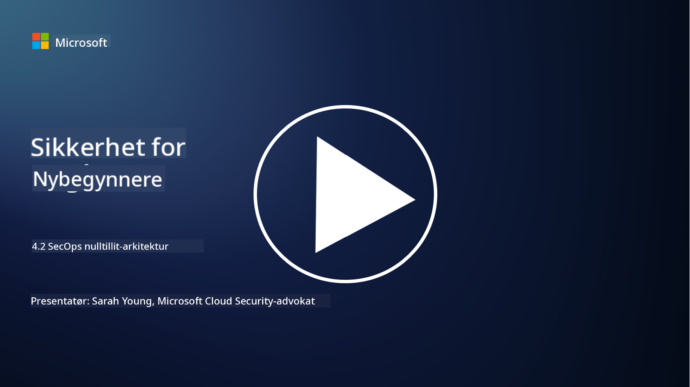

<!--
CO_OP_TRANSLATOR_METADATA:
{
  "original_hash": "45bbdc114e70936816b0b3e7c40189cf",
  "translation_date": "2025-09-04T00:45:24+00:00",
  "source_file": "4.2 SecOps zero trust architecture.md",
  "language_code": "no"
}
-->
# SecOps null tillit-arkitektur

Sikkerhetsoperasjoner utgjør to deler av null tillit-arkitekturen, og i denne leksjonen skal vi lære om begge:

- Hvordan må IT-arkitekturer bygges for å muliggjøre sentralisert loggsamling?

- Hva er beste praksis for sikkerhetsoperasjoner i moderne IT-miljøer?

## Hvordan må IT-arkitekturer bygges for å muliggjøre sentralisert loggsamling?

Sentralisert loggsamling er en kritisk komponent i moderne sikkerhetsoperasjoner. Det gir organisasjoner mulighet til å samle inn logger og data fra ulike kilder, som servere, applikasjoner, nettverksenheter og sikkerhetsverktøy, i et sentralt lager for analyse, overvåking og hendelseshåndtering. Her er noen beste praksiser for å bygge IT-arkitekturer som støtter sentralisert loggsamling:

1. **Integrering av loggkilder**:

- Sørg for at alle relevante enheter og systemer er konfigurert til å generere logger. Dette inkluderer servere, brannmurer, rutere, svitsjer, applikasjoner og sikkerhetsenheter.

- Konfigurer loggkilder til å videresende logger til en sentral loggsamler eller administrasjonssystem.

2. **Velg riktig SIEM-verktøy (Security Information and Event Management)**:

- Velg en SIEM-løsning som passer til organisasjonens behov og skala.

- Sørg for at den valgte løsningen støtter loggsamling, aggregering, analyse og rapportering.

3. **Skalerbarhet og redundans**:

- Design arkitekturen for skalerbarhet slik at den kan håndtere et økende antall loggkilder og økt loggvolum.

- Implementer redundans for høy tilgjengelighet for å unngå avbrudd på grunn av maskinvare- eller nettverksfeil.

4. **Sikker transport av logger**:

- Bruk sikre protokoller som TLS/SSL eller IPsec for å transportere logger fra kildene til det sentrale lageret.

- Implementer autentisering og tilgangskontroller for å sikre at kun autoriserte enheter kan sende logger.

5. **Normalisering**:

- Standardiser loggformater og normaliser data for å sikre konsistens og enkel analyse.

6. **Lagring og oppbevaring**:

- Bestem riktig oppbevaringsperiode for logger basert på samsvars- og sikkerhetskrav.

- Lagre logger sikkert og beskytt dem mot uautorisert tilgang og manipulering.

## Hva er beste praksis for sikkerhetsoperasjoner i moderne IT-miljøer?

I tillegg til sentralisert loggsamling, her er noen beste praksiser for sikkerhetsoperasjoner i moderne IT-miljøer:

1. **Kontinuerlig overvåking**: Implementer kontinuerlig overvåking av nettverks- og systemaktiviteter for å oppdage og reagere på trusler i sanntid.

2. **Trusselinformasjon**: Hold deg oppdatert på nye trusler og sårbarheter ved å bruke trusselinformasjonsstrømmer og -tjenester.

3. **Brukeropplæring**: Gjennomfør regelmessig sikkerhetsopplæring for ansatte for å redusere risikoen forbundet med sosial manipulering og phishing-angrep.

4. **Hendelseshåndteringsplan**: Utvikle og test en hendelseshåndteringsplan for å sikre en rask og effektiv respons på sikkerhetshendelser.

5. **Sikkerhetsautomatisering**: Bruk sikkerhetsautomatiserings- og orkestreringsverktøy for å effektivisere hendelseshåndtering og repetitive oppgaver.

6. **Sikkerhetskopiering og gjenoppretting**: Implementer robuste sikkerhetskopierings- og katastrofegjenopprettingsløsninger for å sikre datatilgjengelighet i tilfelle datatap eller løsepengevirusangrep.

## Videre lesing

- [Microsoft Security Best Practices module: Security operations | Microsoft Learn](https://learn.microsoft.com/security/operations/security-operations-videos-and-decks?WT.mc_id=academic-96948-sayoung)
- [Security operations - Cloud Adoption Framework | Microsoft Learn](https://learn.microsoft.com/azure/cloud-adoption-framework/secure/security-operations?WT.mc_id=academic-96948-sayoung)
- [What is Security Operations and Analytics Platform Architecture? A Definition of SOAPA, How It Works, Benefits, and More (digitalguardian.com)](https://www.digitalguardian.com/blog/what-security-operations-and-analytics-platform-architecture-definition-soapa-how-it-works#:~:text=All%20in%20all%2C%20security%20operations%20and%20analytics%20platform,become%20more%20efficient%20and%20operative%20with%20your%20security.)

---

**Ansvarsfraskrivelse**:  
Dette dokumentet er oversatt ved hjelp av AI-oversettelsestjenesten [Co-op Translator](https://github.com/Azure/co-op-translator). Selv om vi tilstreber nøyaktighet, vennligst vær oppmerksom på at automatiske oversettelser kan inneholde feil eller unøyaktigheter. Det originale dokumentet på sitt opprinnelige språk bør anses som den autoritative kilden. For kritisk informasjon anbefales profesjonell menneskelig oversettelse. Vi er ikke ansvarlige for eventuelle misforståelser eller feiltolkninger som oppstår ved bruk av denne oversettelsen.