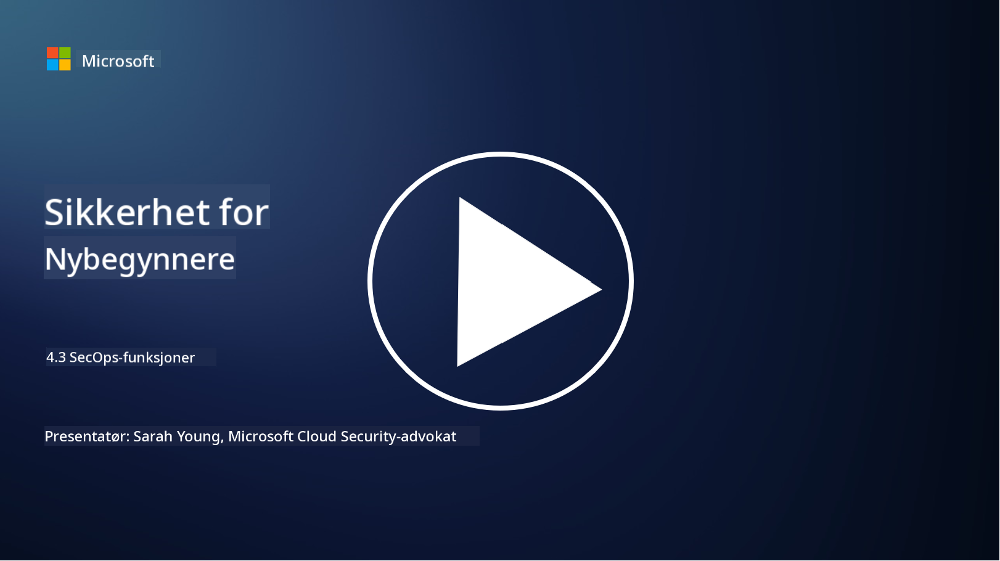

<!--
CO_OP_TRANSLATOR_METADATA:
{
  "original_hash": "553eb694c89f1caca0694e8d8ab89e0e",
  "translation_date": "2025-09-04T01:19:53+00:00",
  "source_file": "4.3 SecOps capabilities.md",
  "language_code": "no"
}
-->
# SecOps-funksjoner

I denne delen skal vi gå nærmere inn på de viktigste verktøyene og funksjonene som kan brukes i sikkerhetsoperasjoner.

I denne leksjonen skal vi dekke:

- Hva er et verktøy for sikkerhetsinformasjon og hendelseshåndtering (SIEM)?

- Hva er XDR?

- Hvilke funksjoner kan brukes for å forbedre sikkerhetsoperasjoner?

## Hva er et verktøy for sikkerhetsinformasjon og hendelseshåndtering (SIEM)?

Et verktøy for sikkerhetsinformasjon og hendelseshåndtering (SIEM) brukes til å analysere sikkerhetsvarsler som genereres i en organisasjons IT-miljø. De samler inn, aggregerer, korrelerer og analyserer loggdata og sikkerhetshendelser fra ulike kilder, som nettverksenheter, servere, applikasjoner og sikkerhetssystemer.

Viktige funksjoner og egenskaper ved SIEM-verktøy inkluderer:

1. **Logginnsamling**: SIEM-verktøy samler inn logger og sikkerhetshendelsesdata fra et bredt spekter av enheter, systemer og applikasjoner, inkludert brannmurer, inntrengingsdeteksjonssystemer, antivirusprogramvare og mer.

2. **Datanormalisering**: De normaliserer loggdata til et felles format for å lette analyse og korrelasjon.

3. **Hendelseskorrelasjon**: SIEM-verktøy korrelerer hendelser for å identifisere mønstre og avvik som kan indikere sikkerhetshendelser eller trusler.

4. **Varsling og notifikasjon**: SIEM-verktøy genererer varsler og notifikasjoner i sanntid når mistenkelige aktiviteter eller sikkerhetsbrudd oppdages, slik at man kan reagere umiddelbart.

5. **Hendelsesdeteksjon**: De legger til rette for deteksjon av sikkerhetshendelser, inkludert uautorisert tilgang, datainnbrudd, malware-infeksjoner og interne trusler.

6. **Analyse av bruker- og enhetsatferd (UEBA)**: Noen SIEM-verktøy inkluderer UEBA-funksjoner for å identifisere unormal atferd hos brukere og enheter som kan indikere kompromitterte kontoer eller interne trusler.

7. **Integrasjon av trusselinformasjon**: SIEM-verktøy kan integreres med trusselinformasjonsstrømmer for å forbedre trusseldeteksjon ved å sammenligne kjente kompromitteringsindikatorer (IOCs) med nettverksaktivitet.

8. **Automatisering og orkestrering**: Automatiseringsfunksjoner gjør det mulig for SIEM å automatisere respons på vanlige sikkerhetshendelser, noe som reduserer responstider og manuelt arbeid.

9. **Dashbord og visualisering**: De tilbyr dashbord og visualiseringsverktøy for overvåking av sikkerhetsdata og oppretting av tilpassede rapporter.

10. **Integrasjon med andre sikkerhetsverktøy**: SIEM-verktøy integreres ofte med andre sikkerhetsverktøy og teknologier, som Endpoint Detection and Response (EDR)-løsninger, for å gi en helhetlig oversikt over en organisasjons sikkerhetsstatus.

## Hva er XDR?

XDR (Extended Detection and Response) er en teknologi som utvider funksjonene til tradisjonell Endpoint Detection and Response (EDR) og kombinerer dem med bredere sikkerhetstelemetri fra ulike kilder for å gi en mer omfattende oversikt over en organisasjons sikkerhetsstatus. XDR har som mål å forbedre trusseldeteksjon, hendelsesrespons og generell sikkerhet ved å adressere begrensningene ved å kun stole på EDR, SIEM eller andre individuelle sikkerhetsverktøy.

Viktige egenskaper og komponenter ved XDR inkluderer:

1. **Dataintegrasjon**: XDR integrerer data fra flere kilder, inkludert endepunkter, nettverkstrafikk, skytjenester, e-post og mer. Denne omfattende dataaggregasjonen gir en bredere kontekst for trusseldeteksjon og analyse.

2. **Avansert analyse**: XDR bruker avansert analyse, maskinlæring og atferdsanalyse for å identifisere og prioritere sikkerhetstrusler. Det ser etter mønstre og avvik i de integrerte dataene for å oppdage både kjente og ukjente trusler.

3. **Automatisert trusseldeteksjon**: XDR automatiserer deteksjon av sikkerhetstrusler og avvik ved å korrelere informasjon fra ulike kilder. Det kan identifisere komplekse angrepskjeder som kan strekke seg over flere vektorer.

4. **Hendelsesundersøkelse og respons**: XDR gir verktøy for hendelsesundersøkelse og respons, som hjelper sikkerhetsteam med raskt å vurdere omfanget og virkningen av hendelser og ta passende tiltak.

5. **Integrasjon av trusselinformasjon**: Det integrerer trusselinformasjonsstrømmer og data for å forbedre trusseldeteksjon ved å sammenligne kjente kompromitteringsindikatorer (IOCs) med organisasjonens nettverks- og endepunktaktivitet.

6. **Samlet konsoll**: XDR tilbyr vanligvis en samlet konsoll eller et dashbord der sikkerhetsteam kan se og administrere sikkerhetsvarsler og hendelser fra ulike kilder på en sentralisert måte.

7. **Dekning på tvers av plattformer**: XDR-løsninger dekker et bredt spekter av plattformer, inkludert endepunkter, servere, skymiljøer og mobile enheter, noe som gjør det egnet for moderne, flerplattform IT-miljøer.

## Hvilke funksjoner kan brukes for å forbedre sikkerhetsoperasjoner?

For å forbedre sikkerhetsoperasjoner kan organisasjoner benytte seg av flere funksjoner i tillegg til SIEM-verktøy:

1. **Maskinlæring og kunstig intelligens**: Implementer avansert analyse, maskinlæring og AI for å oppdage utviklende trusler og automatisere trusseljakt.

2. **Analyse av bruker- og enhetsatferd (UEBA)**: Analyser bruker- og enhetsatferd for å oppdage avvik og interne trusler.

3. **Trusselinformasjonsstrømmer**: Integrer trusselinformasjonsstrømmer for å holde deg oppdatert på de nyeste truslene og kompromitteringsindikatorene.

4. **Sikkerhetsorkestrering, automatisering og respons (SOAR)**: Implementer SOAR-plattformer for å automatisere hendelsesrespons og effektivisere arbeidsflyten i sikkerhetsoperasjoner.

5. **Deception-teknologier**: Bruk deception-teknologier for å villede og oppdage angripere i nettverket.

## Videre lesing

- [What is SIEM? | Microsoft Security](https://www.microsoft.com/security/business/security-101/what-is-siem?WT.mc_id=academic-96948-sayoung)
- [What Is SIEM? - Security Information and Event Management - Cisco](https://www.cisco.com/c/en/us/products/security/what-is-siem.html)
- [Security information and event management - Wikipedia](https://en.wikipedia.org/wiki/Security_information_and_event_management)
- [What Is XDR? | Microsoft Security](https://www.microsoft.com/security/business/security-101/what-is-xdr?WT.mc_id=academic-96948-sayoung)
- [XDR & XDR Security (kaspersky.com.au)](https://www.kaspersky.com.au/resource-center/definitions/what-is-xdr)
- [The Power of SecOps: Redefining Core Security Capabilities - The New Stack](https://thenewstack.io/the-power-of-secops-redefining-core-security-capabilities/)
- [Seven Steps to Improve Your Security Operations and Response (securityintelligence.com)](https://securityintelligence.com/seven-steps-to-improve-your-security-operations-and-response/)

---

**Ansvarsfraskrivelse**:  
Dette dokumentet er oversatt ved hjelp av AI-oversettelsestjenesten [Co-op Translator](https://github.com/Azure/co-op-translator). Selv om vi tilstreber nøyaktighet, vennligst vær oppmerksom på at automatiske oversettelser kan inneholde feil eller unøyaktigheter. Det originale dokumentet på sitt opprinnelige språk bør anses som den autoritative kilden. For kritisk informasjon anbefales profesjonell menneskelig oversettelse. Vi er ikke ansvarlige for eventuelle misforståelser eller feiltolkninger som oppstår ved bruk av denne oversettelsen.