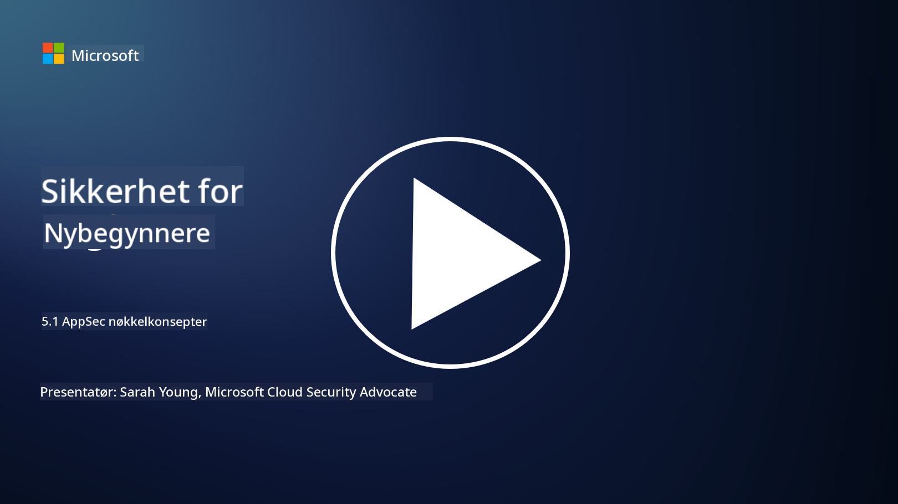

<!--
CO_OP_TRANSLATOR_METADATA:
{
  "original_hash": "e4b56bb23078d3ffb7ad407d280b0c36",
  "translation_date": "2025-09-04T00:32:36+00:00",
  "source_file": "5.1 AppSec key concepts.md",
  "language_code": "no"
}
-->
# AppSec nøkkelkonsepter

Applikasjonssikkerhet er en egen spesialisering innen sikkerhet. I denne delen av kurset skal vi se nærmere på applikasjonssikkerhet.

## Introduksjon

I denne leksjonen skal vi dekke:

- Hva er applikasjonssikkerhet?

- Hva er nøkkelkonsepter/prinsipper innen applikasjonssikkerhet?

## Hva er applikasjonssikkerhet?

Applikasjonssikkerhet, ofte forkortet til "AppSec," refererer til praksisen med å beskytte programvareapplikasjoner mot sikkerhetstrusler, sårbarheter og angrep. Det omfatter prosesser, teknikker og verktøy som brukes for å identifisere, redusere og forhindre sikkerhetsrisiko gjennom hele utviklings-, implementerings- og vedlikeholdslivssyklusen til en applikasjon.

Applikasjonssikkerhet er kritisk fordi applikasjoner ofte er mål for cyberangrep. Ondsinnede aktører utnytter sårbarheter og svakheter i programvare for å få uautorisert tilgang, stjele data, forstyrre tjenester eller utføre andre skadelige aktiviteter. Effektiv applikasjonssikkerhet bidrar til å sikre konfidensialitet, integritet og tilgjengelighet for en applikasjon og dens tilhørende data.

## Hva er nøkkelkonsepter/prinsipper innen applikasjonssikkerhet?

Nøkkelkonsepter og prinsipper som ligger til grunn for applikasjonssikkerhet inkluderer:

1. **Sikkerhet ved design**:

- Sikkerhet bør integreres i applikasjonens design og arkitektur fra starten, i stedet for å bli lagt til i etterkant.

2. **Input-validering**:

- All brukerinput bør valideres for å sikre at den samsvarer med forventede formater og er fri for skadelig kode eller data.

3. **Output-koding**:

- Data som sendes til klienten bør kodes riktig for å forhindre sårbarheter som cross-site scripting (XSS).

4. **Autentisering og autorisering**:

- Autentiser brukere og autoriser deres tilgang til ressurser basert på roller og tillatelser.

5. **Databeskyttelse**:

- Sensitiv data bør krypteres når den lagres, overføres og behandles for å forhindre uautorisert tilgang.

6. **Sesjonshåndtering**:

- Sikker sesjonshåndtering sikrer at brukersesjoner er beskyttet mot kapring og uautorisert tilgang.

7. **Sikre avhengigheter**:

- Hold alle programvareavhengigheter oppdatert med sikkerhetsoppdateringer for å forhindre sårbarheter.

8. **Feilhåndtering og logging**:

- Implementer sikker feilhåndtering for å unngå å avsløre sensitiv informasjon og sørg for sikre loggingspraksiser.

9. **Sikkerhetstesting**:

- Test applikasjoner regelmessig for sårbarheter ved hjelp av metoder som penetrasjonstesting, kodegjennomganger og automatiserte skanningsverktøy.

10. **Sikker programvareutviklingslivssyklus (SDLC)**:

- Integrer sikkerhetspraksis i alle faser av programvareutviklingslivssyklusen, fra krav til implementering og vedlikehold.

## Videre lesing

- [SheHacksPurple: What is Application Security? - YouTube](https://www.youtube.com/watch?v=eNmccQNzSSY)
- [What Is Application Security? - Cisco](https://www.cisco.com/c/en/us/solutions/security/application-first-security/what-is-application-security.html#~how-does-it-work)
- [What is application security? A process and tools for securing software | CSO Online](https://www.csoonline.com/article/566471/what-is-application-security-a-process-and-tools-for-securing-software.html)
- [OWASP Cheat Sheet Series | OWASP Foundation](https://owasp.org/www-project-cheat-sheets/)

---

**Ansvarsfraskrivelse**:  
Dette dokumentet er oversatt ved hjelp av AI-oversettelsestjenesten [Co-op Translator](https://github.com/Azure/co-op-translator). Selv om vi streber etter nøyaktighet, vær oppmerksom på at automatiske oversettelser kan inneholde feil eller unøyaktigheter. Det originale dokumentet på sitt opprinnelige språk bør anses som den autoritative kilden. For kritisk informasjon anbefales profesjonell menneskelig oversettelse. Vi er ikke ansvarlige for misforståelser eller feiltolkninger som oppstår ved bruk av denne oversettelsen.