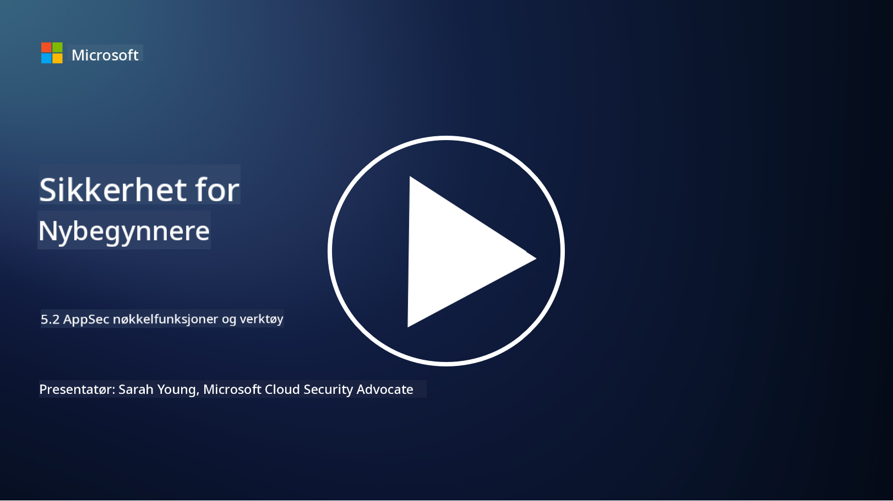

<!--
CO_OP_TRANSLATOR_METADATA:
{
  "original_hash": "790a3fa7e535ec60bb51bde13e759781",
  "translation_date": "2025-09-04T00:50:50+00:00",
  "source_file": "5.2 AppSec key capabilities.md",
  "language_code": "no"
}
-->
## Introduksjon

I denne leksjonen skal vi dekke hvilke nøkkelfunksjoner og verktøy som brukes innen applikasjonssikkerhet.

## Nøkkelfunksjoner og verktøy innen applikasjonssikkerhet

Nøkkelfunksjoner og verktøy som brukes innen applikasjonssikkerhet er avgjørende for å identifisere, redusere og forhindre sikkerhetssårbarheter og trusler i programvareapplikasjoner. Her er noen av de viktigste:

**1. Statisk applikasjonssikkerhetstesting (SAST)**:

- **Funksjoner**: Analyserer kildekode, bytekode eller binærkode for å identifisere sikkerhetssårbarheter i applikasjonens kodebase.

- **Verktøy**: Eksempler inkluderer Fortify, Checkmarx og Veracode.

**2. Dynamisk applikasjonssikkerhetstesting (DAST)**:

- **Funksjoner**: Skanner en kjørende applikasjon for å identifisere sårbarheter ved å sende innspillsforespørsler og analysere svarene.

- **Verktøy**: Eksempler inkluderer ZAP, Burp Suite og Qualys Web Application Scanning.

**3. Interaktiv applikasjonssikkerhetstesting (IAST)**:

- **Funksjoner**: Kombinerer elementer fra SAST og DAST for å analysere kode under kjøring, noe som gir mer nøyaktige resultater og reduserer falske positiver.

- **Verktøy**: Eksempler inkluderer Contrast Security og HCL AppScan.

**4. Runtime Application Self-Protection (RASP)**:

- **Funksjoner**: Overvåker og beskytter applikasjoner i sanntid, oppdager og reagerer på sikkerhetstrusler mens de oppstår.

- **Verktøy**: Eksempler inkluderer Veracode Runtime Protection og F5 Advanced WAF med RASP.

**5. Web Application Firewalls (WAFs)**:

- **Funksjoner**: Gir et beskyttende lag mellom applikasjonen og internett, filtrerer innkommende trafikk og blokkerer skadelige forespørsler.

- **Verktøy**: Eksempler inkluderer ModSecurity, AWS WAF og Akamai Kona Site Defender.

**6. Avhengighetsskanning**:

- **Funksjoner**: Identifiserer sårbarheter i tredjepartsbiblioteker og komponenter som brukes i applikasjonen.

- **Verktøy**: Eksempler inkluderer OWASP Dependency-Check og Snyk.

**7. Penetrasjonstesting (Pen Testing)**:

- **Funksjoner**: Simulerer realistiske angrep for å oppdage sårbarheter og vurdere sikkerheten til en applikasjon.

- **Verktøy**: Utføres av sertifiserte etiske hackere og sikkerhetsprofesjonelle ved bruk av ulike verktøy som Metasploit og Nmap.

**8. Sikkerhetsskanning og analyse**:

- **Funksjoner**: Skanner etter kjente sårbarheter, konfigurasjonsfeil og sikkerhetsmisforståelser.

- **Verktøy**: Eksempler inkluderer Nessus, Qualys Vulnerability Management og OpenVAS.

**9. Verktøy for containersikkerhet**:

- **Funksjoner**: Fokuserer på å sikre containeriserte applikasjoner og deres miljøer.

- **Verktøy**: Eksempler inkluderer Docker Security Scanning og Aqua Security.

**10. Opplæring i sikker utvikling**:

- **Funksjoner**: Tilbyr opplæring og bevisstgjøringsprogrammer for utviklingsteam for å fremme sikre kodingspraksiser.

- **Verktøy**: Tilpassede opplæringsprogrammer og plattformer.

**11. Rammeverk for sikkerhetstesting**:

- **Funksjoner**: Tilbyr omfattende testverktøy for ulike behov innen applikasjonssikkerhetstesting.

- **Verktøy**: OWASP Amass, OWASP OWTF og FrAppSec.

**12. Verktøy for sikker kodegjennomgang**:

- **Funksjoner**: Gjennomgår kildekode for sikkerhetssårbarheter og kodingsbestepraksiser.

- **Verktøy**: Eksempler inkluderer SonarQube og Checkmarx.

**13. Verktøy for sikre API-er og mikrotjenester**:

- **Funksjoner**: Fokuserer på å sikre API-er og mikrotjenester, inkludert autentisering, autorisasjon og databeskyttelse.

- **Verktøy**: Eksempler inkluderer Apigee, AWS API Gateway og Istio.

## Videre lesing

- [What Is Application Security? Concepts, Tools & Best Practices | HackerOne](https://www.hackerone.com/knowledge-center/what-application-security-concepts-tools-best-practices)
- [What is IAST? (Interactive Application Security Testing) (comparitech.com)](https://www.comparitech.com/net-admin/what-is-iast/)
- [10 Types of Application Security Testing Tools: When and How to Use Them (cmu.edu)](https://insights.sei.cmu.edu/blog/10-types-of-application-security-testing-tools-when-and-how-to-use-them/)
- [Shifting the Balance of Cybersecurity Risk: Principles and Approaches for Security-by-Design and Default | Cyber.gov.au](https://www.cyber.gov.au/about-us/view-all-content/publications/principles-and-approaches-for-security-by-design-and-default)

---

**Ansvarsfraskrivelse**:  
Dette dokumentet er oversatt ved hjelp av AI-oversettelsestjenesten [Co-op Translator](https://github.com/Azure/co-op-translator). Selv om vi tilstreber nøyaktighet, vennligst vær oppmerksom på at automatiske oversettelser kan inneholde feil eller unøyaktigheter. Det originale dokumentet på sitt opprinnelige språk bør anses som den autoritative kilden. For kritisk informasjon anbefales profesjonell menneskelig oversettelse. Vi er ikke ansvarlige for eventuelle misforståelser eller feiltolkninger som oppstår ved bruk av denne oversettelsen.