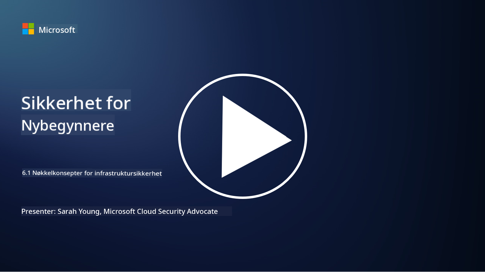

<!--
CO_OP_TRANSLATOR_METADATA:
{
  "original_hash": "882ebf66a648f419bcbf680ed6aefa00",
  "translation_date": "2025-09-03T23:14:29+00:00",
  "source_file": "6.1 Infrastructure security key concepts.md",
  "language_code": "no"
}
-->
# Nøkkelkonsepter innen infrastruktur-sikkerhet

"Infrastruktur" refererer til byggesteinene i ethvert IT-miljø, som inkluderer servere, skytjenester og containere – et bredt spekter av ulike teknologier. Applikasjonene som ble diskutert i forrige seksjon kjører på infrastruktur, og denne infrastrukturen kan også være et mål for angripere.

I denne leksjonen skal vi dekke:

- Hva er sikkerhetshygiene, og hvorfor er det viktig?

- Hva er sikkerhetsstatushåndtering?

- Hva er patching, og hvorfor er det viktig?

- Hva er containere, og hva er annerledes med sikkerheten deres?

## Hva er sikkerhetshygiene, og hvorfor er det viktig?

**Sikkerhetshygiene** refererer til settet med praksiser og atferd som enkeltpersoner og organisasjoner følger for å opprettholde gode cybersikkerhetsvaner. Det innebærer å ta skritt for å beskytte systemer, data og nettverk mot trusler og sårbarheter. God sikkerhetshygiene er viktig av flere grunner:

- **Forebygge angrep**: Å følge beste praksis kan forhindre vanlige cyberangrep, som phishing, skadevareinfeksjoner og uautorisert tilgang.

- **Beskytte data**: Riktig sikkerhetshygiene sikrer sensitiv og konfidensiell data mot tyveri eller eksponering.

- **Opprettholde tillit**: Organisasjoner som viser god sikkerhetshygiene bygger tillit hos kunder og partnere.

- **Etterlevelse**: Mange forskrifter og standarder krever at organisasjoner følger sikkerhetshygienepraksiser.

- **Redusere risiko**: Konsistent sikkerhetshygiene reduserer den totale risikoen for sikkerhetshendelser og brudd.

Sikkerhetshygiene inkluderer praksiser som å holde programvare oppdatert, bruke sterke passord og flerfaktorautentisering, regelmessige sikkerhetskopier, opplæring av ansatte og overvåking av mistenkelige aktiviteter. Det er grunnlaget for en sterk cybersikkerhet.

## Hva er sikkerhetsstatushåndtering?

Sikkerhetsstatushåndtering refererer til praksisen med å vurdere, overvåke og administrere en organisasjons samlede cybersikkerhetsstatus. En cybersikkerhetsstatus beskriver en organisasjons overordnede tilnærming og beredskap til å beskytte sine IT-systemer, nettverk, data og eiendeler mot cybertrusler og angrep. Den omfatter strategiene, policyene, praksisene og teknologiene som en organisasjon bruker for å sikre sine digitale eiendeler og opprettholde konfidensialitet, integritet og tilgjengelighet av informasjonen.

Det innebærer å evaluere og opprettholde sikkerheten til systemer, nettverk, applikasjoner og data for å sikre at de er i tråd med sikkerhetspolicyer, beste praksis og krav til etterlevelse. Målet med sikkerhetsstatushåndtering er å gi en helhetlig oversikt over en organisasjons sikkerhetsstatus, identifisere sårbarheter og svakheter, og prioritere tiltak for å rette opp disse.

## Hva er patching, og hvorfor er det viktig?

**Patching** refererer til prosessen med å anvende programvareoppdateringer, også kjent som patcher eller fikser, til programvare, operativsystemer og applikasjoner. Disse oppdateringene adresserer vanligvis sikkerhetssårbarheter, feil og andre problemer som kan utnyttes av angripere. Maskinvareenheter krever også patching: dette kan være fastvaren eller det innebygde operativsystemet. Maskinvarepatching kan være mye vanskeligere enn programvarepatching.

Patching er viktig av flere grunner:

- **Sikkerhet**: Patcher fikser kjente sårbarheter som angripere kan utnytte for å kompromittere systemer og stjele data.

- **Stabilitet**: Patcher inkluderer ofte forbedringer i stabilitet og ytelse, noe som reduserer risikoen for krasj eller systemfeil.

- **Etterlevelse**: Mange forskrifter og standarder for etterlevelse krever at organisasjoner raskt anvender sikkerhetspatcher.

- **Opprettholde tillit**: Regelmessig patching bidrar til å opprettholde tilliten til kunder og interessenter ved å vise en forpliktelse til sikkerhet.

- **Reduksjon av risiko**: Patching reduserer angrepsflaten og sannsynligheten for vellykkede cyberangrep.

Manglende anvendelse av patcher i tide kan etterlate systemer sårbare for kjente utnyttelser, noe som øker risikoen for sikkerhetsbrudd og datatap.

## Hva er containere, og hva er annerledes med sikkerheten deres?

Containere er en form for lette, frittstående og kjørbare programvarepakker som inneholder alt som trengs for å kjøre et stykke programvare, inkludert koden, runtime, biblioteker og systemverktøy. Containere gir et konsistent og isolert miljø for applikasjoner, noe som gjør det enklere å utvikle, pakke og distribuere programvare på tvers av ulike miljøer og plattformer. Populære containerteknologier inkluderer Docker og Kubernetes.

Containersikkerhet refererer til praksisene og teknologiene som brukes for å beskytte containere og applikasjonene de hoster mot ulike sikkerhetstrusler og sårbarheter. Containersikkerhet er avgjørende fordi, selv om containere gir mange fordeler når det gjelder portabilitet og skalerbarhet, introduserer de også potensielle sikkerhetsutfordringer:

1. **Bildesikkerhet:** Containerbilder kan inneholde sårbarheter, og hvis disse bildene ikke oppdateres og patches regelmessig, kan de utnyttes av angripere. Containersikkerhet innebærer skanning av bilder for kjente sårbarheter og å sikre at kun pålitelige bilder brukes.

2. **Kjøretidssikkerhet:** Kjørende containere må isoleres fra hverandre og verts-systemet for å forhindre uautorisert tilgang og potensielle angrep. Kjøretidssikkerhetsmekanismer inkluderer containerisolasjonsteknologier som namespaces og cgroups, samt verktøy for overvåking og revisjon av containeratferd.

3. **Nettverkssikkerhet:** Containere kommuniserer med hverandre og eksterne systemer over nettverk. Riktig nettverkssegmentering og brannmurregler er essensielt for å kontrollere trafikk mellom containere og forhindre uautorisert tilgang.

4. **Tilgangskontroll:** Å sikre at kun autoriserte brukere og prosesser kan få tilgang til og endre containere er kritisk. Rollebasert tilgangskontroll (RBAC) og identitetsstyringsverktøy brukes ofte for tilgangskontroll.

5. **Logging og overvåking:** Containersikkerhet innebærer innsamling og analyse av logger og overvåkingsdata for å oppdage og reagere på sikkerhetshendelser og avvik i sanntid.

6. **Orkestreringssikkerhet:** Når man bruker containerorkestreringsplattformer som Kubernetes, er det like viktig å sikre orkestreringslaget. Dette inkluderer å sikre Kubernetes API-serveren, sørge for riktige RBAC-policyer og revidere aktivitet i klyngen.

7. **Håndtering av hemmeligheter:** Håndtering av sensitiv informasjon, som API-nøkler og passord, i containere krever sikre lagrings- og styringsløsninger for å forhindre eksponering.

Løsninger for containersikkerhet involverer ofte en kombinasjon av sikkerhetspraksiser, verktøy for sårbarhetsskanning, kjøretidsbeskyttelsesmekanismer, nettverkssikkerhetskonfigurasjoner og sikkerhetsfunksjoner for containerorkestrering. Kontinuerlig overvåking og automatisering er essensielle komponenter i containersikkerhet for raskt å oppdage og reagere på trusler etter hvert som containeriserte applikasjoner utvikler seg og skaleres.

## Videre lesing

- [The importance of security hygiene | Security Magazine](https://www.securitymagazine.com/articles/99510-the-importance-of-security-hygiene)
- [What is CSPM? | Microsoft Security](https://www.microsoft.com/security/business/security-101/what-is-cspm?WT.mc_id=academic-96948-sayoung)
- [What is Cloud Security Posture Management (CSPM)? | HackerOne](https://www.hackerone.com/knowledge-center/what-cloud-security-posture-management)
- [Function of cloud security posture management - Cloud Adoption Framework | Microsoft Learn](https://learn.microsoft.com/azure/cloud-adoption-framework/organize/cloud-security-posture-management?WT.mc_id=academic-96948-sayoung)
- [What Is a CNAPP? | Microsoft Security](https://www.microsoft.com/security/business/security-101/what-is-cnapp)
- [Why Everyone Is Talking About CNAPP (forbes.com)](https://www.forbes.com/sites/forbestechcouncil/2021/12/10/why-everyone-is-talking-about-cnapp/?sh=567275ca1549)
- [Why is patching important to cybersecurity? - CyberSmart](https://cybersmart.co.uk/blog/why-is-patching-important-to-cybersecurity/)
- [What Is Container Security? Complete Guide [2023] (aquasec.com)](https://www.aquasec.com/cloud-native-academy/container-security/container-security/)

---

**Ansvarsfraskrivelse**:  
Dette dokumentet er oversatt ved hjelp av AI-oversettelsestjenesten [Co-op Translator](https://github.com/Azure/co-op-translator). Selv om vi tilstreber nøyaktighet, vennligst vær oppmerksom på at automatiske oversettelser kan inneholde feil eller unøyaktigheter. Det originale dokumentet på sitt opprinnelige språk bør anses som den autoritative kilden. For kritisk informasjon anbefales profesjonell menneskelig oversettelse. Vi er ikke ansvarlige for eventuelle misforståelser eller feiltolkninger som oppstår ved bruk av denne oversettelsen.