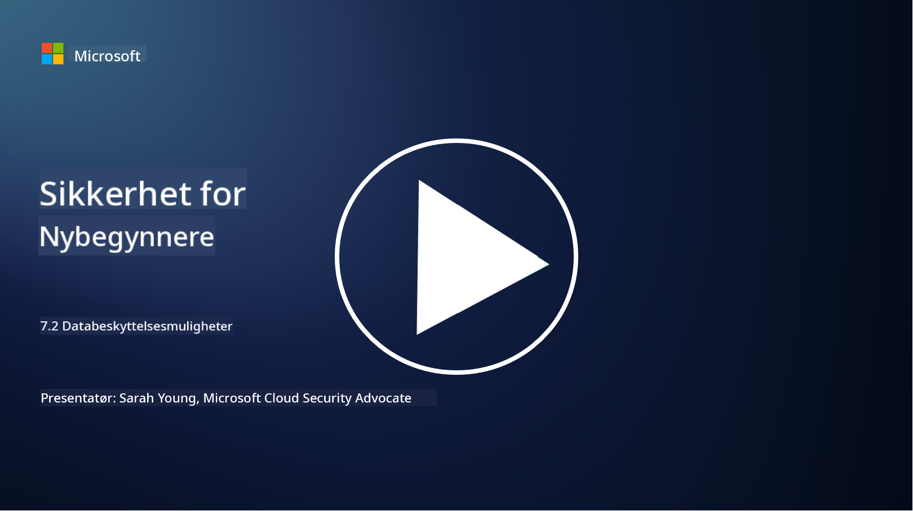

<!--
CO_OP_TRANSLATOR_METADATA:
{
  "original_hash": "50697add9758e54693442d502d2d5f8a",
  "translation_date": "2025-09-04T00:56:29+00:00",
  "source_file": "7.2 Data security capabilities.md",
  "language_code": "no"
}
-->
# Datasikkerhetsfunksjoner

I denne delen skal vi gå gjennom flere detaljer om de sentrale verktøyene og funksjonene som brukes i datasikkerhet:

**Introduksjon**

I denne leksjonen skal vi dekke:

- Hva er verktøy for forebygging av datatap?

- Hva er verktøy for håndtering av interne risikoer?

- Hvilke verktøy for dataoppbevaring er tilgjengelige?

## Hva er verktøy for forebygging av datatap?

Verktøy for forebygging av datatap (Data Loss Prevention, DLP) refererer til en rekke programvareløsninger og teknologier som er designet for å forhindre uautorisert tilgang, deling eller lekkasje av sensitiv eller konfidensiell informasjon i en organisasjon. Disse verktøyene bruker innholdsinspeksjon, policyhåndhevelse og overvåking for å identifisere og beskytte sensitiv data mot å bli eksponert eller misbrukt. Eksempler på DLP-produkter inkluderer: Symantec Data Loss Prevention, McAfee Total Protection for Data Loss Prevention, Microsoft 365 DLP**: Integreres med Microsoft 365-applikasjoner for å hjelpe organisasjoner med å identifisere og beskytte sensitiv data i e-poster, dokumenter og meldinger.

## Hva er verktøy for håndtering av interne risikoer?

Verktøy for håndtering av interne risikoer hjelper organisasjoner med å identifisere og redusere risikoer som oppstår fra ansatte, kontraktører eller partnere som med vilje eller utilsiktet kan kompromittere datasikkerheten. Disse verktøyene overvåker brukeradferd, tilgangsmønstre og databruk for å oppdage mistenkelige aktiviteter og potensielle interne trusler. Eksempler på produkter for håndtering av interne risikoer inkluderer: Microsoft Insider Risk Management (en del av Microsoft 365), Forcepoint Insider Threat Data Protection, Varonis Insider Threat Detection.

## Hvilke verktøy for dataoppbevaring er tilgjengelige?

Verktøy for dataoppbevaring inkluderer programvare og løsninger som er designet for å administrere oppbevaring og sletting av data i samsvar med en organisasjons retningslinjer for dataoppbevaring og juridiske krav. Disse verktøyene hjelper med å automatisere prosessen med å oppbevare data i bestemte tidsperioder og slette dem sikkert når de ikke lenger er nødvendige. Eksempler på produkter for dataoppbevaring inkluderer: Veritas Enterprise Vault, Commvault Complete Data Protection, Microsoft data lifecycle management. Disse løsningene hjelper organisasjoner med å opprettholde kontroll over dataoppbevaring og -sletting, sikre samsvar med databeskyttelsesregler og effektivt administrere data gjennom hele livssyklusen.

## Videre lesing

- [Guide til Data Security Posture Management (DSPM) | CSA (cloudsecurityalliance.org)](https://cloudsecurityalliance.org/blog/2023/03/31/the-big-guide-to-data-security-posture-management-dspm/)
- [Forebygging av datatap på tvers av endepunkter, apper og tjenester | Microsoft Purview](https://youtu.be/hvqq8L_0kgI)
- [18 Beste programvareverktøy for forebygging av datatap 2023 (Gratis + Betalt) (comparitech.com)](https://www.comparitech.com/data-privacy-management/data-loss-prevention-tools-software/)
- [Forebygging av datatap (nist.gov)](https://tsapps.nist.gov/publication/get_pdf.cfm?pub_id=904672)
- [Lær om håndtering av interne risikoer | Microsoft Learn](https://learn.microsoft.com/purview/insider-risk-management?WT.mc_id=academic-96948-sayoung)
- [Data Lifecycle Management | IBM](https://www.ibm.com/topics/data-lifecycle-management)
- [Hva er Data Lifecycle Management (DLM)? | 2023 Beste praksis (selecthub.com)](https://www.selecthub.com/big-data-analytics/data-lifecycle-management/)

---

**Ansvarsfraskrivelse**:  
Dette dokumentet er oversatt ved hjelp av AI-oversettelsestjenesten [Co-op Translator](https://github.com/Azure/co-op-translator). Selv om vi tilstreber nøyaktighet, vennligst vær oppmerksom på at automatiske oversettelser kan inneholde feil eller unøyaktigheter. Det originale dokumentet på sitt opprinnelige språk bør anses som den autoritative kilden. For kritisk informasjon anbefales profesjonell menneskelig oversettelse. Vi er ikke ansvarlige for eventuelle misforståelser eller feiltolkninger som oppstår ved bruk av denne oversettelsen.