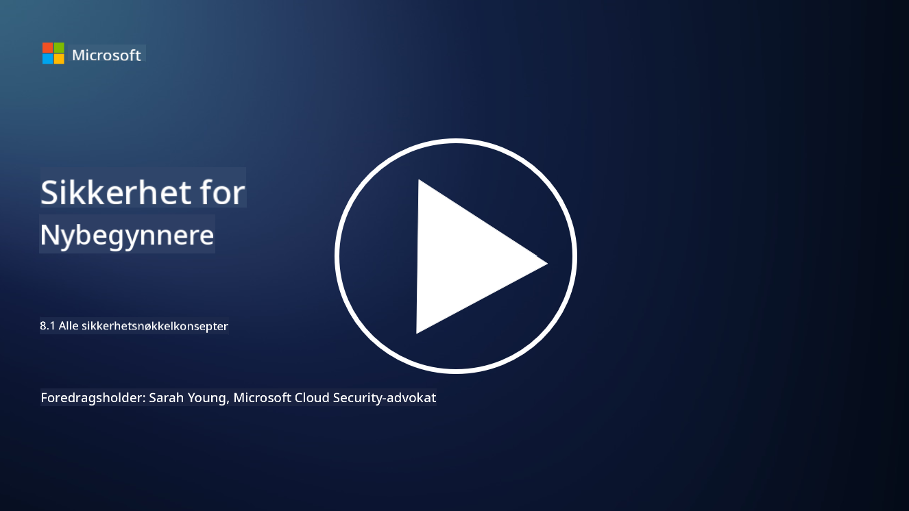

<!--
CO_OP_TRANSLATOR_METADATA:
{
  "original_hash": "66b61d96936cf25d20fcb411d4ce5227",
  "translation_date": "2025-09-03T22:48:41+00:00",
  "source_file": "8.1 AI security key concepts.md",
  "language_code": "no"
}
-->
# AI-sikkerhet: nøkkelkonsepter

## Hvordan skiller AI-sikkerhet seg fra tradisjonell cybersikkerhet?

Å sikre AI-systemer innebærer unike utfordringer sammenlignet med tradisjonell cybersikkerhet, hovedsakelig på grunn av AI-teknologiens læringsevner og beslutningsprosesser. Her er noen viktige forskjeller:

-   **Dataintegritet**: AI-systemer er sterkt avhengige av data for læring. [Å sikre integriteten til disse dataene er avgjørende, da angripere kan manipulere dataene for å påvirke AI-ens oppførsel, en taktikk kjent som dataforgiftning.
-   **Modellsikkerhet**: Selve beslutningsmodellen til AI kan være et mål. [Angripere kan forsøke å reversere modellen eller utnytte dens svakheter for å fremkalle feil eller skadelige beslutninger.
-   **Adversarielle angrep**: AI-systemer kan være sårbare for adversarielle angrep, der små, ofte umerkelige endringer i inputdata kan føre til feil eller uriktige prediksjoner.
-   **Infrastruktursikkerhet**: Selv om tradisjonell cybersikkerhet også fokuserer på å beskytte infrastruktur, kan AI-systemer ha ekstra lag av kompleksitet, som skytjenester eller spesialisert maskinvare, som krever spesifikke sikkerhetstiltak.
-   **Etiske hensyn**: Bruken av AI i sikkerhet bringer med seg etiske spørsmål, som personvern og potensialet for skjevhet i beslutningsprosesser, som må tas med i sikkerhetsstrategien.

Alt i alt krever sikring av AI-systemer en annen tilnærming som tar hensyn til de unike aspektene ved AI-teknologi, inkludert beskyttelse av data, modeller og AI-ens læringsprosess, samtidig som de etiske implikasjonene av AI-bruk adresseres.

AI-sikkerhet og tradisjonell cybersikkerhet har mange likheter, men de har også noen klare forskjeller på grunn av de unike egenskapene og kapasitetene til kunstige intelligenssystemer. Slik skiller de seg:

- **Kompleksitet i trusler**: AI-systemer introduserer nye lag av kompleksitet i cybersikkerhet. Tradisjonell cybersikkerhet håndterer primært trusler som skadelig programvare, phishing-angrep og nettverksinntrengninger. AI-systemer kan imidlertid være sårbare for angrep som adversarielle angrep, dataforgiftning og modellmanipulasjon, som spesifikt retter seg mot maskinlæringsalgoritmene.

- **Angrepsflate**: AI-systemer har ofte større angrepsflater sammenlignet med tradisjonelle systemer. Dette skyldes at de ikke bare er avhengige av programvare, men også av data og modeller. Angripere kan målrette treningsdata, manipulere modeller eller utnytte sårbarheter i selve algoritmene.

- **Tilpasningsevne til trusler**: AI-systemer kan tilpasse seg og lære fra omgivelsene, noe som kan gjøre dem mer sårbare for adaptive og utviklende trusler. Tradisjonelle cybersikkerhetstiltak kan være utilstrekkelige for å forsvare mot angrep som stadig utvikler seg basert på AI-systemets oppførsel.

- **Fortolkning og forklarbarhet**: Å forstå hvorfor et AI-system tok en bestemt beslutning er ofte mer utfordrende sammenlignet med tradisjonelle programvaresystemer. Denne mangelen på fortolkning og forklarbarhet kan gjøre det vanskelig å oppdage og håndtere angrep på AI-systemer effektivt.

- **Personvernrisiko**: AI-systemer er ofte avhengige av store mengder data, noe som kan introdusere personvernrisiko hvis de ikke håndteres riktig. Tradisjonelle cybersikkerhetstiltak kan være utilstrekkelige for å adressere disse personvernrisikoene som er spesifikke for AI-systemer.

- **Regulatorisk samsvar**: Det regulatoriske landskapet for AI-sikkerhet er fortsatt under utvikling, med spesifikke regler og standarder som dukker opp for å håndtere de unike utfordringene AI-systemer medfører. Tradisjonelle cybersikkerhetsrammeverk kan måtte utvides eller tilpasses for å sikre samsvar med disse nye reguleringene.

- **Etiske hensyn**: AI-sikkerhet handler ikke bare om å beskytte systemer mot ondsinnede angrep, men også om å sikre at AI-systemer brukes på en etisk og ansvarlig måte. Dette inkluderer hensyn som rettferdighet, åpenhet og ansvarlighet, som kanskje ikke er like fremtredende i tradisjonell cybersikkerhet.

## Hvordan er AI lik sikring av tradisjonelle IT-systemer?

Sikring av AI-systemer deler flere grunnleggende prinsipper med tradisjonell cybersikkerhet:

-   **Trusselbeskyttelse**: Både AI- og tradisjonelle systemer må beskyttes mot uautorisert tilgang, datamodifikasjon og ødeleggelse, samt andre vanlige trusler.
-   **Sårbarhetshåndtering**: Mange sårbarheter som påvirker tradisjonelle systemer, som programvarefeil eller feilkonfigurasjoner, kan også påvirke AI-systemer.
-   **Datasikkerhet**: Beskyttelse av prosesserte data er avgjørende i begge domener for å forhindre databrudd og sikre konfidensialitet.
-   **Forsyningskjedesikkerhet**: Begge typer systemer er utsatt for angrep på forsyningskjeden, der en kompromittert komponent kan undergrave sikkerheten til hele systemet.

Disse likhetene viser at selv om AI-systemer introduserer nye sikkerhetsutfordringer, krever de også anvendelse av etablerte cybersikkerhetspraksiser for å sikre robust beskyttelse. Det handler om å kombinere tradisjonell sikkerhetskunnskap med tilpasning til de unike aspektene ved AI-teknologi.

## Videre lesing

- [Not with a Bug, But with a Sticker [Book] (oreilly.com)](https://www.oreilly.com/library/view/not-with-a/9781119883982/)
   
- [Intro to AI Security Part 1: AI Security 101 | by HarrietHacks | Medium](https://medium.com/@harrietfarlow/intro-to-ai-security-part-1-ai-security-101-b8662a9efe5)
   
- [Best practices for AI security risk management | Microsoft Security Blog](https://www.microsoft.com/en-us/security/blog/2021/12/09/best-practices-for-ai-security-risk-management/?WT.mc_id=academic-96948-sayoung)
   
- [OWASP AI Security and Privacy Guide | OWASP Foundation](https://owasp.org/www-project-ai-security-and-privacy-guide/)

---

**Ansvarsfraskrivelse**:  
Dette dokumentet er oversatt ved hjelp av AI-oversettelsestjenesten [Co-op Translator](https://github.com/Azure/co-op-translator). Selv om vi tilstreber nøyaktighet, vennligst vær oppmerksom på at automatiske oversettelser kan inneholde feil eller unøyaktigheter. Det originale dokumentet på sitt opprinnelige språk bør anses som den autoritative kilden. For kritisk informasjon anbefales profesjonell menneskelig oversettelse. Vi er ikke ansvarlige for eventuelle misforståelser eller feiltolkninger som oppstår ved bruk av denne oversettelsen.