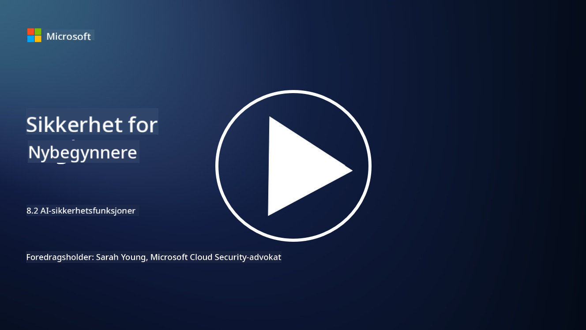

<!--
CO_OP_TRANSLATOR_METADATA:
{
  "original_hash": "b6bb7175672298d1e2f73ba7e0006f95",
  "translation_date": "2025-09-04T01:05:41+00:00",
  "source_file": "8.2 AI security capabilities.md",
  "language_code": "no"
}
-->
# AI-sikkerhetsfunksjoner

## Hvilke verktøy og funksjoner har vi for å sikre AI-systemer i dag?

For øyeblikket finnes det flere verktøy og funksjoner for å sikre AI-systemer:

-   **Counterfit**: Et åpen kildekode-automatiseringsverktøy for sikkerhetstesting av AI-systemer, utviklet for å hjelpe organisasjoner med å gjennomføre risikovurderinger for AI-sikkerhet og sikre robustheten til algoritmene deres.
-   **Verktøy for motstandsdyktighet mot angrep**: Disse verktøyene evaluerer robustheten til maskinlæringsmodeller mot angrep, og hjelper med å identifisere og redusere sårbarheter.
-   **AI-sikkerhetsverktøysett**: Det finnes åpen kildekode-verktøysett som gir ressurser for å sikre AI-systemer, inkludert biblioteker og rammeverk for å implementere sikkerhetstiltak.
-   **Samarbeidsplattformer**: Partnerskap mellom selskaper og AI-samfunn for å utvikle AI-spesifikke sikkerhetsskannere og andre verktøy for å sikre AI-forsyningskjeden.

Disse verktøyene og funksjonene er en del av et voksende felt dedikert til å styrke sikkerheten til AI-systemer mot ulike trusler. De representerer en kombinasjon av forskning, praktiske verktøy og samarbeid i industrien for å møte de unike utfordringene som AI-teknologier medfører.

## Hva med AI-red teaming? Hvordan skiller det seg fra tradisjonell sikkerhets-red teaming?

AI-red teaming skiller seg fra tradisjonell sikkerhets-red teaming på flere viktige måter:

-   **Fokus på AI-systemer**: AI-red teaming retter seg spesifikt mot de unike sårbarhetene til AI-systemer, som maskinlæringsmodeller og datarørledninger, i stedet for tradisjonell IT-infrastruktur.
-   **Testing av AI-adferd**: Det innebærer testing av hvordan AI-systemer reagerer på uvanlige eller uventede input, noe som kan avdekke sårbarheter som kan utnyttes av angripere.
-   **Utforsking av AI-feil**: AI-red teaming ser på både ondsinnede og utilsiktede feil, og vurderer et bredere spekter av scenarier og potensielle systemfeil utover bare sikkerhetsbrudd.
-   **Prompt-injeksjon og innholdsgenerering**: AI-red teaming inkluderer også testing for feil som prompt-injeksjon, der angripere manipulerer AI-systemer til å generere skadelig eller feilaktig innhold.
-   **Etisk og ansvarlig AI**: Det er en del av å sikre ansvarlig AI ved design, og sørge for at AI-systemer er robuste mot forsøk på å få dem til å oppføre seg på uønskede måter.

Alt i alt er AI-red teaming en utvidet praksis som ikke bare dekker testing for sikkerhetssårbarheter, men også inkluderer testing for andre typer systemfeil som er spesifikke for AI-teknologier. Det er en viktig del av å utvikle tryggere AI-systemer ved å forstå og redusere nye risikoer knyttet til AI-implementering.

## Videre lesing

 - [Microsoft AI Red Team building future of safer AI | Microsoft Security Blog](https://www.microsoft.com/en-us/security/blog/2023/08/07/microsoft-ai-red-team-building-future-of-safer-ai/?WT.mc_id=academic-96948-sayoung)
 - [Announcing Microsoft’s open automation framework to red team generative AI Systems | Microsoft Security Blog](https://www.microsoft.com/en-us/security/blog/2024/02/22/announcing-microsofts-open-automation-framework-to-red-team-generative-ai-systems/?WT.mc_id=academic-96948-sayoung)
 - [AI Security Tools: The Open-Source Toolkit | Wiz](https://www.wiz.io/academy/ai-security-tools)

---

**Ansvarsfraskrivelse**:  
Dette dokumentet er oversatt ved hjelp av AI-oversettelsestjenesten [Co-op Translator](https://github.com/Azure/co-op-translator). Selv om vi streber etter nøyaktighet, vær oppmerksom på at automatiserte oversettelser kan inneholde feil eller unøyaktigheter. Det originale dokumentet på sitt opprinnelige språk bør anses som den autoritative kilden. For kritisk informasjon anbefales profesjonell menneskelig oversettelse. Vi er ikke ansvarlige for misforståelser eller feiltolkninger som oppstår ved bruk av denne oversettelsen.