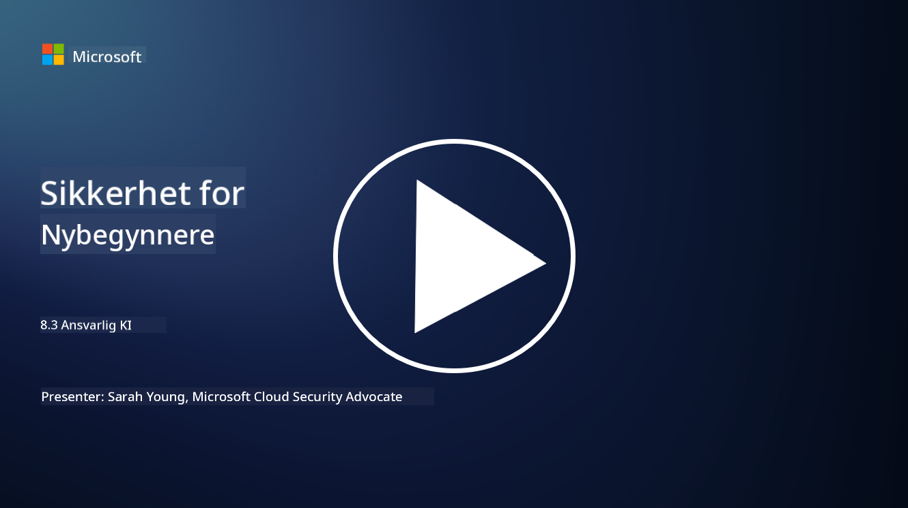

<!--
CO_OP_TRANSLATOR_METADATA:
{
  "original_hash": "5e9775ee91bde7d44577891d5f11c4c5",
  "translation_date": "2025-09-04T00:05:53+00:00",
  "source_file": "8.3 Responsible AI.md",
  "language_code": "no"
}
-->
# Ansvarlig AI

## Hva er ansvarlig AI, og hvordan henger det sammen med AI-sikkerhet?

Ansvarlig AI refererer til utvikling og bruk av kunstig intelligens på en måte som er etisk, transparent og i tråd med samfunnets verdier. Det omfatter prinsipper som rettferdighet, ansvarlighet og robusthet, og sikrer at AI-systemer er designet og opererer for å gagne enkeltpersoner, lokalsamfunn og samfunnet som helhet.

Forholdet mellom ansvarlig AI og AI-sikkerhet er betydelig fordi:

-   **Etiske hensyn**: Ansvarlig AI innebærer etiske hensyn som direkte påvirker sikkerheten, som personvern og databeskyttelse. Å sikre at AI-systemer respekterer brukernes personvern og beskytter personopplysninger er en sentral del av ansvarlig AI.
-   **Robusthet og pålitelighet**: AI-systemer må være robuste mot manipulasjon og angrep, noe som er et kjerneprinsipp for både ansvarlig AI og AI-sikkerhet. Dette inkluderer beskyttelse mot fiendtlige angrep og sikring av integriteten i AI-baserte beslutningsprosesser.
-   **Åpenhet og forklarbarhet**: En del av ansvarlig AI er å sørge for at AI-systemer er transparente og at beslutningene deres kan forklares. Dette er avgjørende for sikkerhet, da interessenter må forstå hvordan AI-systemer fungerer for å kunne stole på sikkerhetstiltakene deres.
-   **Ansvarlighet**: AI-systemer bør holdes ansvarlige for sine handlinger, noe som betyr at det må finnes mekanismer for å spore beslutninger og rette opp eventuelle problemer. Dette samsvarer med sikkerhetspraksis som overvåker og reviderer systemaktiviteter for å forhindre og håndtere brudd.

Kort sagt er ansvarlig AI og AI-sikkerhet tett sammenvevd, der ansvarlige AI-prinsipper styrker sikkerheten til AI-systemer og omvendt. Implementering av ansvarlige AI-prinsipper bidrar til å skape AI-systemer som ikke bare er etisk forsvarlige, men også mer sikre mot potensielle trusler.

## Hvordan kan jeg sikre at AI-systemet mitt er både sikkert og etisk?

For å sikre at AI-systemet ditt er både sikkert og etisk, kreves en helhetlig tilnærming som inkluderer følgende steg:

- **Følg etiske prinsipper**: Følg etablerte etiske retningslinjer som vektlegger menneskelig, samfunnsmessig og miljømessig velvære; rettferdighet; personvern; pålitelighet; åpenhet; mulighet for å bestride beslutninger; og ansvarlighet.

- **Implementer robuste sikkerhetstiltak**: Bruk proaktiv sikkerhetstesting og programmer for AI-tillit, risikostyring og sikkerhet for å beskytte mot trusler og sårbarheter.

- **Involver ulike interessenter**: Inkluder et bredt spekter av deltakere i AI-utviklingsprosessen, inkludert etikere, samfunnsvitere og representanter fra berørte grupper, for å sikre at ulike perspektiver og verdier blir vurdert.

- **Sørg for åpenhet og forklarbarhet**: Sikre at AI-systemets beslutningsprosesser er transparente og kan forklares, slik at det blir lettere å identifisere potensielle skjevheter eller feil.

- **Oppretthold databeskyttelse**: Beskytt personvernet og autentisiteten til data gjennom kryptering og andre tiltak for databeskyttelse, slik at brukernes rettigheter respekteres.

- **Muliggjør menneskelig tilsyn**: Implementer mekanismer for menneskelig tilsyn som gjør det mulig å bestride beslutninger tatt av AI-systemer og sikre ansvarlighet.

- **Hold deg oppdatert på AI-sikkerhet**: Følg med på den nyeste forskningen og diskusjonene om AI-sikkerhet for å forstå det stadig skiftende landskapet innen AI-sikkerhet og etikk.

- **Overhold regelverk**: Sørg for at AI-systemet ditt overholder alle relevante lover og forskrifter, som databeskyttelseslover, antidiskrimineringslover og bransjespesifikke retningslinjer.

## Kan du gi meg noen eksempler på sikkerhetsproblemer forårsaket av uetisk bruk av AI?

Her er noen eksempler på sikkerhetsproblemer som kan oppstå ved uetisk bruk av AI:

- **Skjev beslutningstaking**: AI-systemer kan videreføre og forsterke eksisterende skjevheter hvis de er trent på skjeve datasett. For eksempel, hvis en søkemotor er trent på data som gjenspeiler samfunnsmessige stereotyper, kan den vise skjeve søkeresultater, noe som kan føre til urettferdig behandling eller diskriminering.

- **AI i rettssystemer**: Bruk av AI i juridiske beslutningsprosesser kan reise etiske bekymringer, spesielt hvis AI-systemets beslutningsprosess mangler åpenhet eller er påvirket av skjeve data. Dette kan føre til urettferdige juridiske utfall og krenke individers rettigheter.

- **Manipulering av AI-systemer**: AI-systemer kan være sårbare for fiendtlige angrep, der små endringer i inndata kan føre til feilaktige resultater. For eksempel kan autonome kjøretøy bli villedet til å feiltolke trafikkskilt, noe som kan føre til sikkerhetsrisikoer.

- **AI-drevet overvåkning**: Bruk av AI til overvåkning kan føre til brudd på personvernet, spesielt hvis det brukes uten riktig samtykke eller på måter som krenker individuelle friheter. Dette kan være spesielt problematisk i autoritære regimer som kan bruke AI til å overvåke og undertrykke opposisjon.

Disse eksemplene understreker viktigheten av etiske hensyn i utviklingen og implementeringen av AI-systemer for å forhindre sikkerhetsproblemer og beskytte individers rettigheter og personvern.

## Videre lesning

 - [Microsoft Responsible AI Standard v2 General Requirements](https://query.prod.cms.rt.microsoft.com/cms/api/am/binary/RE5cmFl?culture=en-us&country=us&WT.mc_id=academic-96948-sayoung)
 - [Responsible AI (mit.edu)](https://sloanreview.mit.edu/big-ideas/responsible-ai/)
 - [13 Principles for Using AI Responsibly (hbr.org)](https://hbr.org/2023/06/13-principles-for-using-ai-responsibly)

---

**Ansvarsfraskrivelse**:  
Dette dokumentet er oversatt ved hjelp av AI-oversettelsestjenesten [Co-op Translator](https://github.com/Azure/co-op-translator). Selv om vi tilstreber nøyaktighet, vennligst vær oppmerksom på at automatiske oversettelser kan inneholde feil eller unøyaktigheter. Det originale dokumentet på sitt opprinnelige språk bør anses som den autoritative kilden. For kritisk informasjon anbefales profesjonell menneskelig oversettelse. Vi er ikke ansvarlige for eventuelle misforståelser eller feiltolkninger som oppstår ved bruk av denne oversettelsen.