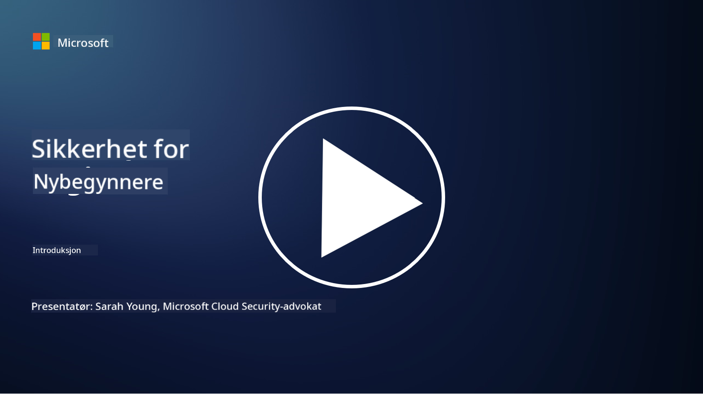

<!--
CO_OP_TRANSLATOR_METADATA:
{
  "original_hash": "ec0b921727399a8a980305086a6d3832",
  "translation_date": "2025-09-04T06:40:43+00:00",
  "source_file": "README.md",
  "language_code": "no"
}
-->

### 🌐 Støtte for flere språk

#### Støttet via GitHub Action (Automatisert og alltid oppdatert)

[French](../fr/README.md) | [Spanish](../es/README.md) | [German](../de/README.md) | [Russian](../ru/README.md) | [Arabic](../ar/README.md) | [Persian (Farsi)](../fa/README.md) | [Urdu](../ur/README.md) | [Chinese (Simplified)](../zh/README.md) | [Chinese (Traditional, Macau)](../mo/README.md) | [Chinese (Traditional, Hong Kong)](../hk/README.md) | [Chinese (Traditional, Taiwan)](../tw/README.md) | [Japanese](../ja/README.md) | [Korean](../ko/README.md) | [Hindi](../hi/README.md) | [Bengali](../bn/README.md) | [Marathi](../mr/README.md) | [Nepali](../ne/README.md) | [Punjabi (Gurmukhi)](../pa/README.md) | [Portuguese (Portugal)](../pt/README.md) | [Portuguese (Brazil)](../br/README.md) | [Italian](../it/README.md) | [Polish](../pl/README.md) | [Turkish](../tr/README.md) | [Greek](../el/README.md) | [Thai](../th/README.md) | [Swedish](../sv/README.md) | [Danish](../da/README.md) | [Norwegian](./README.md) | [Finnish](../fi/README.md) | [Dutch](../nl/README.md) | [Hebrew](../he/README.md) | [Vietnamese](../vi/README.md) | [Indonesian](../id/README.md) | [Malay](../ms/README.md) | [Tagalog (Filipino)](../tl/README.md) | [Swahili](../sw/README.md) | [Hungarian](../hu/README.md) | [Czech](../cs/README.md) | [Slovak](../sk/README.md) | [Romanian](../ro/README.md) | [Bulgarian](../bg/README.md) | [Serbian (Cyrillic)](../sr/README.md) | [Croatian](../hr/README.md) | [Slovenian](../sl/README.md) | [Ukrainian](../uk/README.md) | [Burmese (Myanmar)](../my/README.md)

**Hvis du ønsker støtte for flere språk, finner du en liste over tilgjengelige språk [her](https://github.com/Azure/co-op-translator/blob/main/getting_started/supported-languages.md)**

#### Bli med i vårt fellesskap 

# 🚀 Cybersikkerhet for nybegynnere – et kurs

I en tid med rask adopsjon av AI-teknologi er det enda viktigere å forstå hvordan man sikrer IT-systemer. Dette kurset er designet for å lære deg grunnleggende konsepter innen cybersikkerhet og gi deg en god start på sikkerhetslæringen. Kurset er leverandøruavhengig og delt opp i små leksjoner som tar omtrent 30-60 minutter å fullføre. Hver leksjon inneholder en liten quiz og lenker til videre lesing for de som ønsker å fordype seg i emnet.

Hva dette kurset dekker 📚

- 🔐 Grunnleggende konsepter innen cybersikkerhet som CIA-triaden, forskjellene mellom risikoer, trusler osv.
- 🛡️ Forstå hva en sikkerhetskontroll er og hvilke former de kan ta.
- 🌐 Forstå hva nulltillit (zero trust) er og hvorfor dette er viktig i moderne cybersikkerhet.
- 🔑 Forstå nøkkelkonsepter og temaer innen identitet, nettverk, sikkerhetsoperasjoner, infrastruktur og datasikkerhet.
- 🔧 Gi eksempler på verktøy som brukes for å implementere sikkerhetskontroller.

Hva dette kurset ikke dekker 🙅‍♂️

- 🚫 Hvordan bruke spesifikke sikkerhetsverktøy.
- 🚫 Hvordan "hacke" eller utføre red teaming/offensiv sikkerhet.
- 🚫 Læring om spesifikke samsvarsstandarder.

Når du har fullført dette kurset, kan du gå videre til noen av våre Microsoft Learn-moduler. Vi anbefaler at du fortsetter læringen med [Microsoft Security, Compliance, and Identity Fundamentals.](https://learn.microsoft.com/training/paths/describe-concepts-of-security-compliance-identity/?WT.mc_id=academic-96948-sayoung) 

Til slutt kan du vurdere å ta [Eksamen SC-900: Microsoft Security, Compliance, and Identity Fundamentals.](https://learn.microsoft.com/credentials/certifications/exams/sc-900/?WT.mc_id=academic-96948-sayoung)

> 💁 Hvis du har tilbakemeldinger eller forslag til dette kurset og innhold vi mangler, vil vi gjerne høre fra deg!

## Oversikt over moduler 📝 
| **Modulnummer** | **Modulnavn**                              | **Konsepter som læres**              | **Læringsmål**                                                                                                  |
|-----------------|-------------------------------------------|--------------------------------------|-----------------------------------------------------------------------------------------------------------------|
| **1.1**         | Grunnleggende sikkerhetskonsepter          | [CIA-triaden](https://github.com/microsoft/Security-101/blob/main/1.1%20The%20CIA%20triad%20and%20other%20key%20concepts.md)                        | Lær om konfidensialitet, tilgjengelighet og integritet. Også autentisitet, ikke-benekting og personvern.         |
| **1.2**         | Grunnleggende sikkerhetskonsepter          | [Vanlige cybersikkerhetstrusler](https://github.com/microsoft/Security-101/blob/main/1.2%20Common%20cybersecurity%20threats.md)        | Lær om vanlige cybersikkerhetstrusler som påvirker enkeltpersoner og organisasjoner.                            |
| **1.3**         | Grunnleggende sikkerhetskonsepter          | [Forstå risikostyring](https://github.com/microsoft/Security-101/blob/main/1.3%20Understanding%20risk%20management.md)       | Lær om å vurdere og forstå risiko – konsekvens/sannsynlighet og implementering av kontroller.                   |
| **1.4**         | Grunnleggende sikkerhetskonsepter          | [Sikkerhetspraksis og dokumentasjon](https://github.com/microsoft/Security-101/blob/main/1.4%20Security%20practices%20and%20documentation.md) | Lær om forskjellen mellom retningslinjer, prosedyrer, standarder og forskrifter/lover.                          |
| **1.5**         | Grunnleggende sikkerhetskonsepter          | [Nulltillit](https://github.com/microsoft/Security-101/blob/main/1.5%20Zero%20trust.md)                           | Lær om hva nulltillit er og hvordan det påvirker arkitektur. Hva er dybdeforsvar?                               |
| **1.6**         | Grunnleggende sikkerhetskonsepter          | [Modellen for delt ansvar](https://github.com/microsoft/Security-101/blob/main/1.6%20Shared%20responsibility%20model.md)                           | Hva er modellen for delt ansvar, og hvordan påvirker den cybersikkerhet?                                        |
| **1.7**         | [Quiz på slutten av modulen](https://github.com/microsoft/Security-101/blob/main/1.7%20End%20of%20module%20quiz.md)                        |                                      |                                                                                                                 |
| **2.1**         | Grunnleggende identitets- og tilgangsstyring | [IAM nøkkelkonsepter](https://github.com/microsoft/Security-101/blob/main/2.1%20IAM%20key%20concepts.md)                     | Lær om prinsippet om minst privilegium, oppdeling av oppgaver, og hvordan IAM støtter nulltillit.               |
| **2.2**         | Grunnleggende identitets- og tilgangsstyring | [IAM nulltillitsarkitektur](https://github.com/microsoft/Security-101/blob/main/2.2%20IAM%20zero%20trust%20architecture.md)          | Lær om hvordan identitet er den nye perimeteren for moderne IT-miljøer og truslene det reduserer.               |
| **2.3**         | Grunnleggende identitets- og tilgangsstyring | [IAM kapabiliteter](https://github.com/microsoft/Security-101/blob/main/2.3%20IAM%20capabilities.md)                     | Lær om IAM kapabiliteter og kontroller for å sikre identiteter.                                                 |
| **2.4**         | [Quiz på slutten av modulen](https://github.com/microsoft/Security-101/blob/main/2.4%20End%20of%20module%20quiz.md)                        |                                      |                                                                                                                 |
| **3.1**         | Grunnleggende nettverkssikkerhet           | [Nettverksnøkkelkonsepter](https://github.com/microsoft/Security-101/blob/main/3.1%20Networking%20key%20concepts.md)              | Lær om nettverkskonsepter (IP-adressering, portnumre, kryptering osv.)                                          |
| **3.2**         | Grunnleggende nettverkssikkerhet           | [Nettverks nulltillitsarkitektur](https://github.com/microsoft/Security-101/blob/main/3.2%20Networking%20zero%20trust%20architecture.md)   | Lær om hvordan nettverk bidrar til en ende-til-ende nulltillitsarkitektur og truslene det reduserer.            |
| **3.3**         | Grunnleggende nettverkssikkerhet           | [Nettverkssikkerhetskapabiliteter](https://github.com/microsoft/Security-101/blob/main/3.3%20Network%20security%20capabilities.md)        | Lær om nettverkssikkerhetsverktøy – brannmurer, WAF, DDoS-beskyttelse osv.                                      |
| **3.4**         | [Quiz på slutten av modulen](https://github.com/microsoft/Security-101/blob/main/3.4%20End%20of%20module%20quiz.md)                        |                                      |                                                                                                                 |
| **4.1**         | Grunnleggende sikkerhetsoperasjoner        | [SecOps nøkkelkonsepter](https://github.com/microsoft/Security-101/blob/main/4.1%20SecOps%20key%20concepts.md)                  | Lær om hvorfor sikkerhetsoperasjoner er viktige og hvordan de skiller seg fra vanlige IT-operasjonsteam.        |
| **4.2**         | Grunnleggende sikkerhetsoperasjoner        | [SecOps nulltillitsarkitektur](https://github.com/microsoft/Security-101/blob/main/4.2%20SecOps%20zero%20trust%20architecture.md)       | Lær om hvordan SecOps bidrar til en ende-til-ende nulltillitsarkitektur og truslene det reduserer.              |
| **4.3**         | Grunnleggende sikkerhetsoperasjoner        | [SecOps kapabiliteter](https://github.com/microsoft/Security-101/blob/main/4.3%20SecOps%20capabilities.md)                  | Lær om SecOps-verktøy – SIEM, XDR osv.                                                                          |
| **4.4**         | [Quiz på slutten av modulen](https://github.com/microsoft/Security-101/blob/main/4.4%20End%20of%20module%20quiz.md)                        |                                      |                                                                                                                 |
| **5.1**         | Grunnleggende applikasjonssikkerhet        | [AppSec nøkkelkonsepter](https://github.com/microsoft/Security-101/blob/main/5.1%20AppSec%20key%20concepts.md)                  | Lær om AppSec-konsepter som sikkerhet ved design, validering av input osv.                                      |
| **5.2**         | Grunnleggende applikasjonssikkerhet        | [AppSec kapabiliteter](https://github.com/microsoft/Security-101/blob/main/5.2%20AppSec%20key%20capabilities.md)                  | Lær om AppSec-verktøy: sikkerhetsverktøy for pipeline, kodeskanning, hemmelighetsskanning osv.                  |
| **5.3**         | [Quiz på slutten av modulen](https://github.com/microsoft/Security-101/blob/main/5.3%20End%20of%20module%20quiz.md)                        |                                      |                                                                                                                 |
| **6.1**           | Grunnleggende prinsipper for infrastruktur-sikkerhet      | [Nøkkelkonsepter for infrastruktur-sikkerhet](https://github.com/microsoft/Security-101/blob/main/6.1%20Infrastructure%20security%20key%20concepts.md) | Lær om å styrke systemer, oppdateringer, sikkerhetshygiene, og sikkerhet for containere.                                  |
| **6.2**           | Grunnleggende prinsipper for infrastruktur-sikkerhet      | [Muligheter innen infrastruktur-sikkerhet](https://github.com/microsoft/Security-101/blob/main/6.2%20Infrastructure%20security%20capabilities.md) | Lær om verktøy som kan hjelpe med infrastruktur-sikkerhet, f.eks. CSPM, sikkerhet for containere, osv.            |
| **6.3**           | [Quiz på slutten av modulen](https://github.com/microsoft/Security-101/blob/main/6.3%20End%20of%20module%20quiz.md)                        |                                      |                                                                                                                 |
| **7.1**           | Grunnleggende prinsipper for datasikkerhet                | [Nøkkelkonsepter for datasikkerhet](https://github.com/microsoft/Security-101/blob/main/7.1%20Data%20security%20key%20concepts.md)           | Lær om dataklassifisering og lagring, og hvorfor dette er viktig for en organisasjon.                     |
| **7.2**           | Grunnleggende prinsipper for datasikkerhet                | [Muligheter innen datasikkerhet](https://github.com/microsoft/Security-101/blob/main/7.2%20Data%20security%20capabilities.md)           | Lær om verktøy for datasikkerhet – DLP, risikostyring internt, datastyring, osv.                          |
| **7.3**           | [Quiz på slutten av modulen](https://github.com/microsoft/Security-101/blob/main/7.3%20End%20of%20module%20quiz.md)                        |
| **8.1**           | Grunnleggende prinsipper for AI-sikkerhet                | [Nøkkelkonsepter for AI-sikkerhet](https://github.com/microsoft/Security-101/blob/main/8.1%20AI%20security%20key%20concepts.md)          | Lær om forskjellene og likhetene mellom tradisjonell sikkerhet og AI-sikkerhet.                 |
| **8.2**           | Grunnleggende prinsipper for AI-sikkerhet                | [Muligheter innen AI-sikkerhet](https://github.com/microsoft/Security-101/blob/main/8.2%20AI%20security%20capabilities.md)           | Lær om verktøy for AI-sikkerhet og kontrollene som kan brukes for å sikre AI.                         |
| **8.3**           | Grunnleggende prinsipper for AI-sikkerhet                | [Ansvarlig AI](https://github.com/microsoft/Security-101/blob/main/8.3%20Responsible%20AI.md)          | Lær om hva ansvarlig AI er og AI-spesifikke skader som sikkerhetsprofesjonelle må være oppmerksomme på.                          |
| **8.4**           | [Quiz på slutten av modulen](https://github.com/microsoft/Security-101/blob/main/8.4%20End%20of%20module%20quiz.md)     

## 🎒 Andre kurs 

Teamet vårt lager også andre kurs! Sjekk ut:

- [Generativ AI for nybegynnere](https://aka.ms/genai-beginners)
- [Generativ AI for nybegynnere .NET](https://github.com/microsoft/Generative-AI-for-beginners-dotnet)
- [Generativ AI med JavaScript](https://github.com/microsoft/generative-ai-with-javascript)
- [Generativ AI med Java](https://github.com/microsoft/Generative-AI-for-beginners-java)
- [AI for nybegynnere](https://aka.ms/ai-beginners)
- [Data Science for nybegynnere](https://aka.ms/datascience-beginners)
- [Maskinlæring for nybegynnere](https://aka.ms/ml-beginners)
- [Cybersikkerhet for nybegynnere](https://github.com/microsoft/Security-101) 
- [Webutvikling for nybegynnere](https://aka.ms/webdev-beginners)
- [IoT for nybegynnere](https://aka.ms/iot-beginners)
- [XR-utvikling for nybegynnere](https://github.com/microsoft/xr-development-for-beginners)
- [Mestre GitHub Copilot for parprogrammering](https://github.com/microsoft/Mastering-GitHub-Copilot-for-Paired-Programming)
- [Mestre GitHub Copilot for C#/.NET-utviklere](https://github.com/microsoft/mastering-github-copilot-for-dotnet-csharp-developers)
- [Velg ditt eget Copilot-eventyr](https://github.com/microsoft/CopilotAdventures)

---

**Ansvarsfraskrivelse**:  
Dette dokumentet er oversatt ved hjelp av AI-oversettelsestjenesten [Co-op Translator](https://github.com/Azure/co-op-translator). Selv om vi streber etter nøyaktighet, vær oppmerksom på at automatiserte oversettelser kan inneholde feil eller unøyaktigheter. Det originale dokumentet på sitt opprinnelige språk bør anses som den autoritative kilden. For kritisk informasjon anbefales profesjonell menneskelig oversettelse. Vi er ikke ansvarlige for misforståelser eller feiltolkninger som oppstår ved bruk av denne oversettelsen.