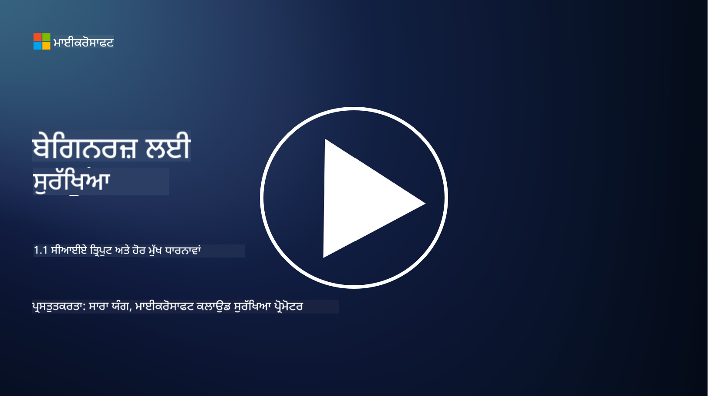
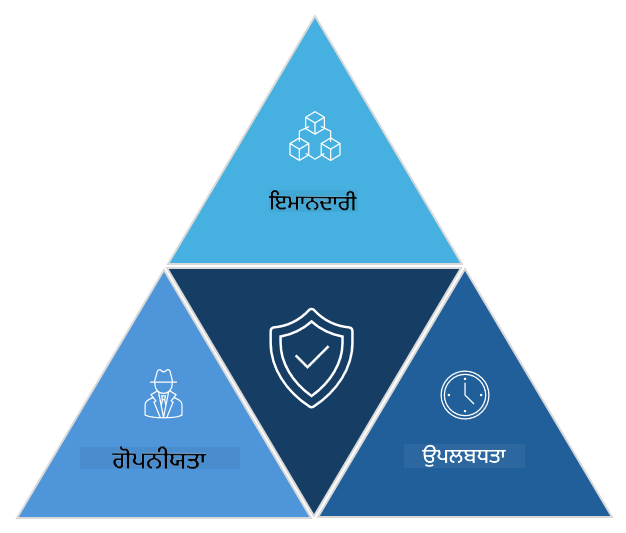

<!--
CO_OP_TRANSLATOR_METADATA:
{
  "original_hash": "16a76f9fa372fb63cffb6d76b855f023",
  "translation_date": "2025-09-04T01:09:24+00:00",
  "source_file": "1.1 The CIA triad and other key concepts.md",
  "language_code": "pa"
}
-->
# ਸਾਈਬਰਸੁਰੱਖਿਆ ਦਾ ਸੀਆਈਏ ਤ੍ਰਿਕੋਣ ਅਤੇ ਹੋਰ ਮੁੱਖ ਧਾਰਨਾਵਾਂ

## ਪਰਿਚਯ

ਇਸ ਪਾਠ ਵਿੱਚ, ਅਸੀਂ ਕਵਰ ਕਰਾਂਗੇ:

 - ਸਾਈਬਰਸੁਰੱਖਿਆ ਕੀ ਹੈ?
   
 - ਸਾਈਬਰਸੁਰੱਖਿਆ ਦਾ ਸੀਆਈਏ ਤ੍ਰਿਕੋਣ ਕੀ ਹੈ?

 - ਸਾਈਬਰਸੁਰੱਖਿਆ ਦੇ ਸੰਦਰਭ ਵਿੱਚ ਪ੍ਰਮਾਣਿਕਤਾ, ਅਸਵੀਕਾਰਤਾ ਅਤੇ ਗੋਪਨੀਯਤਾ ਕੀ ਹਨ?

## ਸਾਈਬਰਸੁਰੱਖਿਆ ਕੀ ਹੈ?

ਸਾਈਬਰਸੁਰੱਖਿਆ, ਜਿਸਨੂੰ ਜਾਣਕਾਰੀ ਸੁਰੱਖਿਆ ਵੀ ਕਿਹਾ ਜਾਂਦਾ ਹੈ, ਕੰਪਿਊਟਰ ਸਿਸਟਮਾਂ, ਨੈੱਟਵਰਕਾਂ, ਡਿਵਾਈਸਾਂ ਅਤੇ ਡਾਟਾ ਨੂੰ ਡਿਜ਼ਿਟਲ ਹਮਲਿਆਂ, ਬਿਨਾਂ ਇਜਾਜ਼ਤ ਪਹੁੰਚ, ਨੁਕਸਾਨ ਜਾਂ ਚੋਰੀ ਤੋਂ ਬਚਾਉਣ ਦੀ ਪ੍ਰਕਿਰਿਆ ਹੈ। ਸਾਈਬਰਸੁਰੱਖਿਆ ਦਾ ਮੁੱਖ ਉਦੇਸ਼ ਡਿਜ਼ਿਟਲ ਸੰਪਤੀਆਂ ਅਤੇ ਜਾਣਕਾਰੀ ਦੀ ਗੋਪਨੀਯਤਾ, ਅਖੰਡਤਾ ਅਤੇ ਉਪਲਬਧਤਾ ਨੂੰ ਯਕੀਨੀ ਬਣਾਉਣਾ ਹੈ। ਸਾਈਬਰਸੁਰੱਖਿਆ ਵਿਸ਼ੇਸ਼ਜੋਗ ਸੁਰੱਖਿਆ ਨਿਯੰਤਰਣਾਂ ਨੂੰ ਡਿਜ਼ਾਈਨ ਅਤੇ ਲਾਗੂ ਕਰਦੇ ਹਨ ਤਾਂ ਜੋ ਸੰਪਤੀਆਂ ਅਤੇ ਜਾਣਕਾਰੀ ਦੀ ਰੱਖਿਆ ਕੀਤੀ ਜਾ ਸਕੇ। ਜਿਵੇਂ ਜਿਵੇਂ ਸਾਡੀ ਜ਼ਿੰਦਗੀ ਵੱਧ ਤੋਂ ਵੱਧ ਡਿਜ਼ਿਟਲ ਅਤੇ ਆਨਲਾਈਨ ਹੋ ਰਹੀ ਹੈ, ਸਾਈਬਰਸੁਰੱਖਿਆ ਨਿੱਜੀ ਵਿਅਕਤੀਆਂ ਅਤੇ ਸੰਗਠਨਾਂ ਦੋਵਾਂ ਲਈ ਇੱਕ ਮੁੱਖ ਚਿੰਤਾ ਬਣ ਗਈ ਹੈ।

## ਸਾਈਬਰਸੁਰੱਖਿਆ ਦਾ ਸੀਆਈਏ ਤ੍ਰਿਕੋਣ ਕੀ ਹੈ?

ਸਾਈਬਰਸੁਰੱਖਿਆ ਤ੍ਰਿਕੋਣ ਉਸ ਮਾਡਲ ਨੂੰ ਦਰਸਾਉਂਦਾ ਹੈ ਜੋ ਕਿਸੇ ਵੀ ਸਾਈਬਰਸੁਰੱਖਿਆ ਦੇ ਕੰਮ ਜਾਂ ਸਿਸਟਮ/ਵਾਤਾਵਰਣ ਨੂੰ ਡਿਜ਼ਾਈਨ ਕਰਨ ਲਈ ਤਿੰਨ ਮੁੱਖ ਵਿਚਾਰਾਂ ਨੂੰ ਸ਼ਾਮਲ ਕਰਦਾ ਹੈ:

### ਗੋਪਨੀਯਤਾ (Confidentiality)

ਇਹ ਉਹ ਵਿਚਾਰਧਾਰਾ ਹੈ ਜਿਸ ਨਾਲ ਜ਼ਿਆਦਾਤਰ ਲੋਕ ਸਾਈਬਰਸੁਰੱਖਿਆ ਬਾਰੇ ਸੋਚਦੇ ਸਮੇਂ ਜਾਣੂ ਹੁੰਦੇ ਹਨ: ਗੋਪਨੀਯਤਾ ਡਾਟਾ ਅਤੇ ਜਾਣਕਾਰੀ ਨੂੰ ਬਿਨਾਂ ਇਜਾਜ਼ਤ ਪਹੁੰਚ ਦੇ ਯਤਨਾਂ ਤੋਂ ਬਚਾਉਣ ਦੀ ਪ੍ਰਕਿਰਿਆ ਹੈ, ਜਿਵੇਂ ਕਿ ਸਿਰਫ ਉਹ ਲੋਕ ਜੋ ਜਾਣਕਾਰੀ ਦੇਖਣ ਦੀ ਲੋੜ ਰੱਖਦੇ ਹਨ, ਉਹ ਇਸ ਤੱਕ ਪਹੁੰਚ ਸਕਣ। ਹਾਲਾਂਕਿ ਸਾਰੀ ਜਾਣਕਾਰੀ ਇੱਕੋ ਜਿਹੀ ਨਹੀਂ ਹੁੰਦੀ, ਅਤੇ ਡਾਟਾ ਨੂੰ ਆਮ ਤੌਰ 'ਤੇ ਇਸ ਆਧਾਰ 'ਤੇ ਸ਼੍ਰੇਣੀਬੱਧ ਅਤੇ ਸੁਰੱਖਿਅਤ ਕੀਤਾ ਜਾਂਦਾ ਹੈ ਕਿ ਗਲਤ ਲੋਕਾਂ ਦੁਆਰਾ ਇਸ ਤੱਕ ਪਹੁੰਚ ਕੀਤਿਆਂ ਕਿੰਨਾ ਨੁਕਸਾਨ ਹੋਵੇਗਾ।

### ਅਖੰਡਤਾ (Integrity)

ਇਹ ਉਸ ਡਾਟਾ ਦੀ ਸਹੀਤਾ ਅਤੇ ਭਰੋਸੇਯੋਗਤਾ ਦੀ ਰੱਖਿਆ ਕਰਨ ਨੂੰ ਦਰਸਾਉਂਦਾ ਹੈ ਜੋ ਵਾਤਾਵਰਣਾਂ ਵਿੱਚ ਮੌਜੂਦ ਹੈ ਅਤੇ ਇਸ ਗੱਲ ਨੂੰ ਯਕੀਨੀ ਬਣਾਉਂਦਾ ਹੈ ਕਿ ਬਿਨਾਂ ਇਜਾਜ਼ਤ ਵਾਲੇ ਵਿਅਕਤੀਆਂ ਦੁਆਰਾ ਡਾਟਾ ਨੂੰ ਬਦਲਿਆ ਜਾਂ ਸੋਧਿਆ ਨਾ ਜਾਵੇ। ਉਦਾਹਰਣ ਲਈ, ਇੱਕ ਵਿਦਿਆਰਥੀ ਆਪਣੇ ਡ੍ਰਾਈਵਰ ਰਿਕਾਰਡ ਵਿੱਚ ਜਨਮ ਮਿਤੀ ਨੂੰ ਬਦਲ ਕੇ ਆਪਣੇ ਆਪ ਨੂੰ ਵੱਡਾ ਦਿਖਾਉਣ ਦੀ ਕੋਸ਼ਿਸ਼ ਕਰਦਾ ਹੈ ਤਾਂ ਜੋ ਉਹ ਆਪਣਾ ਲਾਇਸੈਂਸ ਮੁੜ ਛਪਵਾ ਸਕੇ ਅਤੇ ਸ਼ਰਾਬ ਖਰੀਦ ਸਕੇ।

### ਉਪਲਬਧਤਾ (Availability)

ਇਹ ਸਾਰੇ ਆਪਰੇਸ਼ਨਲ ਆਈਟੀ ਵਿੱਚ ਇੱਕ ਮਹੱਤਵਪੂਰਨ ਵਿਚਾਰ ਹੈ, ਪਰ ਉਪਲਬਧਤਾ ਸਾਈਬਰਸੁਰੱਖਿਆ ਲਈ ਵੀ ਮਹੱਤਵਪੂਰਨ ਹੈ। ਕੁਝ ਖਾਸ ਕਿਸਮ ਦੇ ਹਮਲੇ ਉਪਲਬਧਤਾ ਨੂੰ ਨਿਸ਼ਾਨਾ ਬਣਾਉਂਦੇ ਹਨ, ਜਿਨ੍ਹਾਂ ਤੋਂ ਸੁਰੱਖਿਆ ਵਿਸ਼ੇਸ਼ਜੋਗਾਂ ਨੂੰ ਬਚਾਉਣਾ ਪੈਂਦਾ ਹੈ (ਜਿਵੇਂ ਕਿ ਡਿਸਟ੍ਰਿਬਿਊਟਡ ਡਿਨਾਇਲ ਆਫ ਸਰਵਿਸ – DDoS – ਹਮਲੇ)।

**ਸਾਈਬਰਸੁਰੱਖਿਆ ਸੀਆਈਏ ਤ੍ਰਿਕੋਣ**

## ਸਾਈਬਰਸੁਰੱਖਿਆ ਦੇ ਸੰਦਰਭ ਵਿੱਚ ਪ੍ਰਮਾਣਿਕਤਾ, ਅਸਵੀਕਾਰਤਾ ਅਤੇ ਗੋਪਨੀਯਤਾ ਕੀ ਹਨ?

ਇਹ ਕੁਝ ਹੋਰ ਮਹੱਤਵਪੂਰਨ ਧਾਰਨਾਵਾਂ ਹਨ ਜੋ ਸਿਸਟਮਾਂ ਅਤੇ ਡਾਟਾ ਦੀ ਸੁਰੱਖਿਆ ਅਤੇ ਭਰੋਸੇਯੋਗਤਾ ਨੂੰ ਯਕੀਨੀ ਬਣਾਉਣ ਨਾਲ ਸਬੰਧਤ ਹਨ:

**ਪ੍ਰਮਾਣਿਕਤਾ (Authenticity)** - ਇਹ ਯਕੀਨੀ ਬਣਾਉਣ ਨੂੰ ਦਰਸਾਉਂਦਾ ਹੈ ਕਿ ਤੁਸੀਂ ਜਿਸ ਜਾਣਕਾਰੀ, ਸੰਚਾਰ ਜਾਂ ਇਕਾਈ ਨਾਲ ਸੰਪਰਕ ਕਰ ਰਹੇ ਹੋ, ਉਹ ਅਸਲੀ ਹੈ ਅਤੇ ਇਸਨੂੰ ਬਿਨਾਂ ਇਜਾਜ਼ਤ ਵਾਲੇ ਪੱਖਾਂ ਦੁਆਰਾ ਤਬਦੀਲ ਜਾਂ ਸੋਧਿਆ ਨਹੀਂ ਗਿਆ।

**ਅਸਵੀਕਾਰਤਾ (Nonrepudiation)** - ਇਹ ਧਾਰਨਾ ਹੈ ਕਿ ਕਿਸੇ ਪੱਖ ਨੂੰ ਆਪਣੇ ਸ਼ਾਮਿਲ ਹੋਣ ਜਾਂ ਕਿਸੇ ਲੈਣ-ਦੇਣ ਜਾਂ ਸੰਚਾਰ ਦੀ ਪ੍ਰਮਾਣਿਕਤਾ ਤੋਂ ਇਨਕਾਰ ਕਰਨ ਦੀ ਆਗਿਆ ਨਹੀਂ ਹੈ। ਇਹ ਕਿਸੇ ਨੂੰ ਇਹ ਦਾਅਵਾ ਕਰਨ ਤੋਂ ਰੋਕਦਾ ਹੈ ਕਿ ਉਸਨੇ ਕੋਈ ਸੁਨੇਹਾ ਨਹੀਂ ਭੇਜਿਆ ਜਾਂ ਕੋਈ ਖਾਸ ਕਾਰਵਾਈ ਨਹੀਂ ਕੀਤੀ ਜਦੋਂ ਇਸਦੇ ਉਲਟ ਸਬੂਤ ਮੌਜੂਦ ਹੋਵੇ।

**ਗੋਪਨੀਯਤਾ (Privacy)** - ਇਹ ਸੰਵੇਦਨਸ਼ੀਲ ਅਤੇ ਨਿੱਜੀ ਪਛਾਣਯੋਗ ਜਾਣਕਾਰੀ ਨੂੰ ਬਿਨਾਂ ਇਜਾਜ਼ਤ ਪਹੁੰਚ, ਵਰਤੋਂ, ਪ੍ਰਕਾਸ਼ਨ ਜਾਂ ਸੋਧ ਤੋਂ ਬਚਾਉਣ ਨੂੰ ਦਰਸਾਉਂਦਾ ਹੈ। ਇਹ ਇਸ ਗੱਲ ਨੂੰ ਨਿਯੰਤਰਿਤ ਕਰਦਾ ਹੈ ਕਿ ਕੌਣ ਨਿੱਜੀ ਡਾਟਾ ਤੱਕ ਪਹੁੰਚ ਰੱਖਦਾ ਹੈ ਅਤੇ ਇਹ ਡਾਟਾ ਕਿਵੇਂ ਇਕੱਠਾ, ਸਟੋਰ ਅਤੇ ਸਾਂਝਾ ਕੀਤਾ ਜਾਂਦਾ ਹੈ।

## ਹੋਰ ਪੜ੍ਹਾਈ

[ਜਾਣਕਾਰੀ ਸੁਰੱਖਿਆ (InfoSec) ਕੀ ਹੈ? | ਮਾਈਕਰੋਸਾਫਟ ਸੁਰੱਖਿਆ](https://www.microsoft.com/security/business/security-101/what-is-information-security-infosec#:~:text=Three%20pillars%20of%20information%20security%3A%20the%20CIA%20triad,as%20guiding%20principles%20for%20implementing%20an%20InfoSec%20plan.)

---

**ਅਸਵੀਕਰਤੀ**:  
ਇਹ ਦਸਤਾਵੇਜ਼ AI ਅਨੁਵਾਦ ਸੇਵਾ [Co-op Translator](https://github.com/Azure/co-op-translator) ਦੀ ਵਰਤੋਂ ਕਰਕੇ ਅਨੁਵਾਦ ਕੀਤਾ ਗਿਆ ਹੈ। ਜਦੋਂ ਕਿ ਅਸੀਂ ਸਹੀ ਹੋਣ ਦਾ ਯਤਨ ਕਰਦੇ ਹਾਂ, ਕਿਰਪਾ ਕਰਕੇ ਧਿਆਨ ਦਿਓ ਕਿ ਸਵੈਚਾਲਿਤ ਅਨੁਵਾਦਾਂ ਵਿੱਚ ਗਲਤੀਆਂ ਜਾਂ ਅਸੁੱਛਤਾਵਾਂ ਹੋ ਸਕਦੀਆਂ ਹਨ। ਇਸ ਦੀ ਮੂਲ ਭਾਸ਼ਾ ਵਿੱਚ ਮੌਜੂਦ ਮੂਲ ਦਸਤਾਵੇਜ਼ ਨੂੰ ਪ੍ਰਮਾਣਿਕ ਸਰੋਤ ਮੰਨਿਆ ਜਾਣਾ ਚਾਹੀਦਾ ਹੈ। ਮਹੱਤਵਪੂਰਨ ਜਾਣਕਾਰੀ ਲਈ, ਪੇਸ਼ੇਵਰ ਮਨੁੱਖੀ ਅਨੁਵਾਦ ਦੀ ਸਿਫਾਰਸ਼ ਕੀਤੀ ਜਾਂਦੀ ਹੈ। ਇਸ ਅਨੁਵਾਦ ਦੀ ਵਰਤੋਂ ਤੋਂ ਪੈਦਾ ਹੋਣ ਵਾਲੇ ਕਿਸੇ ਵੀ ਗਲਤਫਹਿਮੀ ਜਾਂ ਗਲਤ ਵਿਆਖਿਆ ਲਈ ਅਸੀਂ ਜ਼ਿੰਮੇਵਾਰ ਨਹੀਂ ਹਾਂ।