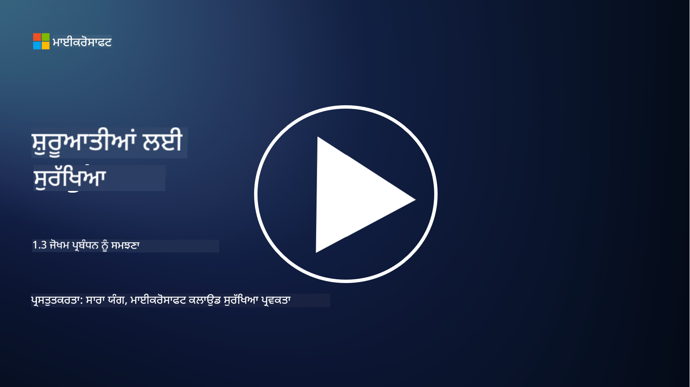
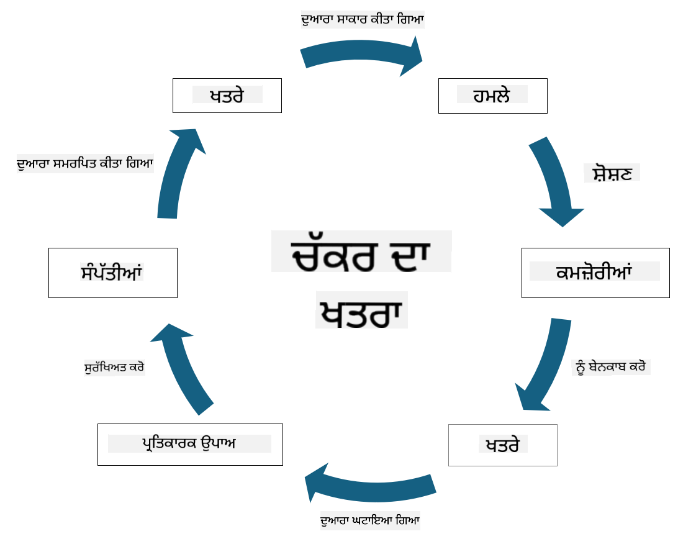

<!--
CO_OP_TRANSLATOR_METADATA:
{
  "original_hash": "fcca304f072cabf206388199e8e2e578",
  "translation_date": "2025-09-04T01:28:30+00:00",
  "source_file": "1.3 Understanding risk management.md",
  "language_code": "pa"
}
-->
# ਰਿਸਕ ਮੈਨੇਜਮੈਂਟ ਨੂੰ ਸਮਝਣਾ

## ਪਰਿਚਯ

ਇਸ ਪਾਠ ਵਿੱਚ, ਅਸੀਂ ਕਵਰ ਕਰਾਂਗੇ:

 - ਆਮ ਤੌਰ 'ਤੇ ਵਰਤੇ ਜਾਣ ਵਾਲੇ ਸੁਰੱਖਿਆ ਸਬੰਧੀ ਸ਼ਬਦਾਵਲੀ ਦੀਆਂ ਪਰਿਭਾਸ਼ਾਵਾਂ
   
 - ਸੁਰੱਖਿਆ ਨਿਯੰਤਰਣ ਦੇ ਕਿਸਮਾਂ

 - ਸੁਰੱਖਿਆ ਖਤਰਨਾਂ ਦਾ ਮੁਲਾਂਕਣ

## ਆਮ ਤੌਰ 'ਤੇ ਵਰਤੇ ਜਾਣ ਵਾਲੇ ਸੁਰੱਖਿਆ ਸਬੰਧੀ ਸ਼ਬਦਾਵਲੀ ਦੀਆਂ ਪਰਿਭਾਸ਼ਾਵਾਂ

ਇਹ ਸ਼ਬਦ ਸਾਇਬਰਸੁਰੱਖਿਆ ਅਤੇ ਰਿਸਕ ਮੈਨੇਜਮੈਂਟ ਦੇ ਖੇਤਰ ਵਿੱਚ ਮੁੱਢਲੇ ਸੰਕਲਪ ਹਨ। ਆਓ ਹਰ ਇੱਕ ਸ਼ਬਦ ਨੂੰ ਸਮਝੀਏ ਅਤੇ ਇਹ ਕਿਵੇਂ ਇੱਕ ਦੂਜੇ ਨਾਲ ਜੁੜੇ ਹੋਏ ਹਨ:

1. **ਥ੍ਰੈਟ ਏਜੰਟ (Threat Agent)**:

ਥ੍ਰੈਟ ਏਜੰਟ ਉਹ ਵਿਅਕਤੀ, ਸਮੂਹ, ਸੰਗਠਨ ਜਾਂ ਆਟੋਮੇਟਡ ਸਿਸਟਮ ਹੁੰਦਾ ਹੈ ਜਿਸ ਵਿੱਚ ਸਿਸਟਮ ਜਾਂ ਨੈੱਟਵਰਕ ਦੀਆਂ ਕਮਜ਼ੋਰੀਆਂ ਦਾ ਫਾਇਦਾ ਚੁੱਕ ਕੇ ਨੁਕਸਾਨ ਪਹੁੰਚਾਉਣ ਦੀ ਸਮਰੱਥਾ ਹੁੰਦੀ ਹੈ। ਥ੍ਰੈਟ ਏਜੰਟ ਵਿੱਚ ਹੈਕਰ, ਮਾਲਵੇਅਰ ਲਿਖਣ ਵਾਲੇ, ਨਾਰਾਜ਼ ਕਰਮਚਾਰੀ ਜਾਂ ਕੋਈ ਵੀ ਐਸਾ ਤੱਤ ਸ਼ਾਮਲ ਹੋ ਸਕਦਾ ਹੈ ਜੋ ਜਾਣਕਾਰੀ ਅਤੇ ਤਕਨਾਲੋਜੀ ਸਿਸਟਮ ਲਈ ਖਤਰਾ ਬਣਦਾ ਹੈ।

2. **ਥ੍ਰੈਟ (Threat)**:

ਥ੍ਰੈਟ ਇੱਕ ਸੰਭਾਵਿਤ ਘਟਨਾ ਜਾਂ ਕਾਰਵਾਈ ਹੈ ਜੋ ਸਿਸਟਮ ਦੀਆਂ ਕਮਜ਼ੋਰੀਆਂ ਦਾ ਫਾਇਦਾ ਚੁੱਕ ਕੇ ਕਿਸੇ ਸੰਪਤੀ ਨੂੰ ਨੁਕਸਾਨ ਪਹੁੰਚਾ ਸਕਦੀ ਹੈ। ਥ੍ਰੈਟ ਵਿੱਚ ਹੈਕਿੰਗ, ਡਾਟਾ ਚੋਰੀ, ਡਿਨਾਇਲ-ਆਫ-ਸਰਵਿਸ ਹਮਲੇ ਆਦਿ ਸ਼ਾਮਲ ਹੋ ਸਕਦੇ ਹਨ। ਥ੍ਰੈਟ ਉਹ "ਕੀ" ਹੈ ਜੋ ਸੰਗਠਨ ਦੀਆਂ ਸੰਪਤੀਆਂ ਨੂੰ ਨੁਕਸਾਨ ਪਹੁੰਚਾ ਸਕਦੀ ਹੈ।

3. **ਵਲਨਰੇਬਿਲਟੀ (Vulnerability)**:

ਵਲਨਰੇਬਿਲਟੀ ਸਿਸਟਮ ਦੇ ਡਿਜ਼ਾਈਨ, ਇੰਪਲੀਮੈਂਟੇਸ਼ਨ ਜਾਂ ਕਨਫਿਗਰੇਸ਼ਨ ਵਿੱਚ ਮੌਜੂਦ ਉਹ ਕਮਜ਼ੋਰੀ ਹੈ ਜਿਸਦਾ ਫਾਇਦਾ ਥ੍ਰੈਟ ਏਜੰਟ ਚੁੱਕ ਸਕਦਾ ਹੈ। ਇਹ ਕਮਜ਼ੋਰੀਆਂ ਸੌਫਟਵੇਅਰ, ਹਾਰਡਵੇਅਰ, ਪ੍ਰਕਿਰਿਆਵਾਂ ਜਾਂ ਮਨੁੱਖੀ ਵਿਵਹਾਰ ਵਿੱਚ ਹੋ ਸਕਦੀਆਂ ਹਨ। ਵਲਨਰੇਬਿਲਟੀ ਦੀ ਪਛਾਣ ਅਤੇ ਉਸਨੂੰ ਦੂਰ ਕਰਨਾ ਸਫਲ ਹਮਲਿਆਂ ਦੇ ਖਤਰੇ ਨੂੰ ਘਟਾਉਣ ਲਈ ਜ਼ਰੂਰੀ ਹੈ।

4. **ਰਿਸਕ (Risk)**:

ਰਿਸਕ ਉਹ ਸੰਭਾਵਨਾ ਹੈ ਜਿਸ ਵਿੱਚ ਥ੍ਰੈਟ ਅਤੇ ਵਲਨਰੇਬਿਲਟੀ ਦੇ ਪਰਸਪਰ ਪ੍ਰਭਾਵ ਨਾਲ ਨੁਕਸਾਨ ਜਾਂ ਹਾਨੀ ਹੋ ਸਕਦੀ ਹੈ। ਇਹ ਉਹ ਸੰਭਾਵਨਾ ਹੈ ਕਿ ਥ੍ਰੈਟ ਏਜੰਟ ਵਲਨਰੇਬਿਲਟੀ ਦਾ ਫਾਇਦਾ ਚੁੱਕ ਕੇ ਨਕਾਰਾਤਮਕ ਪ੍ਰਭਾਵ ਪੈਦਾ ਕਰੇਗਾ। ਰਿਸਕ ਨੂੰ ਅਕਸਰ ਇਸਦੇ ਸੰਭਾਵਿਤ ਪ੍ਰਭਾਵ ਅਤੇ ਸੰਭਾਵਨਾ ਦੇ ਆਧਾਰ 'ਤੇ ਅੰਕਿਤ ਕੀਤਾ ਜਾਂਦਾ ਹੈ।

5. **ਐਸੈਟ (Asset)**:

ਐਸੈਟ ਉਹ ਸਭ ਕੁਝ ਹੈ ਜਿਸਦੀ ਸੰਗਠਨ ਰੱਖਿਆ ਕਰਨਾ ਚਾਹੁੰਦੀ ਹੈ। ਐਸੈਟ ਵਿੱਚ ਭੌਤਿਕ ਚੀਜ਼ਾਂ (ਜਿਵੇਂ ਕਿ ਕੰਪਿਊਟਰ ਅਤੇ ਸਰਵਰ), ਡਾਟਾ (ਗਾਹਕ ਜਾਣਕਾਰੀ, ਵਿੱਤੀ ਰਿਕਾਰਡ), ਬੌਧਿਕ ਸੰਪਤੀ (ਟ੍ਰੇਡ ਸੀਕ੍ਰੇਟ, ਪੇਟੈਂਟ) ਅਤੇ ਇੱਥੋਂ ਤੱਕ ਕਿ ਮਨੁੱਖੀ ਸਰੋਤ (ਕਰਮਚਾਰੀਆਂ ਦੀਆਂ ਕੌਸ਼ਲ ਅਤੇ ਗਿਆਨ) ਸ਼ਾਮਲ ਹਨ। ਐਸੈਟ ਦੀ ਸੁਰੱਖਿਆ ਸਾਇਬਰਸੁਰੱਖਿਆ ਦਾ ਮੁੱਖ ਲਕਸ਼ ਹੈ।

6. **ਐਕਸਪੋਜ਼ਰ (Exposure)**:

ਐਕਸਪੋਜ਼ਰ ਉਸ ਸਥਿਤੀ ਨੂੰ ਕਿਹਾ ਜਾਂਦਾ ਹੈ ਜਦੋਂ ਸਿਸਟਮ ਜਾਂ ਨੈੱਟਵਰਕ ਵਿੱਚ ਮੌਜੂਦ ਕਮਜ਼ੋਰੀਆਂ ਥ੍ਰੈਟ ਏਜੰਟ ਦੁਆਰਾ ਸ਼ੋਸ਼ਣਯੋਗ ਹੁੰਦੀਆਂ ਹਨ। ਇਹ ਰਿਸਕ ਨੂੰ ਦਰਸਾਉਂਦਾ ਹੈ ਜੋ ਸਿਸਟਮ ਜਾਂ ਨੈੱਟਵਰਕ ਵਿੱਚ ਕਮਜ਼ੋਰੀਆਂ ਹੋਣ ਨਾਲ ਜੁੜਿਆ ਹੁੰਦਾ ਹੈ।

7. **ਕੰਟਰੋਲ (Control)**:

ਕੰਟਰੋਲ ਉਹ ਉਪਾਅ ਹੈ ਜੋ ਵਲਨਰੇਬਿਲਟੀ ਅਤੇ ਥ੍ਰੈਟ ਨਾਲ ਜੁੜੇ ਰਿਸਕ ਨੂੰ ਘਟਾਉਣ ਲਈ ਲਗਾਇਆ ਜਾਂਦਾ ਹੈ। ਕੰਟਰੋਲ ਤਕਨੀਕੀ, ਪ੍ਰਕਿਰਿਆਵਾਦੀ ਜਾਂ ਪ੍ਰਸ਼ਾਸਕੀ ਹੋ ਸਕਦੇ ਹਨ। ਇਹ ਥ੍ਰੈਟ ਅਤੇ ਵਲਨਰੇਬਿਲਟੀ ਦੇ ਪ੍ਰਭਾਵ ਨੂੰ ਰੋਕਣ, ਪਛਾਣਣ ਜਾਂ ਘਟਾਉਣ ਲਈ ਤਿਆਰ ਕੀਤੇ ਜਾਂਦੇ ਹਨ। ਉਦਾਹਰਣਾਂ ਵਿੱਚ ਫਾਇਰਵਾਲ, ਐਕਸੈਸ ਕੰਟਰੋਲ, ਇਨਕ੍ਰਿਪਸ਼ਨ, ਸੁਰੱਖਿਆ ਨੀਤੀਆਂ ਅਤੇ ਕਰਮਚਾਰੀ ਸਿਖਲਾਈ ਸ਼ਾਮਲ ਹਨ।

ਸੰਖੇਪ ਵਿੱਚ, ਇਹ ਸ਼ਬਦ ਇੱਕ ਦੂਜੇ ਨਾਲ ਇਸ ਤਰ੍ਹਾਂ ਜੁੜੇ ਹੋਏ ਹਨ: ਥ੍ਰੈਟ ਏਜੰਟ ਵਲਨਰੇਬਿਲਟੀ ਦਾ ਫਾਇਦਾ ਚੁੱਕ ਕੇ ਥ੍ਰੈਟ ਪੈਦਾ ਕਰਦੇ ਹਨ, ਜੋ ਰਿਸਕ ਨੂੰ ਜਨਮ ਦਿੰਦੇ ਹਨ ਅਤੇ ਇਹ ਰਿਸਕ ਕੀਮਤੀ ਐਸੈਟ ਨੂੰ ਨੁਕਸਾਨ ਪਹੁੰਚਾ ਸਕਦੇ ਹਨ। ਜਦੋਂ ਵਲਨਰੇਬਿਲਟੀ ਮੌਜੂਦ ਹੁੰਦੀ ਹੈ, ਤਾਂ ਐਕਸਪੋਜ਼ਰ ਹੁੰਦਾ ਹੈ, ਅਤੇ ਰਿਸਕ ਨੂੰ ਘਟਾਉਣ ਲਈ ਕੰਟਰੋਲ ਲਗਾਏ ਜਾਂਦੇ ਹਨ। ਇਹ ਢਾਂਚਾ ਸਾਇਬਰਸੁਰੱਖਿਆ ਰਿਸਕ ਮੈਨੇਜਮੈਂਟ ਦਾ ਆਧਾਰ ਬਣਾਉਂਦਾ ਹੈ, ਜੋ ਸੰਗਠਨਾਂ ਨੂੰ ਆਪਣੇ ਜਾਣਕਾਰੀ ਸਿਸਟਮ ਅਤੇ ਸੰਪਤੀਆਂ ਦੇ ਸੰਭਾਵਿਤ ਖਤਰਨਾਂ ਦੀ ਪਛਾਣ, ਮੁਲਾਂਕਣ ਅਤੇ ਹੱਲ ਕਰਨ ਵਿੱਚ ਸਹਾਇਤਾ ਕਰਦਾ ਹੈ।

## ਸੁਰੱਖਿਆ ਨਿਯੰਤਰਣ ਦੇ ਕਿਸਮਾਂ

ਸੁਰੱਖਿਆ ਨਿਯੰਤਰਣ ਉਹ ਉਪਾਅ ਹਨ ਜੋ ਜਾਣਕਾਰੀ ਸਿਸਟਮ ਅਤੇ ਸੰਪਤੀਆਂ ਨੂੰ ਵੱਖ-ਵੱਖ ਖਤਰਨਾਂ ਅਤੇ ਕਮਜ਼ੋਰੀਆਂ ਤੋਂ ਬਚਾਉਣ ਲਈ ਲਾਗੂ ਕੀਤੇ ਜਾਂਦੇ ਹਨ। ਇਹਨਾਂ ਨੂੰ ਉਨ੍ਹਾਂ ਦੇ ਧਿਆਨ ਅਤੇ ਉਦੇਸ਼ ਦੇ ਆਧਾਰ 'ਤੇ ਕਈ ਸ਼੍ਰੇਣੀਆਂ ਵਿੱਚ ਵੰਡਿਆ ਜਾ ਸਕਦਾ ਹੈ। ਹੇਠਾਂ ਕੁਝ ਆਮ ਕਿਸਮਾਂ ਦੇ ਸੁਰੱਖਿਆ ਨਿਯੰਤਰਣ ਦਿੱਤੇ ਗਏ ਹਨ:

1. **ਪ੍ਰਸ਼ਾਸਕੀ ਨਿਯੰਤਰਣ (Administrative Controls)**:

ਇਹ ਨਿਯੰਤਰਣ ਨੀਤੀਆਂ, ਪ੍ਰਕਿਰਿਆਵਾਂ ਅਤੇ ਦਿਸ਼ਾ-ਨਿਰਦੇਸ਼ਾਂ ਨਾਲ ਜੁੜੇ ਹੁੰਦੇ ਹਨ ਜੋ ਸੰਗਠਨ ਦੀ ਸੁਰੱਖਿਆ ਪ੍ਰਥਾਵਾਂ ਅਤੇ ਉਪਭੋਗਤਾ ਦੇ ਵਿਵਹਾਰ ਨੂੰ ਨਿਰਧਾਰਤ ਕਰਦੇ ਹਨ।

- ਸੁਰੱਖਿਆ ਨੀਤੀਆਂ ਅਤੇ ਪ੍ਰਕਿਰਿਆਵਾਂ: ਦਸਤਾਵੇਜ਼ੀ ਦਿਸ਼ਾ-ਨਿਰਦੇਸ਼ ਜੋ ਸੰਗਠਨ ਵਿੱਚ ਸੁਰੱਖਿਆ ਕਿਵੇਂ ਬਣਾਈ ਰੱਖੀ ਜਾਂਦੀ ਹੈ, ਇਸਨੂੰ ਪਰਿਭਾਸ਼ਿਤ ਕਰਦੇ ਹਨ।

- ਸੁਰੱਖਿਆ ਜਾਗਰੂਕਤਾ ਅਤੇ ਸਿਖਲਾਈ: ਕਰਮਚਾਰੀਆਂ ਨੂੰ ਸੁਰੱਖਿਆ ਦੀਆਂ ਸਰਵੋਤਮ ਪ੍ਰਥਾਵਾਂ ਅਤੇ ਸੰਭਾਵਿਤ ਖਤਰਨਾਂ ਬਾਰੇ ਸਿੱਖਾਉਣ ਵਾਲੇ ਪ੍ਰੋਗਰਾਮ।

- ਘਟਨਾ ਪ੍ਰਤੀਕਿਰਿਆ ਅਤੇ ਪ੍ਰਬੰਧਨ: ਸੁਰੱਖਿਆ ਘਟਨਾਵਾਂ ਦਾ ਜਵਾਬ ਦੇਣ ਅਤੇ ਘਟਾਉਣ ਲਈ ਯੋਜਨਾਵਾਂ।

2. **ਤਕਨੀਕੀ ਨਿਯੰਤਰਣ (Technical Controls)**:

ਤਕਨੀਕੀ ਨਿਯੰਤਰਣ ਉਹ ਹੁੰਦੇ ਹਨ ਜੋ ਸੁਰੱਖਿਆ ਉਪਾਅ ਲਾਗੂ ਕਰਨ ਅਤੇ ਸਿਸਟਮ ਅਤੇ ਡਾਟਾ ਦੀ ਰੱਖਿਆ ਕਰਨ ਲਈ ਤਕਨਾਲੋਜੀ ਦੀ ਵਰਤੋਂ ਕਰਦੇ ਹਨ। ਤਕਨੀਕੀ ਨਿਯੰਤਰਣ ਦੇ ਉਦਾਹਰਣ ਹਨ:

- ਐਕਸੈਸ ਕੰਟਰੋਲ: ਉਪਭੋਗਤਾਵਾਂ ਦੀ ਪਹੁੰਚ ਨੂੰ ਉਨ੍ਹਾਂ ਦੇ ਭੂਮਿਕਾਵਾਂ ਅਤੇ ਅਧਿਕਾਰਾਂ ਦੇ ਆਧਾਰ 'ਤੇ ਸੀਮਿਤ ਕਰਨਾ।

- ਇਨਕ੍ਰਿਪਸ਼ਨ: ਡਾਟਾ ਨੂੰ ਇੱਕ ਸੁਰੱਖਿਅਤ ਫਾਰਮੈਟ ਵਿੱਚ ਬਦਲਣਾ ਤਾਂ ਜੋ ਅਣਅਧਿਕਾਰਤ ਪਹੁੰਚ ਤੋਂ ਬਚਿਆ ਜਾ ਸਕੇ।

- ਫਾਇਰਵਾਲ: ਨੈੱਟਵਰਕ ਸੁਰੱਖਿਆ ਜੰਤਰ ਜੋ ਆਉਣ-ਜਾਣ ਵਾਲੀ ਟ੍ਰੈਫਿਕ ਨੂੰ ਫਿਲਟਰ ਅਤੇ ਨਿਯੰਤਰਿਤ ਕਰਦੇ ਹਨ।

- ਇੰਟ੍ਰੂਜ਼ਨ ਡਿਟੈਕਸ਼ਨ ਅਤੇ ਪ੍ਰਿਵੈਂਸ਼ਨ ਸਿਸਟਮ (IDPS): ਸੰਦ ਜੋ ਸ਼ੱਕੀ ਗਤੀਵਿਧੀ ਲਈ ਨੈੱਟਵਰਕ ਟ੍ਰੈਫਿਕ ਦੀ ਨਿਗਰਾਨੀ ਕਰਦੇ ਹਨ।

- ਐਂਟੀਵਾਇਰਸ ਅਤੇ ਐਂਟੀ-ਮਾਲਵੇਅਰ ਸੌਫਟਵੇਅਰ: ਪ੍ਰੋਗਰਾਮ ਜੋ ਮਾਲਵੇਅਰ ਦੀ ਪਛਾਣ ਅਤੇ ਹਟਾਉਣ ਕਰਦੇ ਹਨ।

- ਪ੍ਰਮਾਣਿਕਤਾ ਮਕੈਨਿਜ਼ਮ: ਉਪਭੋਗਤਾਵਾਂ ਦੀ ਪਛਾਣ ਦੀ ਪੁਸ਼ਟੀ ਕਰਨ ਦੇ ਤਰੀਕੇ, ਜਿਵੇਂ ਕਿ ਪਾਸਵਰਡ, ਬਾਇਓਮੈਟ੍ਰਿਕਸ, ਅਤੇ ਮਲਟੀ-ਫੈਕਟਰ ਪ੍ਰਮਾਣਿਕਤਾ।

- ਪੈਚ ਪ੍ਰਬੰਧਨ: ਜਾਣੀਆਂ ਕਮਜ਼ੋਰੀਆਂ ਨੂੰ ਦੂਰ ਕਰਨ ਲਈ ਸੌਫਟਵੇਅਰ ਨੂੰ ਨਿਯਮਿਤ ਤੌਰ 'ਤੇ ਅਪਡੇਟ ਕਰਨਾ।

3. **ਭੌਤਿਕ ਨਿਯੰਤਰਣ (Physical Controls)**:

ਭੌਤਿਕ ਨਿਯੰਤਰਣ ਉਹ ਉਪਾਅ ਹਨ ਜੋ ਭੌਤਿਕ ਸੰਪਤੀਆਂ ਅਤੇ ਸਹੂਲਤਾਂ ਦੀ ਰੱਖਿਆ ਲਈ ਲਾਗੂ ਕੀਤੇ ਜਾਂਦੇ ਹਨ।

- ਸੁਰੱਖਿਆ ਗਾਰਡ ਅਤੇ ਐਕਸੈਸ ਕੰਟਰੋਲ ਕਰਮਚਾਰੀ: ਉਹ ਕਰਮਚਾਰੀ ਜੋ ਭੌਤਿਕ ਸਥਾਨਾਂ ਦੀ ਪਹੁੰਚ ਦੀ ਨਿਗਰਾਨੀ ਅਤੇ ਨਿਯੰਤਰਣ ਕਰਦੇ ਹਨ।

- ਨਿਗਰਾਨੀ ਕੈਮਰੇ: ਗਤੀਵਿਧੀਆਂ ਦੀ ਨਿਗਰਾਨੀ ਅਤੇ ਰਿਕਾਰਡਿੰਗ ਲਈ ਵੀਡੀਓ ਮਾਨੀਟਰਿੰਗ ਸਿਸਟਮ।

- ਤਾਲੇ ਅਤੇ ਭੌਤਿਕ ਰੁਕਾਵਟਾਂ: ਸੰਵੇਦਨਸ਼ੀਲ ਖੇਤਰਾਂ ਦੀ ਪਹੁੰਚ ਨੂੰ ਸੀਮਿਤ ਕਰਨ ਲਈ ਭੌਤਿਕ ਉਪਾਅ।

- ਵਾਤਾਵਰਣੀ ਨਿਯੰਤਰਣ: ਉਪਕਰਣ ਅਤੇ ਡਾਟਾ ਸੈਂਟਰਾਂ ਨੂੰ ਪ੍ਰਭਾਵਿਤ ਕਰਨ ਵਾਲੇ ਤਾਪਮਾਨ, ਨਮੀ, ਅਤੇ ਹੋਰ ਵਾਤਾਵਰਣੀ ਕਾਰਕਾਂ ਨੂੰ ਨਿਯੰਤਰਿਤ ਕਰਨ ਦੇ ਉਪਾਅ।

4. **ਚਾਲੂ ਨਿਯੰਤਰਣ (Operational Controls)**:

ਇਹ ਨਿਯੰਤਰਣ ਦਿਨ-ਪ੍ਰਤੀ-ਦਿਨ ਦੇ ਕਾਰਜਾਂ ਅਤੇ ਗਤੀਵਿਧੀਆਂ ਨਾਲ ਜੁੜੇ ਹੁੰਦੇ ਹਨ ਜੋ ਸਿਸਟਮਾਂ ਦੀ ਸੁਰੱਖਿਆ ਨੂੰ ਯਕੀਨੀ ਬਣਾਉਂਦੇ ਹਨ।

- ਬਦਲਾਅ ਪ੍ਰਬੰਧਨ: ਸਿਸਟਮਾਂ ਅਤੇ ਕਨਫਿਗਰੇਸ਼ਨਾਂ ਵਿੱਚ ਬਦਲਾਅ ਦੀ ਟ੍ਰੈਕਿੰਗ ਅਤੇ ਮਨਜ਼ੂਰੀ ਲਈ ਪ੍ਰਕਿਰਿਆਵਾਂ।

- ਬੈਕਅੱਪ ਅਤੇ ਡਿਜਾਸਟਰ ਰਿਕਵਰੀ: ਸਿਸਟਮ ਫੇਲ੍ਹ ਜਾਂ ਆਫਤ ਦੇ ਮਾਮਲੇ ਵਿੱਚ ਡਾਟਾ ਬੈਕਅੱਪ ਅਤੇ ਰਿਕਵਰੀ ਲਈ ਯੋਜਨਾਵਾਂ।

- ਲਾਗਿੰਗ ਅਤੇ ਆਡਿਟਿੰਗ: ਸੁਰੱਖਿਆ ਅਤੇ ਅਨੁਕੂਲਤਾ ਦੇ ਉਦੇਸ਼ਾਂ ਲਈ ਸਿਸਟਮ ਗਤੀਵਿਧੀਆਂ ਦੀ ਨਿਗਰਾਨੀ ਅਤੇ ਰਿਕਾਰਡਿੰਗ।

- ਸੁਰੱਖਿਅਤ ਕੋਡਿੰਗ ਪ੍ਰਥਾਵਾਂ: ਸੌਫਟਵੇਅਰ ਲਿਖਣ ਲਈ ਦਿਸ਼ਾ-ਨਿਰਦੇਸ਼ ਜੋ ਕਮਜ਼ੋਰੀਆਂ ਨੂੰ ਘਟਾਉਣ ਲਈ ਤਿਆਰ ਕੀਤੇ ਗਏ ਹਨ।

5. **ਕਾਨੂੰਨੀ ਅਤੇ ਨਿਯਮਕ ਨਿਯੰਤਰਣ (Legal and Regulatory Controls)**:

ਇਹ ਨਿਯੰਤਰਣ ਸਬੰਧਤ ਕਾਨੂੰਨਾਂ, ਨਿਯਮਾਂ, ਅਤੇ ਉਦਯੋਗ ਮਿਆਰਾਂ ਦੀ ਪਾਲਣਾ ਯਕੀਨੀ ਬਣਾਉਂਦੇ ਹਨ। ਸੰਗਠਨ ਨੂੰ ਕਿਹੜੇ ਮਿਆਰਾਂ ਦੀ ਪਾਲਣਾ ਕਰਨੀ ਚਾਹੀਦੀ ਹੈ, ਇਹ ਜੁਰਿਸਡਿਕਸ਼ਨ, ਉਦਯੋਗ ਖੇਤਰ ਅਤੇ ਹੋਰ ਕਾਰਕਾਂ 'ਤੇ ਨਿਰਭਰ ਕਰਦਾ ਹੈ।

- ਡਾਟਾ ਸੁਰੱਖਿਆ ਨਿਯਮ: GDPR, HIPAA, ਅਤੇ CCPA ਵਰਗੇ ਕਾਨੂੰਨਾਂ ਦੀ ਪਾਲਣਾ।

- ਉਦਯੋਗ-ਵਿਸ਼ੇਸ਼ ਮਿਆਰ: ਭੁਗਤਾਨ ਕਾਰਡ ਡਾਟਾ ਸੁਰੱਖਿਆ ਲਈ PCI DSS ਵਰਗੇ ਮਿਆਰਾਂ ਦੀ ਪਾਲਣਾ।

ਇਹ ਸੁਰੱਖਿਆ ਨਿਯੰਤਰਣ ਦੀਆਂ ਸ਼੍ਰੇਣੀਆਂ ਸੰਗਠਨਾਂ ਲਈ ਇੱਕ ਵਿਸ਼ਾਲ ਸੁਰੱਖਿਆ ਰੂਪਰੇਖਾ ਬਣਾਉਂਦੀਆਂ ਹਨ, ਜੋ ਉਨ੍ਹਾਂ ਦੇ ਸਿਸਟਮਾਂ, ਡਾਟਾ, ਅਤੇ ਸੰਪਤੀਆਂ ਨੂੰ ਵੱਖ-ਵੱਖ ਖਤਰਨਾਂ ਤੋਂ ਬਚਾਉਣ ਵਿੱਚ ਸਹਾਇਕ ਹੁੰਦੀਆਂ ਹਨ।

## ਸੁਰੱਖਿਆ ਖਤਰਨਾਂ ਦਾ ਮੁਲਾਂਕਣ

ਕੁਝ ਸੁਰੱਖਿਆ ਪੇਸ਼ੇਵਰਾਂ ਨੂੰ ਲੱਗਦਾ ਹੈ ਕਿ ਰਿਸਕ ਮੈਨੇਜਮੈਂਟ ਸਿਰਫ ਰਿਸਕ ਪੇਸ਼ੇਵਰਾਂ ਲਈ ਹੈ, ਪਰ ਸੁਰੱਖਿਆ ਖਤਰੇ ਨੂੰ ਸਮਝਣ ਦੀ ਪ੍ਰਕਿਰਿਆ ਨੂੰ ਸਮਝਣਾ ਕਿਸੇ ਵੀ ਸੁਰੱਖਿਆ ਪੇਸ਼ੇਵਰ ਲਈ ਮਹੱਤਵਪੂਰਨ ਹੈ ਤਾਂ ਜੋ ਸੁਰੱਖਿਆ ਖਤਰੇ ਨੂੰ ਸੰਗਠਨ ਦੀ ਭਾਸ਼ਾ ਵਿੱਚ ਵਿਆਖਿਆ ਕੀਤਾ ਜਾ ਸਕੇ ਅਤੇ ਇਸ 'ਤੇ ਕਾਰਵਾਈ ਕੀਤੀ ਜਾ ਸਕੇ।

ਸੰਗਠਨਾਂ ਨੂੰ ਸੁਰੱਖਿਆ ਖਤਰਨਾਂ ਦਾ ਨਿਰੰਤਰ ਮੁਲਾਂਕਣ ਕਰਨਾ ਚਾਹੀਦਾ ਹੈ ਅਤੇ ਇਹ ਫੈਸਲਾ ਕਰਨਾ ਚਾਹੀਦਾ ਹੈ ਕਿ ਕਾਰੋਬਾਰ ਲਈ ਖਤਰਨਾਂ ਦੇ ਖਿਲਾਫ ਕੀ ਕਾਰਵਾਈ (ਜਾਂ ਨਾ ਕਰਨ) ਦੀ ਜ਼ਰੂਰਤ ਹੈ। ਹੇਠਾਂ ਇਸਦੀ ਇੱਕ ਝਲਕ ਦਿੱਤੀ ਗਈ ਹੈ ਕਿ ਇਹ ਆਮ ਤੌਰ 'ਤੇ ਕਿਵੇਂ ਕੀਤਾ ਜਾਂਦਾ ਹੈ। ਧਿਆਨ ਦਿਓ ਕਿ ਇਹ ਪ੍ਰਕਿਰਿਆ ਆਮ ਤੌਰ 'ਤੇ ਸੰਗਠਨ ਦੇ ਕਈ ਵੱਖ-ਵੱਖ ਟੀਮਾਂ ਦੁਆਰਾ ਕੀਤੀ ਜਾਂਦੀ ਹੈ; ਇਹ ਕਦਾਚਿਤ ਹੀ ਹੁੰਦਾ ਹੈ ਕਿ ਇੱਕ ਟੀਮ ਰਿਸਕ ਦੇ ਅੰਤ-ਤੱਕ ਪ੍ਰਬੰਧਨ ਲਈ ਜ਼ਿੰਮੇਵਾਰ ਹੋਵੇ।

1. **ਐਸੈਟ ਅਤੇ ਥ੍ਰੈਟ ਦੀ ਪਛਾਣ ਕਰੋ**:

ਸੰਗਠਨ ਉਹ ਐਸੈਟ ਪਛਾਣਦਾ ਹੈ ਜੋ ਉਹ ਸੁਰੱਖਿਅਤ ਕਰਨਾ ਚਾਹੁੰਦਾ ਹੈ। ਇਹਨਾਂ ਵਿੱਚ ਡਾਟਾ, ਸਿਸਟਮ, ਹਾਰਡਵੇਅਰ, ਸੌਫਟਵੇਅਰ, ਬੌਧਿਕ ਸੰਪਤੀ ਆਦਿ ਸ਼ਾਮਲ ਹਨ। ਇਸ ਤੋਂ ਬਾਅਦ, ਉਹ ਸੰਭਾਵਿਤ ਥ੍ਰੈਟ ਪਛਾਣਦੇ ਹਨ ਜੋ ਇਹਨਾਂ ਐਸੈਟਾਂ ਨੂੰ ਨਿਸ਼ਾਨਾ ਬਣਾ ਸਕਦੇ ਹਨ।

2. **ਵਲਨਰੇਬਿਲਟੀਜ਼ ਦਾ ਮੁਲਾਂਕਣ ਕਰੋ**:

ਸੰਗਠਨ ਫਿਰ ਉਹ ਕਮਜ਼ੋਰੀਆਂ ਜਾਂ ਕਮੀਆਂ ਪਛਾਣਦਾ ਹੈ ਜੋ ਥ੍ਰੈਟ ਦੁਆਰਾ ਸ਼ੋਸ਼ਣਯੋਗ ਹੋ ਸਕਦੀਆਂ ਹਨ। ਇਹ ਕਮਜ਼ੋਰੀਆਂ ਸੌਫਟਵੇਅਰ ਦੀਆਂ ਖਾਮੀਆਂ, ਗਲਤ ਕਨਫਿਗਰੇਸ਼ਨ, ਸੁਰੱਖਿਆ ਨਿਯੰਤਰਣ ਦੀ ਘਾਟ, ਅਤੇ ਮਨੁੱਖੀ ਗਲਤੀ ਤੋਂ ਆ ਸਕਦੀਆਂ ਹਨ।

3. **ਸੰਭਾਵਨਾ ਦਾ ਮੁਲਾਂਕਣ ਕਰੋ**:

ਸੰਗਠਨ ਫਿਰ ਹਰ ਥ੍ਰੈਟ ਦੇ ਹੋਣ ਦੀ ਸੰਭਾਵਨਾ ਦਾ ਮੁਲਾਂਕਣ ਕਰੇਗਾ। ਇਸ ਵਿੱਚ ਇਤਿਹਾਸਕ ਡਾਟਾ, ਥ੍ਰੈਟ ਇੰਟੈਲੀਜੈਂਸ, ਉਦਯੋਗ ਰੁਝਾਨ, ਅਤੇ ਅੰਦਰੂਨੀ ਕਾਰਕਾਂ ਨੂੰ ਧਿਆਨ ਵਿੱਚ ਰੱਖਣਾ ਸ਼ਾਮਲ ਹੈ। ਸੰਭਾਵਨਾ ਨੂੰ ਘੱਟ, ਦਰਮਿਆਨਾ ਜਾਂ ਉੱਚ ਸ਼੍ਰ

---

**ਅਸਵੀਕਰਤੀ**:  
ਇਹ ਦਸਤਾਵੇਜ਼ AI ਅਨੁਵਾਦ ਸੇਵਾ [Co-op Translator](https://github.com/Azure/co-op-translator) ਦੀ ਵਰਤੋਂ ਕਰਕੇ ਅਨੁਵਾਦ ਕੀਤਾ ਗਿਆ ਹੈ। ਜਦੋਂ ਕਿ ਅਸੀਂ ਸਹੀ ਹੋਣ ਦਾ ਯਤਨ ਕਰਦੇ ਹਾਂ, ਕਿਰਪਾ ਕਰਕੇ ਧਿਆਨ ਦਿਓ ਕਿ ਸਵੈਚਾਲਿਤ ਅਨੁਵਾਦਾਂ ਵਿੱਚ ਗਲਤੀਆਂ ਜਾਂ ਅਸੁੱਛਤਾਵਾਂ ਹੋ ਸਕਦੀਆਂ ਹਨ। ਇਸ ਦੀ ਮੂਲ ਭਾਸ਼ਾ ਵਿੱਚ ਮੌਜੂਦ ਮੂਲ ਦਸਤਾਵੇਜ਼ ਨੂੰ ਪ੍ਰਮਾਣਿਕ ਸਰੋਤ ਮੰਨਿਆ ਜਾਣਾ ਚਾਹੀਦਾ ਹੈ। ਮਹੱਤਵਪੂਰਨ ਜਾਣਕਾਰੀ ਲਈ, ਪੇਸ਼ੇਵਰ ਮਨੁੱਖੀ ਅਨੁਵਾਦ ਦੀ ਸਿਫਾਰਸ਼ ਕੀਤੀ ਜਾਂਦੀ ਹੈ। ਇਸ ਅਨੁਵਾਦ ਦੇ ਪ੍ਰਯੋਗ ਤੋਂ ਪੈਦਾ ਹੋਣ ਵਾਲੇ ਕਿਸੇ ਵੀ ਗਲਤਫਹਿਮੀ ਜਾਂ ਗਲਤ ਵਿਆਖਿਆ ਲਈ ਅਸੀਂ ਜ਼ਿੰਮੇਵਾਰ ਨਹੀਂ ਹਾਂ।