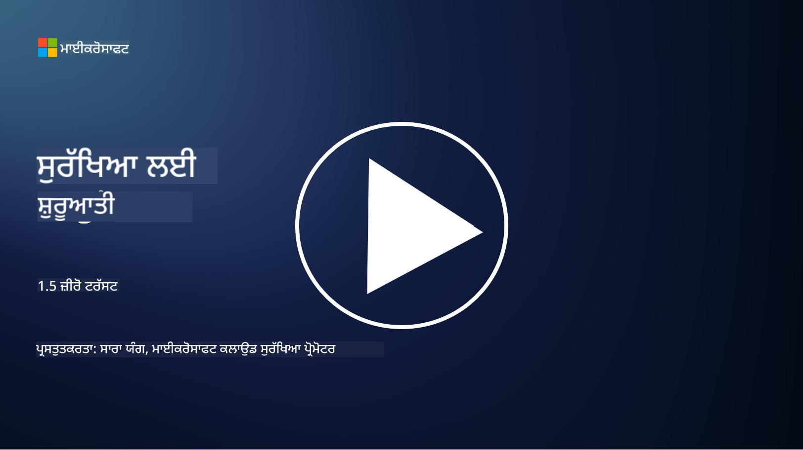
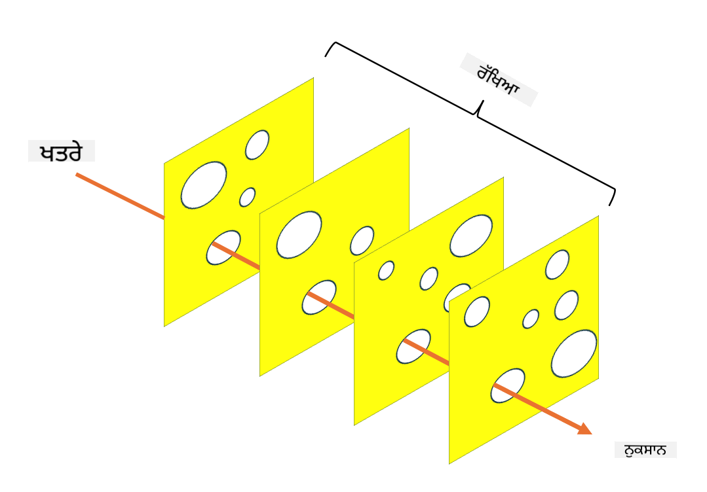

<!--
CO_OP_TRANSLATOR_METADATA:
{
  "original_hash": "75f77f972d2233c584f87c1eb96c983b",
  "translation_date": "2025-09-03T23:46:36+00:00",
  "source_file": "1.5 Zero trust.md",
  "language_code": "pa"
}
-->
# ਜ਼ੀਰੋ ਟਰਸਟ

"ਜ਼ੀਰੋ ਟਰਸਟ" ਇੱਕ ਸ਼ਬਦ ਹੈ ਜੋ ਅੱਜਕਲ੍ਹ ਸੁਰੱਖਿਆ ਦੇ ਮਾਹਿਰਾਂ ਵਿੱਚ ਬਹੁਤ ਵਰਤਿਆ ਜਾਂਦਾ ਹੈ। ਪਰ ਇਸਦਾ ਕੀ ਅਰਥ ਹੈ, ਕੀ ਇਹ ਸਿਰਫ਼ ਇੱਕ ਬਜ਼ਵਰਡ ਹੈ? ਇਸ ਪਾਠ ਵਿੱਚ, ਅਸੀਂ ਇਸ ਗੱਲ ਦੀ ਗਹਿਰਾਈ ਵਿੱਚ ਜਾਣਾਂਗੇ ਕਿ ਜ਼ੀਰੋ ਟਰਸਟ ਅਸਲ ਵਿੱਚ ਕੀ ਹੈ।

## ਪਰਿਚਯ

 - ਇਸ ਪਾਠ ਵਿੱਚ, ਅਸੀਂ ਕਵਰ ਕਰਾਂਗੇ:
   
   
 - ਜ਼ੀਰੋ ਟਰਸਟ ਕੀ ਹੈ?

   
  

 - ਜ਼ੀਰੋ ਟਰਸਟ ਪਾਰੰਪਰਿਕ ਸੁਰੱਖਿਆ ਆਰਕੀਟੈਕਚਰ ਤੋਂ ਕਿਵੇਂ ਵੱਖਰਾ ਹੈ?

   
   

 - ਡਿਫੈਂਸ ਇਨ ਡੈਪਥ ਕੀ ਹੈ?

## ਜ਼ੀਰੋ ਟਰਸਟ

ਜ਼ੀਰੋ ਟਰਸਟ ਇੱਕ ਸਾਈਬਰਸੁਰੱਖਿਆ ਪਹੁੰਚ ਹੈ ਜੋ "ਭਰੋਸਾ ਕਰੋ ਪਰ ਜਾਂਚੋ" ਦੇ ਪਾਰੰਪਰਿਕ ਧਾਰਨਾ ਨੂੰ ਚੁਣੌਤੀ ਦਿੰਦੀ ਹੈ। ਇਹ ਮੰਨਦਾ ਹੈ ਕਿ ਕੋਈ ਵੀ ਇਕਾਈ, ਚਾਹੇ ਉਹ ਸੰਗਠਨ ਦੇ ਨੈਟਵਰਕ ਦੇ ਅੰਦਰ ਹੋਵੇ ਜਾਂ ਬਾਹਰ, ਨੂੰ ਆਪਣੇ ਆਪ 'ਤੇ ਭਰੋਸੇਯੋਗ ਨਹੀਂ ਮੰਨਿਆ ਜਾਣਾ ਚਾਹੀਦਾ। ਇਸਦੀ ਬਜਾਏ, ਜ਼ੀਰੋ ਟਰਸਟ ਹਰ ਯੂਜ਼ਰ, ਡਿਵਾਈਸ ਅਤੇ ਐਪਲੀਕੇਸ਼ਨ ਨੂੰ, ਜੋ ਸਾਧਨਾਂ ਤੱਕ ਪਹੁੰਚ ਕਰਨ ਦੀ ਕੋਸ਼ਿਸ਼ ਕਰ ਰਹੇ ਹਨ, ਦੀ ਜਾਂਚ ਕਰਨ ਦੀ ਸਿਫਾਰਸ਼ ਕਰਦਾ ਹੈ, ਚਾਹੇ ਉਹ ਕਿਤੇ ਵੀ ਹੋਣ। ਜ਼ੀਰੋ ਟਰਸਟ ਦਾ ਮੁੱਖ ਸਿਧਾਂਤ "ਅਟੈਕ ਸਰਫੇਸ" ਨੂੰ ਘਟਾਉਣਾ ਅਤੇ ਸੁਰੱਖਿਆ ਦੇ ਉਲੰਘਨਾਂ ਦੇ ਸੰਭਾਵਿਤ ਪ੍ਰਭਾਵ ਨੂੰ ਘਟਾਉਣਾ ਹੈ।

ਜ਼ੀਰੋ ਟਰਸਟ ਮਾਡਲ ਵਿੱਚ, ਹੇਠਾਂ ਦਿੱਤੇ ਸਿਧਾਂਤਾਂ 'ਤੇ ਜ਼ੋਰ ਦਿੱਤਾ ਜਾਂਦਾ ਹੈ:

1. **ਪਛਾਣ ਦੀ ਜਾਂਚ ਕਰੋ**: ਪ੍ਰਮਾਣਿਕਤਾ ਅਤੇ ਅਧਿਕਾਰ ਨੂੰ ਸਖਤੀ ਨਾਲ ਸਾਰੇ ਯੂਜ਼ਰਾਂ ਅਤੇ ਡਿਵਾਈਸਾਂ 'ਤੇ ਲਾਗੂ ਕੀਤਾ ਜਾਂਦਾ ਹੈ, ਚਾਹੇ ਉਹ ਕਿਤੇ ਵੀ ਹੋਣ। ਯਾਦ ਰੱਖੋ ਕਿ ਪਛਾਣ ਹਮੇਸ਼ਾ ਮਨੁੱਖੀ ਨਹੀਂ ਹੁੰਦੀ: ਇਹ ਇੱਕ ਡਿਵਾਈਸ, ਐਪਲੀਕੇਸ਼ਨ ਆਦਿ ਹੋ ਸਕਦੀ ਹੈ।

2. **ਘੱਟੋ-ਘੱਟ ਅਧਿਕਾਰ**: ਯੂਜ਼ਰਾਂ ਅਤੇ ਡਿਵਾਈਸਾਂ ਨੂੰ ਸਿਰਫ਼ ਉਹ ਪਹੁੰਚ ਦਿੱਤੀ ਜਾਂਦੀ ਹੈ ਜੋ ਉਨ੍ਹਾਂ ਦੇ ਕੰਮ ਕਰਨ ਲਈ ਜ਼ਰੂਰੀ ਹੈ, ਜਿਸ ਨਾਲ ਉਨ੍ਹਾਂ ਦੇ ਕਾਬੂ ਵਿੱਚ ਆਉਣ ਦੀ ਸਥਿਤੀ ਵਿੱਚ ਸੰਭਾਵਿਤ ਨੁਕਸਾਨ ਘਟਦਾ ਹੈ।

3. **ਮਾਈਕਰੋ-ਸੈਗਮੈਂਟੇਸ਼ਨ**: ਨੈਟਵਰਕ ਸਾਧਨਾਂ ਨੂੰ ਛੋਟੇ-ਛੋਟੇ ਹਿੱਸਿਆਂ ਵਿੱਚ ਵੰਡਿਆ ਜਾਂਦਾ ਹੈ ਤਾਂ ਜੋ ਉਲੰਘਨ ਦੇ ਮਾਮਲੇ ਵਿੱਚ ਨੈਟਵਰਕ ਦੇ ਅੰਦਰ ਲੈਟਰਲ ਮੂਵਮੈਂਟ ਨੂੰ ਸੀਮਿਤ ਕੀਤਾ ਜਾ ਸਕੇ।

4. **ਲਗਾਤਾਰ ਨਿਗਰਾਨੀ**: ਯੂਜ਼ਰ ਅਤੇ ਡਿਵਾਈਸ ਦੇ ਵਿਹਾਰ ਦੀ ਲਗਾਤਾਰ ਨਿਗਰਾਨੀ ਅਤੇ ਵਿਸ਼ਲੇਸ਼ਣ ਕੀਤੀ ਜਾਂਦੀ ਹੈ ਤਾਂ ਜੋ ਅਸਧਾਰਨਤਾ ਅਤੇ ਸੰਭਾਵਿਤ ਖਤਰੇ ਪਤਾ ਲਗ ਸਕਣ। ਆਧੁਨਿਕ ਨਿਗਰਾਨੀ ਤਕਨੀਕਾਂ ਮਸ਼ੀਨ ਲਰਨਿੰਗ, AI ਅਤੇ ਖਤਰੇ ਦੀ ਜਾਣਕਾਰੀ ਵਰਤਦੀਆਂ ਹਨ ਜੋ ਨਿਗਰਾਨੀ ਨੂੰ ਵਧੇਰੇ ਵਿਸਤਾਰ ਅਤੇ ਸੰਦਰਭ ਪ੍ਰਦਾਨ ਕਰਦੀਆਂ ਹਨ।

5. **ਡਾਟਾ ਇਨਕ੍ਰਿਪਸ਼ਨ**: ਡਾਟਾ ਨੂੰ ਟ੍ਰਾਂਜ਼ਿਟ ਅਤੇ ਰੈਸਟ ਦੋਵਾਂ ਵਿੱਚ ਇਨਕ੍ਰਿਪਟ ਕੀਤਾ ਜਾਂਦਾ ਹੈ ਤਾਂ ਜੋ ਅਣਅਧਿਕਾਰਤ ਪਹੁੰਚ ਨੂੰ ਰੋਕਿਆ ਜਾ ਸਕੇ।

6. **ਸਖਤ ਪਹੁੰਚ ਨਿਯੰਤਰਣ**: ਪਹੁੰਚ ਨਿਯੰਤਰਣ ਯੂਜ਼ਰ ਰੋਲ, ਡਿਵਾਈਸ ਦੀ ਸਿਹਤ ਅਤੇ ਨੈਟਵਰਕ ਸਥਾਨ ਵਰਗੇ ਸੰਦਰਭ ਦੇ ਆਧਾਰ 'ਤੇ ਲਾਗੂ ਕੀਤੇ ਜਾਂਦੇ ਹਨ।

ਮਾਈਕਰੋਸਾਫਟ ਜ਼ੀਰੋ ਟਰਸਟ ਨੂੰ ਪੰਜ ਖੰਭਾਂ ਵਿੱਚ ਵੰਡਦਾ ਹੈ, ਜਿਨ੍ਹਾਂ ਨੂੰ ਅਸੀਂ ਅਗਲੇ ਪਾਠ ਵਿੱਚ ਚਰਚਾ ਕਰਾਂਗੇ।

## ਪਾਰੰਪਰਿਕ ਸੁਰੱਖਿਆ ਆਰਕੀਟੈਕਚਰ ਤੋਂ ਅੰਤਰ

ਜ਼ੀਰੋ ਟਰਸਟ ਪਾਰੰਪਰਿਕ ਸੁਰੱਖਿਆ ਆਰਕੀਟੈਕਚਰ, ਜਿਵੇਂ ਕਿ ਪੇਰੀਮੀਟਰ-ਅਧਾਰਿਤ ਮਾਡਲ, ਤੋਂ ਕਈ ਤਰੀਕਿਆਂ ਵਿੱਚ ਵੱਖਰਾ ਹੈ:

1. **ਪੇਰੀਮੀਟਰ ਵਿਰੁੱਧ ਪਛਾਣ-ਕੇਂਦਰਿਤ**: ਪਾਰੰਪਰਿਕ ਮਾਡਲ ਨੈਟਵਰਕ ਦੇ ਪੇਰੀਮੀਟਰ ਦੀ ਸੁਰੱਖਿਆ ਕਰਨ 'ਤੇ ਧਿਆਨ ਦਿੰਦੇ ਹਨ ਅਤੇ ਮੰਨਦੇ ਹਨ ਕਿ ਅੰਦਰੂਨੀ ਯੂਜ਼ਰ ਅਤੇ ਡਿਵਾਈਸਾਂ ਨੂੰ ਇੱਕ ਵਾਰ ਅੰਦਰ ਆਉਣ 'ਤੇ ਭਰੋਸੇਯੋਗ ਮੰਨਿਆ ਜਾ ਸਕਦਾ ਹੈ। ਜ਼ੀਰੋ ਟਰਸਟ, ਇਸਦੇ ਬਜਾਏ, ਮੰਨਦਾ ਹੈ ਕਿ ਖਤਰੇ ਨੈਟਵਰਕ ਦੇ ਅੰਦਰ ਅਤੇ ਬਾਹਰ ਦੋਵਾਂ ਤੋਂ ਆ ਸਕਦੇ ਹਨ ਅਤੇ ਸਖਤ ਪਛਾਣ-ਅਧਾਰਿਤ ਨਿਯੰਤਰਣ ਲਾਗੂ ਕਰਦਾ ਹੈ।

2. **ਅਪਰੋਕਸ਼ ਵਿਰੁੱਧ ਸਪਸ਼ਟ ਭਰੋਸਾ**: ਪਾਰੰਪਰਿਕ ਮਾਡਲ ਨੈਟਵਰਕ ਦੇ ਅੰਦਰ ਡਿਵਾਈਸਾਂ ਅਤੇ ਯੂਜ਼ਰਾਂ 'ਤੇ ਅਪਰੋਕਸ਼ ਤੌਰ 'ਤੇ ਭਰੋਸਾ ਕਰਦੇ ਹਨ ਜਦ ਤੱਕ ਕਿ ਇਹ ਸਾਬਤ ਨਾ ਹੋਵੇ। ਜ਼ੀਰੋ ਟਰਸਟ ਸਪਸ਼ਟ ਤੌਰ 'ਤੇ ਪਛਾਣ ਦੀ ਜਾਂਚ ਕਰਦਾ ਹੈ ਅਤੇ ਅਸਧਾਰਨਤਾ ਲਈ ਲਗਾਤਾਰ ਨਿਗਰਾਨੀ ਕਰਦਾ ਹੈ।

3. **ਫਲੈਟ ਵਿਰੁੱਧ ਸੈਗਮੈਂਟੇਡ ਨੈਟਵਰਕ**: ਪਾਰੰਪਰਿਕ ਆਰਕੀਟੈਕਚਰ ਅਕਸਰ ਫਲੈਟ ਨੈਟਵਰਕ ਸ਼ਾਮਲ ਕਰਦੇ ਹਨ ਜਿੱਥੇ ਅੰਦਰੂਨੀ ਯੂਜ਼ਰਾਂ ਨੂੰ ਵਿਆਪਕ ਪਹੁੰਚ ਹੁੰਦੀ ਹੈ। ਜ਼ੀਰੋ ਟਰਸਟ ਨੈਟਵਰਕ ਨੂੰ ਛੋਟੇ, ਅਲੱਗ-ਅਲੱਗ ਜ਼ੋਨ ਵਿੱਚ ਵੰਡਣ ਦੀ ਸਿਫਾਰਸ਼ ਕਰਦਾ ਹੈ ਤਾਂ ਜੋ ਸੰਭਾਵਿਤ ਉਲੰਘਨਾਂ ਨੂੰ ਰੋਕਿਆ ਜਾ ਸਕੇ।

4. **ਪ੍ਰਤੀਕ੍ਰਿਆਸ਼ੀਲ ਵਿਰੁੱਧ ਪ੍ਰੋ-ਐਕਟਿਵ**: ਪਾਰੰਪਰਿਕ ਸੁਰੱਖਿਆ ਅਕਸਰ ਪੇਰੀਮੀਟਰ ਫਾਇਰਵਾਲ ਅਤੇ ਇੰਟ੍ਰੂਜ਼ਨ ਡਿਟੈਕਸ਼ਨ ਵਰਗੇ ਪ੍ਰਤੀਕ੍ਰਿਆਸ਼ੀਲ ਉਪਾਅ 'ਤੇ ਨਿਰਭਰ ਕਰਦੀ ਹੈ। ਜ਼ੀਰੋ ਟਰਸਟ ਇੱਕ ਪ੍ਰੋ-ਐਕਟਿਵ ਪਹੁੰਚ ਲੈਂਦਾ ਹੈ ਜੋ ਮੰਨਦਾ ਹੈ ਕਿ ਉਲੰਘਨ ਸੰਭਾਵਿਤ ਹਨ ਅਤੇ ਉਨ੍ਹਾਂ ਦੇ ਪ੍ਰਭਾਵ ਨੂੰ ਘਟਾਉਣ ਦੀ ਕੋਸ਼ਿਸ਼ ਕਰਦਾ ਹੈ।

## ਡਿਫੈਂਸ ਇਨ ਡੈਪਥ

ਡਿਫੈਂਸ ਇਨ ਡੈਪਥ, ਜਿਸਨੂੰ ਲੇਅਰਡ ਸੁਰੱਖਿਆ ਵੀ ਕਿਹਾ ਜਾਂਦਾ ਹੈ, ਇੱਕ ਸਾਈਬਰਸੁਰੱਖਿਆ ਰਣਨੀਤੀ ਹੈ ਜੋ ਸੰਗਠਨ ਦੇ ਸਾਧਨਾਂ ਦੀ ਸੁਰੱਖਿਆ ਕਰਨ ਲਈ ਕਈ ਲੇਅਰਾਂ ਦੇ ਸੁਰੱਖਿਆ ਨਿਯੰਤਰਣ ਅਤੇ ਉਪਾਅ ਤੈਨਾਤ ਕਰਨ 'ਤੇ ਧਿਆਨ ਦਿੰਦੀ ਹੈ। ਇਸਦਾ ਉਦੇਸ਼ ਇਹ ਹੈ ਕਿ ਅਜੇਕਰ ਇੱਕ ਲੇਅਰ ਉਲੰਘਿਆ ਜਾਂਦਾ ਹੈ, ਤਾਂ ਹੋਰ ਲੇਅਰਾਂ ਫਿਰ ਵੀ ਸੁਰੱਖਿਆ ਪ੍ਰਦਾਨ ਕਰ ਸਕਦੀਆਂ ਹਨ। ਹਰ ਲੇਅਰ ਸੁਰੱਖਿਆ ਦੇ ਇੱਕ ਵੱਖਰੇ ਪਹਲੂ 'ਤੇ ਧਿਆਨ ਦਿੰਦੀ ਹੈ ਅਤੇ ਸੰਗਠਨ ਦੀ ਕੁੱਲ ਸੁਰੱਖਿਆ ਸਥਿਤੀ ਨੂੰ ਵਧਾਉਂਦੀ ਹੈ।

ਡਿਫੈਂਸ ਇਨ ਡੈਪਥ ਵਿੱਚ ਤਕਨੀਕੀ, ਪ੍ਰਕਿਰਿਆਵਾਦੀ ਅਤੇ ਭੌਤਿਕ ਸੁਰੱਖਿਆ ਉਪਾਅ ਦਾ ਸੰਯੋਜਨ ਸ਼ਾਮਲ ਹੁੰਦਾ ਹੈ। ਇਹ ਫਾਇਰਵਾਲ, ਇੰਟ੍ਰੂਜ਼ਨ ਡਿਟੈਕਸ਼ਨ ਸਿਸਟਮ, ਪਹੁੰਚ ਨਿਯੰਤਰਣ, ਇਨਕ੍ਰਿਪਸ਼ਨ, ਯੂਜ਼ਰ ਟ੍ਰੇਨਿੰਗ, ਸੁਰੱਖਿਆ ਨੀਤੀਆਂ ਅਤੇ ਹੋਰ ਕਈ ਚੀਜ਼ਾਂ ਸ਼ਾਮਲ ਕਰ ਸਕਦੇ ਹਨ। ਇਹ ਵਿਚਾਰ ਹੈ ਕਿ ਕਈ ਰੁਕਾਵਟਾਂ ਬਣਾਈਆਂ ਜਾਣ ਜੋ ਮਿਲ ਕੇ ਹਮਲਾਵਰਾਂ ਲਈ ਸੰਗਠਨ ਦੇ ਸਿਸਟਮ ਅਤੇ ਨੈਟਵਰਕ ਵਿੱਚ ਘੁਸਣਾ ਮੁਸ਼ਕਲ ਬਣਾਉਂਦੀਆਂ ਹਨ। ਇਸਨੂੰ ਕਈ ਵਾਰ "ਸਵਿਸ ਚੀਜ਼" ਮਾਡਲ ਵੀ ਕਿਹਾ ਜਾਂਦਾ ਹੈ ਜੋ ਹੋਰ ਉਦਯੋਗਾਂ (ਜਿਵੇਂ ਕਿ ਟਰਾਂਸਪੋਰਟ) ਵਿੱਚ ਹਾਦਸਿਆਂ ਨੂੰ ਰੋਕਣ ਲਈ ਵਰਤਿਆ ਜਾਂਦਾ ਹੈ।

## ਹੋਰ ਪੜ੍ਹਾਈ

[ਜ਼ੀਰੋ ਟਰਸਟ ਕੀ ਹੈ?](https://learn.microsoft.com/security/zero-trust/zero-trust-overview?WT.mc_id=academic-96948-sayoung)

[ਜ਼ੀਰੋ ਟਰਸਟ ਦਾ ਵਿਕਾਸ – ਮਾਈਕਰੋਸਾਫਟ ਪੋਜ਼ੀਸ਼ਨ ਪੇਪਰ](https://query.prod.cms.rt.microsoft.com/cms/api/am/binary/RWJJdT?WT.mc_id=academic-96948-sayoung)

[ਜ਼ੀਰੋ ਟਰਸਟ ਅਤੇ ਬਿਯਾਂਡਕੋਰਪ ਗੂਗਲ ਕਲਾਉਡ | ਗੂਗਲ ਕਲਾਉਡ ਬਲੌਗ](https://cloud.google.com/blog/topics/developers-practitioners/zero-trust-and-beyondcorp-google-cloud)

---

**ਅਸਵੀਕਤੀ**:  
ਇਹ ਦਸਤਾਵੇਜ਼ AI ਅਨੁਵਾਦ ਸੇਵਾ [Co-op Translator](https://github.com/Azure/co-op-translator) ਦੀ ਵਰਤੋਂ ਕਰਕੇ ਅਨੁਵਾਦ ਕੀਤਾ ਗਿਆ ਹੈ। ਜਦੋਂ ਕਿ ਅਸੀਂ ਸਹੀਤਾ ਲਈ ਯਤਨਸ਼ੀਲ ਹਾਂ, ਕਿਰਪਾ ਕਰਕੇ ਧਿਆਨ ਦਿਓ ਕਿ ਸਵੈਚਾਲਿਤ ਅਨੁਵਾਦਾਂ ਵਿੱਚ ਗਲਤੀਆਂ ਜਾਂ ਅਸੁਣਤਾਂ ਹੋ ਸਕਦੀਆਂ ਹਨ। ਮੂਲ ਦਸਤਾਵੇਜ਼ ਨੂੰ ਇਸਦੀ ਮੂਲ ਭਾਸ਼ਾ ਵਿੱਚ ਅਧਿਕਾਰਤ ਸਰੋਤ ਮੰਨਿਆ ਜਾਣਾ ਚਾਹੀਦਾ ਹੈ। ਮਹੱਤਵਪੂਰਨ ਜਾਣਕਾਰੀ ਲਈ, ਪੇਸ਼ੇਵਰ ਮਨੁੱਖੀ ਅਨੁਵਾਦ ਦੀ ਸਿਫਾਰਸ਼ ਕੀਤੀ ਜਾਂਦੀ ਹੈ। ਇਸ ਅਨੁਵਾਦ ਦੀ ਵਰਤੋਂ ਤੋਂ ਪੈਦਾ ਹੋਣ ਵਾਲੇ ਕਿਸੇ ਵੀ ਗਲਤਫਹਿਮੀ ਜਾਂ ਗਲਤ ਵਿਆਖਿਆ ਲਈ ਅਸੀਂ ਜ਼ਿੰਮੇਵਾਰ ਨਹੀਂ ਹਾਂ।