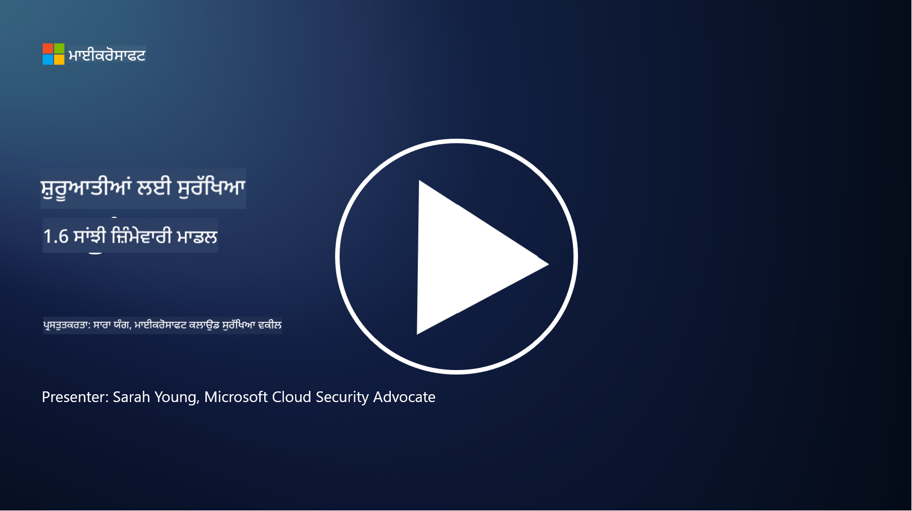

<!--
CO_OP_TRANSLATOR_METADATA:
{
  "original_hash": "a48db640d80c786b928ca178c414f084",
  "translation_date": "2025-09-04T00:25:08+00:00",
  "source_file": "1.6 Shared responsibility model.md",
  "language_code": "pa"
}
-->
# ਸਾਂਝੀ ਜ਼ਿੰਮੇਵਾਰੀ ਮਾਡਲ

ਸਾਂਝੀ ਜ਼ਿੰਮੇਵਾਰੀ ਆਈਟੀ ਵਿੱਚ ਇੱਕ ਨਵਾਂ ਅਵਧਾਰਣਾ ਹੈ ਜੋ ਕਲਾਉਡ ਕੰਪਿਊਟਿੰਗ ਦੇ ਆਗਮਨ ਨਾਲ ਆਈ। ਸਾਇਬਰਸੁਰੱਖਿਆ ਦੇ ਨਜ਼ਰੀਏ ਤੋਂ, ਇਹ ਸਮਝਣਾ ਮਹੱਤਵਪੂਰਨ ਹੈ ਕਿ ਕੌਣ ਕਿਹੜੇ ਸੁਰੱਖਿਆ ਨਿਯੰਤਰਣ ਪ੍ਰਦਾਨ ਕਰ ਰਿਹਾ ਹੈ ਤਾਂ ਜੋ ਰੱਖਿਆ ਵਿੱਚ ਕੋਈ ਖਾਮੀ ਨਾ ਰਹੇ।

## ਪਰਿਚਯ

ਇਸ ਪਾਠ ਵਿੱਚ, ਅਸੀਂ ਕਵਰ ਕਰਾਂਗੇ:

- ਸਾਇਬਰਸੁਰੱਖਿਆ ਦੇ ਸੰਦਰਭ ਵਿੱਚ ਸਾਂਝੀ ਜ਼ਿੰਮੇਵਾਰੀ ਕੀ ਹੈ?

- IaaS, PaaS ਅਤੇ SaaS ਵਿੱਚ ਸੁਰੱਖਿਆ ਨਿਯੰਤਰਣ ਲਈ ਸਾਂਝੀ ਜ਼ਿੰਮੇਵਾਰੀ ਵਿੱਚ ਕੀ ਅੰਤਰ ਹੈ?

- ਤੁਹਾਡਾ ਕਲਾਉਡ ਪਲੇਟਫਾਰਮ ਕਿਹੜੇ ਸੁਰੱਖਿਆ ਨਿਯੰਤਰਣ ਪ੍ਰਦਾਨ ਕਰ ਰਿਹਾ ਹੈ, ਇਹ ਕਿੱਥੇ ਪਤਾ ਲਗ ਸਕਦਾ ਹੈ?

- "ਭਰੋਸਾ ਕਰੋ ਪਰ ਜਾਂਚੋ" ਕੀ ਹੈ?

## ਸਾਇਬਰਸੁਰੱਖਿਆ ਦੇ ਸੰਦਰਭ ਵਿੱਚ ਸਾਂਝੀ ਜ਼ਿੰਮੇਵਾਰੀ ਕੀ ਹੈ?

ਸਾਇਬਰਸੁਰੱਖਿਆ ਵਿੱਚ ਸਾਂਝੀ ਜ਼ਿੰਮੇਵਾਰੀ ਦਾ ਮਤਲਬ ਹੈ ਸੁਰੱਖਿਆ ਦੀਆਂ ਜ਼ਿੰਮੇਵਾਰੀਆਂ ਨੂੰ ਕਲਾਉਡ ਸੇਵਾ ਪ੍ਰਦਾਤਾ (CSP) ਅਤੇ ਇਸਦੇ ਗਾਹਕਾਂ ਵਿੱਚ ਵੰਡਣਾ। ਕਲਾਉਡ ਕੰਪਿਊਟਿੰਗ ਵਾਤਾਵਰਣਾਂ ਵਿੱਚ, ਜਿਵੇਂ ਕਿ Infrastructure as a Service (IaaS), Platform as a Service (PaaS), ਅਤੇ Software as a Service (SaaS), CSP ਅਤੇ ਗਾਹਕ ਦੋਵੇਂ ਨੂੰ ਡਾਟਾ, ਐਪਲੀਕੇਸ਼ਨ ਅਤੇ ਸਿਸਟਮ ਦੀ ਸੁਰੱਖਿਆ ਯਕੀਨੀ ਬਣਾਉਣ ਵਿੱਚ ਭੂਮਿਕਾ ਨਿਭਾਉਣੀ ਪੈਂਦੀ ਹੈ।

## IaaS, PaaS ਅਤੇ SaaS ਵਿੱਚ ਸੁਰੱਖਿਆ ਨਿਯੰਤਰਣ ਲਈ ਸਾਂਝੀ ਜ਼ਿੰਮੇਵਾਰੀ ਵਿੱਚ ਕੀ ਅੰਤਰ ਹੈ?

ਜ਼ਿੰਮੇਵਾਰੀਆਂ ਦੀ ਵੰਡ ਆਮ ਤੌਰ 'ਤੇ ਵਰਤੇ ਜਾ ਰਹੇ ਕਲਾਉਡ ਸੇਵਾ ਦੇ ਕਿਸਮ 'ਤੇ ਨਿਰਭਰ ਕਰਦੀ ਹੈ:

- **IaaS (Infrastructure as a Service)**: CSP ਬੁਨਿਆਦੀ ਢਾਂਚਾ (ਸਰਵਰ, ਨੈਟਵਰਕਿੰਗ, ਸਟੋਰੇਜ) ਪ੍ਰਦਾਨ ਕਰਦਾ ਹੈ, ਜਦਕਿ ਗਾਹਕ ਉਸ ਢਾਂਚੇ 'ਤੇ ਆਪਰੇਟਿੰਗ ਸਿਸਟਮ, ਐਪਲੀਕੇਸ਼ਨ ਅਤੇ ਸੁਰੱਖਿਆ ਸੰਰਚਨਾਵਾਂ ਦਾ ਪ੍ਰਬੰਧ ਕਰਦਾ ਹੈ।

- **PaaS (Platform as a Service):** CSP ਇੱਕ ਪਲੇਟਫਾਰਮ ਪ੍ਰਦਾਨ ਕਰਦਾ ਹੈ ਜਿਸ 'ਤੇ ਗਾਹਕ ਐਪਲੀਕੇਸ਼ਨ ਬਣਾਉਣ ਅਤੇ ਤੈਨਾਤ ਕਰਨ ਦੇ ਯੋਗ ਹੁੰਦੇ ਹਨ। CSP ਅਧਾਰਭੂਤ ਢਾਂਚੇ ਦਾ ਪ੍ਰਬੰਧ ਕਰਦਾ ਹੈ, ਅਤੇ ਗਾਹਕ ਐਪਲੀਕੇਸ਼ਨ ਵਿਕਾਸ ਅਤੇ ਡਾਟਾ ਸੁਰੱਖਿਆ 'ਤੇ ਧਿਆਨ ਕੇਂਦਰਿਤ ਕਰਦਾ ਹੈ।

- **SaaS (Software as a Service):** CSP ਪੂਰੀ ਤਰ੍ਹਾਂ ਕਾਰਗਰ ਐਪਲੀਕੇਸ਼ਨ ਪ੍ਰਦਾਨ ਕਰਦਾ ਹੈ ਜੋ ਇੰਟਰਨੈਟ ਰਾਹੀਂ ਪਹੁੰਚਯੋਗ ਹੁੰਦੇ ਹਨ। ਇਸ ਮਾਮਲੇ ਵਿੱਚ, CSP ਐਪਲੀਕੇਸ਼ਨ ਦੀ ਸੁਰੱਖਿਆ ਅਤੇ ਢਾਂਚੇ ਲਈ ਜ਼ਿੰਮੇਵਾਰ ਹੁੰਦਾ ਹੈ, ਜਦਕਿ ਗਾਹਕ ਯੂਜ਼ਰ ਪਹੁੰਚ ਅਤੇ ਡਾਟਾ ਦੀ ਵਰਤੋਂ ਦਾ ਪ੍ਰਬੰਧ ਕਰਦਾ ਹੈ।

ਸਾਂਝੀ ਜ਼ਿੰਮੇਵਾਰੀ ਨੂੰ ਸਮਝਣਾ ਮਹੱਤਵਪੂਰਨ ਹੈ ਕਿਉਂਕਿ ਇਹ ਸਪਸ਼ਟ ਕਰਦਾ ਹੈ ਕਿ CSP ਕਿਹੜੇ ਸੁਰੱਖਿਆ ਪਹਲੂ ਕਵਰ ਕਰਦਾ ਹੈ ਅਤੇ ਕਿਹੜੇ ਗਾਹਕ ਨੂੰ ਸੰਬੋਧਨ ਕਰਨੇ ਹਨ। ਇਹ ਗਲਤਫਹਮੀਆਂ ਨੂੰ ਰੋਕਣ ਵਿੱਚ ਮਦਦ ਕਰਦਾ ਹੈ ਅਤੇ ਇਹ ਯਕੀਨੀ ਬਣਾਉਂਦਾ ਹੈ ਕਿ ਸੁਰੱਖਿਆ ਉਪਾਅ ਪੂਰੀ ਤਰ੍ਹਾਂ ਲਾਗੂ ਕੀਤੇ ਗਏ ਹਨ।

## ਤੁਹਾਡਾ ਕਲਾਉਡ ਪਲੇਟਫਾਰਮ ਕਿਹੜੇ ਸੁਰੱਖਿਆ ਨਿਯੰਤਰਣ ਪ੍ਰਦਾਨ ਕਰ ਰਿਹਾ ਹੈ, ਇਹ ਕਿੱਥੇ ਪਤਾ ਲਗ ਸਕਦਾ ਹੈ?

ਤੁਹਾਡਾ ਕਲਾਉਡ ਪਲੇਟਫਾਰਮ ਕਿਹੜੇ ਸੁਰੱਖਿਆ ਨਿਯੰਤਰਣ ਪ੍ਰਦਾਨ ਕਰ ਰਿਹਾ ਹੈ, ਇਹ ਪਤਾ ਕਰਨ ਲਈ ਤੁਹਾਨੂੰ ਕਲਾਉਡ ਸੇਵਾ ਪ੍ਰਦਾਤਾ ਦੀ ਦਸਤਾਵੇਜ਼ੀ ਅਤੇ ਸਰੋਤਾਂ ਨੂੰ ਦੇਖਣਾ ਪਵੇਗਾ। ਇਹ ਸ਼ਾਮਲ ਹਨ:

- **CSP ਦੀ ਵੈਬਸਾਈਟ ਅਤੇ ਦਸਤਾਵੇਜ਼ੀ**: CSP ਦੀ ਵੈਬਸਾਈਟ ਉਨ੍ਹਾਂ ਦੀਆਂ ਸੇਵਾਵਾਂ ਦੇ ਹਿੱਸੇ ਵਜੋਂ ਪੇਸ਼ ਕੀਤੀਆਂ ਸੁਰੱਖਿਆ ਵਿਸ਼ੇਸ਼ਤਾਵਾਂ ਅਤੇ ਨਿਯੰਤਰਣਾਂ ਬਾਰੇ ਜਾਣਕਾਰੀ ਰੱਖਦੀ ਹੈ। CSP ਆਮ ਤੌਰ 'ਤੇ ਵਿਸਤ੍ਰਿਤ ਦਸਤਾਵੇਜ਼ੀ ਪ੍ਰਦਾਨ ਕਰਦੇ ਹਨ ਜੋ ਉਨ੍ਹਾਂ ਦੇ ਸੁਰੱਖਿਆ ਅਭਿਆਸ, ਨਿਯੰਤਰਣ ਅਤੇ ਸਿਫਾਰਸ਼ਾਂ ਦੀ ਵਿਆਖਿਆ ਕਰਦੀ ਹੈ। ਇਸ ਵਿੱਚ ਵਾਈਟਪੇਪਰ, ਸੁਰੱਖਿਆ ਗਾਈਡ ਅਤੇ ਤਕਨੀਕੀ ਦਸਤਾਵੇਜ਼ ਸ਼ਾਮਲ ਹੋ ਸਕਦੇ ਹਨ।

- **ਸੁਰੱਖਿਆ ਮੁਲਾਂਕਣ ਅਤੇ ਆਡਿਟ**: ਜ਼ਿਆਦਾਤਰ CSP ਆਪਣੇ ਸੁਰੱਖਿਆ ਨਿਯੰਤਰਣਾਂ ਨੂੰ ਸਵਤੰਤਰ ਸੁਰੱਖਿਆ ਵਿਸ਼ੇਸ਼ਗਿਆ ਅਤੇ ਸੰਗਠਨਾਂ ਦੁਆਰਾ ਮੁਲਾਂਕਨ ਕਰਵਾਉਂਦੇ ਹਨ। ਇਹ ਸਮੀਖਿਆ CSP ਦੇ ਸੁਰੱਖਿਆ ਉਪਾਅ ਦੀ ਗੁਣਵੱਤਾ ਬਾਰੇ ਜਾਣਕਾਰੀ ਪ੍ਰਦਾਨ ਕਰ ਸਕਦੀ ਹੈ। ਕਈ ਵਾਰ ਇਸ ਨਾਲ CSP ਨੂੰ ਸੁਰੱਖਿਆ ਅਨੁਕੂਲਤਾ ਸਰਟੀਫਿਕੇਟ ਮਿਲਦਾ ਹੈ (ਅਗਲੇ ਬੁੱਲਟ ਪਾਇੰਟ ਦੇਖੋ)।

- **ਸੁਰੱਖਿਆ ਅਨੁਕੂਲਤਾ ਸਰਟੀਫਿਕੇਸ਼ਨ**: ਜ਼ਿਆਦਾਤਰ CSP ISO:27001, SOC 2, ਅਤੇ FedRAMP ਆਦਿ ਵਰਗੇ ਸਰਟੀਫਿਕੇਸ਼ਨ ਪ੍ਰਾਪਤ ਕਰਦੇ ਹਨ। ਇਹ ਸਰਟੀਫਿਕੇਸ਼ਨ ਦਿਖਾਉਂਦੇ ਹਨ ਕਿ ਪ੍ਰਦਾਤਾ ਵਿਸ਼ੇਸ਼ ਸੁਰੱਖਿਆ ਅਤੇ ਅਨੁਕੂਲਤਾ ਮਿਆਰਾਂ ਨੂੰ ਪੂਰਾ ਕਰਦਾ ਹੈ।

ਯਾਦ ਰੱਖੋ ਕਿ ਜਾਣਕਾਰੀ ਦੀ ਵਿਸਤ੍ਰਤਾ ਅਤੇ ਉਪਲਬਧਤਾ ਕਲਾਉਡ ਪ੍ਰਦਾਤਾਵਾਂ ਵਿੱਚ ਵੱਖ-ਵੱਖ ਹੋ ਸਕਦੀ ਹੈ। ਹਮੇਸ਼ਾ ਇਹ ਯਕੀਨੀ ਬਣਾਓ ਕਿ ਤੁਸੀਂ ਕਲਾਉਡ ਸੇਵਾ ਪ੍ਰਦਾਤਾ ਦੁਆਰਾ ਪ੍ਰਦਾਨ ਕੀਤੇ ਗਏ ਅਧਿਕਾਰਤ ਅਤੇ ਅਪ-ਟੂ-ਡੇਟ ਸਰੋਤਾਂ ਦੀ ਸਲਾਹ-ਮਸ਼ਵਰਾ ਕਰ ਰਹੇ ਹੋ ਤਾਂ ਜੋ ਆਪਣੇ ਕਲਾਉਡ-ਅਧਾਰਿਤ ਸੰਪਤੀਆਂ ਦੀ ਸੁਰੱਖਿਆ ਬਾਰੇ ਸੂਝਵਾਨ ਫੈਸਲੇ ਲਏ ਜਾ ਸਕਣ।

## "ਭਰੋਸਾ ਕਰੋ ਪਰ ਜਾਂਚੋ" ਕੀ ਹੈ?

CSP, ਤੀਜੀ ਪਾਰਟੀ ਸੌਫਟਵੇਅਰ ਜਾਂ ਹੋਰ ਆਈਟੀ ਸੁਰੱਖਿਆ ਸੇਵਾ ਦੀ ਵਰਤੋਂ ਦੇ ਸੰਦਰਭ ਵਿੱਚ, ਇੱਕ ਸੰਗਠਨ ਸ਼ੁਰੂਆਤੀ ਤੌਰ 'ਤੇ ਪ੍ਰਦਾਤਾ ਦੇ ਸੁਰੱਖਿਆ ਉਪਾਅ ਬਾਰੇ ਦਾਅਵਿਆਂ 'ਤੇ ਭਰੋਸਾ ਕਰ ਸਕਦਾ ਹੈ। ਹਾਲਾਂਕਿ, ਆਪਣੇ ਡਾਟਾ ਅਤੇ ਸਿਸਟਮ ਦੀ ਸੁਰੱਖਿਆ ਯਕੀਨੀ ਬਣਾਉਣ ਲਈ, ਉਹ ਸੁਰੱਖਿਆ ਮੁਲਾਂਕਣ, ਪੈਨਟਰੇਸ਼ਨ ਟੈਸਟਿੰਗ ਅਤੇ ਬਾਹਰੀ ਪਾਰਟੀ ਦੇ ਸੁਰੱਖਿਆ ਨਿਯੰਤਰਣਾਂ ਦੀ ਸਮੀਖਿਆ ਕਰਕੇ ਇਨ੍ਹਾਂ ਦਾਅਵਿਆਂ ਦੀ ਜਾਂਚ ਕਰਦੇ ਹਨ। ਸਾਰੇ ਵਿਅਕਤੀ ਅਤੇ ਸੰਗਠਨ ਉਹ ਸੁਰੱਖਿਆ ਨਿਯੰਤਰਣਾਂ 'ਤੇ ਭਰੋਸਾ ਕਰਨ ਦੀ ਕੋਸ਼ਿਸ਼ ਕਰਨ ਚਾਹੀਦੀ ਹੈ ਜਿਨ੍ਹਾਂ ਲਈ ਉਹ ਜ਼ਿੰਮੇਵਾਰ ਨਹੀਂ ਹਨ।

## ਸੰਗਠਨ ਦੇ ਅੰਦਰ ਸਾਂਝੀ ਜ਼ਿੰਮੇਵਾਰੀ

ਯਾਦ ਰੱਖੋ, ਸੰਗਠਨ ਦੇ ਅੰਦਰ ਵੱਖ-ਵੱਖ ਟੀਮਾਂ ਲਈ ਸੁਰੱਖਿਆ ਲਈ ਸਾਂਝੀ ਜ਼ਿੰਮੇਵਾਰੀ ਨੂੰ ਵੀ ਧਿਆਨ ਵਿੱਚ ਰੱਖਣ ਦੀ ਲੋੜ ਹੈ। ਸੁਰੱਖਿਆ ਟੀਮ ਕਦੇ ਵੀ ਸਾਰੇ ਨਿਯੰਤਰਣਾਂ ਨੂੰ ਖੁਦ ਲਾਗੂ ਨਹੀਂ ਕਰੇਗੀ ਅਤੇ ਸੰਗਠਨ ਨੂੰ ਸੁਰੱਖਿਆਯੋਗ ਬਣਾਉਣ ਲਈ ਸਾਰੇ ਸੁਰੱਖਿਆ ਨਿਯੰਤਰਣ ਲਾਗੂ ਕਰਨ ਲਈ ਓਪਰੇਸ਼ਨ ਟੀਮਾਂ, ਡਿਵੈਲਪਰਾਂ ਅਤੇ ਵਪਾਰ ਦੇ ਹੋਰ ਹਿੱਸਿਆਂ ਨਾਲ ਸਹਿਯੋਗ ਕਰਨ ਦੀ ਲੋੜ ਹੋਵੇਗੀ।

## ਹੋਰ ਪੜ੍ਹਾਈ

- [Shared responsibility in the cloud - Microsoft Azure | Microsoft Learn](https://learn.microsoft.com/azure/security/fundamentals/shared-responsibility?WT.mc_id=academic-96948-sayoung)  
- [What is shared responsibility model? – Definition from TechTarget.com](https://www.techtarget.com/searchcloudcomputing/definition/shared-responsibility-model)  
- [The shared responsibility model explained and what it means for cloud security | CSO Online](https://www.csoonline.com/article/570779/the-shared-responsibility-model-explained-and-what-it-means-for-cloud-security.html)  
- [Shared Responsibility for Cloud Security: What You Need to Know (cisecurity.org)](https://www.cisecurity.org/insights/blog/shared-responsibility-cloud-security-what-you-need-to-know)  

---

**ਅਸਵੀਕਤੀ**:  
ਇਹ ਦਸਤਾਵੇਜ਼ AI ਅਨੁਵਾਦ ਸੇਵਾ [Co-op Translator](https://github.com/Azure/co-op-translator) ਦੀ ਵਰਤੋਂ ਕਰਕੇ ਅਨੁਵਾਦ ਕੀਤਾ ਗਿਆ ਹੈ। ਜਦੋਂ ਕਿ ਅਸੀਂ ਸਹੀਤਾ ਲਈ ਯਤਨਸ਼ੀਲ ਹਾਂ, ਕਿਰਪਾ ਕਰਕੇ ਧਿਆਨ ਦਿਓ ਕਿ ਸਵੈਚਾਲਿਤ ਅਨੁਵਾਦਾਂ ਵਿੱਚ ਗਲਤੀਆਂ ਜਾਂ ਅਸੁਚਨਾਵਾਂ ਹੋ ਸਕਦੀਆਂ ਹਨ। ਮੂਲ ਦਸਤਾਵੇਜ਼ ਨੂੰ ਇਸਦੀ ਮੂਲ ਭਾਸ਼ਾ ਵਿੱਚ ਅਧਿਕਾਰਤ ਸਰੋਤ ਮੰਨਿਆ ਜਾਣਾ ਚਾਹੀਦਾ ਹੈ। ਮਹੱਤਵਪੂਰਨ ਜਾਣਕਾਰੀ ਲਈ, ਪੇਸ਼ੇਵਰ ਮਨੁੱਖੀ ਅਨੁਵਾਦ ਦੀ ਸਿਫਾਰਸ਼ ਕੀਤੀ ਜਾਂਦੀ ਹੈ। ਇਸ ਅਨੁਵਾਦ ਦੀ ਵਰਤੋਂ ਤੋਂ ਪੈਦਾ ਹੋਣ ਵਾਲੇ ਕਿਸੇ ਵੀ ਗਲਤਫਹਿਮੀ ਜਾਂ ਗਲਤ ਵਿਆਖਿਆ ਲਈ ਅਸੀਂ ਜ਼ਿੰਮੇਵਾਰ ਨਹੀਂ ਹਾਂ।