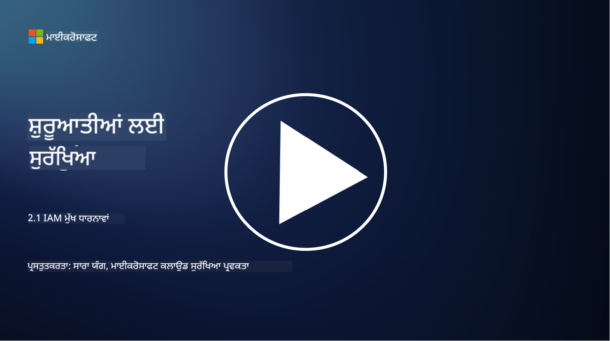

<!--
CO_OP_TRANSLATOR_METADATA:
{
  "original_hash": "2e3864e3d579f0dbb4ac2ec8c5f82acf",
  "translation_date": "2025-09-03T22:38:55+00:00",
  "source_file": "2.1 IAM key concepts.md",
  "language_code": "pa"
}
-->
# IAM ਮੁੱਖ ਧਾਰਨਾਵਾਂ

ਕੀ ਤੁਸੀਂ ਕਦੇ ਕੰਪਿਊਟਰ ਜਾਂ ਵੈਬਸਾਈਟ 'ਤੇ ਲੌਗਇਨ ਕੀਤਾ ਹੈ? ਬਿਲਕੁਲ ਕੀਤਾ ਹੋਵੇਗਾ! ਇਸਦਾ ਮਤਲਬ ਹੈ ਕਿ ਤੁਸੀਂ ਆਪਣੀ ਦਿਨਚਰਿਆ ਵਿੱਚ ਪਹਿਲਾਂ ਹੀ ਪਹਿਚਾਣ ਨਿਯੰਤਰਣਾਂ ਦੀ ਵਰਤੋਂ ਕਰ ਰਹੇ ਹੋ। ਪਹਿਚਾਣ ਅਤੇ ਪਹੁੰਚ ਪ੍ਰਬੰਧਨ (IAM) ਸੁਰੱਖਿਆ ਦਾ ਇੱਕ ਮਹੱਤਵਪੂਰਨ ਸਤੰਭ ਹੈ, ਜਿਸ ਬਾਰੇ ਅਸੀਂ ਅਗਲੇ ਪਾਠਾਂ ਵਿੱਚ ਹੋਰ ਜਾਣਕਾਰੀ ਲਵਾਂਗੇ।

**ਪ੍ਰਸਤਾਵਨਾ**

ਇਸ ਪਾਠ ਵਿੱਚ, ਅਸੀਂ ਕਵਰ ਕਰਾਂਗੇ:

- ਸਾਈਬਰਸੁਰੱਖਿਆ ਦੇ ਸੰਦਰਭ ਵਿੱਚ ਪਹਿਚਾਣ ਅਤੇ ਪਹੁੰਚ ਪ੍ਰਬੰਧਨ (IAM) ਦਾ ਕੀ ਅਰਥ ਹੈ?

- ਘੱਟੋ-ਘੱਟ ਅਧਿਕਾਰ ਦਾ ਸਿਧਾਂਤ ਕੀ ਹੈ?

- ਕਾਰਜਾਂ ਦੀ ਵੰਡ (Segregation of duties) ਕੀ ਹੈ?

- ਪ੍ਰਮਾਣਿਕਤਾ (Authentication) ਅਤੇ ਅਧਿਕਾਰ (Authorization) ਕੀ ਹਨ?

## ਸਾਈਬਰਸੁਰੱਖਿਆ ਦੇ ਸੰਦਰਭ ਵਿੱਚ ਪਹਿਚਾਣ ਅਤੇ ਪਹੁੰਚ ਪ੍ਰਬੰਧਨ (IAM) ਦਾ ਕੀ ਅਰਥ ਹੈ?

ਪਹਿਚਾਣ ਅਤੇ ਪਹੁੰਚ ਪ੍ਰਬੰਧਨ (IAM) ਪ੍ਰਕਿਰਿਆਵਾਂ, ਤਕਨਾਲੋਜੀਆਂ, ਅਤੇ ਨੀਤੀਆਂ ਦੇ ਇੱਕ ਸੈੱਟ ਨੂੰ ਦਰਸਾਉਂਦਾ ਹੈ ਜੋ ਇਹ ਯਕੀਨੀ ਬਣਾਉਣ ਲਈ ਲਾਗੂ ਕੀਤੀਆਂ ਜਾਂਦੀਆਂ ਹਨ ਕਿ ਸਹੀ ਵਿਅਕਤੀਆਂ ਨੂੰ ਸੰਗਠਨ ਦੇ ਡਿਜੀਟਲ ਵਾਤਾਵਰਣ ਵਿੱਚ ਸਾਧਨਾਂ ਤੱਕ ਉਚਿਤ ਪਹੁੰਚ ਪ੍ਰਾਪਤ ਹੈ। IAM ਵਿੱਚ ਡਿਜੀਟਲ ਪਹਿਚਾਣਾਂ (ਯੂਜ਼ਰ, ਕਰਮਚਾਰੀ, ਸਾਥੀ) ਅਤੇ ਉਨ੍ਹਾਂ ਦੀ ਸਿਸਟਮਾਂ, ਐਪਲੀਕੇਸ਼ਨਾਂ, ਡਾਟਾ, ਅਤੇ ਨੈਟਵਰਕ ਤੱਕ ਪਹੁੰਚ ਦਾ ਪ੍ਰਬੰਧਨ ਸ਼ਾਮਲ ਹੈ। IAM ਦਾ ਮੁੱਖ ਉਦੇਸ਼ ਸੁਰੱਖਿਆ ਨੂੰ ਵਧਾਉਣਾ, ਯੂਜ਼ਰ ਪਹੁੰਚ ਨੂੰ ਸਧਾਰਨਾ, ਅਤੇ ਸੰਗਠਨ ਦੀਆਂ ਨੀਤੀਆਂ ਅਤੇ ਨਿਯਮਾਂ ਨਾਲ ਅਨੁਕੂਲਤਾ ਯਕੀਨੀ ਬਣਾਉਣਾ ਹੈ। IAM ਹੱਲਾਂ ਵਿੱਚ ਆਮ ਤੌਰ 'ਤੇ ਯੂਜ਼ਰ ਪ੍ਰਮਾਣਿਕਤਾ, ਅਧਿਕਾਰ, ਪਹਿਚਾਣ ਪ੍ਰਦਾਨ ਕਰਨਾ, ਪਹੁੰਚ ਨਿਯੰਤਰਣ, ਅਤੇ ਯੂਜ਼ਰ ਲਾਈਫਸਾਈਕਲ ਪ੍ਰਬੰਧਨ (ਜਾਂਚ ਕਰਨਾ ਕਿ ਖਾਤੇ ਹਟਾਏ ਜਾਂਦੇ ਹਨ ਜਦੋਂ ਉਹ ਹੋਰ ਵਰਤੋਂ ਵਿੱਚ ਨਹੀਂ ਹੁੰਦੇ) ਸ਼ਾਮਲ ਹੁੰਦੇ ਹਨ।

## ਘੱਟੋ-ਘੱਟ ਅਧਿਕਾਰ ਦਾ ਸਿਧਾਂਤ ਕੀ ਹੈ?

ਘੱਟੋ-ਘੱਟ ਅਧਿਕਾਰ ਦਾ ਸਿਧਾਂਤ ਇੱਕ ਮੂਲ ਧਾਰਨਾ ਹੈ ਜੋ ਯੂਜ਼ਰਾਂ ਅਤੇ ਸਿਸਟਮਾਂ ਨੂੰ ਸਿਰਫ ਉਹਨਾਂ ਦੇ ਇਰਾਦੇ ਜਾਂ ਭੂਮਿਕਾਵਾਂ ਨੂੰ ਪੂਰਾ ਕਰਨ ਲਈ ਜ਼ਰੂਰੀ ਘੱਟੋ-ਘੱਟ ਅਧਿਕਾਰ ਦੇਣ ਦੀ ਸਲਾਹ ਦਿੰਦਾ ਹੈ। ਇਹ ਸਿਧਾਂਤ ਸੁਰੱਖਿਆ ਦੇ ਉਲੰਘਨ ਜਾਂ ਅੰਦਰੂਨੀ ਖਤਰੇ ਦੇ ਮਾਮਲੇ ਵਿੱਚ ਹੋ ਸਕਦੇ ਨੁਕਸਾਨ ਨੂੰ ਸੀਮਿਤ ਕਰਨ ਵਿੱਚ ਮਦਦ ਕਰਦਾ ਹੈ। ਘੱਟੋ-ਘੱਟ ਅਧਿਕਾਰ ਦੇ ਸਿਧਾਂਤ ਦੀ ਪਾਲਣਾ ਕਰਕੇ, ਸੰਗਠਨ ਹਮਲੇ ਦੇ ਪੱਧਰ ਨੂੰ ਘਟਾਉਂਦੇ ਹਨ ਅਤੇ ਅਣਅਧਿਕਾਰਤ ਪਹੁੰਚ, ਡਾਟਾ ਚੋਰੀ, ਅਤੇ ਅਧਿਕਾਰਾਂ ਦੇ ਗਲਤੀ ਨਾਲ ਦੁਰਵਰਤੋਂ ਦੇ ਖਤਰੇ ਨੂੰ ਘਟਾਉਂਦੇ ਹਨ। ਅਮਲ ਵਿੱਚ, ਇਸਦਾ ਮਤਲਬ ਹੈ ਕਿ ਯੂਜ਼ਰਾਂ ਨੂੰ ਸਿਰਫ ਉਹਨਾਂ ਦੇ ਕੰਮ ਦੀਆਂ ਭੂਮਿਕਾਵਾਂ ਲਈ ਜ਼ਰੂਰੀ ਸਾਧਨਾਂ ਅਤੇ ਕਾਰਜਾਂ ਤੱਕ ਪਹੁੰਚ ਦਿੱਤੀ ਜਾਂਦੀ ਹੈ, ਅਤੇ ਇਸ ਤੋਂ ਵੱਧ ਨਹੀਂ। ਉਦਾਹਰਣ ਲਈ, ਜੇ ਤੁਹਾਨੂੰ ਸਿਰਫ ਇੱਕ ਦਸਤਾਵੇਜ਼ ਪੜ੍ਹਨ ਦੀ ਲੋੜ ਹੈ, ਤਾਂ ਤੁਹਾਨੂੰ ਉਸ ਦਸਤਾਵੇਜ਼ ਲਈ ਪੂਰੇ ਐਡਮਿਨ ਅਧਿਕਾਰ ਦੇਣਾ ਵਧੇਰੇ ਹੋਵੇਗਾ।

## ਕਾਰਜਾਂ ਦੀ ਵੰਡ (Segregation of duties) ਕੀ ਹੈ?

ਕਾਰਜਾਂ ਦੀ ਵੰਡ ਇੱਕ ਸਿਧਾਂਤ ਹੈ ਜੋ ਵਿਰੋਧਾਂ ਦੇ ਸਵਾਲਾਂ ਨੂੰ ਰੋਕਣ ਅਤੇ ਧੋਖਾਧੜੀ ਅਤੇ ਗਲਤੀਆਂ ਦੇ ਖਤਰੇ ਨੂੰ ਘਟਾਉਣ ਲਈ ਮਹੱਤਵਪੂਰਨ ਕੰਮਾਂ ਅਤੇ ਜ਼ਿੰਮੇਵਾਰੀਆਂ ਨੂੰ ਸੰਗਠਨ ਦੇ ਵੱਖ-ਵੱਖ ਵਿਅਕਤੀਆਂ ਵਿੱਚ ਵੰਡਣ ਦੀ ਸਲਾਹ ਦਿੰਦਾ ਹੈ। ਸਾਈਬਰਸੁਰੱਖਿਆ ਦੇ ਸੰਦਰਭ ਵਿੱਚ, ਕਾਰਜਾਂ ਦੀ ਵੰਡ ਇਹ ਯਕੀਨੀ ਬਣਾਉਣ ਵਿੱਚ ਸ਼ਾਮਲ ਹੈ ਕਿ ਕੋਈ ਵੀ ਇਕੱਲਾ ਵਿਅਕਤੀ ਕਿਸੇ ਮਹੱਤਵਪੂਰਨ ਪ੍ਰਕਿਰਿਆ ਜਾਂ ਸਿਸਟਮ ਦੇ ਸਾਰੇ ਪਹਲੂਆਂ 'ਤੇ ਨਿਯੰਤਰਣ ਨਹੀਂ ਰੱਖਦਾ। ਉਦੇਸ਼ ਇੱਕ ਜਾਂਚ ਅਤੇ ਸੰਤੁਲਨ ਦੀ ਪ੍ਰਣਾਲੀ ਬਣਾਉਣਾ ਹੈ ਜੋ ਕਿਸੇ ਵੀ ਇਕੱਲੇ ਵਿਅਕਤੀ ਨੂੰ ਪ੍ਰਕਿਰਿਆ ਦੇ ਸੈਟਅਪ ਅਤੇ ਮਨਜ਼ੂਰੀ ਦੋਵੇਂ ਪੜਾਅ ਕਰਨ ਦੀ ਸਮਰਥਾ ਰੱਖਣ ਤੋਂ ਰੋਕਦਾ ਹੈ। ਉਦਾਹਰਣ ਲਈ, ਵਿੱਤੀ ਪ੍ਰਣਾਲੀਆਂ ਵਿੱਚ, ਇਹ ਇਹ ਨਿਰਧਾਰਤ ਕਰ ਸਕਦਾ ਹੈ ਕਿ ਜੋ ਵਿਅਕਤੀ ਪ੍ਰਣਾਲੀ ਵਿੱਚ ਲੈਣ-ਦੇਣ ਦਾਖਲ ਕਰਦਾ ਹੈ ਉਹ ਉਹੀ ਵਿਅਕਤੀ ਨਹੀਂ ਹੋਣਾ ਚਾਹੀਦਾ ਜੋ ਉਹਨਾਂ ਲੈਣ-ਦੇਣਾਂ ਨੂੰ ਮਨਜ਼ੂਰ ਕਰਦਾ ਹੈ। ਇਹ ਅਣਅਧਿਕਾਰਤ ਜਾਂ ਧੋਖਾਧੜੀ ਵਾਲੇ ਕਾਰਵਾਈਆਂ ਨੂੰ ਬਿਨਾਂ ਪਤਾ ਲੱਗਣ ਤੋਂ ਰੋਕਣ ਵਿੱਚ ਮਦਦ ਕਰਦਾ ਹੈ।

## ਪ੍ਰਮਾਣਿਕਤਾ (Authentication) ਅਤੇ ਅਧਿਕਾਰ (Authorization) ਕੀ ਹਨ?

ਪ੍ਰਮਾਣਿਕਤਾ ਅਤੇ ਅਧਿਕਾਰ ਸਾਈਬਰਸੁਰੱਖਿਆ ਵਿੱਚ ਦੋ ਮੂਲ ਧਾਰਨਾਵਾਂ ਹਨ ਜੋ ਕੰਪਿਊਟਰ ਪ੍ਰਣਾਲੀਆਂ ਅਤੇ ਡਾਟਾ ਦੀ ਸੁਰੱਖਿਆ ਅਤੇ ਅਖੰਡਤਾ ਨੂੰ ਯਕੀਨੀ ਬਣਾਉਣ ਵਿੱਚ ਮਹੱਤਵਪੂਰਨ ਭੂਮਿਕਾ ਨਿਭਾਉਂਦੀਆਂ ਹਨ। ਇਹ ਅਕਸਰ ਸਾਧਨਾਂ ਤੱਕ ਪਹੁੰਚ ਨੂੰ ਨਿਯੰਤਰਿਤ ਕਰਨ ਅਤੇ ਸੰਵੇਦਨਸ਼ੀਲ ਜਾਣਕਾਰੀ ਦੀ ਰੱਖਿਆ ਕਰਨ ਲਈ ਇਕੱਠੇ ਵਰਤੇ ਜਾਂਦੇ ਹਨ।

**1. ਪ੍ਰਮਾਣਿਕਤਾ (Authentication)**: ਪ੍ਰਮਾਣਿਕਤਾ ਉਹ ਪ੍ਰਕਿਰਿਆ ਹੈ ਜਿਸ ਵਿੱਚ ਕਿਸੇ ਯੂਜ਼ਰ, ਸਿਸਟਮ, ਜਾਂ ਇਕਾਈ ਦੀ ਪਹਿਚਾਣ ਦੀ ਪੁਸ਼ਟੀ ਕੀਤੀ ਜਾਂਦੀ ਹੈ ਜੋ ਕਿਸੇ ਕੰਪਿਊਟਰ ਪ੍ਰਣਾਲੀ ਜਾਂ ਵਿਸ਼ੇਸ਼ ਸਾਧਨ ਤੱਕ ਪਹੁੰਚ ਕਰਨ ਦੀ ਕੋਸ਼ਿਸ਼ ਕਰ ਰਹੀ ਹੈ। ਇਹ ਯਕੀਨੀ ਬਣਾਉਂਦਾ ਹੈ ਕਿ ਦਾਅਵਾ ਕੀਤੀ ਪਹਿਚਾਣ ਸੱਚੀ ਅਤੇ ਸਹੀ ਹੈ। ਪ੍ਰਮਾਣਿਕਤਾ ਦੇ ਤਰੀਕੇ ਆਮ ਤੌਰ 'ਤੇ ਹੇਠਾਂ ਦਿੱਤੇ ਤੱਤਾਂ ਵਿੱਚੋਂ ਇੱਕ ਜਾਂ ਵੱਧ ਦੀ ਵਰਤੋਂ ਕਰਦੇ ਹਨ:

   a. ਕੁਝ ਜੋ ਤੁਸੀਂ ਜਾਣਦੇ ਹੋ: ਇਸ ਵਿੱਚ ਪਾਸਵਰਡ, PIN, ਜਾਂ ਹੋਰ ਗੁਪਤ ਜਾਣਕਾਰੀ ਸ਼ਾਮਲ ਹੈ ਜੋ ਸਿਰਫ ਅਧਿਕਾਰਤ ਯੂਜ਼ਰ ਨੂੰ ਪਤਾ ਹੋਣੀ ਚਾਹੀਦੀ ਹੈ।

   b. ਕੁਝ ਜੋ ਤੁਹਾਡੇ ਕੋਲ ਹੈ: ਇਸ ਵਿੱਚ ਭੌਤਿਕ ਟੋਕਨ ਜਾਂ ਡਿਵਾਈਸਾਂ ਸ਼ਾਮਲ ਹਨ ਜਿਵੇਂ ਕਿ ਸਮਾਰਟ ਕਾਰਡ, ਸੁਰੱਖਿਆ ਟੋਕਨ, ਜਾਂ ਮੋਬਾਈਲ ਫੋਨ ਜੋ ਯੂਜ਼ਰ ਦੀ ਪਹਿਚਾਣ ਦੀ ਪੁਸ਼ਟੀ ਕਰਨ ਲਈ ਵਰਤੇ ਜਾਂਦੇ ਹਨ।

   c. ਕੁਝ ਜੋ ਤੁਸੀਂ ਹੋ: ਇਸ ਵਿੱਚ ਬਾਇਓਮੈਟ੍ਰਿਕ ਤੱਤ ਸ਼ਾਮਲ ਹਨ ਜਿਵੇਂ ਕਿ ਫਿੰਗਰਪ੍ਰਿੰਟ, ਚਿਹਰਾ ਪਛਾਣ, ਜਾਂ ਰੇਟਿਨਾ ਸਕੈਨ ਜੋ ਕਿਸੇ ਵਿਅਕਤੀ ਲਈ ਵਿਲੱਖਣ ਹੁੰਦੇ ਹਨ।

ਪ੍ਰਮਾਣਿਕਤਾ ਮਕੈਨਿਜ਼ਮਾਂ ਨੂੰ ਇਹ ਯਕੀਨੀ ਬਣਾਉਣ ਲਈ ਵਰਤਿਆ ਜਾਂਦਾ ਹੈ ਕਿ ਯੂਜ਼ਰ ਉਹ ਹੈ ਜੋ ਉਹ ਦਾਅਵਾ ਕਰਦਾ ਹੈ ਕਿ ਉਹ ਹੈ, ਸਿਸਟਮ ਜਾਂ ਸਾਧਨ ਤੱਕ ਪਹੁੰਚ ਦੀ ਇਜਾਜ਼ਤ ਦੇਣ ਤੋਂ ਪਹਿਲਾਂ। ਇਹ ਅਣਅਧਿਕਾਰਤ ਪਹੁੰਚ ਨੂੰ ਰੋਕਣ ਵਿੱਚ ਮਦਦ ਕਰਦਾ ਹੈ ਅਤੇ ਇਹ ਯਕੀਨੀ ਬਣਾਉਂਦਾ ਹੈ ਕਿ ਸਿਰਫ ਕਾਨੂੰਨੀ ਯੂਜ਼ਰ ਸਿਸਟਮ ਵਿੱਚ ਕਾਰਵਾਈਆਂ ਕਰ ਸਕਦੇ ਹਨ।

**2. ਅਧਿਕਾਰ (Authorization)**: ਅਧਿਕਾਰ ਉਹ ਪ੍ਰਕਿਰਿਆ ਹੈ ਜਿਸ ਵਿੱਚ ਪ੍ਰਮਾਣਿਤ ਯੂਜ਼ਰਾਂ ਜਾਂ ਇਕਾਈਆਂ ਨੂੰ ਵਿਸ਼ੇਸ਼ ਅਨੁਮਤੀਆਂ ਅਤੇ ਅਧਿਕਾਰ ਦਿੱਤੇ ਜਾਂਦੇ ਹਨ ਜਾਂ ਰੱਦ ਕੀਤੇ ਜਾਂਦੇ ਹਨ ਜਦੋਂ ਉਨ੍ਹਾਂ ਦੀ ਪਹਿਚਾਣ ਦੀ ਪੁਸ਼ਟੀ ਹੋ ਜਾਂਦੀ ਹੈ। ਇਹ ਨਿਰਧਾਰਤ ਕਰਦਾ ਹੈ ਕਿ ਯੂਜ਼ਰ ਸਿਸਟਮ ਵਿੱਚ ਜਾਂ ਵਿਸ਼ੇਸ਼ ਸਾਧਨਾਂ 'ਤੇ ਕਿਹੜੀਆਂ ਕਾਰਵਾਈਆਂ ਜਾਂ ਕਾਰਜ ਕਰਨ ਦੀ ਇਜਾਜ਼ਤ ਹੈ। ਅਧਿਕਾਰ ਅਕਸਰ ਪਹਿਲਾਂ ਤੋਂ ਨਿਰਧਾਰਤ ਨੀਤੀਆਂ, ਪਹੁੰਚ ਨਿਯੰਤਰਣ ਨਿਯਮਾਂ, ਅਤੇ ਯੂਜ਼ਰਾਂ ਨੂੰ ਦਿੱਤੀਆਂ ਭੂਮਿਕਾਵਾਂ 'ਤੇ ਆਧਾਰਿਤ ਹੁੰਦਾ ਹੈ।

ਅਧਿਕਾਰ ਨੂੰ ਇਹ ਸਵਾਲ ਦਾ ਜਵਾਬ ਦੇਣ ਵਜੋਂ ਸੋਚਿਆ ਜਾ ਸਕਦਾ ਹੈ, "ਪ੍ਰਮਾਣਿਤ ਯੂਜ਼ਰ ਕੀ ਕਰ ਸਕਦਾ ਹੈ?" ਇਹ ਸੰਵੇਦਨਸ਼ੀਲ ਡਾਟਾ ਅਤੇ ਸਾਧਨਾਂ ਨੂੰ ਅਣਅਧਿਕਾਰਤ ਪਹੁੰਚ ਜਾਂ ਸੋਧ ਤੋਂ ਸੁਰੱਖਿਅਤ ਕਰਨ ਲਈ ਪਹੁੰਚ ਨਿਯੰਤਰਣ ਨੀਤੀਆਂ ਨੂੰ ਪਰਿਭਾਸ਼ਿਤ ਅਤੇ ਲਾਗੂ ਕਰਨ ਵਿੱਚ ਸ਼ਾਮਲ ਹੈ।

**ਸੰਖੇਪ ਵਿੱਚ:**

- ਪ੍ਰਮਾਣਿਕਤਾ ਯੂਜ਼ਰਾਂ ਜਾਂ ਇਕਾਈਆਂ ਦੀ ਪਹਿਚਾਣ ਸਥਾਪਿਤ ਕਰਦੀ ਹੈ।

- ਅਧਿਕਾਰ ਇਹ ਨਿਰਧਾਰਤ ਕਰਦਾ ਹੈ ਕਿ ਪ੍ਰਮਾਣਿਤ ਯੂਜ਼ਰਾਂ ਨੂੰ ਕਿਹੜੀਆਂ ਕਾਰਵਾਈਆਂ ਅਤੇ ਸਾਧਨਾਂ ਤੱਕ ਪਹੁੰਚ ਦੀ ਇਜਾਜ਼ਤ ਹੈ।

## ਹੋਰ ਪੜ੍ਹਾਈ

- [Describe identity concepts - Training | Microsoft Learn](https://learn.microsoft.com/training/modules/describe-identity-principles-concepts/?WT.mc_id=academic-96948-sayoung)
- [Introduction to identity - Microsoft Entra | Microsoft Learn](https://learn.microsoft.com/azure/active-directory/fundamentals/identity-fundamental-concepts?WT.mc_id=academic-96948-sayoung)
- [What is Identity Access Management (IAM)? | Microsoft Security](https://www.microsoft.com/security/business/security-101/what-is-identity-access-management-iam?WT.mc_id=academic-96948-sayoung)
- [What is IAM? Identity and access management explained | CSO Online](https://www.csoonline.com/article/518296/what-is-iam-identity-and-access-management-explained.html)
- [What is IAM? (auth0.com)](https://auth0.com/blog/what-is-iam/)
- [Security+: implementing Identity and Access Management (IAM) controls [updated 2021] | Infosec (infosecinstitute.com)](https://resources.infosecinstitute.com/certifications/securityplus/security-implementing-identity-and-access-management-iam-controls/)
- [least privilege - Glossary | CSRC (nist.gov)](https://csrc.nist.gov/glossary/term/least_privilege)
- [Security: The Principle of Least Privilege (POLP) - Microsoft Community Hub](https://techcommunity.microsoft.com/t5/azure-sql-blog/security-the-principle-of-least-privilege-polp/ba-p/2067390?WT.mc_id=academic-96948-sayoung)
- [Principle of least privilege | CERT NZ](https://www.cert.govt.nz/it-specialists/critical-controls/principle-of-least-privilege/)
- [Why is separation of duties required by NIST 800-171 and CMMC? - (totem.tech)](https://www.totem.tech/cmmc-separation-of-duties/)

---

**ਅਸਵੀਕਤੀ**:  
ਇਹ ਦਸਤਾਵੇਜ਼ AI ਅਨੁਵਾਦ ਸੇਵਾ [Co-op Translator](https://github.com/Azure/co-op-translator) ਦੀ ਵਰਤੋਂ ਕਰਕੇ ਅਨੁਵਾਦ ਕੀਤਾ ਗਿਆ ਹੈ। ਜਦੋਂ ਕਿ ਅਸੀਂ ਸਹੀ ਹੋਣ ਦੀ ਕੋਸ਼ਿਸ਼ ਕਰਦੇ ਹਾਂ, ਕਿਰਪਾ ਕਰਕੇ ਧਿਆਨ ਦਿਓ ਕਿ ਸਵੈਚਾਲਿਤ ਅਨੁਵਾਦਾਂ ਵਿੱਚ ਗਲਤੀਆਂ ਜਾਂ ਅਸੁਚਤਤਾਵਾਂ ਹੋ ਸਕਦੀਆਂ ਹਨ। ਮੂਲ ਦਸਤਾਵੇਜ਼ ਨੂੰ ਇਸਦੀ ਮੂਲ ਭਾਸ਼ਾ ਵਿੱਚ ਅਧਿਕਾਰਤ ਸਰੋਤ ਮੰਨਿਆ ਜਾਣਾ ਚਾਹੀਦਾ ਹੈ। ਮਹੱਤਵਪੂਰਨ ਜਾਣਕਾਰੀ ਲਈ, ਪੇਸ਼ੇਵਰ ਮਨੁੱਖੀ ਅਨੁਵਾਦ ਦੀ ਸਿਫਾਰਸ਼ ਕੀਤੀ ਜਾਂਦੀ ਹੈ। ਇਸ ਅਨੁਵਾਦ ਦੀ ਵਰਤੋਂ ਤੋਂ ਪੈਦਾ ਹੋਣ ਵਾਲੇ ਕਿਸੇ ਵੀ ਗਲਤਫਹਿਮੀ ਜਾਂ ਗਲਤ ਵਿਆਖਿਆ ਲਈ ਅਸੀਂ ਜ਼ਿੰਮੇਵਾਰ ਨਹੀਂ ਹਾਂ।