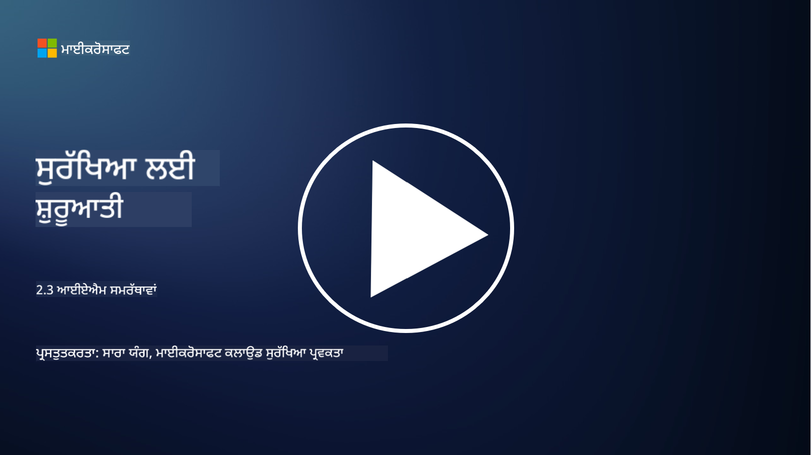

<!--
CO_OP_TRANSLATOR_METADATA:
{
  "original_hash": "bf0b8a54f2c69951744df5a94bc923f7",
  "translation_date": "2025-09-04T01:54:34+00:00",
  "source_file": "2.3 IAM capabilities.md",
  "language_code": "pa"
}
-->
# IAM ਸਮਰੱਥਾਵਾਂ

ਇਸ ਭਾਗ ਵਿੱਚ, ਅਸੀਂ ਪਛਾਣ ਸੁਰੱਖਿਆ ਵਿੱਚ ਵਰਤੇ ਜਾਣ ਵਾਲੇ ਮੁੱਖ ਟੂਲਾਂ ਅਤੇ ਸਮਰੱਥਾਵਾਂ ਬਾਰੇ ਹੋਰ ਵੇਰਵੇ ਕਵਰ ਕਰਾਂਗੇ।

## ਪਰਿਚਯ

ਇਸ ਪਾਠ ਵਿੱਚ, ਅਸੀਂ ਕਵਰ ਕਰਾਂਗੇ:

 - ਡਾਇਰੈਕਟਰੀ ਸੇਵਾ ਕੀ ਹੈ?
      
     
    
 - ਪਛਾਣਾਂ ਨੂੰ ਸੁਰੱਖਿਅਤ ਕਰਨ ਲਈ ਕਿਹੜੀਆਂ ਸਮਰੱਥਾਵਾਂ ਵਰਤੀ ਜਾ ਸਕਦੀਆਂ ਹਨ?
>
>        ਮਲਟੀ-ਫੈਕਟਰ ਪ੍ਰਮਾਣਿਕਤਾ (MFA)
> 
>        ਸਿੰਗਲ ਸਾਈਨ-ਆਨ (SSO)
> 
>        ਰੋਲ-ਅਧਾਰਿਤ ਪਹੁੰਚ ਨਿਯੰਤਰਣ (RBAC)
> 
>        ਅਡੈਪਟਿਵ ਪ੍ਰਮਾਣਿਕਤਾ
> 
>        ਬਾਇਓਮੈਟ੍ਰਿਕ ਪ੍ਰਮਾਣਿਕਤਾ
> 
>        ਪ੍ਰਿਵਿਲਿਜਡ ਪਹੁੰਚ ਪ੍ਰਬੰਧਨ (PAM)
> 
>        ਪਛਾਣ ਗਵਰਨੈਂਸ ਅਤੇ ਪ੍ਰਸ਼ਾਸਨ (IGA)
> 
>        ਵਿਹਾਰਕ ਵਿਸ਼ਲੇਸ਼ਣ

## ਡਾਇਰੈਕਟਰੀ ਸੇਵਾ ਕੀ ਹੈ?

ਡਾਇਰੈਕਟਰੀ ਸੇਵਾ ਇੱਕ ਵਿਸ਼ੇਸ਼ ਡਾਟਾਬੇਸ ਹੈ ਜੋ ਨੈਟਵਰਕ ਸਰੋਤਾਂ, ਜਿਵੇਂ ਕਿ ਉਪਭੋਗਤਾ, ਸਮੂਹ, ਡਿਵਾਈਸ, ਐਪਲੀਕੇਸ਼ਨ ਅਤੇ ਹੋਰ ਵਸਤੂਆਂ ਬਾਰੇ ਜਾਣਕਾਰੀ ਸਟੋਰ ਅਤੇ ਪ੍ਰਬੰਧਿਤ ਕਰਦਾ ਹੈ। ਇਹ ਪਛਾਣ ਅਤੇ ਪਹੁੰਚ-ਸੰਬੰਧੀ ਡਾਟਾ ਦਾ ਕੇਂਦਰੀ ਸੰਗ੍ਰਹਿ ਵਜੋਂ ਕੰਮ ਕਰਦਾ ਹੈ, ਜੋ ਸੰਗਠਨਾਂ ਨੂੰ ਉਪਭੋਗਤਾ ਪ੍ਰਮਾਣਿਕਤਾ, ਅਧਿਕਾਰ, ਅਤੇ ਹੋਰ ਸੁਰੱਖਿਆ-ਸੰਬੰਧੀ ਕੰਮਾਂ ਨੂੰ ਕੁਸ਼ਲਤਾਪੂਰਵਕ ਪ੍ਰਬੰਧਿਤ ਕਰਨ ਦੀ ਆਗਿਆ ਦਿੰਦਾ ਹੈ।

ਡਾਇਰੈਕਟਰੀ ਸੇਵਾਵਾਂ ਆਧੁਨਿਕ IT ਵਾਤਾਵਰਣਾਂ ਵਿੱਚ ਇੱਕ ਮਹੱਤਵਪੂਰਨ ਭੂਮਿਕਾ ਨਿਭਾਉਂਦੀਆਂ ਹਨ, ਪਛਾਣ ਅਤੇ ਪਹੁੰਚ ਪ੍ਰਬੰਧਨ (IAM) ਹੱਲਾਂ ਲਈ ਇੱਕ ਮਜ਼ਬੂਤ ਬੁਨਿਆਦ ਪ੍ਰਦਾਨ ਕਰਦੀਆਂ ਹਨ। ਇਹ ਸਰੋਤਾਂ ਤੱਕ ਸੁਰੱਖਿਅਤ ਪਹੁੰਚ ਨੂੰ ਸਹੂਲਤ ਦਿੰਦੇ ਹਨ, ਪਹੁੰਚ ਨੀਤੀਆਂ ਨੂੰ ਲਾਗੂ ਕਰਦੇ ਹਨ, ਅਤੇ ਪ੍ਰਸ਼ਾਸਨਿਕ ਕੰਮਾਂ ਨੂੰ ਸਧਾਰਨ ਬਣਾਉਂਦੇ ਹਨ। ਸਭ ਤੋਂ ਜਾਣੀ-ਪਛਾਣੀ ਡਾਇਰੈਕਟਰੀ ਸੇਵਾਵਾਂ ਵਿੱਚੋਂ ਇੱਕ ਮਾਈਕਰੋਸਾਫਟ ਐਕਟਿਵ ਡਾਇਰੈਕਟਰੀ ਹੈ, ਪਰ ਹੋਰ ਹੱਲ ਜਿਵੇਂ ਕਿ LDAP (ਲਾਈਟਵੇਟ ਡਾਇਰੈਕਟਰੀ ਐਕਸੈਸ ਪ੍ਰੋਟੋਕੋਲ) ਡਾਇਰੈਕਟਰੀਜ਼ ਵੀ ਸਮਾਨ ਉਦੇਸ਼ਾਂ ਦੀ ਪੂਰਤੀ ਕਰਦੇ ਹਨ।

ਸਾਇਬਰਸੁਰੱਖਿਆ ਦੇ ਸੰਦਰਭ ਵਿੱਚ ਡਾਇਰੈਕਟਰੀ ਸੇਵਾ ਦੇ ਮੁੱਖ ਕੰਮ ਅਤੇ ਵਿਸ਼ੇਸ਼ਤਾਵਾਂ ਵਿੱਚ ਸ਼ਾਮਲ ਹਨ:

 - **ਉਪਭੋਗਤਾ ਪ੍ਰਮਾਣਿਕਤਾ**: ਡਾਇਰੈਕਟਰੀ ਸੇਵਾਵਾਂ ਉਪਭੋਗਤਾ ਦੀਆਂ ਪਛਾਣਾਂ (ਜਿਵੇਂ ਕਿ ਯੂਜ਼ਰਨੇਮ ਅਤੇ ਪਾਸਵਰਡ) ਦੀ ਪੁਸ਼ਟੀ ਕਰਦੀਆਂ ਹਨ ਤਾਂ ਜੋ ਸਿਰਫ ਅਧਿਕਾਰਤ ਉਪਭੋਗਤਾ ਹੀ ਨੈਟਵਰਕ ਅਤੇ ਇਸਦੇ ਸਰੋਤਾਂ ਤੱਕ ਪਹੁੰਚ ਕਰ ਸਕਣ।
 - **ਉਪਭੋਗਤਾ ਅਧਿਕਾਰ**: ਇਹ ਨਿਰਧਾਰਤ ਕਰਦੀਆਂ ਹਨ ਕਿ ਹਰ ਉਪਭੋਗਤਾ ਨੂੰ ਉਸਦੇ ਰੋਲ, ਸਮੂਹ ਮੈਂਬਰਸ਼ਿਪ, ਅਤੇ ਹੋਰ ਗੁਣਾਂ ਦੇ ਆਧਾਰ 'ਤੇ ਕਿੰਨੀ ਪਹੁੰਚ ਪ੍ਰਾਪਤ ਹੈ। ਇਹ ਯਕੀਨੀ ਬਣਾਉਂਦਾ ਹੈ ਕਿ ਉਪਭੋਗਤਾ ਸਿਰਫ ਉਹ ਸਰੋਤਾਂ ਤੱਕ ਪਹੁੰਚ ਕਰ ਸਕਦੇ ਹਨ ਜਿਨ੍ਹਾਂ ਲਈ ਉਹ ਅਧਿਕਾਰਤ ਹਨ।
 - **ਸਮੂਹ ਪ੍ਰਬੰਧਨ**: ਡਾਇਰੈਕਟਰੀ ਸੇਵਾਵਾਂ ਪ੍ਰਸ਼ਾਸਕਾਂ ਨੂੰ ਉਪਭੋਗਤਾਵਾਂ ਨੂੰ ਤਰਕਸੰਗਤ ਸਮੂਹਾਂ ਵਿੱਚ ਸੰਗਠਿਤ ਕਰਨ ਦੀ ਆਗਿਆ ਦਿੰਦੀਆਂ ਹਨ, ਪਹੁੰਚ ਨਿਯੰਤਰਣ ਪ੍ਰਬੰਧਨ ਨੂੰ ਸਧਾਰਨ ਬਣਾਉਂਦੀਆਂ ਹਨ। ਅਨੁਮਤੀਆਂ ਨੂੰ ਵਿਅਕਤੀਗਤ ਉਪਭੋਗਤਾਵਾਂ ਦੀ ਬਜਾਏ ਸਮੂਹਾਂ ਨੂੰ ਸੌਂਪਿਆ ਜਾ ਸਕਦਾ ਹੈ।
 - **ਪਾਸਵਰਡ ਨੀਤੀਆਂ**: ਇਹ ਪਾਸਵਰਡ ਦੀ ਜਟਿਲਤਾ ਅਤੇ ਮਿਆਦ ਦੇ ਨਿਯਮ ਲਾਗੂ ਕਰਦੀਆਂ ਹਨ, ਉਪਭੋਗਤਾ ਖਾਤਿਆਂ ਦੀ ਸੁਰੱਖਿਆ ਨੂੰ ਵਧਾਉਂਦੀਆਂ ਹਨ।
 - **ਸਿੰਗਲ ਸਾਈਨ-ਆਨ (SSO)**: ਕੁਝ ਡਾਇਰੈਕਟਰੀ ਸੇਵਾਵਾਂ SSO ਦਾ ਸਮਰਥਨ ਕਰਦੀਆਂ ਹਨ, ਉਪਭੋਗਤਾਵਾਂ ਨੂੰ ਇੱਕ ਹੀ ਪਛਾਣ ਸੈੱਟ ਨਾਲ ਕਈ ਐਪਲੀਕੇਸ਼ਨ ਅਤੇ ਸੇਵਾਵਾਂ ਤੱਕ ਪਹੁੰਚ ਕਰਨ ਦੀ ਆਗਿਆ ਦਿੰਦੀਆਂ ਹਨ।
 - **ਕੇਂਦਰੀਕ੍ਰਿਤ ਉਪਭੋਗਤਾ ਪ੍ਰਬੰਧਨ**: ਡਾਇਰੈਕਟਰੀ ਸੇਵਾਵਾਂ ਉਪਭੋਗਤਾ ਜਾਣਕਾਰੀ ਨੂੰ ਕੇਂਦਰੀਕ੍ਰਿਤ ਕਰਦੀਆਂ ਹਨ, ਇੱਕ ਹੀ ਸਥਾਨ ਤੋਂ ਉਪਭੋਗਤਾ ਖਾਤਿਆਂ, ਪ੍ਰੋਫਾਈਲਾਂ, ਅਤੇ ਗੁਣਾਂ ਨੂੰ ਪ੍ਰਬੰਧਿਤ ਕਰਨਾ ਆਸਾਨ ਬਣਾਉਂਦੀਆਂ ਹਨ।
 - **ਆਡਿਟਿੰਗ ਅਤੇ ਲਾਗਿੰਗ**: ਇਹ ਉਪਭੋਗਤਾ ਪ੍ਰਮਾਣਿਕਤਾ ਅਤੇ ਪਹੁੰਚ ਗਤੀਵਿਧੀਆਂ ਨੂੰ ਰਿਕਾਰਡ ਕਰ ਸਕਦੀਆਂ ਹਨ, ਸੁਰੱਖਿਆ ਆਡਿਟ ਅਤੇ ਅਨੁਕੂਲਤਾ ਯਤਨਾਂ ਵਿੱਚ ਮਦਦ ਕਰਦੀਆਂ ਹਨ।

## ਪਛਾਣਾਂ ਨੂੰ ਸੁਰੱਖਿਅਤ ਕਰਨ ਲਈ ਕਿਹੜੀਆਂ ਸਮਰੱਥਾਵਾਂ ਵਰਤੀ ਜਾ ਸਕਦੀਆਂ ਹਨ?

**ਮਲਟੀ-ਫੈਕਟਰ ਪ੍ਰਮਾਣਿਕਤਾ (MFA)**

MFA ਉਪਭੋਗਤਾਵਾਂ ਤੋਂ ਪਹੁੰਚ ਦੇਣ ਤੋਂ ਪਹਿਲਾਂ ਕਈ ਤਰ੍ਹਾਂ ਦੀ ਪੁਸ਼ਟੀ ਦੀ ਮੰਗ ਕਰਦਾ ਹੈ। ਇਸ ਵਿੱਚ ਆਮ ਤੌਰ 'ਤੇ ਕੁਝ ਸ਼ਾਮਲ ਹੁੰਦਾ ਹੈ ਜੋ ਉਪਭੋਗਤਾ ਨੂੰ ਪਤਾ ਹੈ (ਪਾਸਵਰਡ), ਕੁਝ ਜੋ ਉਪਭੋਗਤਾ ਕੋਲ ਹੈ (ਸਮਾਰਟਫੋਨ ਜਾਂ ਸੁਰੱਖਿਆ ਟੋਕਨ), ਅਤੇ ਕੁਝ ਜੋ ਉਪਭੋਗਤਾ ਹੈ (ਬਾਇਓਮੈਟ੍ਰਿਕ ਡਾਟਾ ਜਿਵੇਂ ਕਿ ਫਿੰਗਰਪ੍ਰਿੰਟ ਜਾਂ ਚਿਹਰਾ ਪਛਾਣ).

**ਸਿੰਗਲ ਸਾਈਨ-ਆਨ (SSO)**

SSO ਉਪਭੋਗਤਾਵਾਂ ਨੂੰ ਇੱਕ ਹੀ ਪਛਾਣ ਸੈੱਟ ਨਾਲ ਕਈ ਐਪਲੀਕੇਸ਼ਨ ਅਤੇ ਸਿਸਟਮਾਂ ਤੱਕ ਪਹੁੰਚ ਕਰਨ ਦੀ ਆਗਿਆ ਦਿੰਦਾ ਹੈ। ਇਹ ਉਪਭੋਗਤਾ ਅਨੁਭਵ ਨੂੰ ਸੁਧਾਰਦਾ ਹੈ ਅਤੇ ਕਈ ਪਾਸਵਰਡਾਂ ਨੂੰ ਪ੍ਰਬੰਧਿਤ ਕਰਨ ਨਾਲ ਜੁੜੇ ਖਤਰੇ ਨੂੰ ਘਟਾਉਂਦਾ ਹੈ।

**ਰੋਲ-ਅਧਾਰਿਤ ਪਹੁੰਚ ਨਿਯੰਤਰਣ (RBAC)**

RBAC ਪਹੁੰਚ ਅਨੁਮਤੀਆਂ ਨੂੰ ਪਹਿਲਾਂ ਤੋਂ ਪਰਿਭਾਸ਼ਿਤ ਰੋਲਾਂ ਦੇ ਆਧਾਰ 'ਤੇ ਸੌਂਪਦਾ ਹੈ। ਉਪਭੋਗਤਾਵਾਂ ਨੂੰ ਸੰਗਠਨ ਵਿੱਚ ਉਨ੍ਹਾਂ ਦੇ ਰੋਲਾਂ ਦੇ ਆਧਾਰ 'ਤੇ ਪਹੁੰਚ ਦਿੱਤੀ ਜਾਂਦੀ ਹੈ।

**ਅਡੈਪਟਿਵ ਪ੍ਰਮਾਣਿਕਤਾ**

ਅਡੈਪਟਿਵ ਪ੍ਰਮਾਣਿਕਤਾ ਖਤਰੇ ਦੇ ਕਾਰਕਾਂ ਜਿਵੇਂ ਕਿ ਸਥਾਨ, ਡਿਵਾਈਸ, ਪਹੁੰਚ ਦਾ ਸਮਾਂ, ਅਤੇ ਉਪਭੋਗਤਾ ਵਿਹਾਰ ਦਾ ਮੁਲਾਂਕਣ ਕਰਦਾ ਹੈ ਤਾਂ ਜੋ ਪ੍ਰਮਾਣਿਕਤਾ ਦੀ ਲੋੜ ਨੂੰ ਗਤੀਸ਼ੀਲ ਤੌਰ 'ਤੇ ਸਮਰੂਪ ਕੀਤਾ ਜਾ ਸਕੇ। ਜੇਕਰ ਕੋਈ ਬੇਨਤੀ ਸ਼ੱਕੀ ਲੱਗਦੀ ਹੈ, ਤਾਂ ਵਾਧੂ ਪ੍ਰਮਾਣਿਕਤਾ ਕਦਮ ਸ਼ੁਰੂ ਕੀਤੇ ਜਾ ਸਕਦੇ ਹਨ।

**ਬਾਇਓਮੈਟ੍ਰਿਕ ਪ੍ਰਮਾਣਿਕਤਾ**

ਬਾਇਓਮੈਟ੍ਰਿਕ ਪ੍ਰਮਾਣਿਕਤਾ ਵਿਲੱਖਣ ਜੈਵਿਕ ਲੱਛਣਾਂ ਜਿਵੇਂ ਕਿ ਫਿੰਗਰਪ੍ਰਿੰਟ, ਚਿਹਰੇ ਦੀਆਂ ਵਿਸ਼ੇਸ਼ਤਾਵਾਂ, ਆਵਾਜ਼ ਦੇ ਪੈਟਰਨ, ਅਤੇ ਇੱਥੋਂ ਤੱਕ ਕਿ ਟਾਈਪਿੰਗ ਦੀ ਗਤੀ ਵਰਗੇ ਵਿਹਾਰਕ ਲੱਛਣਾਂ ਨੂੰ ਪਛਾਣ ਦੀ ਪੁਸ਼ਟੀ ਲਈ ਵਰਤਦਾ ਹੈ।

**ਪ੍ਰਿਵਿਲਿਜਡ ਪਹੁੰਚ ਪ੍ਰਬੰਧਨ (PAM)**

PAM ਮਹੱਤਵਪੂਰਨ ਸਿਸਟਮਾਂ ਅਤੇ ਡਾਟਾ ਤੱਕ ਪਹੁੰਚ ਨੂੰ ਸੁਰੱਖਿਅਤ ਕਰਨ 'ਤੇ ਧਿਆਨ ਕੇਂਦਰਿਤ ਕਰਦਾ ਹੈ, ਵਿਸ਼ੇਸ਼ ਖਾਤਿਆਂ 'ਤੇ ਸਖਤ ਨਿਯੰਤਰਣ ਲਾਗੂ ਕਰਦਾ ਹੈ। ਇਸ ਵਿੱਚ ਜਸਟ-ਇਨ-ਟਾਈਮ ਪਹੁੰਚ ਅਤੇ ਸੈਸ਼ਨ ਮਾਨੀਟਰਿੰਗ ਵਰਗੀਆਂ ਵਿਸ਼ੇਸ਼ਤਾਵਾਂ ਸ਼ਾਮਲ ਹਨ।

**ਪਛਾਣ ਗਵਰਨੈਂਸ ਅਤੇ ਪ੍ਰਸ਼ਾਸਨ (IGA)**

IGA ਹੱਲ ਉਪਭੋਗਤਾ ਪਛਾਣਾਂ ਅਤੇ ਉਨ੍ਹਾਂ ਦੀ ਪਹੁੰਚ ਨੂੰ ਸਰੋਤਾਂ ਤੱਕ ਉਨ੍ਹਾਂ ਦੇ ਜੀਵਨ ਚੱਕਰ ਦੌਰਾਨ ਪ੍ਰਬੰਧਿਤ ਕਰਦੇ ਹਨ। ਇਸ ਵਿੱਚ ਆਨਬੋਰਡਿੰਗ, ਪ੍ਰੋਵਿਜ਼ਨਿੰਗ, ਰੋਲ-ਅਧਾਰਿਤ ਪਹੁੰਚ ਨਿਯੰਤਰਣ, ਅਤੇ ਡੀ-ਪ੍ਰੋਵਿਜ਼ਨਿੰਗ ਸ਼ਾਮਲ ਹੈ।

**ਵਿਹਾਰਕ ਵਿਸ਼ਲੇਸ਼ਣ**

ਵਿਹਾਰਕ ਵਿਸ਼ਲੇਸ਼ਣ ਉਪਭੋਗਤਾ ਵਿਹਾਰ ਦੀ ਨਿਗਰਾਨੀ ਕਰਦਾ ਹੈ ਅਤੇ ਆਧਾਰ ਰੂਪ ਪੈਟਰਨ ਸਥਾਪਿਤ ਕਰਦਾ ਹੈ। ਨਿਯਮ ਤੋਂ ਹਟ ਕੇ ਗਤੀਵਿਧੀਆਂ ਹੋਰ ਜਾਂਚ ਲਈ ਚੇਤਾਵਨੀ ਜਾਰੀ ਕਰ ਸਕਦੀਆਂ ਹਨ।

# ਹੋਰ ਪੜ੍ਹਾਈ
- [Azure Active Directory fundamentals documentation - Microsoft Entra | Microsoft Learn](https://learn.microsoft.com/azure/active-directory/fundamentals/?WT.mc_id=academic-96948-sayoung)
- [What is Azure Active Directory? - Microsoft Entra | Microsoft Learn](https://learn.microsoft.com/azure/active-directory/fundamentals/whatis?WT.mc_id=academic-96948-sayoung)
- [Manage your multi-cloud identity infrastructure with Microsoft Entra - YouTube](https://www.youtube.com/watch?v=9qQiq3wTS2Y&list=PLXtHYVsvn_b_gtX1-NB62wNervQx1Fhp4&index=18)

---

**ਅਸਵੀਕਰਤੀ**:  
ਇਹ ਦਸਤਾਵੇਜ਼ AI ਅਨੁਵਾਦ ਸੇਵਾ [Co-op Translator](https://github.com/Azure/co-op-translator) ਦੀ ਵਰਤੋਂ ਕਰਕੇ ਅਨੁਵਾਦ ਕੀਤਾ ਗਿਆ ਹੈ। ਜਦੋਂ ਕਿ ਅਸੀਂ ਸਹੀ ਹੋਣ ਦਾ ਯਤਨ ਕਰਦੇ ਹਾਂ, ਕਿਰਪਾ ਕਰਕੇ ਧਿਆਨ ਦਿਓ ਕਿ ਸਵੈਚਾਲਿਤ ਅਨੁਵਾਦਾਂ ਵਿੱਚ ਗਲਤੀਆਂ ਜਾਂ ਅਸੁੱਤੀਆਂ ਹੋ ਸਕਦੀਆਂ ਹਨ। ਇਸ ਦੀ ਮੂਲ ਭਾਸ਼ਾ ਵਿੱਚ ਮੌਜੂਦ ਮੂਲ ਦਸਤਾਵੇਜ਼ ਨੂੰ ਪ੍ਰਮਾਣਿਕ ਸਰੋਤ ਮੰਨਿਆ ਜਾਣਾ ਚਾਹੀਦਾ ਹੈ। ਮਹੱਤਵਪੂਰਨ ਜਾਣਕਾਰੀ ਲਈ, ਪੇਸ਼ੇਵਰ ਮਨੁੱਖੀ ਅਨੁਵਾਦ ਦੀ ਸਿਫਾਰਸ਼ ਕੀਤੀ ਜਾਂਦੀ ਹੈ। ਇਸ ਅਨੁਵਾਦ ਦੀ ਵਰਤੋਂ ਤੋਂ ਪੈਦਾ ਹੋਣ ਵਾਲੇ ਕਿਸੇ ਵੀ ਗਲਤਫਹਿਮੀ ਜਾਂ ਗਲਤ ਵਿਆਖਿਆ ਲਈ ਅਸੀਂ ਜ਼ਿੰਮੇਵਾਰ ਨਹੀਂ ਹਾਂ।  