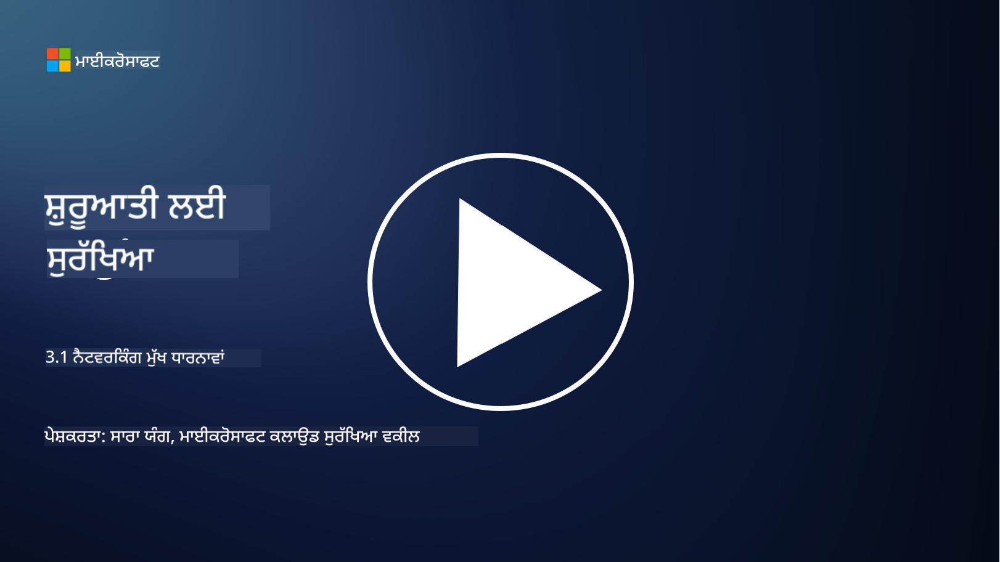
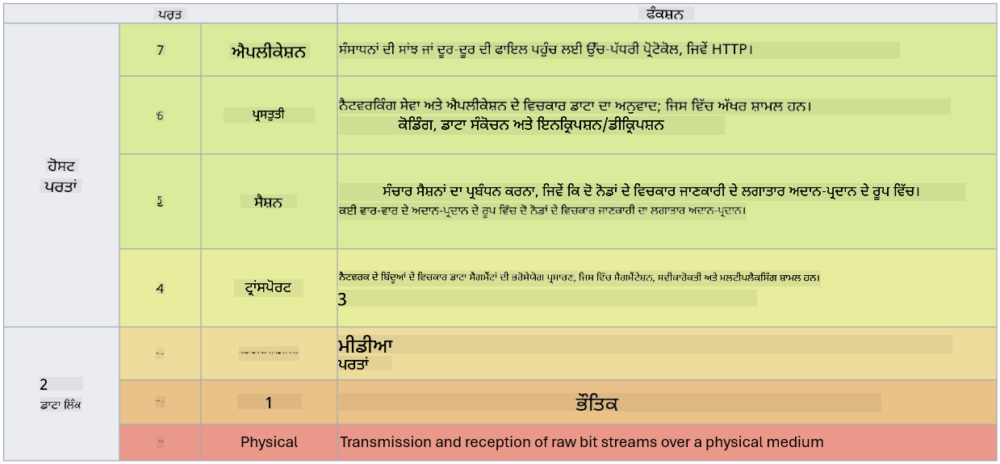

<!--
CO_OP_TRANSLATOR_METADATA:
{
  "original_hash": "252724eceeb183fb9018f88c5e1a3f0c",
  "translation_date": "2025-09-04T01:45:05+00:00",
  "source_file": "3.1 Networking key concepts.md",
  "language_code": "pa"
}
-->
# ਨੈਟਵਰਕਿੰਗ ਦੇ ਮੁੱਖ ਸਿਧਾਂਤ

ਜੇ ਤੁਸੀਂ ਕਦੇ ਵੀ ਆਈਟੀ ਵਿੱਚ ਕੰਮ ਕੀਤਾ ਹੈ, ਤਾਂ ਸੰਭਵ ਹੈ ਕਿ ਤੁਸੀਂ ਨੈਟਵਰਕਿੰਗ ਸਿਧਾਂਤਾਂ ਨਾਲ ਜਾਣੂ ਹੋਏ ਹੋਵੋਗੇ। ਹਾਲਾਂਕਿ ਅਧੁਨਿਕ ਵਾਤਾਵਰਣਾਂ ਵਿੱਚ ਅਸੀਂ ਆਪਣੀ ਮੁੱਖ ਸੁਰੱਖਿਆ ਲਈ ਪਹਿਚਾਣ (identity) ਨੂੰ ਵਰਤਦੇ ਹਾਂ, ਇਸਦਾ ਮਤਲਬ ਇਹ ਨਹੀਂ ਕਿ ਨੈਟਵਰਕ ਨਿਯੰਤਰਣ ਬੇਕਾਰ ਹਨ। ਇਹ ਇੱਕ ਵੱਡਾ ਵਿਸ਼ਾ ਹੈ, ਪਰ ਇਸ ਪਾਠ ਵਿੱਚ ਅਸੀਂ ਕੁਝ ਮੁੱਖ ਨੈਟਵਰਕਿੰਗ ਸਿਧਾਂਤਾਂ ਨੂੰ ਕਵਰ ਕਰਾਂਗੇ।

ਇਸ ਪਾਠ ਵਿੱਚ ਅਸੀਂ ਕਵਰ ਕਰਾਂਗੇ:

 - IP ਐਡਰੈਸਿੰਗ ਕੀ ਹੈ?
   
 - OSI ਮਾਡਲ ਕੀ ਹੈ?

 - TCP/UDP ਕੀ ਹੈ?

 - ਪੋਰਟ ਨੰਬਰ ਕੀ ਹਨ?

 - ਡਾਟਾ ਨੂੰ ਰੈਸਟ ਅਤੇ ਟ੍ਰਾਂਜ਼ਿਟ ਦੌਰਾਨ ਇਨਕ੍ਰਿਪਟ ਕਰਨਾ ਕੀ ਹੈ?

## IP ਐਡਰੈਸਿੰਗ ਕੀ ਹੈ?

IP ਐਡਰੈਸਿੰਗ, ਜਾਂ ਇੰਟਰਨੈਟ ਪ੍ਰੋਟੋਕੋਲ ਐਡਰੈਸਿੰਗ, ਇੱਕ ਅੰਕਾਤਮਕ ਲੇਬਲ ਹੈ ਜੋ ਹਰ ਉਸ ਡਿਵਾਈਸ ਨੂੰ ਦਿੱਤਾ ਜਾਂਦਾ ਹੈ ਜੋ ਇੰਟਰਨੈਟ ਪ੍ਰੋਟੋਕੋਲ ਦੀ ਵਰਤੋਂ ਕਰਦੇ ਹੋਏ ਕੰਪਿਊਟਰ ਨੈਟਵਰਕ ਨਾਲ ਜੁੜਿਆ ਹੁੰਦਾ ਹੈ। ਇਹ ਨੈਟਵਰਕ ਵਿੱਚ ਡਿਵਾਈਸਾਂ ਲਈ ਇੱਕ ਵਿਲੱਖਣ ਪਛਾਣਕਰਤਾ ਵਜੋਂ ਕੰਮ ਕਰਦਾ ਹੈ, ਜੋ ਉਨ੍ਹਾਂ ਨੂੰ ਇੰਟਰਨੈਟ ਜਾਂ ਹੋਰ ਜੁੜੇ ਹੋਏ ਨੈਟਵਰਕਾਂ ਵਿੱਚ ਡਾਟਾ ਭੇਜਣ ਅਤੇ ਪ੍ਰਾਪਤ ਕਰਨ ਦੀ ਆਗਿਆ ਦਿੰਦਾ ਹੈ। IP ਐਡਰੈਸਿੰਗ ਦੇ ਦੋ ਮੁੱਖ ਸੰਸਕਰਣ ਹਨ: IPv4 (ਇੰਟਰਨੈਟ ਪ੍ਰੋਟੋਕੋਲ ਵਰਜਨ 4) ਅਤੇ IPv6 (ਇੰਟਰਨੈਟ ਪ੍ਰੋਟੋਕੋਲ ਵਰਜਨ 6)। ਇੱਕ IP ਐਡਰੈਸ ਆਮ ਤੌਰ 'ਤੇ ਜਾਂ ਤਾਂ IPv4 ਫਾਰਮੈਟ (ਜਿਵੇਂ 192.168.1.1) ਜਾਂ IPv6 ਫਾਰਮੈਟ (ਜਿਵੇਂ 2001:0db8:85a3:0000:0000:8a2e:0370:7334) ਵਿੱਚ ਦਰਸਾਇਆ ਜਾਂਦਾ ਹੈ।

## OSI ਮਾਡਲ ਕੀ ਹੈ?

OSI (ਓਪਨ ਸਿਸਟਮ ਇੰਟਰਕਨੈਕਸ਼ਨ) ਮਾਡਲ ਇੱਕ ਸੰਕਲਪਤ ਢਾਂਚਾ ਹੈ ਜੋ ਸੰਚਾਰ ਪ੍ਰਣਾਲੀ ਦੇ ਕਾਰਜਾਂ ਨੂੰ ਸੱਤ ਵੱਖ-ਵੱਖ ਪਰਤਾਂ ਵਿੱਚ ਮਿਆਰੀਕ੍ਰਿਤ ਕਰਦਾ ਹੈ। ਹਰ ਪਰਤ ਖਾਸ ਕੰਮ ਕਰਦੀ ਹੈ ਅਤੇ ਨੈਟਵਰਕ ਵਿੱਚ ਡਿਵਾਈਸਾਂ ਦੇ ਵਿਚਕਾਰ ਕੁਸ਼ਲ ਅਤੇ ਭਰੋਸੇਯੋਗ ਡਾਟਾ ਸੰਚਾਰ ਨੂੰ ਯਕੀਨੀ ਬਣਾਉਣ ਲਈ ਲਗਭਗ ਪਰਤਾਂ ਨਾਲ ਸੰਚਾਰ ਕਰਦੀ ਹੈ। ਇਹ ਪਰਤਾਂ ਹੇਠਾਂ ਤੋਂ ਉੱਪਰ ਤੱਕ ਹਨ:

 1. ਫਿਜ਼ਿਕਲ ਪਰਤ
    
 2. ਡਾਟਾ ਲਿੰਕ ਪਰਤ

 3. ਨੈਟਵਰਕ ਪਰਤ

 4. ਟ੍ਰਾਂਸਪੋਰਟ ਪਰਤ

 5. ਸੈਸ਼ਨ ਪਰਤ

 6. ਪ੍ਰਜ਼ੈਂਟੇਸ਼ਨ ਪਰਤ

 7. ਐਪਲੀਕੇਸ਼ਨ ਪਰਤ

OSI ਮਾਡਲ ਇਹ ਸਮਝਣ ਲਈ ਇੱਕ ਸਾਂਝਾ ਹਵਾਲਾ ਪ੍ਰਦਾਨ ਕਰਦਾ ਹੈ ਕਿ ਨੈਟਵਰਕਿੰਗ ਪ੍ਰੋਟੋਕੋਲ ਅਤੇ ਤਕਨਾਲੋਜੀਆਂ ਕਿਵੇਂ ਪਰਸਪਰ ਕਿਰਿਆਸ਼ੀਲ ਹੁੰਦੀਆਂ ਹਨ, ਭਾਵੇਂ ਖਾਸ ਹਾਰਡਵੇਅਰ ਜਾਂ ਸਾਫਟਵੇਅਰ ਲਾਗੂ ਕਰਨ ਤੋਂ ਬਿਨਾਂ।

_ref: https://en.wikipedia.org/wiki/OSI_model_

## TCP/UDP ਕੀ ਹੈ?

TCP (ਟ੍ਰਾਂਸਮਿਸ਼ਨ ਕੰਟਰੋਲ ਪ੍ਰੋਟੋਕੋਲ) ਅਤੇ UDP (ਯੂਜ਼ਰ ਡੈਟਾਗ੍ਰਾਮ ਪ੍ਰੋਟੋਕੋਲ) ਦੋ ਮੁੱਖ ਟ੍ਰਾਂਸਪੋਰਟ ਪਰਤ ਪ੍ਰੋਟੋਕੋਲ ਹਨ ਜੋ ਕੰਪਿਊਟਰ ਨੈਟਵਰਕਾਂ ਵਿੱਚ ਡਿਵਾਈਸਾਂ ਦੇ ਵਿਚਕਾਰ ਸੰਚਾਰ ਨੂੰ ਆਸਾਨ ਬਣਾਉਣ ਲਈ ਵਰਤੇ ਜਾਂਦੇ ਹਨ। ਇਹ ਡਾਟਾ ਨੂੰ ਪੈਕਟਾਂ ਵਿੱਚ ਤੋੜਦੇ ਹਨ ਅਤੇ ਫਿਰ ਪ੍ਰਾਪਤ ਕਰਨ ਵਾਲੇ ਪਾਸੇ ਉਨ੍ਹਾਂ ਪੈਕਟਾਂ ਨੂੰ ਮੁੜ ਇਕੱਠਾ ਕਰਦੇ ਹਨ। ਹਾਲਾਂਕਿ, ਇਹ ਆਪਣੇ ਵਿਸ਼ੇਸ਼ਤਾਵਾਂ ਅਤੇ ਵਰਤੋਂ ਦੇ ਕੇਸਾਂ ਵਿੱਚ ਵੱਖਰੇ ਹਨ।

**TCP (ਟ੍ਰਾਂਸਮਿਸ਼ਨ ਕੰਟਰੋਲ ਪ੍ਰੋਟੋਕੋਲ)**:

TCP ਇੱਕ ਕਨੈਕਸ਼ਨ-ਓਰੀਐਂਟਡ ਪ੍ਰੋਟੋਕੋਲ ਹੈ ਜੋ ਡਿਵਾਈਸਾਂ ਦੇ ਵਿਚਕਾਰ ਭਰੋਸੇਯੋਗ ਅਤੇ ਕ੍ਰਮਬੱਧ ਡਾਟਾ ਡਿਲਿਵਰੀ ਪ੍ਰਦਾਨ ਕਰਦਾ ਹੈ। ਇਹ ਡਾਟਾ ਅਦਾਨ-ਪ੍ਰਦਾਨ ਸ਼ੁਰੂ ਹੋਣ ਤੋਂ ਪਹਿਲਾਂ ਭੇਜਣ ਵਾਲੇ ਅਤੇ ਪ੍ਰਾਪਤ ਕਰਨ ਵਾਲੇ ਦੇ ਵਿਚਕਾਰ ਇੱਕ ਕਨੈਕਸ਼ਨ ਸਥਾਪਿਤ ਕਰਦਾ ਹੈ। TCP ਯਕੀਨੀ ਬਣਾਉਂਦਾ ਹੈ ਕਿ ਡਾਟਾ ਪੈਕਟ ਸਹੀ ਕ੍ਰਮ ਵਿੱਚ ਪਹੁੰਚਦੇ ਹਨ ਅਤੇ ਗੁੰਮ ਹੋਏ ਪੈਕਟਾਂ ਦੀ ਮੁੜ ਭੇਜਣ ਦੀ ਸੰਭਾਲ ਕਰ ਸਕਦਾ ਹੈ ਤਾਂ ਜੋ ਡਾਟਾ ਦੀ ਅਖੰਡਤਾ ਅਤੇ ਪੂਰਨਤਾ ਦੀ ਗਾਰੰਟੀ ਦਿੱਤੀ ਜਾ ਸਕੇ। ਇਹ TCP ਨੂੰ ਉਹਨਾਂ ਐਪਲੀਕੇਸ਼ਨਾਂ ਲਈ ਉਚਿਤ ਬਣਾਉਂਦਾ ਹੈ ਜਿਨ੍ਹਾਂ ਨੂੰ ਭਰੋਸੇਯੋਗ ਡਾਟਾ ਡਿਲਿਵਰੀ ਦੀ ਲੋੜ ਹੁੰਦੀ ਹੈ, ਜਿਵੇਂ ਕਿ ਵੈੱਬ ਬ੍ਰਾਊਜ਼ਿੰਗ, ਈਮੇਲ, ਫਾਈਲ ਟ੍ਰਾਂਸਫਰ (FTP), ਅਤੇ ਡਾਟਾਬੇਸ ਸੰਚਾਰ।

**UDP (ਯੂਜ਼ਰ ਡੈਟਾਗ੍ਰਾਮ ਪ੍ਰੋਟੋਕੋਲ)**:

UDP ਇੱਕ ਕਨੈਕਸ਼ਨਲੈੱਸ ਪ੍ਰੋਟੋਕੋਲ ਹੈ ਜੋ ਤੇਜ਼ ਡਾਟਾ ਸੰਚਾਰ ਦੀ ਪੇਸ਼ਕਸ਼ ਕਰਦਾ ਹੈ ਪਰ TCP ਦੇ ਜਿਵੇਂ ਭਰੋਸੇਯੋਗਤਾ ਪ੍ਰਦਾਨ ਨਹੀਂ ਕਰਦਾ। ਇਹ ਡਾਟਾ ਭੇਜਣ ਤੋਂ ਪਹਿਲਾਂ ਕੋਈ ਰਸਮੀ ਕਨੈਕਸ਼ਨ ਸਥਾਪਿਤ ਨਹੀਂ ਕਰਦਾ ਅਤੇ ਗੁੰਮ ਹੋਏ ਪੈਕਟਾਂ ਦੀ ਪਛਾਣ ਜਾਂ ਮੁੜ ਭੇਜਣ ਲਈ ਕੋਈ ਮਕੈਨਿਜ਼ਮ ਸ਼ਾਮਲ ਨਹੀਂ ਕਰਦਾ। UDP ਉਹਨਾਂ ਐਪਲੀਕੇਸ਼ਨਾਂ ਲਈ ਉਚਿਤ ਹੈ ਜਿੱਥੇ ਗਤੀਸ਼ੀਲਤਾ ਅਤੇ ਕੁਸ਼ਲਤਾ ਭਰੋਸੇਯੋਗ ਡਿਲਿਵਰੀ ਤੋਂ ਵੱਧ ਮਹੱਤਵਪੂਰਨ ਹਨ, ਜਿਵੇਂ ਕਿ ਰੀਅਲ-ਟਾਈਮ ਸੰਚਾਰ, ਸਟ੍ਰੀਮਿੰਗ ਮੀਡੀਆ, ਆਨਲਾਈਨ ਗੇਮਿੰਗ, ਅਤੇ DNS ਕਵੈਰੀਜ਼।

ਸਾਰ ਵਿੱਚ, TCP ਭਰੋਸੇਯੋਗਤਾ ਅਤੇ ਕ੍ਰਮਬੱਧ ਡਿਲਿਵਰੀ ਨੂੰ ਤਰਜੀਹ ਦਿੰਦਾ ਹੈ, ਜਿਸ ਨਾਲ ਇਹ ਉਹਨਾਂ ਐਪਲੀਕੇਸ਼ਨਾਂ ਲਈ ਉਚਿਤ ਬਣਦਾ ਹੈ ਜਿਨ੍ਹਾਂ ਨੂੰ ਡਾਟਾ ਦੀ ਸ਼ੁੱਧਤਾ ਦੀ ਲੋੜ ਹੁੰਦੀ ਹੈ, ਜਦਕਿ UDP ਗਤੀਸ਼ੀਲਤਾ ਅਤੇ ਕੁਸ਼ਲਤਾ ਨੂੰ ਤਰਜੀਹ ਦਿੰਦਾ ਹੈ, ਜਿਸ ਨਾਲ ਇਹ ਉਹਨਾਂ ਐਪਲੀਕੇਸ਼ਨਾਂ ਲਈ ਉਚਿਤ ਬਣਦਾ ਹੈ ਜਿੱਥੇ ਘੱਟ ਲੈਟੈਂਸੀ ਦੇ ਬਦਲੇ ਵਿੱਚ ਥੋੜ੍ਹਾ ਬਹੁਤ ਡਾਟਾ ਗੁਆਉਣਾ ਸਵੀਕਾਰਯੋਗ ਹੁੰਦਾ ਹੈ। TCP ਅਤੇ UDP ਵਿੱਚੋਂ ਚੋਣ ਐਪਲੀਕੇਸ਼ਨ ਜਾਂ ਸੇਵਾ ਦੀ ਖਾਸ ਲੋੜਾਂ 'ਤੇ ਨਿਰਭਰ ਕਰਦੀ ਹੈ।

## ਪੋਰਟ ਨੰਬਰ ਕੀ ਹਨ?

ਨੈਟਵਰਕਿੰਗ ਵਿੱਚ, ਇੱਕ ਪੋਰਟ ਨੰਬਰ ਇੱਕ ਅੰਕਾਤਮਕ ਪਛਾਣਕਰਤਾ ਹੁੰਦਾ ਹੈ ਜੋ ਇੱਕ ਨੈਟਵਰਕ ਵਿੱਚ ਇੱਕ ਹੀ ਡਿਵਾਈਸ 'ਤੇ ਚੱਲ ਰਹੀਆਂ ਵੱਖ-ਵੱਖ ਸੇਵਾਵਾਂ ਜਾਂ ਐਪਲੀਕੇਸ਼ਨਾਂ ਵਿੱਚ ਫਰਕ ਕਰਨ ਲਈ ਵਰਤਿਆ ਜਾਂਦਾ ਹੈ। ਪੋਰਟ ਆਉਣ ਵਾਲੇ ਡਾਟਾ ਨੂੰ ਸਹੀ ਐਪਲੀਕੇਸ਼ਨ ਵੱਲ ਰੂਟ ਕਰਨ ਵਿੱਚ ਮਦਦ ਕਰਦੇ ਹਨ। ਪੋਰਟ ਨੰਬਰ 16-ਬਿਟ ਅਨਸਾਈਨਡ ਇੰਟੀਜਰ ਹੁੰਦੇ ਹਨ, ਜਿਸਦਾ ਮਤਲਬ ਹੈ ਕਿ ਇਹ 0 ਤੋਂ 65535 ਤੱਕ ਹੁੰਦੇ ਹਨ। ਇਹ ਤਿੰਨ ਸ਼੍ਰੇਣੀਆਂ ਵਿੱਚ ਵੰਡੇ ਗਏ ਹਨ:

- ਵੈਲ-ਨੋਨ ਪੋਰਟ (0-1023): ਮਿਆਰੀ ਸੇਵਾਵਾਂ ਲਈ ਰਿਜ਼ਰਵ ਕੀਤੇ ਗਏ ਹਨ, ਜਿਵੇਂ HTTP (ਪੋਰਟ 80) ਅਤੇ FTP (ਪੋਰਟ 21)।

- ਰਜਿਸਟਰਡ ਪੋਰਟ (1024-49151): ਉਹ ਐਪਲੀਕੇਸ਼ਨਾਂ ਅਤੇ ਸੇਵਾਵਾਂ ਲਈ ਵਰਤੇ ਜਾਂਦੇ ਹਨ ਜੋ ਵੈਲ-ਨੋਨ ਸ਼੍ਰੇਣੀ ਦਾ ਹਿੱਸਾ ਨਹੀਂ ਹਨ ਪਰ ਅਧਿਕਾਰਤ ਤੌਰ 'ਤੇ ਰਜਿਸਟਰ ਕੀਤੇ ਗਏ ਹਨ।

- ਡਾਇਨਾਮਿਕ/ਪ੍ਰਾਈਵੇਟ ਪੋਰਟ (49152-65535): ਐਪਲੀਕੇਸ਼ਨਾਂ ਦੁਆਰਾ ਅਸਥਾਈ ਜਾਂ ਨਿੱਜੀ ਵਰਤੋਂ ਲਈ ਉਪਲਬਧ ਹਨ।

## ਰੈਸਟ ਅਤੇ ਟ੍ਰਾਂਜ਼ਿਟ ਦੌਰਾਨ ਇਨਕ੍ਰਿਪਸ਼ਨ ਕੀ ਹੈ?

ਇਨਕ੍ਰਿਪਸ਼ਨ ਡਾਟਾ ਨੂੰ ਇੱਕ ਸੁਰੱਖਿਅਤ ਫਾਰਮੈਟ ਵਿੱਚ ਬਦਲਣ ਦੀ ਪ੍ਰਕਿਰਿਆ ਹੈ ਤਾਂ ਜੋ ਇਸਨੂੰ ਅਣਅਧਿਕਾਰਤ ਪਹੁੰਚ ਜਾਂ ਤਬਦੀਲੀ ਤੋਂ ਬਚਾਇਆ ਜਾ ਸਕੇ। ਇਨਕ੍ਰਿਪਸ਼ਨ ਨੂੰ "ਰੈਸਟ" (ਜਦੋਂ ਡਿਵਾਈਸ ਜਾਂ ਸਰਵਰ 'ਤੇ ਸਟੋਰ ਕੀਤਾ ਜਾਂਦਾ ਹੈ) ਅਤੇ "ਟ੍ਰਾਂਜ਼ਿਟ" (ਜਦੋਂ ਡਿਵਾਈਸਾਂ ਦੇ ਵਿਚਕਾਰ ਜਾਂ ਨੈਟਵਰਕਾਂ 'ਤੇ ਪ੍ਰਸਾਰਿਤ ਕੀਤਾ ਜਾਂਦਾ ਹੈ) ਦੋਹਾਂ 'ਤੇ ਲਾਗੂ ਕੀਤਾ ਜਾ ਸਕਦਾ ਹੈ।

**ਰੈਸਟ ਦੌਰਾਨ ਇਨਕ੍ਰਿਪਸ਼ਨ**: ਇਹ ਡਾਟਾ ਨੂੰ ਇਨਕ੍ਰਿਪਟ ਕਰਨ ਵਿੱਚ ਸ਼ਾਮਲ ਹੁੰਦਾ ਹੈ ਜੋ ਡਿਵਾਈਸਾਂ, ਸਰਵਰਾਂ ਜਾਂ ਸਟੋਰੇਜ ਪ੍ਰਣਾਲੀਆਂ 'ਤੇ ਸਟੋਰ ਕੀਤਾ ਜਾਂਦਾ ਹੈ। ਭਾਵੇਂ ਹਮਲਾਵਰ ਸਟੋਰੇਜ ਮੀਡੀਆ ਤੱਕ ਭੌਤਿਕ ਪਹੁੰਚ ਪ੍ਰਾਪਤ ਕਰ ਲੈਂਦਾ ਹੈ, ਉਹ ਇਨਕ੍ਰਿਪਸ਼ਨ ਕੁੰਜੀਆਂ ਤੋਂ ਬਿਨਾਂ ਡਾਟਾ ਤੱਕ ਪਹੁੰਚ ਨਹੀਂ ਕਰ ਸਕਦਾ। ਇਹ ਸੰਵੇਦਨਸ਼ੀਲ ਡਾਟਾ ਦੀ ਸੁਰੱਖਿਆ ਲਈ ਮਹੱਤਵਪੂਰਨ ਹੈ ਜੇਕਰ ਡਿਵਾਈਸ ਚੋਰੀ ਹੋ ਜਾਵੇ, ਡਾਟਾ ਲੀਕ ਹੋ ਜਾਵੇ ਜਾਂ ਅਣਅਧਿਕਾਰਤ ਪਹੁੰਚ ਹੋਵੇ।

**ਟ੍ਰਾਂਜ਼ਿਟ ਦੌਰਾਨ ਇਨਕ੍ਰਿਪਸ਼ਨ**: ਇਹ ਡਾਟਾ ਨੂੰ ਇਨਕ੍ਰਿਪਟ ਕਰਨ ਵਿੱਚ ਸ਼ਾਮਲ ਹੁੰਦਾ ਹੈ ਜਦੋਂ ਇਹ ਡਿਵਾਈਸਾਂ ਦੇ ਵਿਚਕਾਰ ਜਾਂ ਨੈਟਵਰਕਾਂ 'ਤੇ ਯਾਤਰਾ ਕਰਦਾ ਹੈ। ਇਹ ਡਾਟਾ ਦੇ ਦੌਰਾਨ ਸਨੂਪਿੰਗ ਅਤੇ ਅਣਅਧਿਕਾਰਤ ਰੁਕਾਵਟ ਨੂੰ ਰੋਕਦਾ ਹੈ। ਟ੍ਰਾਂਜ਼ਿਟ ਦੌਰਾਨ ਇਨਕ੍ਰਿਪਸ਼ਨ ਲਈ ਆਮ ਪ੍ਰੋਟੋਕੋਲ ਵਿੱਚ HTTPS ਵੈੱਬ ਸੰਚਾਰ ਲਈ ਅਤੇ TLS/SSL ਵੱਖ-ਵੱਖ ਕਿਸਮਾਂ ਦੇ ਨੈਟਵਰਕ ਟ੍ਰੈਫਿਕ ਨੂੰ ਸੁਰੱਖਿਅਤ ਕਰਨ ਲਈ ਸ਼ਾਮਲ ਹਨ।

## ਹੋਰ ਪੜ੍ਹਾਈ
- [How Do IP Addresses Work? (howtogeek.com)](https://www.howtogeek.com/341307/how-do-ip-addresses-work/)
- [Understanding IP Address: An Introductory Guide (geekflare.com)](https://geekflare.com/understanding-ip-address/)
- [What is the OSI model? The 7 layers of OSI explained (techtarget.com)](https://www.techtarget.com/searchnetworking/definition/OSI)
- [The OSI Model – The 7 Layers of Networking Explained in Plain English (freecodecamp.org)](https://www.freecodecamp.org/news/osi-model-networking-layers-explained-in-plain-english/)
- [TCP/IP protocols - IBM Documentation](https://www.ibm.com/docs/en/aix/7.3?topic=protocol-tcpip-protocols)
- [Common Ports Cheat Sheet: The Ultimate Ports & Protocols List (stationx.net)](https://www.stationx.net/common-ports-cheat-sheet/)
- [Azure Data Encryption-at-Rest - Azure Security | Microsoft Learn](https://learn.microsoft.com/azure/security/fundamentals/encryption-atrest?WT.mc_id=academic-96948-sayoung)

---

**ਅਸਵੀਕਰਤੀ**:  
ਇਹ ਦਸਤਾਵੇਜ਼ AI ਅਨੁਵਾਦ ਸੇਵਾ [Co-op Translator](https://github.com/Azure/co-op-translator) ਦੀ ਵਰਤੋਂ ਕਰਕੇ ਅਨੁਵਾਦ ਕੀਤਾ ਗਿਆ ਹੈ। ਜਦੋਂ ਕਿ ਅਸੀਂ ਸਹੀ ਹੋਣ ਦਾ ਯਤਨ ਕਰਦੇ ਹਾਂ, ਕਿਰਪਾ ਕਰਕੇ ਧਿਆਨ ਦਿਓ ਕਿ ਸਵੈਚਾਲਿਤ ਅਨੁਵਾਦਾਂ ਵਿੱਚ ਗਲਤੀਆਂ ਜਾਂ ਅਸੁੱਤੀਆਂ ਹੋ ਸਕਦੀਆਂ ਹਨ। ਇਸ ਦੀ ਮੂਲ ਭਾਸ਼ਾ ਵਿੱਚ ਮੌਜੂਦ ਮੂਲ ਦਸਤਾਵੇਜ਼ ਨੂੰ ਪ੍ਰਮਾਣਿਕ ਸਰੋਤ ਮੰਨਿਆ ਜਾਣਾ ਚਾਹੀਦਾ ਹੈ। ਮਹੱਤਵਪੂਰਨ ਜਾਣਕਾਰੀ ਲਈ, ਪੇਸ਼ੇਵਰ ਮਨੁੱਖੀ ਅਨੁਵਾਦ ਦੀ ਸਿਫਾਰਸ਼ ਕੀਤੀ ਜਾਂਦੀ ਹੈ। ਇਸ ਅਨੁਵਾਦ ਦੀ ਵਰਤੋਂ ਤੋਂ ਪੈਦਾ ਹੋਣ ਵਾਲੀਆਂ ਕਿਸੇ ਵੀ ਗਲਤਫਹਮੀਆਂ ਜਾਂ ਗਲਤ ਵਿਆਖਿਆਵਾਂ ਲਈ ਅਸੀਂ ਜ਼ਿੰਮੇਵਾਰ ਨਹੀਂ ਹਾਂ।  