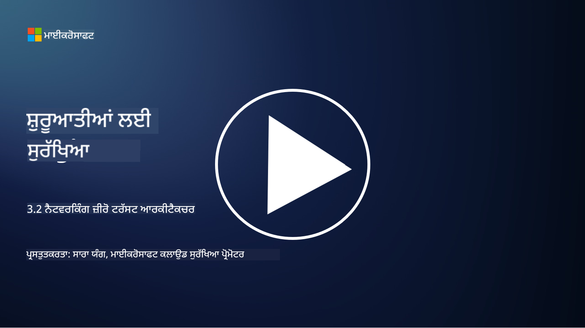

<!--
CO_OP_TRANSLATOR_METADATA:
{
  "original_hash": "680d6e14d9d33fc471c22f44679713f8",
  "translation_date": "2025-09-04T00:37:04+00:00",
  "source_file": "3.2 Networking zero trust architecture.md",
  "language_code": "pa"
}
-->
# ਨੈਟਵਰਕਿੰਗ ਜ਼ੀਰੋ ਟਰੱਸਟ ਆਰਕੀਟੈਕਚਰਜ਼

ਨੈਟਵਰਕ ਜ਼ੀਰੋ ਟਰੱਸਟ ਨਿਯੰਤਰਣਾਂ ਵਿੱਚ ਇੱਕ ਮਹੱਤਵਪੂਰਨ ਪਰਤ ਪ੍ਰਦਾਨ ਕਰਦਾ ਹੈ। ਇਸ ਪਾਠ ਵਿੱਚ ਅਸੀਂ ਇਸ ਬਾਰੇ ਹੋਰ ਜਾਣਾਂਗੇ:

 - ਨੈਟਵਰਕ ਸੈਗਮੈਂਟੇਸ਼ਨ ਕੀ ਹੈ?  
 - ਨੈਟਵਰਕ ਸੈਗਮੈਂਟੇਸ਼ਨ ਜ਼ੀਰੋ ਟਰੱਸਟ ਨੂੰ ਕਿਵੇਂ ਲਾਗੂ ਕਰਨ ਵਿੱਚ ਮਦਦ ਕਰਦਾ ਹੈ?  
 - ਐਂਡ-ਟੂ-ਐਂਡ ਇਨਕ੍ਰਿਪਸ਼ਨ ਕੀ ਹੈ?  

## ਨੈਟਵਰਕ ਸੈਗਮੈਂਟੇਸ਼ਨ ਕੀ ਹੈ?

ਨੈਟਵਰਕ ਸੈਗਮੈਂਟੇਸ਼ਨ ਨੈਟਵਰਕ ਨੂੰ ਛੋਟੇ, ਅਲੱਗ-ਅਲੱਗ ਹਿੱਸਿਆਂ ਜਾਂ ਸਬਨੈਟਵਰਕਾਂ ਵਿੱਚ ਵੰਡਣ ਦੀ ਪ੍ਰਕਿਰਿਆ ਹੈ। ਹਰ ਹਿੱਸਾ ਦੂਸਰੇ ਤੋਂ ਅਲੱਗ ਹੁੰਦਾ ਹੈ, ਅਤੇ ਹਿੱਸਿਆਂ ਦੇ ਵਿਚਕਾਰ ਪਹੁੰਚ ਨੂੰ ਖਾਸ ਸੁਰੱਖਿਆ ਨੀਤੀਆਂ ਦੇ ਆਧਾਰ 'ਤੇ ਨਿਯੰਤਰਿਤ ਅਤੇ ਸੀਮਿਤ ਕੀਤਾ ਜਾਂਦਾ ਹੈ। ਨੈਟਵਰਕ ਸੈਗਮੈਂਟੇਸ਼ਨ ਸੁਰੱਖਿਆ ਵਿੱਚ ਸੁਧਾਰ ਕਰਨ ਲਈ ਵਰਤੀ ਜਾਂਦੀ ਹੈ, ਤਾਂ ਜੋ ਸੰਭਾਵਿਤ ਹਮਲਿਆਂ ਦੇ ਪ੍ਰਭਾਵ ਨੂੰ ਰੋਕਿਆ ਜਾ ਸਕੇ ਅਤੇ ਹਮਲਾਵਰਾਂ ਦੀ ਲੈਟਰਲ ਮੂਵਮੈਂਟ ਨੂੰ ਸੀਮਿਤ ਕੀਤਾ ਜਾ ਸਕੇ।

ਨੈਟਵਰਕ ਸੈਗਮੈਂਟੇਸ਼ਨ ਲਾਗੂ ਕਰਕੇ, ਇੱਕ ਸੰਗਠਨ "ਜ਼ੋਨ" ਬਣਾਉਂਦਾ ਹੈ ਜੋ ਵੱਖ-ਵੱਖ ਕਿਸਮ ਦੇ ਯੂਜ਼ਰਾਂ, ਐਪਲੀਕੇਸ਼ਨਾਂ ਅਤੇ ਡਾਟਾ ਨੂੰ ਵੱਖ ਕਰਦਾ ਹੈ। ਇਸ ਨਾਲ ਹਮਲੇ ਦੀ ਸੰਭਾਵਨਾ ਘਟਦੀ ਹੈ ਅਤੇ ਸੁਰੱਖਿਆ ਘਟਨਾ ਦੇ ਕਾਰਨ ਹੋਣ ਵਾਲੇ ਨੁਕਸਾਨ ਨੂੰ ਘਟਾਇਆ ਜਾ ਸਕਦਾ ਹੈ। ਨੈਟਵਰਕ ਸੈਗਮੈਂਟੇਸ਼ਨ ਨੂੰ ਵਰਚੁਅਲ ਲੈਨ (VLANs), ਫਾਇਰਵਾਲ ਅਤੇ ਐਕਸੈਸ ਕੰਟਰੋਲ ਵਰਗੀਆਂ ਤਕਨੀਕਾਂ ਰਾਹੀਂ ਹਾਸਲ ਕੀਤਾ ਜਾ ਸਕਦਾ ਹੈ।

## ਨੈਟਵਰਕ ਸੈਗਮੈਂਟੇਸ਼ਨ ਜ਼ੀਰੋ ਟਰੱਸਟ ਨੂੰ ਕਿਵੇਂ ਲਾਗੂ ਕਰਨ ਵਿੱਚ ਮਦਦ ਕਰਦਾ ਹੈ?

ਨੈਟਵਰਕ ਸੈਗਮੈਂਟੇਸ਼ਨ ਜ਼ੀਰੋ ਟਰੱਸਟ ਮਾਡਲ ਦੇ ਸਿਧਾਂਤਾਂ ਨਾਲ ਨਜ਼ਦੀਕੀ ਨਾਲ ਜੁੜਿਆ ਹੋਇਆ ਹੈ। ਜ਼ੀਰੋ ਟਰੱਸਟ ਆਰਕੀਟੈਕਚਰ ਵਿੱਚ, ਨੈਟਵਰਕ ਸੈਗਮੈਂਟੇਸ਼ਨ "ਘੱਟ ਤੋਂ ਘੱਟ ਅਧਿਕਾਰ" ਦੇ ਸਿਧਾਂਤ ਨੂੰ ਲਾਗੂ ਕਰਨ ਵਿੱਚ ਮਦਦ ਕਰਦਾ ਹੈ, ਇਹ ਯਕੀਨੀ ਬਣਾਉਂਦਾ ਹੈ ਕਿ ਯੂਜ਼ਰਾਂ ਅਤੇ ਡਿਵਾਈਸਾਂ ਨੂੰ ਸਿਰਫ਼ ਉਹੀ ਸੰਸਾਧਨ ਅਤੇ ਸੇਵਾਵਾਂ ਪ੍ਰਾਪਤ ਹਨ ਜਿਨ੍ਹਾਂ ਦੀ ਉਨ੍ਹਾਂ ਨੂੰ ਆਪਣਾ ਕੰਮ ਕਰਨ ਲਈ ਲੋੜ ਹੈ। ਨੈਟਵਰਕ ਨੂੰ ਛੋਟੇ ਜ਼ੋਨ ਵਿੱਚ ਵੰਡ ਕੇ, ਸੰਗਠਨ ਸਖਤ ਪਹੁੰਚ ਨਿਯੰਤਰਣ ਲਾਗੂ ਕਰ ਸਕਦੇ ਹਨ, ਮਹੱਤਵਪੂਰਨ ਸੰਸਾਧਨਾਂ ਨੂੰ ਅਲੱਗ ਕਰ ਸਕਦੇ ਹਨ ਅਤੇ ਹਮਲਾਵਰਾਂ ਦੀ ਲੈਟਰਲ ਮੂਵਮੈਂਟ ਨੂੰ ਰੋਕ ਸਕਦੇ ਹਨ।

ਨੈਟਵਰਕ ਸੈਗਮੈਂਟੇਸ਼ਨ ਪਛਾਣ-ਆਧਾਰਿਤ ਪਹੁੰਚ ਨਿਯੰਤਰਣ ਲਾਗੂ ਕਰਨ ਵਿੱਚ ਵੀ ਮਦਦ ਕਰਦਾ ਹੈ, ਜਿੱਥੇ ਯੂਜ਼ਰਾਂ ਅਤੇ ਡਿਵਾਈਸਾਂ ਨੂੰ ਖਾਸ ਹਿੱਸਿਆਂ ਤੱਕ ਪਹੁੰਚ ਕਰਨ ਤੋਂ ਪਹਿਲਾਂ ਪੂਰੀ ਤਰ੍ਹਾਂ ਪ੍ਰਮਾਣਿਤ ਅਤੇ ਅਧਿਕ੍ਰਿਤ ਕੀਤਾ ਜਾਂਦਾ ਹੈ। ਇਸ ਨਾਲ ਸੰਵੇਦਨਸ਼ੀਲ ਸੰਸਾਧਨਾਂ ਤੱਕ ਬਿਨਾਂ ਅਨੁਮਤੀ ਪਹੁੰਚ ਰੋਕੀ ਜਾਂਦੀ ਹੈ ਅਤੇ ਕ੍ਰੈਡੈਂਸ਼ਲਜ਼ ਦੇ ਕਮਪ੍ਰੋਮਾਈਜ਼ ਹੋਣ ਦੇ ਪ੍ਰਭਾਵ ਨੂੰ ਘਟਾਇਆ ਜਾਂਦਾ ਹੈ।

## ਐਂਡ-ਟੂ-ਐਂਡ ਇਨਕ੍ਰਿਪਸ਼ਨ ਕੀ ਹੈ?

ਐਂਡ-ਟੂ-ਐਂਡ (E2E) ਇਨਕ੍ਰਿਪਸ਼ਨ ਇੱਕ ਸੁਰੱਖਿਆ ਉਪਾਅ ਹੈ ਜੋ ਇਹ ਯਕੀਨੀ ਬਣਾਉਂਦਾ ਹੈ ਕਿ ਡਾਟਾ ਆਪਣੀ ਪੂਰੀ ਯਾਤਰਾ ਦੌਰਾਨ ਭੇਜਣ ਵਾਲੇ ਤੋਂ ਪ੍ਰਾਪਤ ਕਰਨ ਵਾਲੇ ਤੱਕ ਇਨਕ੍ਰਿਪਟ ਰਹਿੰਦਾ ਹੈ। ਇਸ ਪ੍ਰਕਿਰਿਆ ਵਿੱਚ, ਡਾਟਾ ਭੇਜਣ ਵਾਲੇ ਦੇ ਪਾਸੇ ਇਨਕ੍ਰਿਪਟ ਕੀਤਾ ਜਾਂਦਾ ਹੈ, ਅਤੇ ਸਿਰਫ਼ ਪ੍ਰਾਪਤ ਕਰਨ ਵਾਲੇ ਕੋਲ ਡਿਕ੍ਰਿਪਸ਼ਨ ਕੁੰਜੀ ਹੁੰਦੀ ਹੈ ਜੋ ਡਾਟਾ ਨੂੰ ਅਨਲੌਕ ਅਤੇ ਪੜ੍ਹ ਸਕੇ। ਇਨਕ੍ਰਿਪਸ਼ਨ ਅਤੇ ਡਿਕ੍ਰਿਪਸ਼ਨ ਦੀਆਂ ਪ੍ਰਕਿਰਿਆਵਾਂ ਐਂਡਪੋਇੰਟਸ 'ਤੇ ਹੁੰਦੀਆਂ ਹਨ, ਜਿਸ ਨਾਲ ਬਿਨਾਂ ਅਨੁਮਤੀ ਪਾਰਟੀਆਂ ਲਈ ਡਾਟਾ ਤੱਕ ਪਹੁੰਚਨਾ ਬਹੁਤ ਮੁਸ਼ਕਲ ਹੋ ਜਾਂਦਾ ਹੈ।

E2E ਇਨਕ੍ਰਿਪਸ਼ਨ ਡਾਟਾ ਪ੍ਰਸਾਰਣ ਲਈ ਇੱਕ ਉੱਚ ਪੱਧਰ ਦੀ ਗੋਪਨੀਯਤਾ ਅਤੇ ਸੁਰੱਖਿਆ ਪ੍ਰਦਾਨ ਕਰਦਾ ਹੈ, ਭਾਵੇਂ ਡਾਟਾ ਕਈ ਮੱਧਵਰਜੀ ਸਿਸਟਮਾਂ ਜਾਂ ਨੈਟਵਰਕਾਂ ਵਿੱਚੋਂ ਗੁਜ਼ਰਦਾ ਹੋਵੇ। ਇਹ ਆਮ ਤੌਰ 'ਤੇ ਸੁਰੱਖਿਅਤ ਮੈਸੇਜਿੰਗ ਐਪਸ, ਈਮੇਲ ਸੇਵਾਵਾਂ ਅਤੇ ਹੋਰ ਸੰਚਾਰ ਪਲੇਟਫਾਰਮਾਂ ਵਿੱਚ ਵਰਤਿਆ ਜਾਂਦਾ ਹੈ, ਤਾਂ ਜੋ ਸੰਵੇਦਨਸ਼ੀਲ ਜਾਣਕਾਰੀ ਨੂੰ ਰੋਕਣ ਅਤੇ ਬਿਨਾਂ ਅਨੁਮਤੀ ਪਹੁੰਚ ਤੋਂ ਬਚਾਇਆ ਜਾ ਸਕੇ।

ਇਹ ਇਨਕ੍ਰਿਪਸ਼ਨ ਵਿਧੀ ਇਹ ਯਕੀਨੀ ਬਣਾਉਂਦੀ ਹੈ ਕਿ ਜੇਕਰ ਹਮਲਾਵਰ ਡਾਟਾ ਤੱਕ ਪਹੁੰਚ ਕਰਨ ਵਿੱਚ ਸਫਲ ਵੀ ਹੋ ਜਾਂਦੇ ਹਨ, ਤਾਂ ਉਹ ਸਿਰਫ਼ ਇਨਕ੍ਰਿਪਟ ਕੀਤੇ ਸਮੱਗਰੀ ਨੂੰ ਹੀ ਦੇਖ ਸਕਦੇ ਹਨ, ਜੋ ਡਿਕ੍ਰਿਪਸ਼ਨ ਕੁੰਜੀ ਤੋਂ ਬਿਨਾਂ ਬੇਮਤਲਬ ਹੁੰਦੀ ਹੈ। ਐਂਡ-ਟੂ-ਐਂਡ ਇਨਕ੍ਰਿਪਸ਼ਨ ਯੂਜ਼ਰ ਦੀ ਗੋਪਨੀਯਤਾ ਦੀ ਰੱਖਿਆ ਕਰਨ ਅਤੇ ਸੰਵੇਦਨਸ਼ੀਲ ਜਾਣਕਾਰੀ ਨੂੰ ਬਿਨਾਂ ਅਨੁਮਤੀ ਪਾਰਟੀਆਂ ਤੋਂ ਬਚਾਉਣ ਵਿੱਚ ਇੱਕ ਮਹੱਤਵਪੂਰਨ ਭੂਮਿਕਾ ਨਿਭਾਉਂਦਾ ਹੈ।

## SASE ਕੀ ਹੈ?

SASE ਦਾ ਮਤਲਬ ਹੈ "ਸਿਕਿਊਰ ਐਕਸੈਸ ਸਰਵਿਸ ਐਜ," ਅਤੇ ਇਹ ਇੱਕ ਸਾਇਬਰਸੁਰੱਖਿਆ ਫਰੇਮਵਰਕ ਅਤੇ ਆਰਕੀਟੈਕਚਰ ਹੈ ਜੋ ਨੈਟਵਰਕ ਸੁਰੱਖਿਆ ਅਤੇ ਵਾਇਡ-ਏਰੀਆ ਨੈਟਵਰਕਿੰਗ (WAN) ਸਮਰੱਥਾਵਾਂ ਨੂੰ ਇੱਕ ਕਲਾਉਡ-ਅਧਾਰਿਤ ਸੇਵਾ ਵਿੱਚ ਜੋੜਦਾ ਹੈ। SASE ਨੂੰ ਦੂਰਦਰਾਜ ਅਤੇ ਮੋਬਾਈਲ ਯੂਜ਼ਰਾਂ ਲਈ ਨੈਟਵਰਕ ਸੰਸਾਧਨਾਂ, ਐਪਲੀਕੇਸ਼ਨਾਂ ਅਤੇ ਡਾਟਾ ਤੱਕ ਸੁਰੱਖਿਅਤ ਅਤੇ ਸਕੇਲਬਲ ਪਹੁੰਚ ਪ੍ਰਦਾਨ ਕਰਨ ਲਈ ਡਿਜ਼ਾਈਨ ਕੀਤਾ ਗਿਆ ਹੈ, ਜਦੋਂ ਕਿ ਨੈਟਵਰਕ ਪ੍ਰਬੰਧਨ ਨੂੰ ਸਧਾਰਨ ਬਣਾਉਂਦਾ ਹੈ ਅਤੇ ਰਵਾਇਤੀ ਨੈਟਵਰਕ ਅਤੇ ਸੁਰੱਖਿਆ ਆਰਕੀਟੈਕਚਰ ਦੀ ਜਟਿਲਤਾ ਨੂੰ ਘਟਾਉਂਦਾ ਹੈ।

SASE ਦੇ ਮੁੱਖ ਵਿਸ਼ੇਸ਼ਤਾਵਾਂ ਅਤੇ ਘਟਕ ਸ਼ਾਮਲ ਹਨ:

1.  **ਕਲਾਉਡ-ਅਧਾਰਿਤ:** SASE ਨੂੰ ਕਲਾਉਡ ਸੇਵਾ ਵਜੋਂ ਪ੍ਰਦਾਨ ਕੀਤਾ ਜਾਂਦਾ ਹੈ, ਜਿਸਦਾ ਅਰਥ ਹੈ ਕਿ ਸੁਰੱਖਿਆ ਅਤੇ ਨੈਟਵਰਕਿੰਗ ਫੰਕਸ਼ਨ ਕਲਾਉਡ ਤੋਂ ਪ੍ਰਦਾਨ ਕੀਤੇ ਜਾਂਦੇ ਹਨ, ਰਵਾਇਤੀ ਓਨ-ਪ੍ਰੈਮਿਸ ਹਾਰਡਵੇਅਰ ਅਤੇ ਉਪਕਰਣਾਂ 'ਤੇ ਨਿਰਭਰ ਨਹੀਂ।  
2.  **ਸੁਰੱਖਿਆ ਅਤੇ ਨੈਟਵਰਕਿੰਗ ਦਾ ਇੰਟੀਗ੍ਰੇਸ਼ਨ:** SASE ਵੱਖ-ਵੱਖ ਸੁਰੱਖਿਆ ਸੇਵਾਵਾਂ ਜਿਵੇਂ ਕਿ ਸੁਰੱਖਿਅਤ ਵੈੱਬ ਗੇਟਵੇ (SWG), ਫਾਇਰਵਾਲ ਐਜ਼ ਏ ਸਰਵਿਸ (FWaaS), ਡਾਟਾ ਲਾਸ ਪ੍ਰਿਵੈਂਸ਼ਨ (DLP), ਜ਼ੀਰੋ-ਟਰੱਸਟ ਨੈਟਵਰਕ ਐਕਸੈਸ (ZTNA), ਅਤੇ WAN ਅਪਟੀਮਾਈਜ਼ੇਸ਼ਨ ਨੂੰ ਵਾਇਡ-ਏਰੀਆ ਨੈਟਵਰਕਿੰਗ ਸਮਰੱਥਾਵਾਂ ਨਾਲ ਜੋੜਦਾ ਹੈ। ਇਹ ਇੰਟੀਗ੍ਰੇਸ਼ਨ ਸੁਰੱਖਿਆ ਅਤੇ ਨੈਟਵਰਕਿੰਗ ਕਾਰਵਾਈਆਂ ਨੂੰ ਸਧਾਰਨ ਬਣਾਉਂਦਾ ਹੈ।  
3.  **ਜ਼ੀਰੋ ਟਰੱਸਟ:** SASE ਜ਼ੀਰੋ ਟਰੱਸਟ ਦੇ ਸਿਧਾਂਤ 'ਤੇ ਕੰਮ ਕਰਦਾ ਹੈ, ਜਿਸਦਾ ਅਰਥ ਹੈ ਕਿ ਇਹ ਸਖਤ ਪਹੁੰਚ ਨਿਯੰਤਰਣ ਅਤੇ ਘੱਟ ਤੋਂ ਘੱਟ ਅਧਿਕਾਰ ਵਾਲੀਆਂ ਨੀਤੀਆਂ ਲਾਗੂ ਕਰਦਾ ਹੈ। ਯੂਜ਼ਰਾਂ ਅਤੇ ਡਿਵਾਈਸਾਂ 'ਤੇ ਡਿਫਾਲਟ ਰੂਪ ਵਿੱਚ ਭਰੋਸਾ ਨਹੀਂ ਕੀਤਾ ਜਾਂਦਾ, ਅਤੇ ਉਨ੍ਹਾਂ ਨੂੰ ਸੰਸਾਧਨਾਂ ਤੱਕ ਪਹੁੰਚ ਕਰਨ ਤੋਂ ਪਹਿਲਾਂ ਪ੍ਰਮਾਣਿਤ ਅਤੇ ਅਧਿਕ੍ਰਿਤ ਕੀਤਾ ਜਾਣਾ ਚਾਹੀਦਾ ਹੈ।  
4.  **ਪਛਾਣ-ਕੇਂਦਰਿਤ:** SASE ਪਹੁੰਚ ਨਿਯੰਤਰਣ ਦੇ ਆਧਾਰ ਵਜੋਂ ਯੂਜ਼ਰ ਅਤੇ ਡਿਵਾਈਸ ਪਛਾਣਾਂ 'ਤੇ ਧਿਆਨ ਕੇਂਦਰਿਤ ਕਰਦਾ ਹੈ। ਪਛਾਣ ਅਤੇ ਸੰਦਰਭ-ਆਧਾਰਿਤ ਨੀਤੀਆਂ ਪਹੁੰਚ ਅਨੁਮਤੀਆਂ ਨੂੰ ਨਿਰਧਾਰਤ ਕਰਨ ਲਈ ਵਰਤੀਆਂ ਜਾਂਦੀਆਂ ਹਨ, ਅਤੇ ਇਹ ਨੀਤੀਆਂ ਯੂਜ਼ਰ ਦੇ ਵਿਵਹਾਰ ਅਤੇ ਸੰਦਰਭ ਦੇ ਆਧਾਰ 'ਤੇ ਗਤੀਸ਼ੀਲ ਤੌਰ 'ਤੇ ਅਨੁਕੂਲ ਹੁੰਦੀਆਂ ਹਨ।  
5.  **ਸਕੇਲਬਿਲਟੀ ਅਤੇ ਲਚੀਲਾਪਨ:** SASE ਬਹੁਤ ਸਾਰੇ ਯੂਜ਼ਰਾਂ ਅਤੇ ਡਿਵਾਈਸਾਂ ਨੂੰ ਸਮਰੱਥ ਬਣਾਉਣ ਲਈ ਆਸਾਨੀ ਨਾਲ ਸਕੇਲ ਕਰ ਸਕਦਾ ਹੈ, ਜਿਸ ਨਾਲ ਇਹ ਵੱਖ-ਵੱਖ ਅਤੇ ਵਿਕਸਿਤ ਹੋ ਰਹੀਆਂ ਨੈਟਵਰਕਿੰਗ ਅਤੇ ਸੁਰੱਖਿਆ ਦੀਆਂ ਲੋੜਾਂ ਵਾਲੇ ਸੰਗਠਨਾਂ ਲਈ ਉਚਿਤ ਬਣ ਜਾਂਦਾ ਹੈ।  

SASE ਖਾਸ ਕਰਕੇ ਆਧੁਨਿਕ ਦੌਰ ਵਿੱਚ ਦੂਰਦਰਾਜ ਦੇ ਕੰਮ ਅਤੇ ਕਲਾਉਡ ਅਪਨਾਵਟ ਦੇ ਯੁੱਗ ਵਿੱਚ ਪ੍ਰਸੰਗਿਕ ਹੈ, ਕਿਉਂਕਿ ਇਹ ਨੈਟਵਰਕ ਪਹੁੰਚ ਨੂੰ ਸੁਰੱਖਿਅਤ ਅਤੇ ਪ੍ਰਬੰਧਿਤ ਕਰਨ ਲਈ ਇੱਕ ਵਿਸਤ੍ਰਿਤ ਅਤੇ ਚੁਸਤ ਦ੍ਰਿਸ਼ਟੀਕੋਣ ਪ੍ਰਦਾਨ ਕਰਦਾ ਹੈ। ਇਹ ਸੰਗਠਨਾਂ ਨੂੰ ਬਦਲ ਰਹੀਆਂ ਸੁਰੱਖਿਆ ਅਤੇ ਨੈਟਵਰਕਿੰਗ ਦੀਆਂ ਲੋੜਾਂ ਦੇ ਅਨੁਕੂਲ ਬਣਾਉਣ ਵਿੱਚ ਮਦਦ ਕਰਦਾ ਹੈ, ਜਦੋਂ ਕਿ ਯੂਜ਼ਰ-ਕੇਂਦਰਿਤ ਅਤੇ ਜ਼ੀਰੋ-ਟਰੱਸਟ ਸੁਰੱਖਿਆ ਮਾਡਲਾਂ 'ਤੇ ਮਜ਼ਬੂਤ ਧਿਆਨ ਬਣਾਈ ਰੱਖਦਾ ਹੈ।

## ਹੋਰ ਪੜ੍ਹਾਈ

- [What Is Network Segmentation? - Cisco](https://www.cisco.com/c/en/us/products/security/what-is-network-segmentation.html#~benefits)  
- [What Is Micro-Segmentation? - Cisco](https://www.cisco.com/c/en/us/products/security/what-is-microsegmentation.html)  
- [Implementing Network Segmentation and Segregation | Cyber.gov.au](https://www.cyber.gov.au/resources-business-and-government/maintaining-devices-and-systems/system-hardening-and-administration/network-hardening/implementing-network-segmentation-and-segregation)  
- [What Is Network Segmentation and Why It Matters | CompTIA](https://www.comptia.org/blog/security-awareness-training-network-segmentation)  
- [Network Segmentation: Concepts and Practices (cmu.edu)](https://insights.sei.cmu.edu/blog/network-segmentation-concepts-and-practices/)  
- [Secure networks with Zero Trust | Microsoft Learn](https://learn.microsoft.com/security/zero-trust/deploy/networks?WT.mc_id=academic-96948-sayoung)  
- [What is end-to-end encryption? | IBM](https://www.ibm.com/topics/end-to-end-encryption)  
- [What Is End-to-End Encryption, and Why Does It Matter? (howtogeek.com)](https://www.howtogeek.com/711656/what-is-end-to-end-encryption-and-why-does-it-matter/)  
- [Definition of Secure Access Service Edge (SASE) - Gartner Information Technology Glossary](https://www.gartner.com/en/information-technology/glossary/secure-access-service-edge-sase)  
- [What Is Secure Access Service Edge (SASE)? | Microsoft Security](https://www.microsoft.com/security/business/security-101/what-is-sase?WT.mc_id=academic-96948-sayoung)  

---

**ਅਸਵੀਕਰਤੀ**:  
ਇਹ ਦਸਤਾਵੇਜ਼ AI ਅਨੁਵਾਦ ਸੇਵਾ [Co-op Translator](https://github.com/Azure/co-op-translator) ਦੀ ਵਰਤੋਂ ਕਰਕੇ ਅਨੁਵਾਦ ਕੀਤਾ ਗਿਆ ਹੈ। ਜਦੋਂ ਕਿ ਅਸੀਂ ਸਹੀ ਹੋਣ ਦਾ ਯਤਨ ਕਰਦੇ ਹਾਂ, ਕਿਰਪਾ ਕਰਕੇ ਧਿਆਨ ਦਿਓ ਕਿ ਸਵੈਚਾਲਿਤ ਅਨੁਵਾਦਾਂ ਵਿੱਚ ਗਲਤੀਆਂ ਜਾਂ ਅਸੁਣਭਵਤਾਵਾਂ ਹੋ ਸਕਦੀਆਂ ਹਨ। ਇਸ ਦੀ ਮੂਲ ਭਾਸ਼ਾ ਵਿੱਚ ਮੌਜੂਦ ਮੂਲ ਦਸਤਾਵੇਜ਼ ਨੂੰ ਪ੍ਰਮਾਣਿਕ ਸਰੋਤ ਮੰਨਿਆ ਜਾਣਾ ਚਾਹੀਦਾ ਹੈ। ਮਹੱਤਵਪੂਰਨ ਜਾਣਕਾਰੀ ਲਈ, ਪੇਸ਼ੇਵਰ ਮਨੁੱਖੀ ਅਨੁਵਾਦ ਦੀ ਸਿਫਾਰਸ਼ ਕੀਤੀ ਜਾਂਦੀ ਹੈ। ਇਸ ਅਨੁਵਾਦ ਦੇ ਪ੍ਰਯੋਗ ਤੋਂ ਪੈਦਾ ਹੋਣ ਵਾਲੇ ਕਿਸੇ ਵੀ ਗਲਤਫਹਮੀਆਂ ਜਾਂ ਗਲਤ ਵਿਆਖਿਆਵਾਂ ਲਈ ਅਸੀਂ ਜ਼ਿੰਮੇਵਾਰ ਨਹੀਂ ਹਾਂ।  