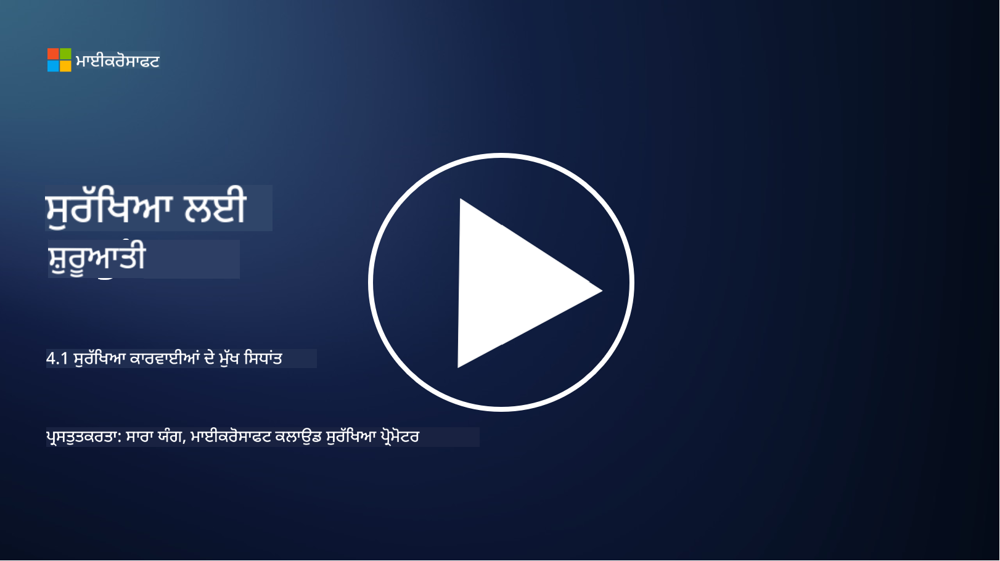

<!--
CO_OP_TRANSLATOR_METADATA:
{
  "original_hash": "6a55b31df9eebf550d040cef0ef7dff3",
  "translation_date": "2025-09-04T02:01:52+00:00",
  "source_file": "4.1 SecOps key concepts.md",
  "language_code": "pa"
}
-->
# ਸੁਰੱਖਿਆ ਕਾਰਜਾਂ ਦੇ ਮੁੱਖ ਧਾਰਨਾ

ਸੁਰੱਖਿਆ ਕਾਰਜਾਂ ਕਿਸੇ ਸੰਸਥਾ ਦੇ ਕੁੱਲ ਸੁਰੱਖਿਆ ਫੰਕਸ਼ਨ ਦਾ ਇੱਕ ਮਹੱਤਵਪੂਰਨ ਹਿੱਸਾ ਹਨ। ਇਸ ਪਾਠ ਵਿੱਚ, ਅਸੀਂ ਇਸ ਬਾਰੇ ਹੋਰ ਜਾਣਾਂਗੇ:

- ਵਪਾਰ ਵਿੱਚ ਸੁਰੱਖਿਆ ਕਾਰਜਾਂ ਦਾ ਫੰਕਸ਼ਨ ਕੀ ਹੈ?

- ਸੁਰੱਖਿਆ ਕਾਰਜਾਂ ਕਿਸ ਰੂਪ ਵਿੱਚ ਹੋ ਸਕਦੇ ਹਨ?

- ਸੁਰੱਖਿਆ ਕਾਰਜਾਂ ਪਰੰਪਰਾਗਤ IT ਕਾਰਜਾਂ ਤੋਂ ਕਿਵੇਂ ਵੱਖਰੇ ਹਨ?

## ਵਪਾਰ ਵਿੱਚ ਸੁਰੱਖਿਆ ਕਾਰਜਾਂ ਦਾ ਫੰਕਸ਼ਨ ਕੀ ਹੈ?

ਵਪਾਰ ਵਿੱਚ ਸੁਰੱਖਿਆ ਕਾਰਜਾਂ ਦਾ ਫੰਕਸ਼ਨ ਇੱਕ ਸਮਰਪਿਤ ਟੀਮ ਜਾਂ ਵਿਭਾਗ ਨੂੰ ਦਰਸਾਉਂਦਾ ਹੈ ਜੋ ਸਾਇਬਰਸੁਰੱਖਿਆ ਖਤਰੇ ਅਤੇ ਘਟਨਾਵਾਂ ਦੀ ਨਿਗਰਾਨੀ, ਪਛਾਣ, ਜਾਂਚ ਅਤੇ ਜਵਾਬ ਦੇਣ ਲਈ ਜ਼ਿੰਮੇਵਾਰ ਹੁੰਦਾ ਹੈ। ਸੁਰੱਖਿਆ ਕਾਰਜਾਂ ਦਾ ਮੁੱਖ ਉਦੇਸ਼ ਸੰਸਥਾ ਦੇ ਡਿਜੀਟਲ ਸੰਸਾਧਨਾਂ ਦੀ ਗੁਪਤਤਾ, ਅਖੰਡਤਾ ਅਤੇ ਉਪਲਬਧਤਾ ਨੂੰ ਯਕੀਨੀ ਬਣਾਉਣਾ ਹੈ, ਸੁਰੱਖਿਆ ਖਤਰੇ ਦੀ ਪਛਾਣ ਅਤੇ ਘਟਨਾਵਾਂ 'ਤੇ ਪ੍ਰਭਾਵਸ਼ਾਲੀ ਜਵਾਬ ਦੇਣ ਦੁਆਰਾ।

## ਸੁਰੱਖਿਆ ਕਾਰਜਾਂ ਕਿਸ ਰੂਪ ਵਿੱਚ ਹੋ ਸਕਦੇ ਹਨ?

ਸੁਰੱਖਿਆ ਕਾਰਜਾਂ ਸੰਸਥਾ ਦੇ ਆਕਾਰ ਅਤੇ ਜਟਿਲਤਾ ਦੇ ਅਧਾਰ 'ਤੇ ਵੱਖ-ਵੱਖ ਰੂਪ ਲੈ ਸਕਦੇ ਹਨ। ਕੁਝ ਆਮ ਰੂਪ ਹਨ:

**ਸੁਰੱਖਿਆ ਕਾਰਜਾਂ ਦਾ ਕੇਂਦਰ (SOC):** ਇੱਕ ਕੇਂਦਰੀ ਟੀਮ ਜੋ 24/7 ਸੁਰੱਖਿਆ ਘਟਨਾਵਾਂ ਦੀ ਨਿਗਰਾਨੀ, ਵਿਸ਼ਲੇਸ਼ਣ ਅਤੇ ਜਵਾਬ ਦੇਣ ਲਈ ਜ਼ਿੰਮੇਵਾਰ ਹੁੰਦੀ ਹੈ। SOC ਅਕਸਰ ਅਗਰਗੰਮੀ ਸੰਦਾਂ ਅਤੇ ਤਕਨਾਲੋਜੀਆਂ ਦੀ ਵਰਤੋਂ ਕਰਦੇ ਹਨ ਤਾਂ ਜੋ ਖਤਰੇ ਦੀ ਪਛਾਣ ਅਤੇ ਰੀਅਲ-ਟਾਈਮ ਵਿੱਚ ਜਵਾਬ ਦਿੱਤਾ ਜਾ ਸਕੇ।

**ਘਟਨਾ ਜਵਾਬ ਟੀਮ:** ਇੱਕ ਵਿਸ਼ੇਸ਼ ਟੀਮ ਜੋ ਸੁਰੱਖਿਆ ਘਟਨਾਵਾਂ ਅਤੇ ਉਲੰਘਨਾਂ 'ਤੇ ਜਵਾਬ ਦੇਣ 'ਤੇ ਧਿਆਨ ਕੇਂਦਰਿਤ ਕਰਦੀ ਹੈ। ਇਹ ਜਾਂਚਾਂ ਕਰਦੀ ਹੈ, ਜਵਾਬ ਦੇਣ ਦੇ ਯਤਨਾਂ ਦਾ ਸਮਨਵਯ ਕਰਦੀ ਹੈ ਅਤੇ ਬਹਾਲੀ ਨੂੰ ਸਹਾਇਤਾ ਦਿੰਦੀ ਹੈ।

**ਖਤਰਾ ਖੋਜ ਟੀਮ:** ਇੱਕ ਟੀਮ ਜੋ ਅਗਰਗੰਮੀ ਖਤਰੇ ਅਤੇ ਲੁਕਵੇਂ ਕਮਜ਼ੋਰੀਆਂ ਦੀ ਪਛਾਣ ਕਰਨ ਲਈ ਪ੍ਰੋ-ਐਕਟਿਵ ਤਰੀਕੇ ਨਾਲ ਖੋਜ ਕਰਦੀ ਹੈ ਜੋ ਪਰੰਪਰਾਗਤ ਸੁਰੱਖਿਆ ਸੰਦਾਂ ਦੁਆਰਾ ਪਛਾਣ ਨਹੀਂ ਕੀਤੇ ਜਾ ਸਕਦੇ।

**ਰੇਡ ਟੀਮ/ਬਲੂ ਟੀਮ:** ਰੇਡ ਟੀਮ ਖਤਰੇ ਦੀ ਨਕਲ ਕਰਦੀ ਹੈ ਤਾਂ ਜੋ ਕਮਜ਼ੋਰੀਆਂ ਦੀ ਪਛਾਣ ਕੀਤੀ ਜਾ ਸਕੇ, ਜਦੋਂ ਕਿ ਬਲੂ ਟੀਮ ਉਹਨਾਂ ਖਤਰੇ ਤੋਂ ਰੱਖਿਆ ਕਰਦੀ ਹੈ। ਦੋਵੇਂ ਟੀਮਾਂ ਸੁਰੱਖਿਆ ਉਪਾਅ ਨੂੰ ਸੁਧਾਰਨ ਲਈ ਇਕੱਠੇ ਕੰਮ ਕਰਦੀਆਂ ਹਨ।

**ਪ੍ਰਬੰਧਿਤ ਸੁਰੱਖਿਆ ਸੇਵਾਵਾਂ ਪ੍ਰਦਾਤਾ (MSSP):** ਕੁਝ ਸੰਸਥਾਵਾਂ ਆਪਣੀਆਂ ਸੁਰੱਖਿਆ ਕਾਰਜਾਂ ਨੂੰ ਤੀਜੀ ਪਾਸੇ ਦੇ ਪ੍ਰਦਾਤਾਵਾਂ ਨੂੰ ਆਊਟਸੋਰਸ ਕਰਦੀਆਂ ਹਨ ਜੋ ਸੁਰੱਖਿਆ ਨਿਗਰਾਨੀ ਅਤੇ ਘਟਨਾ ਜਵਾਬ ਵਿੱਚ ਮਾਹਰ ਹੁੰਦੇ ਹਨ।

## ਸੁਰੱਖਿਆ ਕਾਰਜਾਂ ਪਰੰਪਰਾਗਤ IT ਕਾਰਜਾਂ ਤੋਂ ਕਿਵੇਂ ਵੱਖਰੇ ਹਨ?

ਸੁਰੱਖਿਆ ਕਾਰਜਾਂ ਅਤੇ ਪਰੰਪਰਾਗਤ IT ਕਾਰਜਾਂ ਸੰਬੰਧਿਤ ਪਰੰਤੂ ਵੱਖਰੇ ਫੰਕਸ਼ਨ ਹਨ:

**ਧਿਆਨ:** IT ਕਾਰਜਾਂ ਸੰਸਥਾ ਦੇ IT ਢਾਂਚੇ ਨੂੰ ਪ੍ਰਬੰਧਿਤ ਕਰਨ ਅਤੇ ਇਸਦੀ ਕਾਰਗੁਜ਼ਾਰੀ ਅਤੇ ਉਪਲਬਧਤਾ ਨੂੰ ਯਕੀਨੀ ਬਣਾਉਣ 'ਤੇ ਧਿਆਨ ਕੇਂਦਰਿਤ ਕਰਦੇ ਹਨ। ਸੁਰੱਖਿਆ ਕਾਰਜਾਂ, ਦੂਜੇ ਪਾਸੇ, ਸੁਰੱਖਿਆ ਖਤਰੇ ਦੀ ਪਛਾਣ ਅਤੇ ਘਟਨਾਵਾਂ 'ਤੇ ਜਵਾਬ ਦੇਣ ਨੂੰ ਤਰਜੀਹ ਦਿੰਦੇ ਹਨ।

**ਜਿੰਮੇਵਾਰੀਆਂ:** IT ਕਾਰਜਾਂ ਸਿਸਟਮ ਰਖਰਖਾਵ, ਸੌਫਟਵੇਅਰ ਅਪਡੇਟ ਅਤੇ ਯੂਜ਼ਰ ਸਹਾਇਤਾ ਵਰਗੇ ਕੰਮਾਂ ਨੂੰ ਸੰਭਾਲਦੇ ਹਨ। ਸੁਰੱਖਿਆ ਕਾਰਜਾਂ ਖਤਰੇ ਦੀ ਪਛਾਣ, ਘਟਨਾ ਜਵਾਬ, ਕਮਜ਼ੋਰੀ ਪ੍ਰਬੰਧਨ ਅਤੇ ਸੁਰੱਖਿਆ ਨਿਗਰਾਨੀ ਨੂੰ ਸੰਭਾਲਦੇ ਹਨ।

**ਸਮੇਂ ਦੀ ਮਹੱਤਤਾ:** IT ਕਾਰਜਾਂ ਤੁਰੰਤ ਸਿਸਟਮ ਉਪਲਬਧਤਾ ਅਤੇ ਪ੍ਰਦਰਸ਼ਨ 'ਤੇ ਜ਼ੋਰ ਦਿੰਦੇ ਹਨ। ਸੁਰੱਖਿਆ ਕਾਰਜਾਂ ਖਤਰੇ ਦੀ ਪਛਾਣ ਅਤੇ ਰੀਮਿਡੀਏਸ਼ਨ 'ਤੇ ਧਿਆਨ ਕੇਂਦਰਿਤ ਕਰਦੇ ਹਨ, ਜੋ ਹਮੇਸ਼ਾ ਤੁਰੰਤ ਉਪਲਬਧਤਾ ਨਾਲ ਸੰਗਤ ਨਹੀਂ ਹੋ ਸਕਦੇ।

**ਕੌਸ਼ਲ ਸੈੱਟ:** ਸੁਰੱਖਿਆ ਕਾਰਜਾਂ ਨੂੰ ਖਤਰੇ ਦੇ ਵਿਸ਼ਲੇਸ਼ਣ, ਘਟਨਾ ਜਵਾਬ ਅਤੇ ਸਾਇਬਰਸੁਰੱਖਿਆ ਸੰਦਾਂ ਵਿੱਚ ਵਿਸ਼ੇਸ਼ ਕੌਸ਼ਲ ਦੀ ਲੋੜ ਹੁੰਦੀ ਹੈ। IT ਕਾਰਜਾਂ ਨੂੰ ਸਿਸਟਮ ਪ੍ਰਸ਼ਾਸਨ, ਨੈਟਵਰਕ ਪ੍ਰਬੰਧਨ ਅਤੇ ਐਪਲੀਕੇਸ਼ਨ ਸਹਾਇਤਾ ਵਿੱਚ ਮਾਹਰਤਾ ਦੀ ਲੋੜ ਹੁੰਦੀ ਹੈ।

## ਘਟਨਾ ਜਵਾਬ ਵਰਕਫਲੋ

NIST ਸਾਇਬਰਸੁਰੱਖਿਆ ਫਰੇਮਵਰਕ ਕੋਰ ਫੰਕਸ਼ਨ ਪੰਜ ਮੁੱਖ ਫੰਕਸ਼ਨਾਂ ਦੀ ਸੂਚੀ ਦਿੰਦੇ ਹਨ ਜੋ ਸਾਇਬਰਸੁਰੱਖਿਆ ਖਤਰੇ ਨੂੰ ਘਟਾਉਣ ਲਈ ਸੰਸਥਾ ਦੇ ਕਾਰਜਕਾਰੀ ਵਾਤਾਵਰਣ ਦੇ ਹਿੱਸੇ ਵਜੋਂ ਲਗਾਤਾਰ ਕੀਤੇ ਜਾਣੇ ਚਾਹੀਦੇ ਹਨ।

ਇਹ ਸਮਝਣਾ ਮਹੱਤਵਪੂਰਨ ਹੈ ਕਿ ਇਹ ਗਤੀਵਿਧੀਆਂ ਇੱਕ ਵੱਡੇ ਚੱਕਰ ਦੇ ਹਿੱਸੇ ਵਜੋਂ ਮੌਜੂਦ ਹੋਣ ਚਾਹੀਦੀਆਂ ਹਨ ਜੋ ਸੰਸਥਾ ਦੇ ਵਿਆਪਕ ਸਾਇਬਰਸੁਰੱਖਿਆ ਪ੍ਰਕਿਰਿਆਵਾਂ ਨਾਲ ਜੁੜਦਾ ਹੈ ਅਤੇ ਸੰਗਤ ਹੁੰਦਾ ਹੈ।

**Note:** ਤੁਸੀਂ NIST ਸਾਇਬਰਸੁਰੱਖਿਆ ਫਰੇਮਵਰਕ ਬਾਰੇ ਹੋਰ ਪੜ੍ਹ ਸਕਦੇ ਹੋ [https://www.nist.gov/cybersecurity](https://www.nist.gov/cybersecurity) 'ਤੇ।

## ਹੋਰ ਪੜ੍ਹਾਈ

- [ਸੁਰੱਖਿਆ ਕਾਰਜ | Microsoft Learn](https://learn.microsoft.com/security/operations/overview?WT.mc_id=academic-96948-sayoung)
- [ਸੁਰੱਖਿਆ ਕਾਰਜ ਪ੍ਰਕਿਰਿਆਵਾਂ ਨੂੰ ਲਾਗੂ ਕਰਨਾ | Microsoft Learn](https://learn.microsoft.com/security/operations/?WT.mc_id=academic-96948-sayoung)
- [ਸੁਰੱਖਿਆ ਕਾਰਜਾਂ ਦਾ ਕੇਂਦਰ (SOC) ਕੀ ਹੈ? | Microsoft Security](https://www.microsoft.com/security/business/security-101/what-is-a-security-operations-center-soc?WT.mc_id=academic-96948-sayoung)
- [ਸੁਰੱਖਿਆ ਕਾਰਜਾਂ ਦਾ ਕੇਂਦਰ ਕੀ ਹੈ | ਸਾਇਬਰਸੁਰੱਖਿਆ | CompTIA](https://www.comptia.org/content/articles/what-is-a-security-operations-center)

---

**ਅਸਵੀਕਰਤੀ**:  
ਇਹ ਦਸਤਾਵੇਜ਼ AI ਅਨੁਵਾਦ ਸੇਵਾ [Co-op Translator](https://github.com/Azure/co-op-translator) ਦੀ ਵਰਤੋਂ ਕਰਕੇ ਅਨੁਵਾਦ ਕੀਤਾ ਗਿਆ ਹੈ। ਜਦੋਂ ਕਿ ਅਸੀਂ ਸਹੀ ਹੋਣ ਦਾ ਯਤਨ ਕਰਦੇ ਹਾਂ, ਕਿਰਪਾ ਕਰਕੇ ਧਿਆਨ ਦਿਓ ਕਿ ਸਵੈਚਾਲਿਤ ਅਨੁਵਾਦਾਂ ਵਿੱਚ ਗਲਤੀਆਂ ਜਾਂ ਅਸੁੱਤੀਆਂ ਹੋ ਸਕਦੀਆਂ ਹਨ। ਇਸ ਦੀ ਮੂਲ ਭਾਸ਼ਾ ਵਿੱਚ ਮੌਜੂਦ ਮੂਲ ਦਸਤਾਵੇਜ਼ ਨੂੰ ਅਧਿਕਾਰਤ ਸਰੋਤ ਮੰਨਿਆ ਜਾਣਾ ਚਾਹੀਦਾ ਹੈ। ਮਹੱਤਵਪੂਰਨ ਜਾਣਕਾਰੀ ਲਈ, ਪੇਸ਼ੇਵਰ ਮਨੁੱਖੀ ਅਨੁਵਾਦ ਦੀ ਸਿਫਾਰਸ਼ ਕੀਤੀ ਜਾਂਦੀ ਹੈ। ਇਸ ਅਨੁਵਾਦ ਦੇ ਪ੍ਰਯੋਗ ਤੋਂ ਪੈਦਾ ਹੋਣ ਵਾਲੇ ਕਿਸੇ ਵੀ ਗਲਤਫਹਿਮੀ ਜਾਂ ਗਲਤ ਵਿਆਖਿਆ ਲਈ ਅਸੀਂ ਜ਼ਿੰਮੇਵਾਰ ਨਹੀਂ ਹਾਂ।  