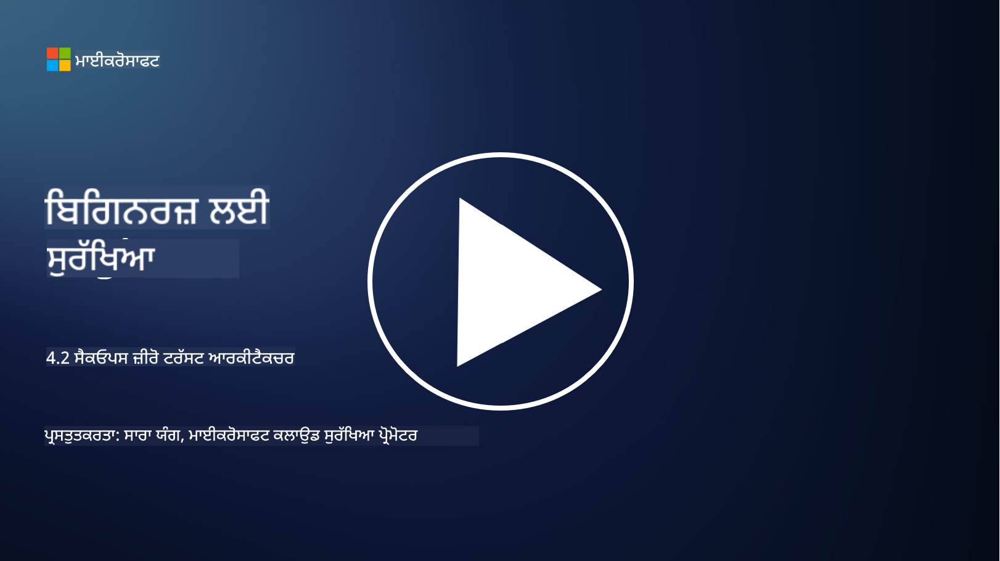

<!--
CO_OP_TRANSLATOR_METADATA:
{
  "original_hash": "45bbdc114e70936816b0b3e7c40189cf",
  "translation_date": "2025-09-04T00:44:15+00:00",
  "source_file": "4.2 SecOps zero trust architecture.md",
  "language_code": "pa"
}
-->
# SecOps ਜ਼ੀਰੋ ਟਰਸਟ ਆਰਕੀਟੈਕਚਰ

ਸੁਰੱਖਿਆ ਓਪਰੇਸ਼ਨ ਜ਼ੀਰੋ ਟਰਸਟ ਆਰਕੀਟੈਕਚਰ ਦੇ ਦੋ ਹਿੱਸੇ ਬਣਾਉਂਦੇ ਹਨ ਅਤੇ ਇਸ ਪਾਠ ਵਿੱਚ ਅਸੀਂ ਦੋਵੇਂ ਬਾਰੇ ਸਿੱਖਾਂਗੇ:

- IT ਆਰਕੀਟੈਕਚਰ ਨੂੰ ਕੇਂਦਰੀ ਲਾਗ ਇਕੱਠਾ ਕਰਨ ਲਈ ਕਿਵੇਂ ਬਣਾਇਆ ਜਾਣਾ ਚਾਹੀਦਾ ਹੈ?

- ਆਧੁਨਿਕ IT ਵਾਤਾਵਰਣਾਂ ਵਿੱਚ ਸੁਰੱਖਿਆ ਓਪਰੇਸ਼ਨ ਲਈ ਸਭ ਤੋਂ ਵਧੀਆ ਅਭਿਆਸ ਕੀ ਹਨ?

## IT ਆਰਕੀਟੈਕਚਰ ਨੂੰ ਕੇਂਦਰੀ ਲਾਗ ਇਕੱਠਾ ਕਰਨ ਲਈ ਕਿਵੇਂ ਬਣਾਇਆ ਜਾਣਾ ਚਾਹੀਦਾ ਹੈ?

ਕੇਂਦਰੀ ਲਾਗ ਇਕੱਠਾ ਕਰਨਾ ਆਧੁਨਿਕ ਸੁਰੱਖਿਆ ਓਪਰੇਸ਼ਨ ਦਾ ਇੱਕ ਮਹੱਤਵਪੂਰਨ ਹਿੱਸਾ ਹੈ। ਇਹ ਸੰਗਠਨਾਂ ਨੂੰ ਸਰਵਰਾਂ, ਐਪਲੀਕੇਸ਼ਨਾਂ, ਨੈਟਵਰਕ ਡਿਵਾਈਸਾਂ ਅਤੇ ਸੁਰੱਖਿਆ ਟੂਲਾਂ ਵਰਗੇ ਵੱਖ-ਵੱਖ ਸਰੋਤਾਂ ਤੋਂ ਲਾਗ ਅਤੇ ਡਾਟਾ ਇਕੱਠਾ ਕਰਨ ਦੀ ਆਗਿਆ ਦਿੰਦਾ ਹੈ, ਜਿਸਨੂੰ ਵਿਸ਼ਲੇਸ਼ਣ, ਨਿਗਰਾਨੀ ਅਤੇ ਘਟਨਾ ਪ੍ਰਤੀਕਰਮ ਲਈ ਇੱਕ ਕੇਂਦਰੀ ਸੰਗ੍ਰਹਿ ਵਿੱਚ ਰੱਖਿਆ ਜਾ ਸਕਦਾ ਹੈ। ਕੇਂਦਰੀ ਲਾਗ ਇਕੱਠਾ ਕਰਨ ਲਈ IT ਆਰਕੀਟੈਕਚਰ ਬਣਾਉਣ ਦੇ ਕੁਝ ਵਧੀਆ ਅਭਿਆਸ ਇਹ ਹਨ:

1. **ਲਾਗ ਸਰੋਤ ਇੰਟੀਗ੍ਰੇਸ਼ਨ**:

- ਯਕੀਨੀ ਬਣਾਓ ਕਿ ਸਾਰੇ ਸੰਬੰਧਿਤ ਡਿਵਾਈਸ ਅਤੇ ਸਿਸਟਮ ਲਾਗ ਪੈਦਾ ਕਰਨ ਲਈ ਸੰਰਚਿਤ ਹਨ। ਇਸ ਵਿੱਚ ਸਰਵਰ, ਫਾਇਰਵਾਲ, ਰਾਊਟਰ, ਸਵਿੱਚ, ਐਪਲੀਕੇਸ਼ਨ ਅਤੇ ਸੁਰੱਖਿਆ ਉਪਕਰਣ ਸ਼ਾਮਲ ਹਨ।

- ਲਾਗ ਸਰੋਤਾਂ ਨੂੰ ਕੇਂਦਰੀ ਲਾਗ ਇਕੱਠਾ ਕਰਨ ਵਾਲੇ ਜਾਂ ਪ੍ਰਬੰਧਨ ਸਿਸਟਮ ਨੂੰ ਲਾਗ ਭੇਜਣ ਲਈ ਸੰਰਚਿਤ ਕਰੋ।

2. **ਸਹੀ SIEM (ਸੁਰੱਖਿਆ ਜਾਣਕਾਰੀ ਅਤੇ ਘਟਨਾ ਪ੍ਰਬੰਧਨ) ਟੂਲ ਚੁਣੋ**:

- SIEM ਹੱਲ ਚੁਣੋ ਜੋ ਤੁਹਾਡੇ ਸੰਗਠਨ ਦੀਆਂ ਜ਼ਰੂਰਤਾਂ ਅਤੇ ਪੈਮਾਨੇ ਨਾਲ ਮੇਲ ਖਾਂਦਾ ਹੋਵੇ।

- ਯਕੀਨੀ ਬਣਾਓ ਕਿ ਚੁਣਿਆ ਗਿਆ ਹੱਲ ਲਾਗ ਇਕੱਠਾ ਕਰਨ, ਇਕੱਠਾ ਕਰਨ, ਵਿਸ਼ਲੇਸ਼ਣ ਅਤੇ ਰਿਪੋਰਟਿੰਗ ਦਾ ਸਮਰਥਨ ਕਰਦਾ ਹੈ।

3. **ਸਕੇਲਬਿਲਟੀ ਅਤੇ ਰਿਡੰਡੈਂਸੀ**:

- ਵਧ ਰਹੇ ਲਾਗ ਸਰੋਤਾਂ ਅਤੇ ਵਧੇਰੇ ਲਾਗ ਮਾਤਰਾ ਨੂੰ ਸਮਰਥਨ ਦੇਣ ਲਈ ਆਰਕੀਟੈਕਚਰ ਨੂੰ ਸਕੇਲਬਲ ਬਣਾਓ।

- ਹਾਰਡਵੇਅਰ ਜਾਂ ਨੈਟਵਰਕ ਫੇਲ੍ਹ ਹੋਣ ਕਾਰਨ ਰੁਕਾਵਟਾਂ ਨੂੰ ਰੋਕਣ ਲਈ ਉੱਚ ਉਪਲਬਧਤਾ ਲਈ ਰਿਡੰਡੈਂਸੀ ਲਾਗੂ ਕਰੋ।

4. **ਲਾਗ ਨੂੰ ਸੁਰੱਖਿਅਤ ਤਰੀਕੇ ਨਾਲ ਭੇਜੋ**:

- TLS/SSL ਜਾਂ IPsec ਵਰਗੇ ਸੁਰੱਖਿਅਤ ਪ੍ਰੋਟੋਕੋਲ ਦੀ ਵਰਤੋਂ ਕਰੋ ਤਾਂ ਜੋ ਲਾਗਾਂ ਨੂੰ ਸਰੋਤਾਂ ਤੋਂ ਕੇਂਦਰੀ ਸੰਗ੍ਰਹਿ ਤੱਕ ਭੇਜਿਆ ਜਾ ਸਕੇ।

- ਪ੍ਰਮਾਣਿਕਤਾ ਅਤੇ ਪਹੁੰਚ ਨਿਯੰਤਰਣ ਲਾਗੂ ਕਰੋ ਤਾਂ ਜੋ ਸਿਰਫ ਅਧਿਕ੍ਰਿਤ ਡਿਵਾਈਸਾਂ ਹੀ ਲਾਗ ਭੇਜ ਸਕਣ।

5. **ਨਾਰਮਲਾਈਜ਼ੇਸ਼ਨ**:

- ਲਾਗ ਫਾਰਮੈਟਾਂ ਨੂੰ ਮਿਆਰੀਕਰਣ ਅਤੇ ਡਾਟਾ ਨੂੰ ਨਾਰਮਲਾਈਜ਼ ਕਰੋ ਤਾਂ ਜੋ ਸਥਿਰਤਾ ਅਤੇ ਵਿਸ਼ਲੇਸ਼ਣ ਦੀ ਸਹੂਲਤ ਹੋਵੇ।

6. **ਸਟੋਰੇਜ ਅਤੇ ਰਿਟੇਨਸ਼ਨ**:

- ਕCompliance ਅਤੇ ਸੁਰੱਖਿਆ ਦੀਆਂ ਜ਼ਰੂਰਤਾਂ ਦੇ ਅਧਾਰ 'ਤੇ ਲਾਗਾਂ ਲਈ ਉਚਿਤ ਰਿਟੇਨਸ਼ਨ ਪੀਰੀਅਡ ਤੈਅ ਕਰੋ।

- ਲਾਗਾਂ ਨੂੰ ਸੁਰੱਖਿਅਤ ਢੰਗ ਨਾਲ ਸਟੋਰ ਕਰੋ, ਉਨ੍ਹਾਂ ਨੂੰ ਅਣਅਧਿਕ੍ਰਿਤ ਪਹੁੰਚ ਅਤੇ ਤਬਦੀਲੀ ਤੋਂ ਬਚਾਓ।

## ਆਧੁਨਿਕ IT ਵਾਤਾਵਰਣਾਂ ਵਿੱਚ ਸੁਰੱਖਿਆ ਓਪਰੇਸ਼ਨ ਲਈ ਸਭ ਤੋਂ ਵਧੀਆ ਅਭਿਆਸ ਕੀ ਹਨ?

ਕੇਂਦਰੀ ਲਾਗ ਇਕੱਠਾ ਕਰਨ ਦੇ ਇਲਾਵਾ, ਆਧੁਨਿਕ IT ਵਾਤਾਵਰਣਾਂ ਵਿੱਚ ਸੁਰੱਖਿਆ ਓਪਰੇਸ਼ਨ ਲਈ ਕੁਝ ਵਧੀਆ ਅਭਿਆਸ ਇਹ ਹਨ:

1. **ਲਗਾਤਾਰ ਨਿਗਰਾਨੀ**: ਨੈਟਵਰਕ ਅਤੇ ਸਿਸਟਮ ਗਤੀਵਿਧੀਆਂ ਦੀ ਲਗਾਤਾਰ ਨਿਗਰਾਨੀ ਕਰੋ ਤਾਂ ਜੋ ਖਤਰੇ ਨੂੰ ਰੀਅਲ-ਟਾਈਮ ਵਿੱਚ ਪਛਾਣਿਆ ਅਤੇ ਪ੍ਰਤੀਕਰਮ ਕੀਤਾ ਜਾ ਸਕੇ।

2. **ਥ੍ਰੈਟ ਇੰਟੈਲੀਜੈਂਸ**: ਉਭਰਦੇ ਖਤਰੇ ਅਤੇ ਕਮਜ਼ੋਰੀਆਂ ਬਾਰੇ ਜਾਣਕਾਰੀ ਪ੍ਰਾਪਤ ਕਰਨ ਲਈ ਥ੍ਰੈਟ ਇੰਟੈਲੀਜੈਂਸ ਫੀਡ ਅਤੇ ਸੇਵਾਵਾਂ ਦੀ ਵਰਤੋਂ ਕਰੋ।

3. **ਯੂਜ਼ਰ ਟ੍ਰੇਨਿੰਗ**: ਕਰਮਚਾਰੀਆਂ ਲਈ ਨਿਯਮਿਤ ਸੁਰੱਖਿਆ ਜਾਗਰੂਕਤਾ ਟ੍ਰੇਨਿੰਗ ਕਰਵਾਓ ਤਾਂ ਜੋ ਸੋਸ਼ਲ ਇੰਜੀਨੀਅਰਿੰਗ ਅਤੇ ਫਿਸ਼ਿੰਗ ਹਮਲਿਆਂ ਨਾਲ ਜੁੜੇ ਖਤਰੇ ਘਟਾਏ ਜਾ ਸਕਣ।

4. **ਇੰਸੀਡੈਂਟ ਰਿਸਪਾਂਸ ਪਲਾਨ**: ਸੁਰੱਖਿਆ ਘਟਨਾਵਾਂ ਲਈ ਤੇਜ਼ ਅਤੇ ਪ੍ਰਭਾਵਸ਼ਾਲੀ ਪ੍ਰਤੀਕਰਮ ਯਕੀਨੀ ਬਣਾਉਣ ਲਈ ਇੱਕ ਇੰਸੀਡੈਂਟ ਰਿਸਪਾਂਸ ਪਲਾਨ ਵਿਕਸਿਤ ਅਤੇ ਟੈਸਟ ਕਰੋ।

5. **ਸੁਰੱਖਿਆ ਆਟੋਮੇਸ਼ਨ**: ਇੰਸੀਡੈਂਟ ਰਿਸਪਾਂਸ ਅਤੇ ਦੁਹਰਾਏ ਜਾਣ ਵਾਲੇ ਕੰਮਾਂ ਨੂੰ ਸਧਾਰਨ ਬਣਾਉਣ ਲਈ ਸੁਰੱਖਿਆ ਆਟੋਮੇਸ਼ਨ ਅਤੇ ਓਰਕੇਸਟਰੇਸ਼ਨ ਟੂਲ ਦੀ ਵਰਤੋਂ ਕਰੋ।

6. **ਬੈਕਅਪ ਅਤੇ ਰਿਕਵਰੀ**: ਡਾਟਾ ਖੋਹ ਜਾਂ ਰੈਨਸਮਵੇਅਰ ਹਮਲਿਆਂ ਦੇ ਮਾਮਲੇ ਵਿੱਚ ਡਾਟਾ ਉਪਲਬਧਤਾ ਯਕੀਨੀ ਬਣਾਉਣ ਲਈ ਮਜ਼ਬੂਤ ਬੈਕਅਪ ਅਤੇ ਡਿਜਾਸਟਰ ਰਿਕਵਰੀ ਹੱਲ ਲਾਗੂ ਕਰੋ।

## ਹੋਰ ਪੜ੍ਹਾਈ

- [Microsoft Security Best Practices module: Security operations | Microsoft Learn](https://learn.microsoft.com/security/operations/security-operations-videos-and-decks?WT.mc_id=academic-96948-sayoung)
- [Security operations - Cloud Adoption Framework | Microsoft Learn](https://learn.microsoft.com/azure/cloud-adoption-framework/secure/security-operations?WT.mc_id=academic-96948-sayoung)
- [What is Security Operations and Analytics Platform Architecture? A Definition of SOAPA, How It Works, Benefits, and More (digitalguardian.com)](https://www.digitalguardian.com/blog/what-security-operations-and-analytics-platform-architecture-definition-soapa-how-it-works#:~:text=All%20in%20all%2C%20security%20operations%20and%20analytics%20platform,become%20more%20efficient%20and%20operative%20with%20your%20security.)

---

**ਅਸਵੀਕਰਤੀ**:  
ਇਹ ਦਸਤਾਵੇਜ਼ AI ਅਨੁਵਾਦ ਸੇਵਾ [Co-op Translator](https://github.com/Azure/co-op-translator) ਦੀ ਵਰਤੋਂ ਕਰਕੇ ਅਨੁਵਾਦ ਕੀਤਾ ਗਿਆ ਹੈ। ਜਦੋਂ ਕਿ ਅਸੀਂ ਸਹੀ ਹੋਣ ਦਾ ਯਤਨ ਕਰਦੇ ਹਾਂ, ਕਿਰਪਾ ਕਰਕੇ ਧਿਆਨ ਦਿਓ ਕਿ ਸਵੈਚਾਲਿਤ ਅਨੁਵਾਦਾਂ ਵਿੱਚ ਗਲਤੀਆਂ ਜਾਂ ਅਸੁਣਤੀਆਂ ਹੋ ਸਕਦੀਆਂ ਹਨ। ਇਸ ਦੀ ਮੂਲ ਭਾਸ਼ਾ ਵਿੱਚ ਮੌਜੂਦ ਮੂਲ ਦਸਤਾਵੇਜ਼ ਨੂੰ ਪ੍ਰਮਾਣਿਕ ਸਰੋਤ ਮੰਨਿਆ ਜਾਣਾ ਚਾਹੀਦਾ ਹੈ। ਮਹੱਤਵਪੂਰਨ ਜਾਣਕਾਰੀ ਲਈ, ਪੇਸ਼ੇਵਰ ਮਨੁੱਖੀ ਅਨੁਵਾਦ ਦੀ ਸਿਫਾਰਸ਼ ਕੀਤੀ ਜਾਂਦੀ ਹੈ। ਇਸ ਅਨੁਵਾਦ ਦੇ ਪ੍ਰਯੋਗ ਤੋਂ ਪੈਦਾ ਹੋਣ ਵਾਲੀਆਂ ਕਿਸੇ ਵੀ ਗਲਤਫਹਮੀਆਂ ਜਾਂ ਗਲਤ ਵਿਆਖਿਆਵਾਂ ਲਈ ਅਸੀਂ ਜ਼ਿੰਮੇਵਾਰ ਨਹੀਂ ਹਾਂ।  