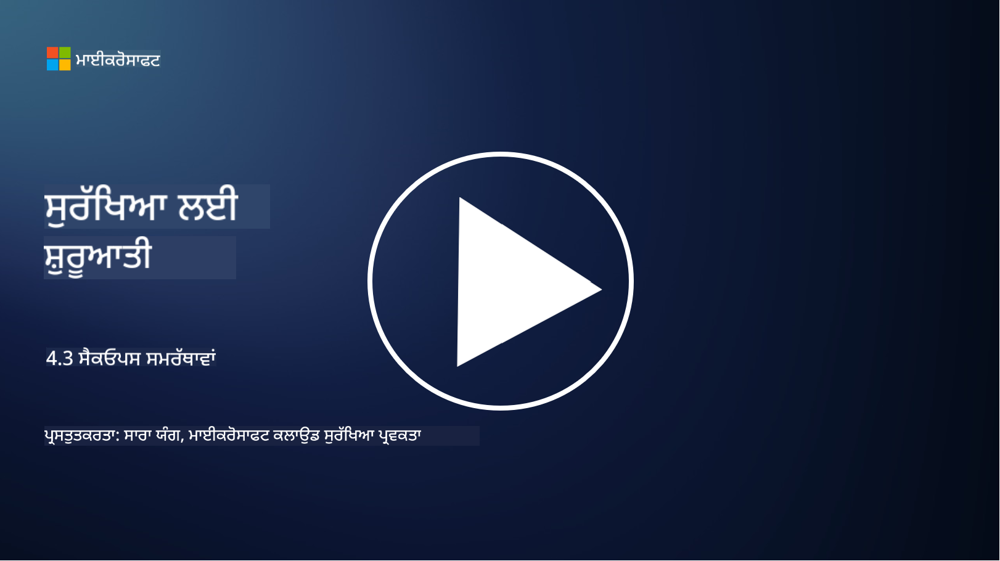

<!--
CO_OP_TRANSLATOR_METADATA:
{
  "original_hash": "553eb694c89f1caca0694e8d8ab89e0e",
  "translation_date": "2025-09-04T01:17:32+00:00",
  "source_file": "4.3 SecOps capabilities.md",
  "language_code": "pa"
}
-->
# ਸੈਕਓਪਸ ਸਮਰੱਥਾਵਾਂ

ਇਸ ਭਾਗ ਵਿੱਚ, ਅਸੀਂ ਸੁਰੱਖਿਆ ਕਾਰਵਾਈਆਂ ਵਿੱਚ ਵਰਤੇ ਜਾ ਸਕਣ ਵਾਲੇ ਮੁੱਖ ਟੂਲਾਂ ਅਤੇ ਸਮਰੱਥਾਵਾਂ ਬਾਰੇ ਹੋਰ ਵੇਰਵੇ ਕਵਰ ਕਰਾਂਗੇ।

ਇਸ ਪਾਠ ਵਿੱਚ, ਅਸੀਂ ਕਵਰ ਕਰਾਂਗੇ:

- ਸੁਰੱਖਿਆ ਜਾਣਕਾਰੀ ਅਤੇ ਘਟਨਾ ਪ੍ਰਬੰਧਨ (SIEM) ਟੂਲ ਕੀ ਹੈ?

- XDR ਕੀ ਹੈ?

- ਕਿਹੜੀਆਂ ਸਮਰੱਥਾਵਾਂ ਸੁਰੱਖਿਆ ਕਾਰਵਾਈਆਂ ਨੂੰ ਬਿਹਤਰ ਬਣਾਉਣ ਲਈ ਵਰਤੀਆਂ ਜਾ ਸਕਦੀਆਂ ਹਨ?

## ਸੁਰੱਖਿਆ ਜਾਣਕਾਰੀ ਅਤੇ ਘਟਨਾ ਪ੍ਰਬੰਧਨ (SIEM) ਟੂਲ ਕੀ ਹੈ?

ਸੁਰੱਖਿਆ ਜਾਣਕਾਰੀ ਅਤੇ ਘਟਨਾ ਪ੍ਰਬੰਧਨ (SIEM) ਟੂਲ ਸੰਗਠਨ ਦੇ ਆਈਟੀ ਵਾਤਾਵਰਣ ਵਿੱਚ ਪੈਦਾ ਹੋਣ ਵਾਲੀਆਂ ਸੁਰੱਖਿਆ ਚੇਤਾਵਨੀਆਂ ਦਾ ਵਿਸ਼ਲੇਸ਼ਣ ਪ੍ਰਦਾਨ ਕਰਦਾ ਹੈ। ਇਹ ਵੱਖ-ਵੱਖ ਸਰੋਤਾਂ, ਜਿਵੇਂ ਕਿ ਨੈੱਟਵਰਕ ਡਿਵਾਈਸ, ਸਰਵਰ, ਐਪਲੀਕੇਸ਼ਨ ਅਤੇ ਸੁਰੱਖਿਆ ਪ੍ਰਣਾਲੀਆਂ ਤੋਂ ਲੌਗ ਡਾਟਾ ਅਤੇ ਸੁਰੱਖਿਆ ਘਟਨਾਵਾਂ ਨੂੰ ਇਕੱਠਾ, ਇਕੱਠਾ, ਸਬੰਧਿਤ ਅਤੇ ਵਿਸ਼ਲੇਸ਼ਣ ਕਰਦਾ ਹੈ।

SIEM ਟੂਲਾਂ ਦੇ ਮੁੱਖ ਕੰਮ ਅਤੇ ਸਮਰੱਥਾਵਾਂ ਵਿੱਚ ਸ਼ਾਮਲ ਹਨ:

1. **ਲੌਗ ਇਕੱਠਾ ਕਰਨਾ**: SIEM ਟੂਲ ਫਾਇਰਵਾਲ, ਇੰਟ੍ਰੂਜ਼ਨ ਡਿਟੈਕਸ਼ਨ ਸਿਸਟਮ, ਐਂਟੀਵਾਇਰਸ ਸੌਫਟਵੇਅਰ ਅਤੇ ਹੋਰ ਸਮੇਤ ਵੱਖ-ਵੱਖ ਡਿਵਾਈਸਾਂ, ਪ੍ਰਣਾਲੀਆਂ ਅਤੇ ਐਪਲੀਕੇਸ਼ਨਾਂ ਤੋਂ ਲੌਗ ਅਤੇ ਸੁਰੱਖਿਆ ਘਟਨਾ ਡਾਟਾ ਇਕੱਠਾ ਕਰਦੇ ਹਨ।

2. **ਡਾਟਾ ਨਾਰਮਲਾਈਜ਼ੇਸ਼ਨ**: ਇਹ ਵਿਸ਼ਲੇਸ਼ਣ ਅਤੇ ਸਬੰਧਿਤ ਕਰਨ ਲਈ ਲੌਗ ਡਾਟਾ ਨੂੰ ਇੱਕ ਸਧਾਰਨ ਫਾਰਮੈਟ ਵਿੱਚ ਨਾਰਮਲਾਈਜ਼ ਕਰਦੇ ਹਨ।

3. **ਘਟਨਾ ਸਬੰਧਿਤ ਕਰਨਾ**: SIEM ਟੂਲ ਪੈਟਰਨ ਅਤੇ ਅਸਧਾਰਨਤਾਵਾਂ ਦੀ ਪਛਾਣ ਕਰਨ ਲਈ ਘਟਨਾਵਾਂ ਨੂੰ ਸਬੰਧਿਤ ਕਰਦੇ ਹਨ ਜੋ ਸੁਰੱਖਿਆ ਘਟਨਾਵਾਂ ਜਾਂ ਖਤਰੇ ਦਰਸਾ ਸਕਦੇ ਹਨ।

4. **ਚੇਤਾਵਨੀ ਅਤੇ ਸੂਚਨਾ**: ਜਦੋਂ ਸ਼ੱਕੀ ਗਤੀਵਿਧੀਆਂ ਜਾਂ ਸੁਰੱਖਿਆ ਉਲੰਘਣਾਂ ਦੀ ਪਛਾਣ ਹੁੰਦੀ ਹੈ, ਤਾਂ SIEM ਟੂਲ ਤੁਰੰਤ ਚੇਤਾਵਨੀਆਂ ਅਤੇ ਸੂਚਨਾਵਾਂ ਪੈਦਾ ਕਰਦੇ ਹਨ, ਜਿਸ ਨਾਲ ਤੁਰੰਤ ਪ੍ਰਤੀਕਿਰਿਆ ਸੰਭਵ ਹੁੰਦੀ ਹੈ।

5. **ਘਟਨਾ ਪਛਾਣ**: ਇਹ ਅਣਅਧਿਕਾਰਤ ਪਹੁੰਚ, ਡਾਟਾ ਚੋਰੀ, ਮਾਲਵੇਅਰ ਸੰਕਰਮਣਾਂ ਅਤੇ ਅੰਦਰੂਨੀ ਖਤਰੇ ਸਮੇਤ ਸੁਰੱਖਿਆ ਘਟਨਾਵਾਂ ਦੀ ਪਛਾਣ ਕਰਨ ਵਿੱਚ ਸਹਾਇਕ ਹੁੰਦੇ ਹਨ।

6. **ਯੂਜ਼ਰ ਅਤੇ ਐਂਟਿਟੀ ਬਿਹੇਵਿਅਰ ਐਨਾਲਿਟਿਕਸ (UEBA)**: ਕੁਝ SIEM ਟੂਲ UEBA ਸਮਰੱਥਾਵਾਂ ਸ਼ਾਮਲ ਕਰਦੇ ਹਨ ਜੋ ਅਸਧਾਰਨ ਯੂਜ਼ਰ ਅਤੇ ਐਂਟਿਟੀ ਵਿਵਹਾਰਾਂ ਦੀ ਪਛਾਣ ਕਰਦੇ ਹਨ ਜੋ ਸੰਭਾਵਿਤ ਤੌਰ 'ਤੇ ਖਾਤਿਆਂ ਦੇ ਕਬਜ਼ੇ ਜਾਂ ਅੰਦਰੂਨੀ ਖਤਰੇ ਦਰਸਾ ਸਕਦੇ ਹਨ।

7. **ਥ੍ਰੈਟ ਇੰਟੈਲੀਜੈਂਸ ਇੰਟੀਗ੍ਰੇਸ਼ਨ**: SIEM ਟੂਲ ਖਤਰੇ ਦੀ ਪਛਾਣ ਨੂੰ ਬਿਹਤਰ ਬਣਾਉਣ ਲਈ ਖਤਰੇ ਦੀ ਜਾਣਕਾਰੀ ਫੀਡਾਂ ਨਾਲ ਇਕੱਠੇ ਹੋ ਸਕਦੇ ਹਨ, ਜੋ ਜਾਣੇ-ਪਛਾਣੇ ਖਤਰੇ ਦੇ ਸੰਕੇਤਾਂ (IOCs) ਦੀ ਨੈੱਟਵਰਕ ਗਤੀਵਿਧੀ ਨਾਲ ਤੁਲਨਾ ਕਰਦੇ ਹਨ।

8. **ਆਟੋਮੇਸ਼ਨ ਅਤੇ ਆਰਕੇਸਟਰੇਸ਼ਨ**: ਆਟੋਮੇਸ਼ਨ ਵਿਸ਼ੇਸ਼ਤਾਵਾਂ SIEM ਨੂੰ ਆਮ ਸੁਰੱਖਿਆ ਘਟਨਾਵਾਂ ਲਈ ਪ੍ਰਤੀਕਿਰਿਆ ਨੂੰ ਆਟੋਮੇਟ ਕਰਨ ਦੀ ਆਗਿਆ ਦਿੰਦੀ ਹੈ, ਪ੍ਰਤੀਕਿਰਿਆ ਦੇ ਸਮੇਂ ਅਤੇ ਮੈਨੂਅਲ ਕੋਸ਼ਿਸ਼ ਨੂੰ ਘਟਾਉਂਦੀ ਹੈ।

9. **ਡੈਸ਼ਬੋਰਡ ਅਤੇ ਵਿਜੁਅਲਾਈਜ਼ੇਸ਼ਨ**: ਇਹ ਸੁਰੱਖਿਆ ਡਾਟਾ ਦੀ ਨਿਗਰਾਨੀ ਕਰਨ ਅਤੇ ਕਸਟਮ ਰਿਪੋਰਟਾਂ ਬਣਾਉਣ ਲਈ ਡੈਸ਼ਬੋਰਡ ਅਤੇ ਵਿਜੁਅਲਾਈਜ਼ੇਸ਼ਨ ਟੂਲ ਪ੍ਰਦਾਨ ਕਰਦੇ ਹਨ।

10. **ਹੋਰ ਸੁਰੱਖਿਆ ਟੂਲਾਂ ਨਾਲ ਇੰਟੀਗ੍ਰੇਸ਼ਨ**: SIEM ਟੂਲ ਅਕਸਰ ਹੋਰ ਸੁਰੱਖਿਆ ਟੂਲਾਂ ਅਤੇ ਤਕਨਾਲੋਜੀਆਂ, ਜਿਵੇਂ ਕਿ ਐਂਡਪੌਇੰਟ ਡਿਟੈਕਸ਼ਨ ਅਤੇ ਰਿਸਪਾਂਸ (EDR) ਹੱਲਾਂ ਨਾਲ ਇਕੱਠੇ ਹੁੰਦੇ ਹਨ, ਜੋ ਸੰਗਠਨ ਦੀ ਸੁਰੱਖਿਆ ਸਥਿਤੀ ਦਾ ਸਮੂਹਿਕ ਦ੍ਰਿਸ਼ਟੀਕੋਣ ਪ੍ਰਦਾਨ ਕਰਦੇ ਹਨ।

## XDR ਕੀ ਹੈ?

XDR (ਐਕਸਟੈਂਡਿਡ ਡਿਟੈਕਸ਼ਨ ਐਂਡ ਰਿਸਪਾਂਸ) ਇੱਕ ਤਕਨਾਲੋਜੀ ਹੈ ਜੋ ਰਵਾਇਤੀ ਐਂਡਪੌਇੰਟ ਡਿਟੈਕਸ਼ਨ ਅਤੇ ਰਿਸਪਾਂਸ (EDR) ਦੀ ਸਮਰੱਥਾ ਨੂੰ ਵਧਾਉਂਦੀ ਹੈ ਅਤੇ ਵੱਖ-ਵੱਖ ਸਰੋਤਾਂ ਤੋਂ ਵਿਆਪਕ ਸੁਰੱਖਿਆ ਟੈਲੀਮੇਟਰੀ ਨਾਲ ਇਸਨੂੰ ਜੋੜਦੀ ਹੈ, ਜੋ ਸੰਗਠਨ ਦੀ ਸੁਰੱਖਿਆ ਸਥਿਤੀ ਦਾ ਹੋਰ ਵਿਸ਼ਤ੍ਰਿਤ ਦ੍ਰਿਸ਼ਟੀਕੋਣ ਪ੍ਰਦਾਨ ਕਰਦੀ ਹੈ। XDR ਦਾ ਉਦੇਸ਼ ਸਿਰਫ EDR, SIEM ਜਾਂ ਹੋਰ ਵਿਅਕਤੀਗਤ ਸੁਰੱਖਿਆ ਟੂਲਾਂ 'ਤੇ ਨਿਰਭਰ ਰਹਿਣ ਦੀ ਸੀਮਾਵਾਂ ਨੂੰ ਦੂਰ ਕਰਕੇ ਖਤਰੇ ਦੀ ਪਛਾਣ, ਘਟਨਾ ਪ੍ਰਤੀਕਿਰਿਆ ਅਤੇ ਕੁੱਲ ਸੁਰੱਖਿਆ ਨੂੰ ਸੁਧਾਰਨਾ ਹੈ।

XDR ਦੇ ਮੁੱਖ ਵਿਸ਼ੇਸ਼ਤਾਵਾਂ ਅਤੇ ਹਿੱਸੇ ਸ਼ਾਮਲ ਹਨ:

1. **ਡਾਟਾ ਇੰਟੀਗ੍ਰੇਸ਼ਨ**: XDR ਐਂਡਪੌਇੰਟਸ, ਨੈੱਟਵਰਕ ਟ੍ਰੈਫਿਕ, ਕਲਾਉਡ ਸੇਵਾਵਾਂ, ਈਮੇਲ ਅਤੇ ਹੋਰ ਸਮੇਤ ਕਈ ਸਰੋਤਾਂ ਤੋਂ ਡਾਟਾ ਨੂੰ ਇਕੱਠਾ ਕਰਦਾ ਹੈ। ਇਹ ਵਿਸ਼ਤ੍ਰਿਤ ਡਾਟਾ ਇਕੱਠਾ ਕਰਨ ਦੀ ਸਮਰੱਥਾ ਖਤਰੇ ਦੀ ਪਛਾਣ ਅਤੇ ਵਿਸ਼ਲੇਸ਼ਣ ਲਈ ਵਿਆਪਕ ਸੰਦਰਭ ਪ੍ਰਦਾਨ ਕਰਦੀ ਹੈ।

2. **ਐਡਵਾਂਸਡ ਐਨਾਲਿਟਿਕਸ**: XDR ਖਤਰੇ ਦੀ ਪਛਾਣ ਅਤੇ ਪ੍ਰਾਥਮਿਕਤਾ ਲਈ ਐਡਵਾਂਸਡ ਐਨਾਲਿਟਿਕਸ, ਮਸ਼ੀਨ ਲਰਨਿੰਗ ਅਤੇ ਵਿਵਹਾਰਕ ਵਿਸ਼ਲੇਸ਼ਣ ਨੂੰ ਵਰਤਦਾ ਹੈ। ਇਹ ਜਾਣੇ-ਪਛਾਣੇ ਅਤੇ ਅਣਜਾਣੇ ਦੋਵਾਂ ਖਤਰੇ ਦੀ ਪਛਾਣ ਕਰਨ ਲਈ ਡਾਟਾ ਵਿੱਚ ਪੈਟਰਨ ਅਤੇ ਅਸਧਾਰਨਤਾਵਾਂ ਦੀ ਤਲਾਸ਼ ਕਰਦਾ ਹੈ।

3. **ਆਟੋਮੇਟਡ ਥ੍ਰੈਟ ਡਿਟੈਕਸ਼ਨ**: XDR ਵੱਖ-ਵੱਖ ਸਰੋਤਾਂ ਤੋਂ ਜਾਣਕਾਰੀ ਨੂੰ ਸਬੰਧਿਤ ਕਰਕੇ ਸੁਰੱਖਿਆ ਖਤਰੇ ਅਤੇ ਅਸਧਾਰਨਤਾਵਾਂ ਦੀ ਪਛਾਣ ਨੂੰ ਆਟੋਮੇਟ ਕਰਦਾ ਹੈ। ਇਹ ਕਈ ਵੈਕਟਰਾਂ ਵਿੱਚ ਫੈਲਣ ਵਾਲੀਆਂ ਜਟਿਲ ਹਮਲਿਆਂ ਦੀ ਪਛਾਣ ਕਰ ਸਕਦਾ ਹੈ।

4. **ਘਟਨਾ ਜਾਂਚ ਅਤੇ ਪ੍ਰਤੀਕਿਰਿਆ**: XDR ਘਟਨਾ ਜਾਂਚ ਅਤੇ ਪ੍ਰਤੀਕਿਰਿਆ ਲਈ ਟੂਲ ਪ੍ਰਦਾਨ ਕਰਦਾ ਹੈ, ਜੋ ਸੁਰੱਖਿਆ ਟੀਮਾਂ ਨੂੰ ਘਟਨਾਵਾਂ ਦੇ ਪੱਧਰ ਅਤੇ ਪ੍ਰਭਾਵ ਦਾ ਜਲਦੀ ਮੁਲਾਂਕਣ ਕਰਨ ਅਤੇ ਉਚਿਤ ਕਾਰਵਾਈ ਕਰਨ ਵਿੱਚ ਸਹਾਇਕ ਹੁੰਦਾ ਹੈ।

5. **ਥ੍ਰੈਟ ਇੰਟੈਲੀਜੈਂਸ ਇੰਟੀਗ੍ਰੇਸ਼ਨ**: ਇਹ ਖਤਰੇ ਦੀ ਪਛਾਣ ਨੂੰ ਬਿਹਤਰ ਬਣਾਉਣ ਲਈ ਖਤਰੇ ਦੀ ਜਾਣਕਾਰੀ ਫੀਡਾਂ ਅਤੇ ਡਾਟਾ ਨੂੰ ਇਕੱਠਾ ਕਰਦਾ ਹੈ, ਜੋ ਜਾਣੇ-ਪਛਾਣੇ ਖਤਰੇ ਦੇ ਸੰਕੇਤਾਂ (IOCs) ਦੀ ਸੰਗਠਨ ਦੇ ਨੈੱਟਵਰਕ ਅਤੇ ਐਂਡਪੌਇੰਟ ਗਤੀਵਿਧੀ ਨਾਲ ਤੁਲਨਾ ਕਰਦਾ ਹੈ।

6. **ਯੂਨਿਫਾਇਡ ਕਨਸੋਲ**: XDR ਆਮ ਤੌਰ 'ਤੇ ਇੱਕ ਯੂਨਿਫਾਇਡ ਕਨਸੋਲ ਜਾਂ ਡੈਸ਼ਬੋਰਡ ਪ੍ਰਦਾਨ ਕਰਦਾ ਹੈ ਜਿੱਥੇ ਸੁਰੱਖਿਆ ਟੀਮ ਵੱਖ-ਵੱਖ ਸਰੋਤਾਂ ਤੋਂ ਸੁਰੱਖਿਆ ਚੇਤਾਵਨੀਆਂ ਅਤੇ ਘਟਨਾਵਾਂ ਨੂੰ ਕੇਂਦਰੀਕ੍ਰਿਤ ਢੰਗ ਨਾਲ ਦੇਖ ਅਤੇ ਪ੍ਰਬੰਧਿਤ ਕਰ ਸਕਦੀਆਂ ਹਨ।

7. **ਕਰਾਸ-ਪਲੇਟਫਾਰਮ ਕਵਰੇਜ**: XDR ਹੱਲ ਐਂਡਪੌਇੰਟਸ, ਸਰਵਰ, ਕਲਾਉਡ ਵਾਤਾਵਰਣ ਅਤੇ ਮੋਬਾਈਲ ਡਿਵਾਈਸ ਸਮੇਤ ਕਈ ਪਲੇਟਫਾਰਮਾਂ ਨੂੰ ਕਵਰ ਕਰਦੇ ਹਨ, ਜਿਸ ਨਾਲ ਇਹ ਆਧੁਨਿਕ, ਬਹੁ-ਪਲੇਟਫਾਰਮ ਆਈਟੀ ਵਾਤਾਵਰਣਾਂ ਲਈ ਉਚਿਤ ਬਣ ਜਾਂਦੇ ਹਨ।

## ਕਿਹੜੀਆਂ ਸਮਰੱਥਾਵਾਂ ਸੁਰੱਖਿਆ ਕਾਰਵਾਈਆਂ ਨੂੰ ਬਿਹਤਰ ਬਣਾਉਣ ਲਈ ਵਰਤੀਆਂ ਜਾ ਸਕਦੀਆਂ ਹਨ?

ਸੁਰੱਖਿਆ ਕਾਰਵਾਈਆਂ ਨੂੰ ਬਿਹਤਰ ਬਣਾਉਣ ਲਈ, ਸੰਗਠਨ SIEM ਟੂਲਾਂ ਦੇ ਇਲਾਵਾ ਕਈ ਸਮਰੱਥਾਵਾਂ ਦਾ ਲਾਭ ਲੈ ਸਕਦੇ ਹਨ:

1. **ਮਸ਼ੀਨ ਲਰਨਿੰਗ ਅਤੇ ਕ੍ਰਿਤ੍ਰਿਮ ਬੁੱਧੀਮਤਾ**: ਵਿਕਸਿਤ ਹੋ ਰਹੇ ਖਤਰੇ ਦੀ ਪਛਾਣ ਕਰਨ ਅਤੇ ਖਤਰੇ ਦੀ ਖੋਜ ਨੂੰ ਆਟੋਮੇਟ ਕਰਨ ਲਈ ਐਡਵਾਂਸਡ ਐਨਾਲਿਟਿਕਸ, ਮਸ਼ੀਨ ਲਰਨਿੰਗ ਅਤੇ AI ਨੂੰ ਲਾਗੂ ਕਰੋ।

2. **ਯੂਜ਼ਰ ਅਤੇ ਐਂਟਿਟੀ ਬਿਹੇਵਿਅਰ ਐਨਾਲਿਟਿਕਸ (UEBA)**: ਯੂਜ਼ਰ ਅਤੇ ਐਂਟਿਟੀ ਦੇ ਵਿਵਹਾਰ ਦਾ ਵਿਸ਼ਲੇਸ਼ਣ ਕਰੋ ਤਾਂ ਜੋ ਅਸਧਾਰਨਤਾਵਾਂ ਅਤੇ ਅੰਦਰੂਨੀ ਖਤਰੇ ਦੀ ਪਛਾਣ ਕੀਤੀ ਜਾ ਸਕੇ।

3. **ਥ੍ਰੈਟ ਇੰਟੈਲੀਜੈਂਸ ਫੀਡਸ**: ਨਵੇਂ ਖਤਰੇ ਅਤੇ ਸੰਕੇਤਾਂ ਬਾਰੇ ਅਪਡੇਟ ਰਹਿਣ ਲਈ ਖਤਰੇ ਦੀ ਜਾਣਕਾਰੀ ਫੀਡਾਂ ਨੂੰ ਇਕੱਠਾ ਕਰੋ।

4. **ਸੁਰੱਖਿਆ ਆਰਕੇਸਟਰੇਸ਼ਨ, ਆਟੋਮੇਸ਼ਨ, ਅਤੇ ਪ੍ਰਤੀਕਿਰਿਆ (SOAR)**: ਘਟਨਾ ਪ੍ਰਤੀਕਿਰਿਆ ਨੂੰ ਆਟੋਮੇਟ ਕਰਨ ਅਤੇ ਸੁਰੱਖਿਆ ਕਾਰਵਾਈਆਂ ਦੇ ਵਰਕਫਲੋਜ਼ ਨੂੰ ਸਧਾਰਨ ਬਣਾਉਣ ਲਈ SOAR ਪਲੇਟਫਾਰਮ ਲਾਗੂ ਕਰੋ।

5. **ਧੋਖਾ ਤਕਨਾਲੋਜੀਆਂ**: ਨੈੱਟਵਰਕ ਵਿੱਚ ਹਮਲਾਵਰਾਂ ਨੂੰ ਗੁੰਮਰਾਹ ਕਰਨ ਅਤੇ ਪਛਾਣ ਕਰਨ ਲਈ ਧੋਖਾ ਤਕਨਾਲੋਜੀਆਂ ਤੈਨਾਤ ਕਰੋ।

## ਹੋਰ ਪੜ੍ਹਾਈ

- [What is SIEM? | Microsoft Security](https://www.microsoft.com/security/business/security-101/what-is-siem?WT.mc_id=academic-96948-sayoung)
- [What Is SIEM? - Security Information and Event Management - Cisco](https://www.cisco.com/c/en/us/products/security/what-is-siem.html)
- [Security information and event management - Wikipedia](https://en.wikipedia.org/wiki/Security_information_and_event_management)
- [What Is XDR? | Microsoft Security](https://www.microsoft.com/security/business/security-101/what-is-xdr?WT.mc_id=academic-96948-sayoung)
- [XDR & XDR Security (kaspersky.com.au)](https://www.kaspersky.com.au/resource-center/definitions/what-is-xdr)
- [The Power of SecOps: Redefining Core Security Capabilities - The New Stack](https://thenewstack.io/the-power-of-secops-redefining-core-security-capabilities/)
- [Seven Steps to Improve Your Security Operations and Response (securityintelligence.com)](https://securityintelligence.com/seven-steps-to-improve-your-security-operations-and-response/)

---

**ਅਸਵੀਕਰਤੀ**:  
ਇਹ ਦਸਤਾਵੇਜ਼ AI ਅਨੁਵਾਦ ਸੇਵਾ [Co-op Translator](https://github.com/Azure/co-op-translator) ਦੀ ਵਰਤੋਂ ਕਰਕੇ ਅਨੁਵਾਦ ਕੀਤਾ ਗਿਆ ਹੈ। ਜਦੋਂ ਕਿ ਅਸੀਂ ਸਹੀ ਹੋਣ ਦਾ ਯਤਨ ਕਰਦੇ ਹਾਂ, ਕਿਰਪਾ ਕਰਕੇ ਧਿਆਨ ਦਿਓ ਕਿ ਸਵੈਚਾਲਿਤ ਅਨੁਵਾਦਾਂ ਵਿੱਚ ਗਲਤੀਆਂ ਜਾਂ ਅਸੁੱਤੀਆਂ ਹੋ ਸਕਦੀਆਂ ਹਨ। ਇਸ ਦੀ ਮੂਲ ਭਾਸ਼ਾ ਵਿੱਚ ਮੌਜੂਦ ਮੂਲ ਦਸਤਾਵੇਜ਼ ਨੂੰ ਅਧਿਕਾਰਤ ਸਰੋਤ ਮੰਨਿਆ ਜਾਣਾ ਚਾਹੀਦਾ ਹੈ। ਮਹੱਤਵਪੂਰਨ ਜਾਣਕਾਰੀ ਲਈ, ਪੇਸ਼ੇਵਰ ਮਨੁੱਖੀ ਅਨੁਵਾਦ ਦੀ ਸਿਫਾਰਸ਼ ਕੀਤੀ ਜਾਂਦੀ ਹੈ। ਇਸ ਅਨੁਵਾਦ ਦੇ ਪ੍ਰਯੋਗ ਤੋਂ ਪੈਦਾ ਹੋਣ ਵਾਲੇ ਕਿਸੇ ਵੀ ਗਲਤਫਹਮੀਆਂ ਜਾਂ ਗਲਤ ਵਿਆਖਿਆਵਾਂ ਲਈ ਅਸੀਂ ਜ਼ਿੰਮੇਵਾਰ ਨਹੀਂ ਹਾਂ।  