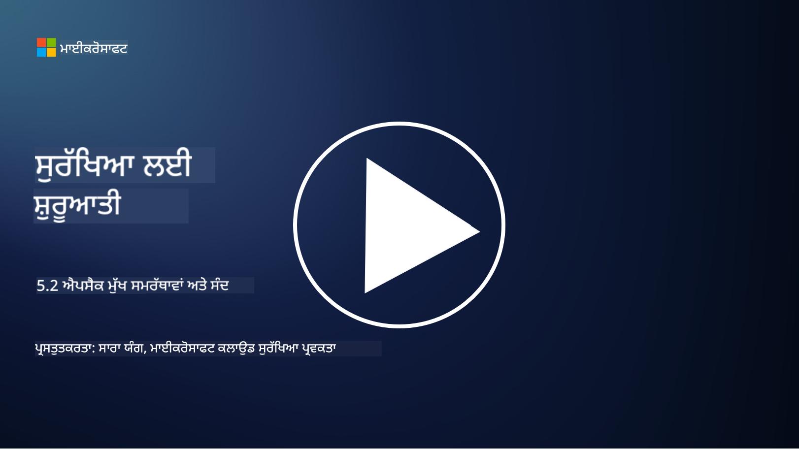

<!--
CO_OP_TRANSLATOR_METADATA:
{
  "original_hash": "790a3fa7e535ec60bb51bde13e759781",
  "translation_date": "2025-09-04T00:49:41+00:00",
  "source_file": "5.2 AppSec key capabilities.md",
  "language_code": "pa"
}
-->
## ਜਾਣ ਪਛਾਣ

ਇਸ ਪਾਠ ਵਿੱਚ, ਅਸੀਂ ਉਹ ਮੁੱਖ ਯੋਗਤਾਵਾਂ ਅਤੇ ਸੰਦਾਂ ਬਾਰੇ ਗੱਲ ਕਰਾਂਗੇ ਜੋ ਐਪਲੀਕੇਸ਼ਨ ਸੁਰੱਖਿਆ ਵਿੱਚ ਵਰਤੇ ਜਾਂਦੇ ਹਨ।

## ਐਪਸੈਕ ਦੀਆਂ ਮੁੱਖ ਯੋਗਤਾਵਾਂ ਅਤੇ ਸੰਦ

ਐਪਲੀਕੇਸ਼ਨ ਸੁਰੱਖਿਆ ਵਿੱਚ ਵਰਤੇ ਜਾਣ ਵਾਲੀਆਂ ਮੁੱਖ ਯੋਗਤਾਵਾਂ ਅਤੇ ਸੰਦ ਸੌਫਟਵੇਅਰ ਐਪਲੀਕੇਸ਼ਨ ਵਿੱਚ ਸੁਰੱਖਿਆ ਦੀਆਂ ਕਮਜ਼ੋਰੀਆਂ ਅਤੇ ਖਤਰੇ ਦੀ ਪਛਾਣ, ਘਟਾਉਣ ਅਤੇ ਰੋਕਥਾਮ ਲਈ ਬਹੁਤ ਜ਼ਰੂਰੀ ਹਨ। ਹੇਠਾਂ ਕੁਝ ਮਹੱਤਵਪੂਰਨ ਸੰਦ ਅਤੇ ਯੋਗਤਾਵਾਂ ਦਿੱਤੀਆਂ ਗਈਆਂ ਹਨ:

**1. ਸਟੈਟਿਕ ਐਪਲੀਕੇਸ਼ਨ ਸੁਰੱਖਿਆ ਟੈਸਟਿੰਗ (SAST)**:

- **ਯੋਗਤਾਵਾਂ**: ਐਪਲੀਕੇਸ਼ਨ ਦੇ ਕੋਡਬੇਸ ਵਿੱਚ ਸੁਰੱਖਿਆ ਦੀਆਂ ਕਮਜ਼ੋਰੀਆਂ ਦੀ ਪਛਾਣ ਕਰਨ ਲਈ ਸੋਰਸ ਕੋਡ, ਬਾਈਟਕੋਡ ਜਾਂ ਬਾਈਨਰੀ ਕੋਡ ਦਾ ਵਿਸ਼ਲੇਸ਼ਣ ਕਰਦਾ ਹੈ।

- **ਸੰਦ**: ਉਦਾਹਰਨਾਂ ਵਿੱਚ Fortify, Checkmarx, ਅਤੇ Veracode ਸ਼ਾਮਲ ਹਨ।

**2. ਡਾਇਨਾਮਿਕ ਐਪਲੀਕੇਸ਼ਨ ਸੁਰੱਖਿਆ ਟੈਸਟਿੰਗ (DAST)**:

- **ਯੋਗਤਾਵਾਂ**: ਚੱਲ ਰਹੀ ਐਪਲੀਕੇਸ਼ਨ ਨੂੰ ਸਕੈਨ ਕਰਦਾ ਹੈ, ਇਨਪੁਟ ਰਿਕਵੈਸਟ ਭੇਜ ਕੇ ਅਤੇ ਜਵਾਬਾਂ ਦਾ ਵਿਸ਼ਲੇਸ਼ਣ ਕਰਕੇ ਕਮਜ਼ੋਰੀਆਂ ਦੀ ਪਛਾਣ ਕਰਦਾ ਹੈ।

- **ਸੰਦ**: ਉਦਾਹਰਨਾਂ ਵਿੱਚ ZAP, Burp Suite, ਅਤੇ Qualys Web Application Scanning ਸ਼ਾਮਲ ਹਨ।

**3. ਇੰਟਰਐਕਟਿਵ ਐਪਲੀਕੇਸ਼ਨ ਸੁਰੱਖਿਆ ਟੈਸਟਿੰਗ (IAST)**:

- **ਯੋਗਤਾਵਾਂ**: SAST ਅਤੇ DAST ਦੇ ਤੱਤਾਂ ਨੂੰ runtime ਦੌਰਾਨ ਕੋਡ ਦਾ ਵਿਸ਼ਲੇਸ਼ਣ ਕਰਨ ਲਈ ਜੋੜਦਾ ਹੈ, ਜੋ ਜ਼ਿਆਦਾ ਸਹੀ ਨਤੀਜੇ ਅਤੇ ਘੱਟ ਗਲਤ ਪਾਜ਼ੀਟਿਵ ਪ੍ਰਦਾਨ ਕਰਦਾ ਹੈ।

- **ਸੰਦ**: ਉਦਾਹਰਨਾਂ ਵਿੱਚ Contrast Security ਅਤੇ HCL AppScan ਸ਼ਾਮਲ ਹਨ।

**4. ਰਨਟਾਈਮ ਐਪਲੀਕੇਸ਼ਨ ਸੈਲਫ-ਪ੍ਰੋਟੈਕਸ਼ਨ (RASP)**:

- **ਯੋਗਤਾਵਾਂ**: ਐਪਲੀਕੇਸ਼ਨ ਨੂੰ ਰੀਅਲ-ਟਾਈਮ ਵਿੱਚ ਮਾਨੀਟਰ ਅਤੇ ਸੁਰੱਖਿਅਤ ਕਰਦਾ ਹੈ, ਸੁਰੱਖਿਆ ਖਤਰੇ ਦੀ ਪਛਾਣ ਅਤੇ ਜਵਾਬ ਦਿੰਦਾ ਹੈ।

- **ਸੰਦ**: ਉਦਾਹਰਨਾਂ ਵਿੱਚ Veracode Runtime Protection ਅਤੇ F5 Advanced WAF with RASP ਸ਼ਾਮਲ ਹਨ।

**5. ਵੈਬ ਐਪਲੀਕੇਸ਼ਨ ਫਾਇਰਵਾਲ (WAFs)**:

- **ਯੋਗਤਾਵਾਂ**: ਐਪਲੀਕੇਸ਼ਨ ਅਤੇ ਇੰਟਰਨੈਟ ਦੇ ਵਿਚਕਾਰ ਇੱਕ ਸੁਰੱਖਿਆ ਪਰਤ ਪ੍ਰਦਾਨ ਕਰਦਾ ਹੈ, ਆਉਣ ਵਾਲੀ ਟ੍ਰੈਫਿਕ ਨੂੰ ਫਿਲਟਰ ਕਰਦਾ ਹੈ ਅਤੇ ਖਰਾਬ ਰਿਕਵੈਸਟਾਂ ਨੂੰ ਰੋਕਦਾ ਹੈ।

- **ਸੰਦ**: ਉਦਾਹਰਨਾਂ ਵਿੱਚ ModSecurity, AWS WAF, ਅਤੇ Akamai Kona Site Defender ਸ਼ਾਮਲ ਹਨ।

**6. ਡਿਪੈਂਡੈਂਸੀ ਸਕੈਨਿੰਗ**:

- **ਯੋਗਤਾਵਾਂ**: ਐਪਲੀਕੇਸ਼ਨ ਵਿੱਚ ਵਰਤੀਆਂ ਗਈਆਂ ਤੀਜੀ ਪਾਰਟੀ ਲਾਇਬ੍ਰੇਰੀਆਂ ਅਤੇ ਕੰਪੋਨੈਂਟਾਂ ਵਿੱਚ ਕਮਜ਼ੋਰੀਆਂ ਦੀ ਪਛਾਣ ਕਰਦਾ ਹੈ।

- **ਸੰਦ**: ਉਦਾਹਰਨਾਂ ਵਿੱਚ OWASP Dependency-Check ਅਤੇ Snyk ਸ਼ਾਮਲ ਹਨ।

**7. ਪੈਨਟ੍ਰੇਸ਼ਨ ਟੈਸਟਿੰਗ (ਪੈਨ ਟੈਸਟਿੰਗ)**:

- **ਯੋਗਤਾਵਾਂ**: ਅਸਲ-ਜਗਤ ਦੇ ਹਮਲਿਆਂ ਦੀ ਨਕਲ ਕਰਦਾ ਹੈ ਤਾਂ ਜੋ ਕਮਜ਼ੋਰੀਆਂ ਦੀ ਪਛਾਣ ਕੀਤੀ ਜਾ ਸਕੇ ਅਤੇ ਐਪਲੀਕੇਸ਼ਨ ਦੀ ਸੁਰੱਖਿਆ ਦਾ ਮੁਲਾਂਕਣ ਕੀਤਾ ਜਾ ਸਕੇ।

- **ਸੰਦ**: ਸਰਟੀਫਾਈਡ ਐਥਿਕਲ ਹੈਕਰਾਂ ਅਤੇ ਸੁਰੱਖਿਆ ਪੇਸ਼ੇਵਰਾਂ ਦੁਆਰਾ Metasploit ਅਤੇ Nmap ਵਰਗੇ ਸੰਦਾਂ ਦੀ ਵਰਤੋਂ ਕਰਕੇ ਕੀਤਾ ਜਾਂਦਾ ਹੈ।

**8. ਸੁਰੱਖਿਆ ਸਕੈਨਿੰਗ ਅਤੇ ਵਿਸ਼ਲੇਸ਼ਣ**:

- **ਯੋਗਤਾਵਾਂ**: ਜਾਣੀ-ਪਛਾਣੀ ਕਮਜ਼ੋਰੀਆਂ, ਕਨਫਿਗਰੇਸ਼ਨ ਗਲਤੀਆਂ, ਅਤੇ ਸੁਰੱਖਿਆ ਗਲਤ ਕਨਫਿਗਰੇਸ਼ਨ ਲਈ ਸਕੈਨ ਕਰਦਾ ਹੈ।

- **ਸੰਦ**: ਉਦਾਹਰਨਾਂ ਵਿੱਚ Nessus, Qualys Vulnerability Management, ਅਤੇ OpenVAS ਸ਼ਾਮਲ ਹਨ।

**9. ਕੰਟੇਨਰ ਸੁਰੱਖਿਆ ਸੰਦ**:

- **ਯੋਗਤਾਵਾਂ**: ਕੰਟੇਨਰਾਈਜ਼ਡ ਐਪਲੀਕੇਸ਼ਨ ਅਤੇ ਉਨ੍ਹਾਂ ਦੇ ਵਾਤਾਵਰਣਾਂ ਨੂੰ ਸੁਰੱਖਿਅਤ ਕਰਨ 'ਤੇ ਧਿਆਨ ਕੇਂਦਰਿਤ ਕਰਦਾ ਹੈ।

- **ਸੰਦ**: ਉਦਾਹਰਨਾਂ ਵਿੱਚ Docker Security Scanning ਅਤੇ Aqua Security ਸ਼ਾਮਲ ਹਨ।

**10. ਸੁਰੱਖਿਅਤ ਵਿਕਾਸ ਪ੍ਰਸ਼ਿਕਸ਼ਣ**:

- **ਯੋਗਤਾਵਾਂ**: ਵਿਕਾਸ ਟੀਮਾਂ ਲਈ ਸੁਰੱਖਿਅਤ ਕੋਡਿੰਗ ਅਭਿਆਸਾਂ ਨੂੰ فروغ ਦੇਣ ਲਈ ਪ੍ਰਸ਼ਿਕਸ਼ਣ ਅਤੇ ਜਾਗਰੂਕਤਾ ਪ੍ਰੋਗਰਾਮ ਪ੍ਰਦਾਨ ਕਰਦਾ ਹੈ।

- **ਸੰਦ**: ਕਸਟਮਾਈਜ਼ਡ ਪ੍ਰਸ਼ਿਕਸ਼ਣ ਪ੍ਰੋਗਰਾਮ ਅਤੇ ਪਲੇਟਫਾਰਮ।

**11. ਸੁਰੱਖਿਆ ਟੈਸਟਿੰਗ ਫਰੇਮਵਰਕ**:

- **ਯੋਗਤਾਵਾਂ**: ਵੱਖ-ਵੱਖ ਐਪਲੀਕੇਸ਼ਨ ਸੁਰੱਖਿਆ ਟੈਸਟਿੰਗ ਦੀਆਂ ਜ਼ਰੂਰਤਾਂ ਲਈ ਵਿਸਤ੍ਰਿਤ ਟੈਸਟਿੰਗ ਫਰੇਮਵਰਕ ਪ੍ਰਦਾਨ ਕਰਦਾ ਹੈ।

- **ਸੰਦ**: OWASP Amass, OWASP OWTF ਅਤੇ FrAppSec।

**12. ਸੁਰੱਖਿਅਤ ਕੋਡ ਰਿਵਿਊ ਸੰਦ**:

- **ਯੋਗਤਾਵਾਂ**: ਸੁਰੱਖਿਆ ਦੀਆਂ ਕਮਜ਼ੋਰੀਆਂ ਅਤੇ ਕੋਡਿੰਗ ਦੇ ਸ੍ਰੇਸ਼ਠ ਅਭਿਆਸਾਂ ਲਈ ਸੋਰਸ ਕੋਡ ਦੀ ਸਮੀਖਾ ਕਰਦਾ ਹੈ।

- **ਸੰਦ**: ਉਦਾਹਰਨਾਂ ਵਿੱਚ SonarQube ਅਤੇ Checkmarx ਸ਼ਾਮਲ ਹਨ।

**13. ਸੁਰੱਖਿਅਤ APIs ਅਤੇ ਮਾਈਕਰੋਸਰਵਿਸ ਸੰਦ**:

- **ਯੋਗਤਾਵਾਂ**: APIs ਅਤੇ ਮਾਈਕਰੋਸਰਵਿਸ ਦੀ ਸੁਰੱਖਿਆ 'ਤੇ ਧਿਆਨ ਕੇਂਦਰਿਤ ਕਰਦਾ ਹੈ, ਜਿਸ ਵਿੱਚ ਪ੍ਰਮਾਣਿਕਤਾ, ਅਧਿਕਾਰ, ਅਤੇ ਡਾਟਾ ਸੁਰੱਖਿਆ ਸ਼ਾਮਲ ਹੈ।

- **ਸੰਦ**: ਉਦਾਹਰਨਾਂ ਵਿੱਚ Apigee, AWS API Gateway, ਅਤੇ Istio ਸ਼ਾਮਲ ਹਨ।

## ਹੋਰ ਪੜ੍ਹਾਈ

- [What Is Application Security? Concepts, Tools & Best Practices | HackerOne](https://www.hackerone.com/knowledge-center/what-application-security-concepts-tools-best-practices)
- [What is IAST? (Interactive Application Security Testing) (comparitech.com)](https://www.comparitech.com/net-admin/what-is-iast/)
- [10 Types of Application Security Testing Tools: When and How to Use Them (cmu.edu)](https://insights.sei.cmu.edu/blog/10-types-of-application-security-testing-tools-when-and-how-to-use-them/)
- [Shifting the Balance of Cybersecurity Risk: Principles and Approaches for Security-by-Design and Default | Cyber.gov.au](https://www.cyber.gov.au/about-us/view-all-content/publications/principles-and-approaches-for-security-by-design-and-default)

---

**ਅਸਵੀਕਰਤੀ**:  
ਇਹ ਦਸਤਾਵੇਜ਼ AI ਅਨੁਵਾਦ ਸੇਵਾ [Co-op Translator](https://github.com/Azure/co-op-translator) ਦੀ ਵਰਤੋਂ ਕਰਕੇ ਅਨੁਵਾਦ ਕੀਤਾ ਗਿਆ ਹੈ। ਜਦੋਂ ਕਿ ਅਸੀਂ ਸਹੀ ਹੋਣ ਦਾ ਯਤਨ ਕਰਦੇ ਹਾਂ, ਕਿਰਪਾ ਕਰਕੇ ਧਿਆਨ ਦਿਓ ਕਿ ਸਵੈਚਾਲਿਤ ਅਨੁਵਾਦਾਂ ਵਿੱਚ ਗਲਤੀਆਂ ਜਾਂ ਅਸੁੱਚਤਤਾਵਾਂ ਹੋ ਸਕਦੀਆਂ ਹਨ। ਇਸ ਦੀ ਮੂਲ ਭਾਸ਼ਾ ਵਿੱਚ ਮੌਜੂਦ ਮੂਲ ਦਸਤਾਵੇਜ਼ ਨੂੰ ਅਧਿਕਾਰਤ ਸਰੋਤ ਮੰਨਿਆ ਜਾਣਾ ਚਾਹੀਦਾ ਹੈ। ਮਹੱਤਵਪੂਰਨ ਜਾਣਕਾਰੀ ਲਈ, ਪੇਸ਼ੇਵਰ ਮਨੁੱਖੀ ਅਨੁਵਾਦ ਦੀ ਸਿਫਾਰਸ਼ ਕੀਤੀ ਜਾਂਦੀ ਹੈ। ਇਸ ਅਨੁਵਾਦ ਦੇ ਪ੍ਰਯੋਗ ਤੋਂ ਪੈਦਾ ਹੋਣ ਵਾਲੇ ਕਿਸੇ ਵੀ ਗਲਤਫਹਿਮੀ ਜਾਂ ਗਲਤ ਵਿਆਖਿਆ ਲਈ ਅਸੀਂ ਜ਼ਿੰਮੇਵਾਰ ਨਹੀਂ ਹਾਂ।  