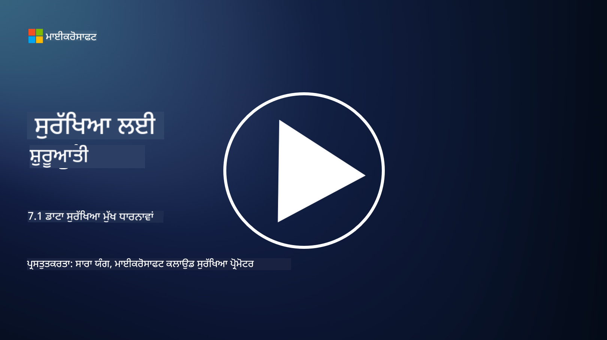

<!--
CO_OP_TRANSLATOR_METADATA:
{
  "original_hash": "9703868f41dcddd5a98dea9ea6fcd94d",
  "translation_date": "2025-09-03T23:55:43+00:00",
  "source_file": "7.1 Data security key concepts.md",
  "language_code": "pa"
}
-->
# ਡਾਟਾ ਸੁਰੱਖਿਆ ਦੇ ਮੁੱਖ ਸਿਧਾਂਤ

ਅਸੀਂ ਇਸ ਕੋਰਸ ਵਿੱਚ ਕਈ ਵਾਰ ਡਾਟਾ ਸੁਰੱਖਿਆ ਦਾ ਜ਼ਿਕਰ ਕੀਤਾ ਹੈ। ਹੁਣ, ਆਓ ਇਸ ਵਿਸ਼ੇ ਨੂੰ ਹੋਰ ਗਹਿਰਾਈ ਨਾਲ ਸਮਝੀਏ। ਇਸ ਪਾਠ ਵਿੱਚ ਤੁਸੀਂ ਸਿੱਖੋਗੇ:

- ਡਾਟਾ ਸੁਰੱਖਿਆ ਕੀ ਹੈ?

- ਡਾਟਾ ਵਰਗੀਕਰਨ ਕੀ ਹੈ?

- ਡਾਟਾ ਲਾਈਫਸਾਈਕਲ ਪ੍ਰਬੰਧਨ ਕੀ ਹੈ?

- ਡਾਟਾ ਲਾਸ ਪ੍ਰਿਵੈਂਸ਼ਨ (DLP) ਕੀ ਹੈ?

- ਸੰਗਠਨ ਲਈ ਡਾਟਾ ਸੁਰੱਖਿਆ ਕਿਉਂ ਮਹੱਤਵਪੂਰਨ ਹੈ?

## ਡਾਟਾ ਸੁਰੱਖਿਆ ਕੀ ਹੈ?

**ਡਾਟਾ ਸੁਰੱਖਿਆ** ਦਾ ਮਤਲਬ ਹੈ ਡਿਜ਼ੀਟਲ ਡਾਟਾ, ਜਿਵੇਂ ਕਿ ਡਾਟਾਬੇਸ, ਫਾਈਲਾਂ ਅਤੇ ਸੰਵੇਦਨਸ਼ੀਲ ਜਾਣਕਾਰੀ ਨੂੰ ਬਿਨਾਂ ਇਜਾਜ਼ਤ ਪਹੁੰਚ, ਖੁਲਾਸੇ, ਬਦਲਾਅ ਜਾਂ ਨਸ਼ਟ ਹੋਣ ਤੋਂ ਬਚਾਉਣਾ। ਡਾਟਾ ਸੁਰੱਖਿਆ ਦਾ ਮੁੱਖ ਉਦੇਸ਼ ਡਾਟਾ ਦੀ ਗੁਪਤਤਾ, ਅਖੰਡਤਾ ਅਤੇ ਉਪਲਬਧਤਾ ਨੂੰ ਯਕੀਨੀ ਬਣਾਉਣਾ ਹੈ। ਇਸ ਵਿੱਚ ਤਕਨੀਕੀ, ਪ੍ਰਸ਼ਾਸਨਿਕ ਅਤੇ ਭੌਤਿਕ ਸੁਰੱਖਿਆ ਉਪਾਅ ਲਾਗੂ ਕਰਨਾ ਸ਼ਾਮਲ ਹੈ, ਜੋ ਸਾਇਬਰ ਹਮਲਿਆਂ, ਅੰਦਰੂਨੀ ਖਤਰੇ ਅਤੇ ਡਾਟਾ ਲੀਕ ਵਰਗੀਆਂ ਸਮੱਸਿਆਵਾਂ ਤੋਂ ਸੁਰੱਖਿਆ ਪ੍ਰਦਾਨ ਕਰਦੇ ਹਨ। ਡਾਟਾ ਸੁਰੱਖਿਆ ਦੇ ਉਪਾਅ ਵਿੱਚ ਇਨਕ੍ਰਿਪਸ਼ਨ, ਐਕਸੈਸ ਕੰਟਰੋਲ, ਪ੍ਰਮਾਣਿਕਤਾ, ਆਡਿਟ ਟ੍ਰੇਲ ਅਤੇ ਸੁਰੱਖਿਆ ਨੀਤੀਆਂ ਸ਼ਾਮਲ ਹੋ ਸਕਦੀਆਂ ਹਨ।

## ਡਾਟਾ ਵਰਗੀਕਰਨ ਕੀ ਹੈ?

**ਡਾਟਾ ਵਰਗੀਕਰਨ** ਦਾ ਮਤਲਬ ਹੈ ਡਾਟਾ ਨੂੰ ਇਸ ਦੀ ਸੰਵੇਦਨਸ਼ੀਲਤਾ, ਮੁੱਲ ਅਤੇ ਸੰਗਠਨ ਲਈ ਮਹੱਤਤਾ ਦੇ ਆਧਾਰ 'ਤੇ ਸ਼੍ਰੇਣੀਬੱਧ ਕਰਨਾ। ਡਾਟਾ ਵਰਗੀਕਰਨ ਦਾ ਉਦੇਸ਼ ਸੰਗਠਨਾਂ ਨੂੰ ਵੱਖ-ਵੱਖ ਕਿਸਮ ਦੇ ਡਾਟਾ ਦੀ ਸੁਰੱਖਿਆ ਅਤੇ ਸੰਭਾਲ ਲਈ ਤਰਜੀਹਾਂ ਨਿਰਧਾਰਤ ਕਰਨ ਵਿੱਚ ਮਦਦ ਕਰਨਾ ਹੈ। ਆਮ ਡਾਟਾ ਵਰਗੀਕਰਨ ਸ਼੍ਰੇਣੀਆਂ ਵਿੱਚ "ਪਬਲਿਕ," "ਇੰਟਰਨਲ," "ਕਾਨਫ਼ਿਡੈਂਸ਼ਲ," ਅਤੇ "ਰਿਸਟ੍ਰਿਕਟਡ" ਜਾਂ "ਹਾਈਲੀ ਕਾਨਫ਼ਿਡੈਂਸ਼ਲ" ਸ਼ਾਮਲ ਹਨ। ਜਦੋਂ ਡਾਟਾ ਵਰਗੀਕ੍ਰਿਤ ਕੀਤਾ ਜਾਂਦਾ ਹੈ, ਤਾਂ ਸੰਗਠਨ ਸੰਵੇਦਨਸ਼ੀਲ ਡਾਟਾ ਦੀ ਯਥੋਚਿਤ ਸੁਰੱਖਿਆ ਅਤੇ ਨਿਯਮਾਂ ਦੀ ਪਾਲਣਾ ਯਕੀਨੀ ਬਣਾਉਣ ਲਈ ਸੁਰੱਖਿਆ ਕੰਟਰੋਲ ਅਤੇ ਪਹੁੰਚ ਸੀਮਾਵਾਂ ਲਾਗੂ ਕਰ ਸਕਦੇ ਹਨ।

## ਡਾਟਾ ਲਾਈਫਸਾਈਕਲ ਪ੍ਰਬੰਧਨ ਕੀ ਹੈ?

**ਡਾਟਾ ਲਾਈਫਸਾਈਕਲ ਪ੍ਰਬੰਧਨ** ਦਾ ਮਤਲਬ ਹੈ ਡਾਟਾ ਦੇ ਪੂਰੇ ਜੀਵਨ ਚੱਕਰ ਦੌਰਾਨ ਇਸਦਾ ਪ੍ਰਬੰਧਨ ਕਰਨ ਲਈ ਇੱਕ ਢਾਂਚਾਗਤ ਪਹੁੰਚ। ਇਹ ਚੱਕਰ ਡਾਟਾ ਦੇ ਸਿਰਜਣ ਜਾਂ ਪ੍ਰਾਪਤੀ ਤੋਂ ਲੈ ਕੇ ਇਸਦੇ ਆਰਕਾਈਵ ਜਾਂ ਮਿਟਾਏ ਜਾਣ ਤੱਕ ਦੇ ਮੋੜਾਂ 'ਤੇ ਆਧਾਰਿਤ ਹੁੰਦਾ ਹੈ। ਡਾਟਾ ਲਾਈਫਸਾਈਕਲ ਵਿੱਚ ਆਮ ਤੌਰ 'ਤੇ ਸਿਰਜਣ, ਸਟੋਰੇਜ, ਪ੍ਰੋਸੈਸਿੰਗ, ਟ੍ਰਾਂਸਮਿਸ਼ਨ, ਆਰਕਾਈਵਲ ਅਤੇ ਨਸ਼ਟ ਕਰਨ ਦੇ ਪੜਾਅ ਸ਼ਾਮਲ ਹੁੰਦੇ ਹਨ। ਇਸ ਪ੍ਰਬੰਧਨ ਵਿੱਚ ਹਰ ਪੜਾਅ ਲਈ ਨੀਤੀਆਂ ਅਤੇ ਪ੍ਰਕਿਰਿਆਵਾਂ ਨਿਰਧਾਰਤ ਕਰਨਾ ਸ਼ਾਮਲ ਹੈ, ਜਿਵੇਂ ਕਿ ਡਾਟਾ ਰਿਟੇਨਸ਼ਨ, ਪਹੁੰਚ ਕੰਟਰੋਲ, ਬੈਕਅੱਪ ਅਤੇ ਡਾਟਾ ਕਲੀਨਸਿੰਗ। ਪ੍ਰਭਾਵਸ਼ਾਲੀ ਡਾਟਾ ਲਾਈਫਸਾਈਕਲ ਪ੍ਰਬੰਧਨ ਸੰਗਠਨਾਂ ਨੂੰ ਡਾਟਾ ਸਟੋਰੇਜ ਦਾ ਸੁਧਾਰ ਕਰਨ, ਡਾਟਾ ਦੀ ਗੁਣਵੱਤਾ ਵਿੱਚ ਸੁਧਾਰ ਕਰਨ ਅਤੇ ਡਾਟਾ ਸੁਰੱਖਿਆ ਨਿਯਮਾਂ ਦੀ ਪਾਲਣਾ ਯਕੀਨੀ ਬਣਾਉਣ ਵਿੱਚ ਮਦਦ ਕਰਦਾ ਹੈ।

## ਡਾਟਾ ਲਾਸ ਪ੍ਰਿਵੈਂਸ਼ਨ (DLP) ਕੀ ਹੈ?

**ਡਾਟਾ ਲਾਸ ਪ੍ਰਿਵੈਂਸ਼ਨ (DLP)** ਤਕਨੀਕਾਂ, ਨੀਤੀਆਂ ਅਤੇ ਅਭਿਆਸਾਂ ਦੇ ਇੱਕ ਸੈੱਟ ਨੂੰ ਦਰਸਾਉਂਦਾ ਹੈ ਜੋ ਸੰਵੇਦਨਸ਼ੀਲ ਜਾਂ ਗੁਪਤ ਡਾਟਾ ਦੀ ਬਿਨਾਂ ਇਜਾਜ਼ਤ ਪਹੁੰਚ, ਸਾਂਝਾ ਕਰਨ ਜਾਂ ਲੀਕ ਹੋਣ ਤੋਂ ਰੋਕਣ ਲਈ ਤਿਆਰ ਕੀਤਾ ਗਿਆ ਹੈ। DLP ਹੱਲ ਸਮੱਗਰੀ ਦੀ ਜਾਂਚ ਅਤੇ ਸੰਦਰਭੀ ਵਿਸ਼ਲੇਸ਼ਣ ਦੀ ਵਰਤੋਂ ਕਰਦੇ ਹਨ ਤਾਂ ਜੋ ਡਾਟਾ ਦੀ ਗਤੀਸ਼ੀਲਤਾ (ਜਿਵੇਂ ਕਿ ਈਮੇਲ, ਵੈੱਬ ਟ੍ਰੈਫਿਕ), ਸਟੋਰੇਜ ਵਿੱਚ ਮੌਜੂਦ ਡਾਟਾ (ਜਿਵੇਂ ਕਿ ਸਟੋਰ ਕੀਤੀਆਂ ਫਾਈਲਾਂ ਅਤੇ ਡਾਟਾਬੇਸ), ਅਤੇ ਵਰਤੋਂ ਵਿੱਚ ਡਾਟਾ (ਜਿਵੇਂ ਕਿ ਵਰਤੋਂਕਾਰਾਂ ਦੁਆਰਾ ਪਹੁੰਚ ਕੀਤੀ ਜਾਂ ਸੰਸੋਧਿਤ ਕੀਤੀ ਜਾਣ ਵਾਲੀ ਜਾਣਕਾਰੀ) ਦੀ ਨਿਗਰਾਨੀ ਅਤੇ ਨਿਯੰਤਰਣ ਕੀਤਾ ਜਾ ਸਕੇ। DLP ਦਾ ਉਦੇਸ਼ ਸੰਵੇਦਨਸ਼ੀਲ ਡਾਟਾ ਦੀ ਪਛਾਣ ਕਰਨਾ ਅਤੇ ਇਸਨੂੰ ਬਲੌਕ ਜਾਂ ਇਨਕ੍ਰਿਪਟ ਕਰਨਾ ਹੈ ਤਾਂ ਜੋ ਡਾਟਾ ਲੀਕ ਨੂੰ ਰੋਕਿਆ ਜਾ ਸਕੇ, ਡਾਟਾ ਸੁਰੱਖਿਆ ਨਿਯਮਾਂ ਦੀ ਪਾਲਣਾ ਕੀਤੀ ਜਾ ਸਕੇ ਅਤੇ ਸੰਗਠਨ ਦੀ ਸਾਖ ਨੂੰ ਸੁਰੱਖਿਅਤ ਕੀਤਾ ਜਾ ਸਕੇ।

## ਸੰਗਠਨ ਲਈ ਡਾਟਾ ਸੁਰੱਖਿਆ ਕਿਉਂ ਮਹੱਤਵਪੂਰਨ ਹੈ?

ਡਾਟਾ ਸੁਰੱਖਿਆ ਸੰਗਠਨਾਂ ਲਈ ਕਈ ਕਾਰਨਾਂ ਕਰਕੇ ਬਹੁਤ ਮਹੱਤਵਪੂਰਨ ਹੈ:

- **ਸੰਵੇਦਨਸ਼ੀਲ ਜਾਣਕਾਰੀ ਦੀ ਸੁਰੱਖਿਆ**: ਸੰਗਠਨ ਅਕਸਰ ਗਾਹਕ ਰਿਕਾਰਡ, ਬੌਧਿਕ ਸੰਪਤੀ, ਵਿੱਤੀ ਡਾਟਾ ਅਤੇ ਕਰਮਚਾਰੀ ਜਾਣਕਾਰੀ ਵਰਗਾ ਸੰਵੇਦਨਸ਼ੀਲ ਡਾਟਾ ਸਟੋਰ ਕਰਦੇ ਹਨ। ਡਾਟਾ ਸੁਰੱਖਿਆ ਇਸ ਜਾਣਕਾਰੀ ਨੂੰ ਬਿਨਾਂ ਇਜਾਜ਼ਤ ਪਹੁੰਚ ਜਾਂ ਚੋਰੀ ਤੋਂ ਬਚਾਉਂਦੀ ਹੈ।

- **ਨਿਯਮਾਂ ਦੀ ਪਾਲਣਾ**: ਕਈ ਉਦਯੋਗਾਂ ਅਤੇ ਖੇਤਰਾਂ ਵਿੱਚ ਸਖਤ ਡਾਟਾ ਸੁਰੱਖਿਆ ਅਤੇ ਗੋਪਨੀਯਤਾ ਨਿਯਮ ਹਨ। ਡਾਟਾ ਸੁਰੱਖਿਆ ਸੰਗਠਨਾਂ ਨੂੰ ਇਨ੍ਹਾਂ ਕਾਨੂੰਨਾਂ ਦੀ ਪਾਲਣਾ ਕਰਨ ਵਿੱਚ ਮਦਦ ਕਰਦੀ ਹੈ, ਜਿਨ੍ਹਾਂ ਨਾਲ ਕਾਨੂੰਨੀ ਜੁਰਮਾਨਿਆਂ ਅਤੇ ਸਾਖ ਨੂੰ ਨੁਕਸਾਨ ਤੋਂ ਬਚਿਆ ਜਾ ਸਕਦਾ ਹੈ।

- **ਡਾਟਾ ਲੀਕ ਦੀ ਰੋਕਥਾਮ**: ਡਾਟਾ ਲੀਕ ਵਿੱਤੀ ਨੁਕਸਾਨ, ਸਾਖ ਨੂੰ ਨੁਕਸਾਨ ਅਤੇ ਕਾਨੂੰਨੀ ਨਤੀਜਿਆਂ ਦਾ ਕਾਰਨ ਬਣ ਸਕਦੇ ਹਨ। ਪ੍ਰਭਾਵਸ਼ਾਲੀ ਡਾਟਾ ਸੁਰੱਖਿਆ ਉਪਾਅ ਡਾਟਾ ਲੀਕ ਨੂੰ ਰੋਕਣ ਜਾਂ ਇਸਦੇ ਪ੍ਰਭਾਵ ਨੂੰ ਘਟਾਉਣ ਵਿੱਚ ਮਦਦ ਕਰਦੇ ਹਨ।

- **ਭਰੋਸੇ ਦੀ ਰੱਖਿਆ**: ਗਾਹਕ ਅਤੇ ਹਿੱਸੇਦਾਰ ਸੰਗਠਨਾਂ 'ਤੇ ਆਪਣਾ ਡਾਟਾ ਸੌਂਪਦੇ ਹਨ। ਡਾਟਾ ਸੁਰੱਖਿਆ ਦੀਆਂ ਘਟਨਾਵਾਂ ਭਰੋਸੇ ਨੂੰ ਘਟਾਉਂਦੀਆਂ ਹਨ। ਮਜ਼ਬੂਤ ਡਾਟਾ ਸੁਰੱਖਿਆ ਨੂੰ ਬਰਕਰਾਰ ਰੱਖਣ ਨਾਲ ਭਰੋਸਾ ਅਤੇ ਗਾਹਕਾਂ ਦਾ ਵਿਸ਼ਵਾਸ ਬਣਿਆ ਰਹਿੰਦਾ ਹੈ।

- **ਮੁਕਾਬਲੇ ਦਾ ਫਾਇਦਾ**: ਡਾਟਾ ਸੁਰੱਖਿਆ ਪ੍ਰਤੀ ਵਚਨਬੱਧਤਾ ਦਿਖਾਉਣਾ ਇੱਕ ਮੁਕਾਬਲੇ ਦਾ ਫਾਇਦਾ ਹੋ ਸਕਦਾ ਹੈ। ਗਾਹਕ ਅਤੇ ਸਾਥੀ ਉਹਨਾਂ ਸੰਗਠਨਾਂ ਨਾਲ ਕੰਮ ਕਰਨ ਨੂੰ ਤਰਜੀਹ ਦਿੰਦੇ ਹਨ ਜੋ ਡਾਟਾ ਸੁਰੱਖਿਆ ਨੂੰ ਗੰਭੀਰਤਾ ਨਾਲ ਲੈਂਦੇ ਹਨ।

- **ਚਾਲੂ ਕਾਰੋਬਾਰ ਦੀ ਲਗਾਤਾਰਤਾ**: ਡਾਟਾ ਸੁਰੱਖਿਆ ਦੇ ਉਪਾਅ, ਜਿਵੇਂ ਕਿ ਡਾਟਾ ਬੈਕਅੱਪ ਅਤੇ ਆਫ਼ਤ ਪੂਰਨ ਯੋਜਨਾ, ਡਾਟਾ ਦੇ ਉਪਲਬਧ ਹੋਣ ਅਤੇ ਡਾਟਾ ਨੁਕਸਾਨ ਜਾਂ ਆਫ਼ਤਾਂ ਦੇ ਮੌਕੇ 'ਤੇ ਕਾਰੋਬਾਰ ਦੀ ਲਗਾਤਾਰਤਾ ਨੂੰ ਯਕੀਨੀ ਬਣਾਉਂਦੇ ਹਨ।

- **ਅੰਦਰੂਨੀ ਖਤਰੇ ਤੋਂ ਸੁਰੱਖਿਆ**: ਡਾਟਾ ਸੁਰੱਖਿਆ ਦੇ ਉਪਾਅ ਸੰਗਠਨ ਦੇ ਅੰਦਰੋਂ ਆਉਣ ਵਾਲੇ ਖਤਰੇ, ਜਿਵੇਂ ਕਿ ਕਰਮਚਾਰੀਆਂ ਦੁਆਰਾ ਅਣਜਾਣੇ ਵਿੱਚ ਡਾਟਾ ਦਾ ਖੁਲਾਸਾ ਅਤੇ ਅੰਦਰੂਨੀ ਵਿਘਾਤਕ ਕਾਰਵਾਈਆਂ ਨੂੰ ਵੀ ਪਤਾ ਲਗਾਉਂਦੇ ਹਨ।

ਸਾਰ ਦੇ ਤੌਰ 'ਤੇ, ਡਾਟਾ ਸੁਰੱਖਿਆ ਸੰਵੇਦਨਸ਼ੀਲ ਜਾਣਕਾਰੀ ਦੀ ਸੁਰੱਖਿਆ, ਨਿਯਮਾਂ ਦੀ ਪਾਲਣਾ, ਡਾਟਾ ਲੀਕ ਦੀ ਰੋਕਥਾਮ, ਭਰੋਸੇ ਦੀ ਰੱਖਿਆ ਅਤੇ ਸੰਗਠਨ ਦੀ ਸਫਲਤਾ ਅਤੇ ਸਾਖ ਨੂੰ ਯਕੀਨੀ ਬਣਾਉਣ ਲਈ ਜ਼ਰੂਰੀ ਹੈ।

## ਹੋਰ ਪੜ੍ਹਾਈ

- [What Is Data Security? | Microsoft Security](https://www.microsoft.com/en-au/security/business/security-101/what-is-data-security?WT.mc_id=academic-96948-sayoung)  
- [Automatically Classify & Protect Documents & Data | Microsoft Purview Information Protection](https://youtu.be/v8LqmzBUaOo)  
- [Example data classification policy](https://www.cmu.edu/data/guidelines/data-classification.html)  
- [What is Data Security? Data Security Definition and Overview | IBM](https://www.ibm.com/topics/data-security)  
- [Data Lifecycle Management: A 2023 Guide for Your Business (cloudwards.net)](https://www.cloudwards.net/data-lifecycle-management/)  
- [What is data loss prevention (DLP)? | Microsoft Security](https://www.microsoft.com/security/business/security-101/what-is-data-loss-prevention-dlp?WT.mc_id=academic-96948-sayoung)  
- [What is DLP? How data loss prevention software works and why you need it | CSO Online](https://www.csoonline.com/article/569559/what-is-dlp-how-data-loss-prevention-software-works-and-why-you-need-it.html)  

---

**ਅਸਵੀਕਰਤੀ**:  
ਇਹ ਦਸਤਾਵੇਜ਼ AI ਅਨੁਵਾਦ ਸੇਵਾ [Co-op Translator](https://github.com/Azure/co-op-translator) ਦੀ ਵਰਤੋਂ ਕਰਕੇ ਅਨੁਵਾਦ ਕੀਤਾ ਗਿਆ ਹੈ। ਜਦੋਂ ਕਿ ਅਸੀਂ ਸਹੀ ਹੋਣ ਦਾ ਯਤਨ ਕਰਦੇ ਹਾਂ, ਕਿਰਪਾ ਕਰਕੇ ਧਿਆਨ ਦਿਓ ਕਿ ਸਵੈਚਾਲਿਤ ਅਨੁਵਾਦਾਂ ਵਿੱਚ ਗਲਤੀਆਂ ਜਾਂ ਅਸੁਣਤੀਆਂ ਹੋ ਸਕਦੀਆਂ ਹਨ। ਇਸ ਦੀ ਮੂਲ ਭਾਸ਼ਾ ਵਿੱਚ ਮੌਜੂਦ ਮੂਲ ਦਸਤਾਵੇਜ਼ ਨੂੰ ਪ੍ਰਮਾਣਿਕ ਸਰੋਤ ਮੰਨਿਆ ਜਾਣਾ ਚਾਹੀਦਾ ਹੈ। ਮਹੱਤਵਪੂਰਨ ਜਾਣਕਾਰੀ ਲਈ, ਪੇਸ਼ੇਵਰ ਮਨੁੱਖੀ ਅਨੁਵਾਦ ਦੀ ਸਿਫਾਰਸ਼ ਕੀਤੀ ਜਾਂਦੀ ਹੈ। ਇਸ ਅਨੁਵਾਦ ਦੀ ਵਰਤੋਂ ਤੋਂ ਪੈਦਾ ਹੋਣ ਵਾਲੀਆਂ ਕਿਸੇ ਵੀ ਗਲਤਫਹਮੀਆਂ ਜਾਂ ਗਲਤ ਵਿਆਖਿਆਵਾਂ ਲਈ ਅਸੀਂ ਜ਼ਿੰਮੇਵਾਰ ਨਹੀਂ ਹਾਂ।  