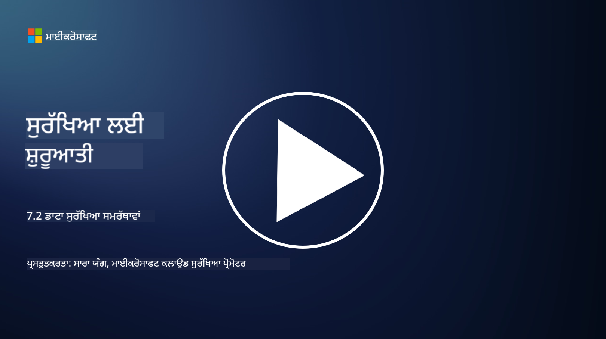

<!--
CO_OP_TRANSLATOR_METADATA:
{
  "original_hash": "50697add9758e54693442d502d2d5f8a",
  "translation_date": "2025-09-04T00:55:33+00:00",
  "source_file": "7.2 Data security capabilities.md",
  "language_code": "pa"
}
-->
# ਡਾਟਾ ਸੁਰੱਖਿਆ ਸਮਰੱਥਾਵਾਂ

ਇਸ ਭਾਗ ਵਿੱਚ, ਅਸੀਂ ਡਾਟਾ ਸੁਰੱਖਿਆ ਵਿੱਚ ਵਰਤੇ ਜਾਣ ਵਾਲੇ ਮੁੱਖ ਸੰਦਾਂ ਅਤੇ ਸਮਰੱਥਾਵਾਂ ਬਾਰੇ ਵਧੇਰੇ ਵੇਰਵੇ ਕਵਰ ਕਰਾਂਗੇ:

**ਪ੍ਰਸਤਾਵਨਾ**

ਇਸ ਪਾਠ ਵਿੱਚ, ਅਸੀਂ ਕਵਰ ਕਰਾਂਗੇ:

- ਡਾਟਾ ਲੋਸ ਪ੍ਰਿਵੈਂਸ਼ਨ ਟੂਲਿੰਗ ਕੀ ਹੈ?

- ਇਨਸਾਈਡਰ ਰਿਸਕ ਮੈਨੇਜਮੈਂਟ ਟੂਲਿੰਗ ਕੀ ਹੈ?

- ਕਿਹੜੇ ਡਾਟਾ ਰਿਟੈਂਸ਼ਨ ਟੂਲ ਉਪਲਬਧ ਹਨ?

## ਡਾਟਾ ਲੋਸ ਪ੍ਰਿਵੈਂਸ਼ਨ ਟੂਲਿੰਗ ਕੀ ਹੈ?

ਡਾਟਾ ਲੋਸ ਪ੍ਰਿਵੈਂਸ਼ਨ (DLP) ਟੂਲਿੰਗ ਸਾਫਟਵੇਅਰ ਹੱਲਾਂ ਅਤੇ ਤਕਨਾਲੋਜੀਆਂ ਦੇ ਇੱਕ ਸੈੱਟ ਨੂੰ ਦਰਸਾਉਂਦੀ ਹੈ ਜੋ ਸੰਸਥਾ ਦੇ ਅੰਦਰ ਸੰਵੇਦਨਸ਼ੀਲ ਜਾਂ ਗੁਪਤ ਡਾਟਾ ਦੀ ਅਣਅਧਿਕ੍ਰਿਤ ਪਹੁੰਚ, ਸਾਂਝਾ ਕਰਨ ਜਾਂ ਲੀਕ ਹੋਣ ਤੋਂ ਰੋਕਣ ਲਈ ਤਿਆਰ ਕੀਤੀ ਗਈ ਹੈ। ਇਹ ਸੰਦ ਸਮੱਗਰੀ ਦੀ ਜਾਂਚ, ਨੀਤੀ ਲਾਗੂ ਕਰਨ ਅਤੇ ਨਿਗਰਾਨੀ ਦੇ ਜ਼ਰੀਏ ਸੰਵੇਦਨਸ਼ੀਲ ਡਾਟਾ ਦੀ ਪਛਾਣ ਅਤੇ ਸੁਰੱਖਿਆ ਕਰਨ ਵਿੱਚ ਮਦਦ ਕਰਦੇ ਹਨ। ਡੀਐਲਪੀ ਉਤਪਾਦਾਂ ਦੇ ਉਦਾਹਰਨਾਂ ਵਿੱਚ ਸ਼ਾਮਲ ਹਨ: Symantec Data Loss Prevention, McAfee Total Protection for Data Loss Prevention, Microsoft 365 DLP**: ਇਹ Microsoft 365 ਐਪਲੀਕੇਸ਼ਨਾਂ ਨਾਲ ਇੰਟੀਗਰੇਟ ਕਰਦਾ ਹੈ ਤਾਂ ਜੋ ਸੰਸਥਾਵਾਂ ਨੂੰ ਈਮੇਲ, ਦਸਤਾਵੇਜ਼ਾਂ ਅਤੇ ਸੁਨੇਹਿਆਂ ਵਿੱਚ ਸੰਵੇਦਨਸ਼ੀਲ ਡਾਟਾ ਦੀ ਪਛਾਣ ਅਤੇ ਸੁਰੱਖਿਆ ਕਰਨ ਵਿੱਚ ਮਦਦ ਮਿਲੇ।

## ਇਨਸਾਈਡਰ ਰਿਸਕ ਮੈਨੇਜਮੈਂਟ ਟੂਲਿੰਗ ਕੀ ਹੈ?

ਇਨਸਾਈਡਰ ਰਿਸਕ ਮੈਨੇਜਮੈਂਟ ਟੂਲਿੰਗ ਸੰਸਥਾਵਾਂ ਨੂੰ ਉਹਨਾਂ ਕਰਮਚਾਰੀਆਂ, ਠੇਕੇਦਾਰਾਂ ਜਾਂ ਸਾਥੀਆਂ ਦੁਆਰਾ ਪੈਦਾ ਹੋਣ ਵਾਲੇ ਖਤਰੇ ਦੀ ਪਛਾਣ ਅਤੇ ਘਟਾਉਣ ਵਿੱਚ ਮਦਦ ਕਰਦੀ ਹੈ ਜੋ ਜਾਣਬੁੱਝ ਕੇ ਜਾਂ ਅਣਜਾਣੇ ਵਿੱਚ ਡਾਟਾ ਸੁਰੱਖਿਆ ਨੂੰ ਖਤਰੇ ਵਿੱਚ ਪਾ ਸਕਦੇ ਹਨ। ਇਹ ਸੰਦ ਉਪਭੋਗਤਾ ਦੇ ਵਿਹਾਰ, ਪਹੁੰਚ ਪੈਟਰਨ ਅਤੇ ਡਾਟਾ ਦੀ ਵਰਤੋਂ ਦੀ ਨਿਗਰਾਨੀ ਕਰਦੇ ਹਨ ਤਾਂ ਜੋ ਸ਼ੱਕੀ ਗਤੀਵਿਧੀਆਂ ਅਤੇ ਸੰਭਾਵਿਤ ਇਨਸਾਈਡਰ ਖਤਰੇ ਦੀ ਪਛਾਣ ਕੀਤੀ ਜਾ ਸਕੇ। ਇਨਸਾਈਡਰ ਰਿਸਕ ਮੈਨੇਜਮੈਂਟ ਉਤਪਾਦਾਂ ਦੇ ਉਦਾਹਰਨਾਂ ਵਿੱਚ ਸ਼ਾਮਲ ਹਨ: Microsoft Insider Risk Management (Microsoft 365 ਦਾ ਹਿੱਸਾ), Forcepoint Insider Threat Data Protection, Varonis Insider Threat Detection।

## ਕਿਹੜੇ ਡਾਟਾ ਰਿਟੈਂਸ਼ਨ ਟੂਲ ਉਪਲਬਧ ਹਨ?

ਡਾਟਾ ਰਿਟੈਂਸ਼ਨ ਟੂਲਿੰਗ ਵਿੱਚ ਸਾਫਟਵੇਅਰ ਅਤੇ ਹੱਲ ਸ਼ਾਮਲ ਹਨ ਜੋ ਸੰਸਥਾ ਦੀਆਂ ਡਾਟਾ ਰਿਟੈਂਸ਼ਨ ਨੀਤੀਆਂ ਅਤੇ ਕਾਨੂੰਨੀ ਜ਼ਰੂਰਤਾਂ ਦੇ ਅਨੁਸਾਰ ਡਾਟਾ ਦੇ ਰਿਟੈਂਸ਼ਨ ਅਤੇ ਮਿਟਾਉਣ ਦਾ ਪ੍ਰਬੰਧ ਕਰਨ ਲਈ ਤਿਆਰ ਕੀਤੇ ਗਏ ਹਨ। ਇਹ ਸੰਦ ਖਾਸ ਸਮਿਆਂ ਲਈ ਡਾਟਾ ਰੱਖਣ ਅਤੇ ਜਦੋਂ ਇਹ ਹੋਰ ਲੋੜੀਂਦਾ ਨਹੀਂ ਰਹਿੰਦਾ ਤਾਂ ਇਸਨੂੰ ਸੁਰੱਖਿਅਤ ਤਰੀਕੇ ਨਾਲ ਮਿਟਾਉਣ ਦੀ ਪ੍ਰਕਿਰਿਆ ਨੂੰ ਆਟੋਮੈਟ ਕਰਨ ਵਿੱਚ ਮਦਦ ਕਰਦੇ ਹਨ। ਡਾਟਾ ਰਿਟੈਂਸ਼ਨ ਉਤਪਾਦਾਂ ਦੇ ਉਦਾਹਰਨਾਂ ਵਿੱਚ ਸ਼ਾਮਲ ਹਨ: Veritas Enterprise Vault, Commvault Complete Data Protection, Microsoft data lifecycle management। ਇਹ ਟੂਲਿੰਗ ਹੱਲ ਸੰਸਥਾਵਾਂ ਨੂੰ ਡਾਟਾ ਰਿਟੈਂਸ਼ਨ ਅਤੇ ਨਿਪਟਾਰੇ 'ਤੇ ਨਿਯੰਤਰਣ ਬਣਾਈ ਰੱਖਣ ਵਿੱਚ ਮਦਦ ਕਰਦੇ ਹਨ, ਡਾਟਾ ਸੁਰੱਖਿਆ ਨਿਯਮਾਂ ਦੀ ਪਾਲਣਾ ਨੂੰ ਯਕੀਨੀ ਬਣਾਉਂਦੇ ਹੋਏ ਡਾਟਾ ਦੇ ਜੀਵਨ ਚੱਕਰ ਦੇ ਦੌਰਾਨ ਇਸਦਾ ਕੁਸ਼ਲਤਾਪੂਰਵਕ ਪ੍ਰਬੰਧਨ ਕਰਦੇ ਹਨ।

## ਵਧੇਰੇ ਪੜ੍ਹਾਈ

- [Guide to Data Security Posture Management (DSPM) | CSA (cloudsecurityalliance.org)](https://cloudsecurityalliance.org/blog/2023/03/31/the-big-guide-to-data-security-posture-management-dspm/)
- [Data Loss Prevention across endpoints, apps, & services | Microsoft Purview](https://youtu.be/hvqq8L_0kgI)
- [18 Best Data Loss Prevention Software Tools 2023 (Free + Paid) (comparitech.com)](https://www.comparitech.com/data-privacy-management/data-loss-prevention-tools-software/)
- [Data Loss Prevention (nist.gov)](https://tsapps.nist.gov/publication/get_pdf.cfm?pub_id=904672)
- [Learn about insider risk management | Microsoft Learn](https://learn.microsoft.com/purview/insider-risk-management?WT.mc_id=academic-96948-sayoung)
- [Data Lifecycle Management | IBM](https://www.ibm.com/topics/data-lifecycle-management)
- [What Is Data Lifecycle Management (DLM)? | 2023 Best Practices (selecthub.com)](https://www.selecthub.com/big-data-analytics/data-lifecycle-management/)

---

**ਅਸਵੀਕਰਤੀ**:  
ਇਹ ਦਸਤਾਵੇਜ਼ AI ਅਨੁਵਾਦ ਸੇਵਾ [Co-op Translator](https://github.com/Azure/co-op-translator) ਦੀ ਵਰਤੋਂ ਕਰਕੇ ਅਨੁਵਾਦ ਕੀਤਾ ਗਿਆ ਹੈ। ਜਦੋਂ ਕਿ ਅਸੀਂ ਸਹੀ ਹੋਣ ਦਾ ਯਤਨ ਕਰਦੇ ਹਾਂ, ਕਿਰਪਾ ਕਰਕੇ ਧਿਆਨ ਦਿਓ ਕਿ ਸਵੈਚਾਲਿਤ ਅਨੁਵਾਦਾਂ ਵਿੱਚ ਗਲਤੀਆਂ ਜਾਂ ਅਸੁੱਤੀਆਂ ਹੋ ਸਕਦੀਆਂ ਹਨ। ਇਸ ਦੀ ਮੂਲ ਭਾਸ਼ਾ ਵਿੱਚ ਮੌਜੂਦ ਮੂਲ ਦਸਤਾਵੇਜ਼ ਨੂੰ ਪ੍ਰਮਾਣਿਕ ਸਰੋਤ ਮੰਨਿਆ ਜਾਣਾ ਚਾਹੀਦਾ ਹੈ। ਮਹੱਤਵਪੂਰਨ ਜਾਣਕਾਰੀ ਲਈ, ਪੇਸ਼ੇਵਰ ਮਨੁੱਖੀ ਅਨੁਵਾਦ ਦੀ ਸਿਫਾਰਸ਼ ਕੀਤੀ ਜਾਂਦੀ ਹੈ। ਇਸ ਅਨੁਵਾਦ ਦੇ ਪ੍ਰਯੋਗ ਤੋਂ ਪੈਦਾ ਹੋਣ ਵਾਲੀਆਂ ਕਿਸੇ ਵੀ ਗਲਤਫਹਮੀਆਂ ਜਾਂ ਗਲਤ ਵਿਆਖਿਆਵਾਂ ਲਈ ਅਸੀਂ ਜ਼ਿੰਮੇਵਾਰ ਨਹੀਂ ਹਾਂ।  