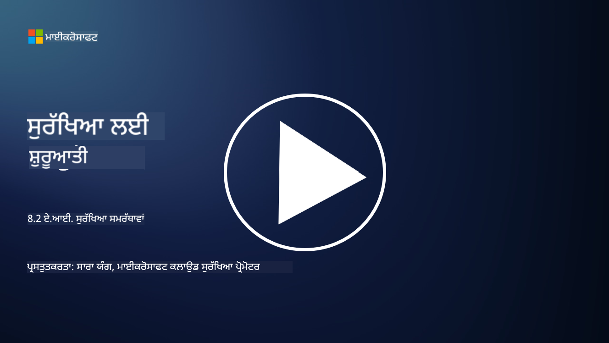

<!--
CO_OP_TRANSLATOR_METADATA:
{
  "original_hash": "b6bb7175672298d1e2f73ba7e0006f95",
  "translation_date": "2025-09-04T01:04:38+00:00",
  "source_file": "8.2 AI security capabilities.md",
  "language_code": "pa"
}
-->
# AI ਸੁਰੱਖਿਆ ਸਮਰੱਥਾਵਾਂ

## ਅੱਜਕੱਲ੍ਹ ਸਾਨੂੰ AI ਸਿਸਟਮਾਂ ਨੂੰ ਸੁਰੱਖਿਅਤ ਕਰਨ ਲਈ ਕਿਹੜੇ ਟੂਲ ਅਤੇ ਸਮਰੱਥਾਵਾਂ ਉਪਲਬਧ ਹਨ?

ਅੱਜਕੱਲ੍ਹ, AI ਸਿਸਟਮਾਂ ਦੀ ਸੁਰੱਖਿਆ ਲਈ ਕਈ ਟੂਲ ਅਤੇ ਸਮਰੱਥਾਵਾਂ ਉਪਲਬਧ ਹਨ:

-   **Counterfit**: ਇਹ ਇੱਕ ਖੁੱਲ੍ਹੇ ਸਰੋਤ ਵਾਲਾ ਆਟੋਮੇਸ਼ਨ ਟੂਲ ਹੈ ਜੋ AI ਸਿਸਟਮਾਂ ਦੀ ਸੁਰੱਖਿਆ ਟੈਸਟਿੰਗ ਲਈ ਬਣਾਇਆ ਗਿਆ ਹੈ। ਇਹ ਸੰਗਠਨਾਂ ਨੂੰ AI ਸੁਰੱਖਿਆ ਖਤਰੇ ਦੇ ਮੁਲਾਂਕਣ ਕਰਨ ਅਤੇ ਉਨ੍ਹਾਂ ਦੇ ਐਲਗੋਰਿਥਮ ਦੀ ਮਜ਼ਬੂਤੀ ਯਕੀਨੀ ਬਣਾਉਣ ਵਿੱਚ ਮਦਦ ਕਰਦਾ ਹੈ।
-   **Adversarial Machine Learning Tools**: ਇਹ ਟੂਲ ਮਸ਼ੀਨ ਲਰਨਿੰਗ ਮਾਡਲਾਂ ਦੀ ਵਿਰੋਧੀ ਹਮਲਿਆਂ ਦੇ ਖਿਲਾਫ ਮਜ਼ਬੂਤੀ ਦਾ ਮੁਲਾਂਕਣ ਕਰਦੇ ਹਨ ਅਤੇ ਕਮਜ਼ੋਰੀਆਂ ਦੀ ਪਛਾਣ ਅਤੇ ਉਨ੍ਹਾਂ ਨੂੰ ਦੂਰ ਕਰਨ ਵਿੱਚ ਸਹਾਇਕ ਹੁੰਦੇ ਹਨ।
-   **AI ਸੁਰੱਖਿਆ ਟੂਲਕਿਟਸ**: ਖੁੱਲ੍ਹੇ ਸਰੋਤ ਵਾਲੇ ਟੂਲਕਿਟ ਉਪਲਬਧ ਹਨ ਜੋ AI ਸਿਸਟਮਾਂ ਦੀ ਸੁਰੱਖਿਆ ਲਈ ਸਾਧਨ ਪ੍ਰਦਾਨ ਕਰਦੇ ਹਨ, ਜਿਵੇਂ ਕਿ ਸੁਰੱਖਿਆ ਉਪਾਅ ਲਾਗੂ ਕਰਨ ਲਈ ਲਾਇਬ੍ਰੇਰੀਆਂ ਅਤੇ ਫਰੇਮਵਰਕ।
-   **ਸਹਿਯੋਗੀ ਪਲੇਟਫਾਰਮ**: ਕੰਪਨੀਆਂ ਅਤੇ AI ਕਮਿਊਨਿਟੀਆਂ ਦੇ ਵਿਚਕਾਰ ਸਾਂਝੇਦਾਰੀਆਂ, ਜੋ AI-ਵਿਸ਼ੇਸ਼ ਸੁਰੱਖਿਆ ਸਕੈਨਰ ਅਤੇ ਹੋਰ ਟੂਲ ਵਿਕਸਿਤ ਕਰਨ ਲਈ ਕੰਮ ਕਰਦੀਆਂ ਹਨ, ਤਾਂ ਜੋ AI ਸਪਲਾਈ ਚੇਨ ਨੂੰ ਸੁਰੱਖਿਅਤ ਕੀਤਾ ਜਾ ਸਕੇ।

ਇਹ ਟੂਲ ਅਤੇ ਸਮਰੱਥਾਵਾਂ ਇੱਕ ਵਧ ਰਹੇ ਖੇਤਰ ਦਾ ਹਿੱਸਾ ਹਨ ਜੋ AI ਸਿਸਟਮਾਂ ਨੂੰ ਵੱਖ-ਵੱਖ ਖਤਰਿਆਂ ਤੋਂ ਸੁਰੱਖਿਅਤ ਕਰਨ ਲਈ ਸਮਰਪਿਤ ਹੈ। ਇਹ ਖੋਜ, ਪ੍ਰਯੋਗਿਕ ਟੂਲਾਂ ਅਤੇ ਉਦਯੋਗਿਕ ਸਹਿਯੋਗ ਦਾ ਮਿਲਾਪ ਹੈ, ਜੋ AI ਤਕਨਾਲੋਜੀਆਂ ਦੁਆਰਾ ਪੈਦਾ ਹੋਣ ਵਾਲੀਆਂ ਵਿਲੱਖਣ ਚੁਣੌਤੀਆਂ ਨੂੰ ਹੱਲ ਕਰਨ ਲਈ ਕੰਮ ਕਰ ਰਿਹਾ ਹੈ।

## AI ਰੈੱਡ ਟੀਮਿੰਗ ਬਾਰੇ ਕੀ? ਇਹ ਰਵਾਇਤੀ ਸੁਰੱਖਿਆ ਰੈੱਡ ਟੀਮਿੰਗ ਤੋਂ ਕਿਵੇਂ ਵੱਖਰੀ ਹੈ?

AI ਰੈੱਡ ਟੀਮਿੰਗ ਕਈ ਮੁੱਖ ਪੱਖਾਂ ਵਿੱਚ ਰਵਾਇਤੀ ਸੁਰੱਖਿਆ ਰੈੱਡ ਟੀਮਿੰਗ ਤੋਂ ਵੱਖਰੀ ਹੈ:

-   **AI ਸਿਸਟਮਾਂ 'ਤੇ ਧਿਆਨ**: AI ਰੈੱਡ ਟੀਮਿੰਗ ਖਾਸ ਤੌਰ 'ਤੇ AI ਸਿਸਟਮਾਂ ਦੀ ਵਿਲੱਖਣ ਕਮਜ਼ੋਰੀਆਂ ਨੂੰ ਨਿਸ਼ਾਨਾ ਬਣਾਉਂਦੀ ਹੈ, ਜਿਵੇਂ ਕਿ ਮਸ਼ੀਨ ਲਰਨਿੰਗ ਮਾਡਲ ਅਤੇ ਡਾਟਾ ਪਾਈਪਲਾਈਨ, ਨਾ ਕਿ ਰਵਾਇਤੀ IT ਢਾਂਚਾ।
-   **AI ਵਿਵਹਾਰ ਦੀ ਜਾਂਚ**: ਇਹ ਇਸ ਗੱਲ ਦੀ ਜਾਂਚ ਕਰਦੀ ਹੈ ਕਿ AI ਸਿਸਟਮ ਅਜੀਬ ਜਾਂ ਅਣਪੇਖਿਆ ਇਨਪੁਟਸ 'ਤੇ ਕਿਵੇਂ ਪ੍ਰਤੀਕਿਰਿਆ ਕਰਦੇ ਹਨ, ਜੋ ਉਹਨਾਂ ਕਮਜ਼ੋਰੀਆਂ ਨੂੰ ਬੇਨਕਾਬ ਕਰ ਸਕਦਾ ਹੈ ਜਿਨ੍ਹਾਂ ਦਾ ਫਾਇਦਾ ਹਮਲਾਵਰ ਚੁੱਕ ਸਕਦੇ ਹਨ।
-   **AI ਦੀਆਂ ਨਾਕਾਮੀਆਂ ਦੀ ਖੋਜ**: AI ਰੈੱਡ ਟੀਮਿੰਗ ਦੋਨੋਂ ਦੁਸ਼ਟ ਅਤੇ ਸ਼ਰਾਰਤਮੁਕਤ ਨਾਕਾਮੀਆਂ ਦੀ ਜਾਂਚ ਕਰਦੀ ਹੈ, ਸਿਰਫ ਸੁਰੱਖਿਆ ਭੰਗਾਂ ਤੋਂ ਪਰੇ ਹੋਰ ਸੰਭਾਵਿਤ ਸਿਸਟਮ ਨਾਕਾਮੀਆਂ ਅਤੇ ਵਿਅਕਤੀਆਂ ਨੂੰ ਧਿਆਨ ਵਿੱਚ ਰੱਖਦੀ ਹੈ।
-   **ਪ੍ਰੋੰਪਟ ਇੰਜੈਕਸ਼ਨ ਅਤੇ ਸਮੱਗਰੀ ਉਤਪੱਤੀ**: ਇਸ ਵਿੱਚ ਪ੍ਰੋੰਪਟ ਇੰਜੈਕਸ਼ਨ ਵਰਗੀਆਂ ਨਾਕਾਮੀਆਂ ਦੀ ਜਾਂਚ ਵੀ ਸ਼ਾਮਲ ਹੈ, ਜਿੱਥੇ ਹਮਲਾਵਰ AI ਸਿਸਟਮਾਂ ਨੂੰ ਹਾਨਿਕਾਰਕ ਜਾਂ ਅਧਾਰਹੀਣ ਸਮੱਗਰੀ ਪੈਦਾ ਕਰਨ ਲਈ ਮੋੜ ਸਕਦੇ ਹਨ।
-   **ਨੈਤਿਕ ਅਤੇ ਜ਼ਿੰਮੇਵਾਰ AI**: ਇਹ ਇਹ ਯਕੀਨੀ ਬਣਾਉਣ ਦਾ ਹਿੱਸਾ ਹੈ ਕਿ AI ਸਿਸਟਮਾਂ ਨੂੰ ਸ਼ੁਰੂ ਤੋਂ ਹੀ ਜ਼ਿੰਮੇਵਾਰ ਢੰਗ ਨਾਲ ਡਿਜ਼ਾਈਨ ਕੀਤਾ ਗਿਆ ਹੈ, ਤਾਂ ਜੋ ਉਹਨਾਂ ਨੂੰ ਅਣਚਾਹੇ ਤਰੀਕੇ ਨਾਲ ਵਿਵਹਾਰ ਕਰਨ ਲਈ ਮੋੜਿਆ ਨਾ ਜਾ ਸਕੇ।

ਕੁੱਲ ਮਿਲਾ ਕੇ, AI ਰੈੱਡ ਟੀਮਿੰਗ ਇੱਕ ਵਿਸਤਾਰਤ ਅਭਿਆਸ ਹੈ ਜੋ ਸਿਰਫ ਸੁਰੱਖਿਆ ਕਮਜ਼ੋਰੀਆਂ ਦੀ ਜਾਂਚ ਤੱਕ ਸੀਮਿਤ ਨਹੀਂ ਹੈ, ਸਗੋਂ AI ਤਕਨਾਲੋਜੀਆਂ ਨਾਲ ਸੰਬੰਧਿਤ ਹੋਰ ਕਿਸਮ ਦੀਆਂ ਸਿਸਟਮ ਨਾਕਾਮੀਆਂ ਦੀ ਜਾਂਚ ਵੀ ਸ਼ਾਮਲ ਕਰਦੀ ਹੈ। ਇਹ AI ਸਿਸਟਮਾਂ ਨੂੰ ਸੁਰੱਖਿਅਤ ਬਣਾਉਣ ਲਈ ਇੱਕ ਮਹੱਤਵਪੂਰਨ ਹਿੱਸਾ ਹੈ, ਜੋ AI ਤੈਨਾਤੀ ਨਾਲ ਜੁੜੇ ਨਵੇਂ ਖਤਰਿਆਂ ਨੂੰ ਸਮਝਣ ਅਤੇ ਘਟਾਉਣ ਵਿੱਚ ਸਹਾਇਕ ਹੈ।

## ਹੋਰ ਪੜ੍ਹਾਈ

 - [Microsoft AI Red Team building future of safer AI | Microsoft Security Blog](https://www.microsoft.com/en-us/security/blog/2023/08/07/microsoft-ai-red-team-building-future-of-safer-ai/?WT.mc_id=academic-96948-sayoung)
 - [Announcing Microsoft’s open automation framework to red team generative AI Systems | Microsoft Security Blog](https://www.microsoft.com/en-us/security/blog/2024/02/22/announcing-microsofts-open-automation-framework-to-red-team-generative-ai-systems/?WT.mc_id=academic-96948-sayoung)
 - [AI Security Tools: The Open-Source Toolkit | Wiz](https://www.wiz.io/academy/ai-security-tools)

---

**ਅਸਵੀਕਰਤੀ**:  
ਇਹ ਦਸਤਾਵੇਜ਼ AI ਅਨੁਵਾਦ ਸੇਵਾ [Co-op Translator](https://github.com/Azure/co-op-translator) ਦੀ ਵਰਤੋਂ ਕਰਕੇ ਅਨੁਵਾਦ ਕੀਤਾ ਗਿਆ ਹੈ। ਜਦੋਂ ਕਿ ਅਸੀਂ ਸਹੀ ਹੋਣ ਦਾ ਯਤਨ ਕਰਦੇ ਹਾਂ, ਕਿਰਪਾ ਕਰਕੇ ਧਿਆਨ ਦਿਓ ਕਿ ਸਵੈਚਾਲਿਤ ਅਨੁਵਾਦਾਂ ਵਿੱਚ ਗਲਤੀਆਂ ਜਾਂ ਅਸੁਣਭਵਤਾਵਾਂ ਹੋ ਸਕਦੀਆਂ ਹਨ। ਇਸ ਦੀ ਮੂਲ ਭਾਸ਼ਾ ਵਿੱਚ ਮੌਜੂਦ ਮੂਲ ਦਸਤਾਵੇਜ਼ ਨੂੰ ਪ੍ਰਮਾਣਿਕ ਸਰੋਤ ਮੰਨਿਆ ਜਾਣਾ ਚਾਹੀਦਾ ਹੈ। ਮਹੱਤਵਪੂਰਨ ਜਾਣਕਾਰੀ ਲਈ, ਪੇਸ਼ੇਵਰ ਮਨੁੱਖੀ ਅਨੁਵਾਦ ਦੀ ਸਿਫਾਰਸ਼ ਕੀਤੀ ਜਾਂਦੀ ਹੈ। ਇਸ ਅਨੁਵਾਦ ਦੇ ਪ੍ਰਯੋਗ ਤੋਂ ਪੈਦਾ ਹੋਣ ਵਾਲੇ ਕਿਸੇ ਵੀ ਗਲਤਫਹਿਮੀ ਜਾਂ ਗਲਤ ਵਿਆਖਿਆ ਲਈ ਅਸੀਂ ਜ਼ਿੰਮੇਵਾਰ ਨਹੀਂ ਹਾਂ।  