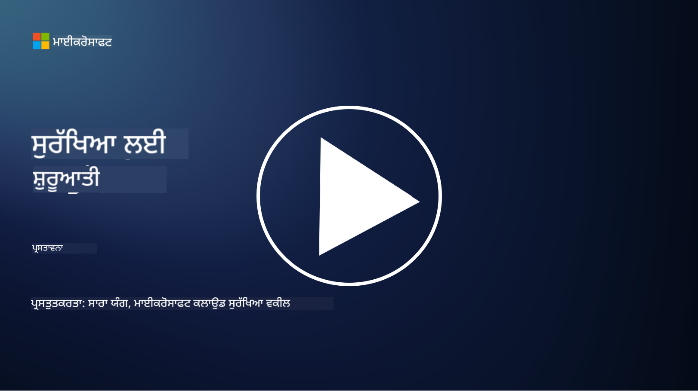

<!--
CO_OP_TRANSLATOR_METADATA:
{
  "original_hash": "33e83c2beb28a1b6e031416624dc23aa",
  "translation_date": "2025-10-11T10:52:17+00:00",
  "source_file": "README.md",
  "language_code": "pa"
}
-->

### 🌐 ਬਹੁ-ਭਾਸ਼ਾ ਸਹਾਇਤਾ

#### GitHub Action ਰਾਹੀਂ ਸਹਾਇਤ (ਆਟੋਮੈਟਿਕ ਅਤੇ ਹਮੇਸ਼ਾ ਅਪਡੇਟ)

<!-- CO-OP TRANSLATOR LANGUAGES TABLE START -->
[ਅਰਬੀ](../ar/README.md) | [ਬੰਗਾਲੀ](../bn/README.md) | [ਬੁਲਗਾਰੀਆਈ](../bg/README.md) | [ਬਰਮੀ (ਮਿਆਂਮਾਰ)](../my/README.md) | [ਚੀਨੀ (ਸਰਲ)](../zh/README.md) | [ਚੀਨੀ (ਪਾਰੰਪਰਿਕ, ਹਾਂਗਕਾਂਗ)](../hk/README.md) | [ਚੀਨੀ (ਪਾਰੰਪਰਿਕ, ਮਕਾਉ)](../mo/README.md) | [ਚੀਨੀ (ਪਾਰੰਪਰਿਕ, ਤਾਈਵਾਨ)](../tw/README.md) | [ਕਰੋਏਸ਼ੀਆਈ](../hr/README.md) | [ਚੈਕ](../cs/README.md) | [ਡੈਨਿਸ਼](../da/README.md) | [ਡੱਚ](../nl/README.md) | [ਇਸਟੋਨੀਆਈ](../et/README.md) | [ਫਿਨਿਸ਼](../fi/README.md) | [ਫਰਾਂਸੀਸੀ](../fr/README.md) | [ਜਰਮਨ](../de/README.md) | [ਗ੍ਰੀਕ](../el/README.md) | [ਹਿਬਰੂ](../he/README.md) | [ਹਿੰਦੀ](../hi/README.md) | [ਹੰਗਰੀਆਈ](../hu/README.md) | [ਇੰਡੋਨੇਸ਼ੀਆਈ](../id/README.md) | [ਇਟਾਲੀਅਨ](../it/README.md) | [ਜਾਪਾਨੀ](../ja/README.md) | [ਕੋਰੀਆਈ](../ko/README.md) | [ਲਿਥੂਆਨੀਅਨ](../lt/README.md) | [ਮਲੇ](../ms/README.md) | [ਮਰਾਠੀ](../mr/README.md) | [ਨੇਪਾਲੀ](../ne/README.md) | [ਨਾਰਵੇਜੀਅਨ](../no/README.md) | [ਫਾਰਸੀ (ਪਾਰਸੀ)](../fa/README.md) | [ਪੋਲਿਸ਼](../pl/README.md) | [ਪੁਰਤਗਾਲੀ (ਬ੍ਰਾਜ਼ੀਲ)](../br/README.md) | [ਪੁਰਤਗਾਲੀ (ਪੁਰਤਗਾਲ)](../pt/README.md) | [ਪੰਜਾਬੀ (ਗੁਰਮੁਖੀ)](./README.md) | [ਰੋਮਾਨੀਆਈ](../ro/README.md) | [ਰੂਸੀ](../ru/README.md) | [ਸਰਬੀਆਈ (ਸਿਰਿਲਿਕ)](../sr/README.md) | [ਸਲੋਵਾਕ](../sk/README.md) | [ਸਲੋਵੇਨੀਆਈ](../sl/README.md) | [ਸਪੇਨੀ](../es/README.md) | [ਸਵਾਹਿਲੀ](../sw/README.md) | [ਸਵੀਡਿਸ਼](../sv/README.md) | [ਟੈਗਾਲੋਗ (ਫਿਲੀਪੀਨੋ)](../tl/README.md) | [ਤਮਿਲ](../ta/README.md) | [ਥਾਈ](../th/README.md) | [ਤੁਰਕੀ](../tr/README.md) | [ਯੂਕਰੇਨੀ](../uk/README.md) | [ਉਰਦੂ](../ur/README.md) | [ਵਿਅਤਨਾਮੀ](../vi/README.md)
<!-- CO-OP TRANSLATOR LANGUAGES TABLE END -->

**ਜੇ ਤੁਸੀਂ ਹੋਰ ਭਾਸ਼ਾਵਾਂ ਵਿੱਚ ਅਨੁਵਾਦ ਦੀ ਮੰਗ ਕਰਨੀ ਹੈ, ਤਾਂ ਸਹਾਇਤ ਭਾਸ਼ਾਵਾਂ ਦੀ ਸੂਚੀ [ਇੱਥੇ](https://github.com/Azure/co-op-translator/blob/main/getting_started/supported-languages.md) ਉਪਲਬਧ ਹੈ।**

#### ਸਾਡੇ ਸਮੁਦਾਇ ਵਿੱਚ ਸ਼ਾਮਲ ਹੋਵੋ 

# 🚀 ਸ਼ੁਰੂਆਤੀ ਲਈ ਸਾਇਬਰਸੁਰੱਖਿਆ – ਇੱਕ ਪਾਠਕ੍ਰਮ

AI ਤਕਨਾਲੋਜੀ ਦੇ ਤੇਜ਼ੀ ਨਾਲ ਬਦਲਦੇ ਯੁੱਗ ਵਿੱਚ, IT ਸਿਸਟਮ ਨੂੰ ਸੁਰੱਖਿਅਤ ਕਰਨ ਦੀ ਸਮਝ ਹੋਣਾ ਹੋਰ ਵੀ ਮਹੱਤਵਪੂਰਨ ਹੈ। ਇਹ ਕੋਰਸ ਤੁਹਾਨੂੰ ਸੁਰੱਖਿਆ ਸਿੱਖਣ ਦੀ ਸ਼ੁਰੂਆਤ ਕਰਨ ਲਈ ਮੁੱਢਲੇ ਸਾਇਬਰਸੁਰੱਖਿਆ ਸੰਕਲਪ ਸਿਖਾਉਣ ਲਈ ਤਿਆਰ ਕੀਤਾ ਗਿਆ ਹੈ। ਇਹ ਵੈਂਡਰ ਅਗਨੋਸਟਿਕ ਹੈ ਅਤੇ ਛੋਟੇ ਪਾਠਾਂ ਵਿੱਚ ਵੰਡਿਆ ਗਿਆ ਹੈ ਜੋ ਪੂਰਾ ਕਰਨ ਵਿੱਚ ਲਗਭਗ 30-60 ਮਿੰਟ ਲੈਂਦੇ ਹਨ। ਹਰ ਪਾਠ ਵਿੱਚ ਇੱਕ ਛੋਟਾ ਕਵਿਜ਼ ਅਤੇ ਹੋਰ ਪੜ੍ਹਨ ਲਈ ਲਿੰਕ ਸ਼ਾਮਲ ਹਨ ਜੇ ਤੁਸੀਂ ਵਿਸ਼ੇ ਵਿੱਚ ਹੋਰ ਡੂੰਘਾਈ ਵਿੱਚ ਜਾਣਾ ਚਾਹੁੰਦੇ ਹੋ।

ਇਹ ਕੋਰਸ ਕੀ ਕਵਰ ਕਰਦਾ ਹੈ 📚

- 🔐 ਮੁੱਢਲੇ ਸਾਇਬਰਸੁਰੱਖਿਆ ਸੰਕਲਪ ਜਿਵੇਂ ਕਿ CIA ਤ੍ਰਿਭੁਜ, ਜੋਖਮ, ਧਮਕੀਆਂ ਆਦਿ ਵਿੱਚ ਅੰਤਰ।
- 🛡️ ਸੁਰੱਖਿਆ ਕੰਟਰੋਲ ਕੀ ਹੈ ਅਤੇ ਇਹ ਕਿਹੜੇ ਰੂਪ ਲੈਂਦੇ ਹਨ।
- 🌐 ਜ਼ੀਰੋ ਟਰਸਟ ਕੀ ਹੈ ਅਤੇ ਆਧੁਨਿਕ ਸਾਇਬਰਸੁਰੱਖਿਆ ਵਿੱਚ ਇਹ ਕਿਉਂ ਮਹੱਤਵਪੂਰਨ ਹੈ।
- 🔑 ਪਛਾਣ, ਨੈਟਵਰਕਿੰਗ, ਸੁਰੱਖਿਆ ਕਾਰਵਾਈਆਂ, ਢਾਂਚੇ ਅਤੇ ਡਾਟਾ ਸੁਰੱਖਿਆ ਵਿੱਚ ਮੁੱਖ ਸੰਕਲਪ ਅਤੇ ਥੀਮਾਂ ਦੀ ਸਮਝ।
- 🔧 ਸੁਰੱਖਿਆ ਕੰਟਰੋਲ ਲਾਗੂ ਕਰਨ ਲਈ ਵਰਤੇ ਜਾਣ ਵਾਲੇ ਕੁਝ ਟੂਲਾਂ ਦੇ ਉਦਾਹਰਨ।

ਇਹ ਕੋਰਸ ਕੀ ਕਵਰ ਨਹੀਂ ਕਰਦਾ 🙅‍♂️

- 🚫 ਖਾਸ ਸੁਰੱਖਿਆ ਟੂਲਾਂ ਦੀ ਵਰਤੋਂ ਕਿਵੇਂ ਕਰਨੀ ਹੈ।
- 🚫 "ਹੈਕ" ਕਰਨਾ ਜਾਂ ਰੈਡ ਟੀਮਿੰਗ/ਆਫੈਂਸਿਵ ਸੁਰੱਖਿਆ।
- 🚫 ਖਾਸ ਅਨੁਕੂਲਤਾ ਮਿਆਰਾਂ ਬਾਰੇ ਸਿੱਖਣਾ।

ਜਦੋਂ ਤੁਸੀਂ ਇਹ ਕੋਰਸ ਪੂਰਾ ਕਰ ਲੈਂਦੇ ਹੋ, ਤਾਂ ਤੁਸੀਂ ਸਾਡੇ Microsoft Learn ਮੋਡਿਊਲਾਂ ਵਿੱਚ ਅੱਗੇ ਵਧ ਸਕਦੇ ਹੋ। ਅਸੀਂ ਤੁਹਾਨੂੰ ਸਿੱਖਣ ਜਾਰੀ ਰੱਖਣ ਲਈ [Microsoft Security, Compliance, and Identity Fundamentals](https://learn.microsoft.com/training/paths/describe-concepts-of-security-compliance-identity/?WT.mc_id=academic-96948-sayoung) ਦੀ ਸਿਫਾਰਸ਼ ਕਰਦੇ ਹਾਂ।

ਅੰਤ ਵਿੱਚ, ਤੁਸੀਂ [Exam SC-900: Microsoft Security, Compliance, and Identity Fundamentals exam](https://learn.microsoft.com/credentials/certifications/exams/sc-900/?WT.mc_id=academic-96948-sayoung) ਦੇਣ ਬਾਰੇ ਸੋਚ ਸਕਦੇ ਹੋ।

> 💁 ਜੇ ਤੁਹਾਡੇ ਕੋਲ ਇਸ ਕੋਰਸ ਬਾਰੇ ਕੋਈ ਫੀਡਬੈਕ ਜਾਂ ਸੁਝਾਅ ਹਨ ਜਾਂ ਕੋਈ ਸਮੱਗਰੀ ਜੋ ਅਸੀਂ ਛੱਡ ਦਿੱਤੀ ਹੈ, ਤਾਂ ਅਸੀਂ ਤੁਹਾਡੇ ਤੋਂ ਸੁਣਨਾ ਚਾਹੁੰਦੇ ਹਾਂ!

## ਮੋਡਿਊਲਾਂ ਦਾ ਝਲਕ 📝 
| **ਮੋਡਿਊਲ ਨੰਬਰ** | **ਮੋਡਿਊਲ ਦਾ ਨਾਮ**                           | **ਸਿਖਾਏ ਗਏ ਸੰਕਲਪ**                  | **ਸਿੱਖਣ ਦੇ ਉਦੇਸ਼**                                                                                          |
|-------------------|-------------------------------------------|--------------------------------------|-----------------------------------------------------------------------------------------------------------------|
| **1.1**           | ਮੁੱਢਲੇ ਸੁਰੱਖਿਆ ਸੰਕਲਪ                   | [CIA ਤ੍ਰਿਭੁਜ](https://github.com/microsoft/Security-101/blob/main/1.1%20The%20CIA%20triad%20and%20other%20key%20concepts.md)                        | ਗੁਪਤਤਾ, ਉਪਲਬਧਤਾ ਅਤੇ ਅਖੰਡਤਾ ਬਾਰੇ ਸਿੱਖੋ। ਅਥੈਂਟੀਸਿਟੀ, ਨਾਨਰਿਪੂਡੀਏਸ਼ਨ ਅਤੇ ਪ੍ਰਾਈਵੇਸੀ ਬਾਰੇ ਵੀ। |
| **1.2**           | ਮੁੱਢਲੇ ਸੁਰੱਖਿਆ ਸੰਕਲਪ                   | [ਆਮ ਸਾਇਬਰਸੁਰੱਖਿਆ ਧਮਕੀਆਂ](https://github.com/microsoft/Security-101/blob/main/1.2%20Common%20cybersecurity%20threats.md)        | ਵਿਅਕਤੀਆਂ ਅਤੇ ਸੰਗਠਨਾਂ ਨੂੰ ਦਰਪੇਸ਼ ਆਮ ਸਾਇਬਰਸੁਰੱਖਿਆ ਧਮਕੀਆਂ ਬਾਰੇ ਸਿੱਖੋ।                             |
| **1.3**           | ਮੁੱਢਲੇ ਸੁਰੱਖਿਆ ਸੰਕਲਪ                   | [ਜੋਖਮ ਪ੍ਰਬੰਧਨ ਦੀ ਸਮਝ](https://github.com/microsoft/Security-101/blob/main/1.3%20Understanding%20risk%20management.md)       | ਜੋਖਮ ਦਾ ਅੰਕਲਨ ਅਤੇ ਸਮਝ – ਪ੍ਰਭਾਵ/ਸੰਭਾਵਨਾ ਅਤੇ ਕੰਟਰੋਲ ਲਾਗੂ ਕਰਨ ਬਾਰੇ ਸਿੱਖੋ।                                                                                                               | |
| **1.4**           | ਮੁੱਢਲੇ ਸੁਰੱਖਿਆ ਸੰਕਲਪ                   | [ਸੁਰੱਖਿਆ ਅਭਿਆਸ ਅਤੇ ਦਸਤਾਵੇਜ਼](https://github.com/microsoft/Security-101/blob/main/1.4%20Security%20practices%20and%20documentation.md) | ਨੀਤੀਆਂ, ਪ੍ਰਕਿਰਿਆਵਾਂ, ਮਿਆਰਾਂ ਅਤੇ ਨਿਯਮ/ਕਾਨੂੰਨਾਂ ਵਿੱਚ ਅੰਤਰ ਬਾਰੇ ਸਿੱਖੋ।                         |
| **1.5**           | ਮੁੱਢਲੇ ਸੁਰੱਖਿਆ ਸੰਕਲਪ                   | [ਜ਼ੀਰੋ ਟਰਸਟ](https://github.com/microsoft/Security-101/blob/main/1.5%20Zero%20trust.md)                           | ਜ਼ੀਰੋ ਟਰਸਟ ਕੀ ਹੈ ਅਤੇ ਇਹ ਆਰਕੀਟੈਕਚਰ ਨੂੰ ਕਿਵੇਂ ਪ੍ਰਭਾਵਿਤ ਕਰਦਾ ਹੈ? ਡਿਫੈਂਸ ਇਨ ਡੈਪਥ ਕੀ ਹੈ?                   |
| **1.6**           | ਮੁੱਢਲੇ ਸੁਰੱਖਿਆ ਸੰਕਲਪ                   | [ਸ਼ੇਅਰਡ ਜ਼ਿੰਮੇਵਾਰੀ ਮਾਡਲ](https://github.com/microsoft/Security-101/blob/main/1.6%20Shared%20responsibility%20model.md)                           | ਸ਼ੇਅਰਡ ਜ਼ਿੰਮੇਵਾਰੀ ਮਾਡਲ ਕੀ ਹੈ ਅਤੇ ਇਹ ਸਾਇਬਰਸੁਰੱਖਿਆ ਨੂੰ ਕਿਵੇਂ ਪ੍ਰਭਾਵਿਤ ਕਰਦਾ ਹੈ?                  |
| **1.7**           | [ਮੋਡਿਊਲ ਦੇ ਅੰਤ ਦਾ ਕਵਿਜ਼](https://github.com/microsoft/Security-101/blob/main/1.7%20End%20of%20module%20quiz.md)                        |                                      |                                                                                                                 |
| **2.1**           | ਪਛਾਣ ਅਤੇ ਪਹੁੰਚ ਪ੍ਰਬੰਧਨ ਮੁੱਢਲੇ ਸੰਕਲਪ | [IAM ਮੁੱਖ ਸੰਕਲਪ](https://github.com/microsoft/Security-101/blob/main/2.1%20IAM%20key%20concepts.md)                     | ਘੱਟ ਤੋਂ ਘੱਟ ਅਧਿਕਾਰ ਦੇ ਸਿਧਾਂਤ, ਡਿਊਟੀਜ਼ ਦੀ ਵੰਡ, ਜ਼ੀਰੋ ਟਰਸਟ ਨੂੰ ਸਹਾਇਤ ਕਰਨ ਵਾਲੇ IAM ਬਾਰੇ ਸਿੱਖੋ।               |
| **2.2**           | ਪਛਾਣ ਅਤੇ ਪਹੁੰਚ ਪ੍ਰਬੰਧਨ ਮੁੱਢਲੇ ਸੰਕਲਪ | [IAM ਜ਼ੀਰੋ ਟਰਸਟ ਆਰਕੀਟੈਕਚਰ](https://github.com/microsoft/Security-101/blob/main/2.2%20IAM%20zero%20trust%20architecture.md)          | ਪਛਾਣ ਆਧੁਨਿਕ IT ਵਾਤਾਵਰਣਾਂ ਲਈ ਨਵਾਂ ਪਰਿਧੀ ਕਿਵੇਂ ਹੈ ਅਤੇ ਇਹ ਕਿਹੜੀਆਂ ਧਮਕੀਆਂ ਨੂੰ ਘਟਾਉਂਦਾ ਹੈ।          |
| **2.3**           | ਪਛਾਣ ਅਤੇ ਪਹੁੰਚ ਪ੍ਰਬੰਧਨ ਮੁੱਢਲੇ ਸੰਕਲਪ | [IAM ਸਮਰੱਥਾਵਾਂ](https://github.com/microsoft/Security-101/blob/main/2.3%20IAM%20capabilities.md)                     | ਪਛਾਣਾਂ ਨੂੰ ਸੁਰੱਖਿਅਤ ਕਰਨ ਲਈ IAM ਸਮਰੱਥਾਵਾਂ ਅਤੇ ਕੰਟਰੋਲ ਬਾਰੇ ਸਿੱਖੋ।                                                  |
| **2.4**           | [ਮੋਡਿਊਲ ਦੇ ਅੰਤ ਦਾ ਕਵਿਜ਼](https://github.com/microsoft/Security-101/blob/main/2.4%20End%20of%20module%20quiz.md)                        |                                      |                                                                                                                 |
| **3.1**           | ਨੈਟਵਰਕ ਸੁਰੱਖਿਆ ਮੁੱਢਲੇ ਸੰਕਲਪ             | [ਨੈਟਵਰਕਿੰਗ ਮੁੱਖ ਸੰਕਲਪ](https://github.com/microsoft/Security-101/blob/main/3.1%20Networking%20key%20concepts.md)              | ਨੈਟਵਰਕਿੰਗ ਸੰਕਲਪ (IP ਐਡਰੈਸਿੰਗ, ਪੋਰਟ ਨੰਬਰ, ਇਨਕ੍ਰਿਪਸ਼ਨ ਆਦਿ) ਬਾਰੇ ਸਿੱਖੋ।                                 |
| **3.2**           | ਨੈਟਵਰਕ ਸੁਰੱਖਿਆ ਮੁੱਢਲੇ ਸੰਕਲਪ             | [ਨੈਟਵਰਕਿੰਗ ਜ਼ੀਰੋ ਟਰਸਟ ਆਰਕੀਟੈਕਚਰ](https://github.com/microsoft/Security-101/blob/main/3.2%20Networking%20zero%20trust%20architecture.md)   | ਨੈਟਵਰਕਿੰਗ E2E ZT ਆਰਕੀਟੈਕਚਰ ਵਿੱਚ ਕਿਵੇਂ ਯੋਗਦਾਨ ਪਾਉਂਦਾ ਹੈ ਅਤੇ ਇਹ ਕਿਹੜੀਆਂ ਧਮਕੀਆਂ ਨੂੰ ਘਟਾਉਂਦਾ ਹੈ।                  |
| **3.3**           | ਨੈਟਵਰਕ ਸੁਰੱਖਿਆ ਮੁੱਢਲੇ ਸੰਕਲਪ             | [ਨੈਟਵਰਕ ਸੁਰੱਖਿਆ ਸਮਰੱਥਾਵਾਂ](https://github.com/microsoft/Security-101/blob/main/3.3%20Network%20security%20capabilities.md)        | ਨੈਟਵਰਕ ਸੁਰੱਖਿਆ ਟੂਲਿੰਗ – ਫਾਇਰਵਾਲ, WAF, DDoS ਸੁਰੱਖਿਆ ਆਦਿ ਬਾਰੇ ਸਿੱਖੋ।                                    |
| **3.4**           | [ਮੋਡਿਊਲ ਦੇ ਅੰਤ ਦਾ ਕਵਿਜ਼](https://github.com/microsoft/Security-101/blob/main/3.4%20End%20of%20module%20quiz.md)                        |                                      |                                                                                                                 |
| **4.1**           | ਸੁਰੱਖਿਆ ਕਾਰਵਾਈਆਂ ਮੁੱਢਲੇ ਸੰਕਲਪ          | [SecOps ਮੁੱਖ ਸੰਕਲਪ](https://github.com/microsoft/Security-101/blob/main/4.1%20SecOps%20key%20concepts.md)                  | ਸੁਰੱਖਿਆ ਕਾਰਵਾਈਆਂ ਕਿਉਂ ਮਹੱਤਵਪੂਰਨ ਹਨ ਅਤੇ ਇਹ ਆਮ IT ਓਪਸ ਟੀਮਾਂ ਤੋਂ ਕਿਵੇਂ ਵੱਖਰੀਆਂ ਹਨ।                  |
| **4.2**           | ਸੁਰੱਖਿਆ ਕਾਰਵਾਈਆਂ ਮੁੱਢਲੇ ਸੰਕਲਪ          | [SecOps ਜ਼ੀਰੋ ਟਰਸਟ ਆਰਕੀਟੈਕਚਰ](https://github.com/microsoft/Security-101/blob/main/4.2%20SecOps%20zero%20trust%20architecture.md)       | SecOps E2E ZT ਆਰਕੀਟੈਕਚਰ ਵਿੱਚ ਕਿਵੇਂ ਯੋਗਦਾਨ ਪਾਉਂਦਾ ਹੈ ਅਤੇ ਇਹ ਕਿਹੜੀਆਂ ਧਮਕੀਆਂ ਨੂੰ ਘਟਾਉਂਦਾ ਹੈ।                      |
| **4.3**           | ਸੁਰੱਖਿਆ ਕਾਰਵਾਈਆਂ ਮੁੱਢਲੇ ਸੰਕਲਪ          | [SecOps ਸਮਰੱਥਾਵਾਂ](https://github.com/microsoft/Security-101/blob/main/4.3%20SecOps%20capabilities.md)                  | SecOps ਟੂਲਿੰਗ – SIEM, XDR ਆਦਿ ਬਾਰੇ ਸਿੱਖੋ।                                                                    |
| **4.4**           | [ਮੋਡਿਊਲ ਦੇ ਅੰਤ ਦਾ ਕਵਿਜ਼](https://github.com/microsoft/Security-101/blob/main/4.4
| **5.2**           | ਐਪਲੀਕੇਸ਼ਨ ਸੁਰੱਖਿਆ ਦੇ ਮੂਲ ਤੱਤ         | [ਐਪਸੈਕ ਸਮਰੱਥਾਵਾਂ](https://github.com/microsoft/Security-101/blob/main/5.2%20AppSec%20key%20capabilities.md)                  | ਐਪਸੈਕ ਟੂਲਿੰਗ ਬਾਰੇ ਜਾਣੋ: ਪਾਈਪਲਾਈਨ ਸੁਰੱਖਿਆ ਟੂਲ, ਕੋਡ ਸਕੈਨਿੰਗ, ਸੀਕ੍ਰੇਟ ਸਕੈਨਿੰਗ ਆਦਿ।                       |
| **5.3**           | [ਮੋਡੀਊਲ ਦੇ ਅੰਤ ਦਾ ਪ੍ਰਸ਼ਨੋਤਰੀ](https://github.com/microsoft/Security-101/blob/main/5.3%20End%20of%20module%20quiz.md)                        |                                      |                                                                                                                 |
| **6.1**           | ਢਾਂਚਾਗਤ ਸੁਰੱਖਿਆ ਦੇ ਮੂਲ ਤੱਤ      | [ਢਾਂਚਾਗਤ ਸੁਰੱਖਿਆ ਦੇ ਮੁੱਖ ਸਿਧਾਂਤ](https://github.com/microsoft/Security-101/blob/main/6.1%20Infrastructure%20security%20key%20concepts.md) | ਸਿਸਟਮਾਂ ਨੂੰ ਮਜ਼ਬੂਤ ਬਣਾਉਣ, ਪੈਚਿੰਗ, ਸੁਰੱਖਿਆ ਸਫਾਈ, ਕੰਟੇਨਰ ਸੁਰੱਖਿਆ ਬਾਰੇ ਜਾਣੋ।                                  |
| **6.2**           | ਢਾਂਚਾਗਤ ਸੁਰੱਖਿਆ ਦੇ ਮੂਲ ਤੱਤ      | [ਢਾਂਚਾਗਤ ਸੁਰੱਖਿਆ ਸਮਰੱਥਾਵਾਂ](https://github.com/microsoft/Security-101/blob/main/6.2%20Infrastructure%20security%20capabilities.md) | ਉਹ ਟੂਲਿੰਗ ਬਾਰੇ ਜਾਣੋ ਜੋ ਢਾਂਚਾਗਤ ਸੁਰੱਖਿਆ ਵਿੱਚ ਮਦਦ ਕਰ ਸਕਦੀ ਹੈ ਜਿਵੇਂ ਕਿ CSPM, ਕੰਟੇਨਰ ਸੁਰੱਖਿਆ ਆਦਿ।            |
| **6.3**           | [ਮੋਡੀਊਲ ਦੇ ਅੰਤ ਦਾ ਪ੍ਰਸ਼ਨੋਤਰੀ](https://github.com/microsoft/Security-101/blob/main/6.3%20End%20of%20module%20quiz.md)                        |                                      |                                                                                                                 |
| **7.1**           | ਡਾਟਾ ਸੁਰੱਖਿਆ ਦੇ ਮੂਲ ਤੱਤ                | [ਡਾਟਾ ਸੁਰੱਖਿਆ ਦੇ ਮੁੱਖ ਸਿਧਾਂਤ](https://github.com/microsoft/Security-101/blob/main/7.1%20Data%20security%20key%20concepts.md)           | ਡਾਟਾ ਵਰਗੀਕਰਨ ਅਤੇ ਰੱਖ-ਰਖਾਅ ਬਾਰੇ ਜਾਣੋ ਅਤੇ ਇਹ ਕਿਸ ਤਰ੍ਹਾਂ ਸੰਗਠਨ ਲਈ ਮਹੱਤਵਪੂਰਨ ਹੈ।                     |
| **7.2**           | ਡਾਟਾ ਸੁਰੱਖਿਆ ਦੇ ਮੂਲ ਤੱਤ                | [ਡਾਟਾ ਸੁਰੱਖਿਆ ਸਮਰੱਥਾਵਾਂ](https://github.com/microsoft/Security-101/blob/main/7.2%20Data%20security%20capabilities.md)           | ਡਾਟਾ ਸੁਰੱਖਿਆ ਟੂਲਿੰਗ ਬਾਰੇ ਜਾਣੋ – DLP, ਅੰਦਰੂਨੀ ਜੋਖਮ ਪ੍ਰਬੰਧਨ, ਡਾਟਾ ਗਵਰਨੈਂਸ ਆਦਿ।                          |
| **7.3**           | [ਮੋਡੀਊਲ ਦੇ ਅੰਤ ਦਾ ਪ੍ਰਸ਼ਨੋਤਰੀ](https://github.com/microsoft/Security-101/blob/main/7.3%20End%20of%20module%20quiz.md)                        |
| **8.1**           | ਏਆਈ ਸੁਰੱਖਿਆ ਦੇ ਮੂਲ ਤੱਤ                | [ਏਆਈ ਸੁਰੱਖਿਆ ਦੇ ਮੁੱਖ ਸਿਧਾਂਤ](https://github.com/microsoft/Security-101/blob/main/8.1%20AI%20security%20key%20concepts.md)          | ਰਵਾਇਤੀ ਸੁਰੱਖਿਆ ਅਤੇ ਏਆਈ ਸੁਰੱਖਿਆ ਵਿਚਕਾਰ ਅੰਤਰ ਅਤੇ ਸਮਾਨਤਾਵਾਂ ਬਾਰੇ ਜਾਣੋ।                 |
| **8.2**           | ਏਆਈ ਸੁਰੱਖਿਆ ਦੇ ਮੂਲ ਤੱਤ                | [ਏਆਈ ਸੁਰੱਖਿਆ ਸਮਰੱਥਾਵਾਂ](https://github.com/microsoft/Security-101/blob/main/8.2%20AI%20security%20capabilities.md)           | ਏਆਈ ਸੁਰੱਖਿਆ ਟੂਲਿੰਗ ਅਤੇ ਉਹ ਕੰਟਰੋਲ ਬਾਰੇ ਜਾਣੋ ਜੋ ਏਆਈ ਨੂੰ ਸੁਰੱਖਿਅਤ ਕਰਨ ਲਈ ਵਰਤੇ ਜਾ ਸਕਦੇ ਹਨ।                         |
| **8.3**           | ਏਆਈ ਸੁਰੱਖਿਆ ਦੇ ਮੂਲ ਤੱਤ                | [ਜਿੰਮੇਵਾਰ ਏਆਈ](https://github.com/microsoft/Security-101/blob/main/8.3%20Responsible%20AI.md)          | ਜਿੰਮੇਵਾਰ ਏਆਈ ਕੀ ਹੈ ਅਤੇ ਉਹ ਖਤਰੇ ਜੋ ਸੁਰੱਖਿਆ ਪੇਸ਼ੇਵਰਾਂ ਨੂੰ ਪਤਾ ਹੋਣੇ ਚਾਹੀਦੇ ਹਨ, ਬਾਰੇ ਜਾਣੋ।                          |
| **8.4**           | [ਮੋਡੀਊਲ ਦੇ ਅੰਤ ਦਾ ਪ੍ਰਸ਼ਨੋਤਰੀ](https://github.com/microsoft/Security-101/blob/main/8.4%20End%20of%20module%20quiz.md)     

## 🎒 ਹੋਰ ਕੋਰਸ 

ਸਾਡੀ ਟੀਮ ਹੋਰ ਕੋਰਸ ਵੀ ਤਿਆਰ ਕਰਦੀ ਹੈ! ਦੇਖੋ:

- [ਸ਼ੁਰੂਆਤੀ ਲਈ ਜਨਰੇਟਿਵ ਏਆਈ](https://aka.ms/genai-beginners)
- [ਸ਼ੁਰੂਆਤੀ ਲਈ ਜਨਰੇਟਿਵ ਏਆਈ .NET](https://github.com/microsoft/Generative-AI-for-beginners-dotnet)
- [ਜਾਵਾਸਕ੍ਰਿਪਟ ਨਾਲ ਜਨਰੇਟਿਵ ਏਆਈ](https://github.com/microsoft/generative-ai-with-javascript)
- [ਜਾਵਾ ਨਾਲ ਜਨਰੇਟਿਵ ਏਆਈ](https://github.com/microsoft/Generative-AI-for-beginners-java)
- [ਸ਼ੁਰੂਆਤੀ ਲਈ ਏਆਈ](https://aka.ms/ai-beginners)
- [ਸ਼ੁਰੂਆਤੀ ਲਈ ਡਾਟਾ ਸਾਇੰਸ](https://aka.ms/datascience-beginners)
- [ਸ਼ੁਰੂਆਤੀ ਲਈ ਮਸ਼ੀਨ ਲਰਨਿੰਗ](https://aka.ms/ml-beginners)
- [ਸ਼ੁਰੂਆਤੀ ਲਈ ਸਾਇਬਰਸੁਰੱਖਿਆ](https://github.com/microsoft/Security-101) 
- [ਸ਼ੁਰੂਆਤੀ ਲਈ ਵੈੱਬ ਡਿਵੈਲਪਮੈਂਟ](https://aka.ms/webdev-beginners)
- [ਸ਼ੁਰੂਆਤੀ ਲਈ IoT](https://aka.ms/iot-beginners)
- [ਸ਼ੁਰੂਆਤੀ ਲਈ XR ਡਿਵੈਲਪਮੈਂਟ](https://github.com/microsoft/xr-development-for-beginners)
- [ਪੇਅਰਡ ਪ੍ਰੋਗ੍ਰਾਮਿੰਗ ਲਈ GitHub Copilot ਵਿੱਚ ਮਾਹਰ ਬਣੋ](https://github.com/microsoft/Mastering-GitHub-Copilot-for-Paired-Programming)
- [C#/.NET ਡਿਵੈਲਪਰਾਂ ਲਈ GitHub Copilot ਵਿੱਚ ਮਾਹਰ ਬਣੋ](https://github.com/microsoft/mastering-github-copilot-for-dotnet-csharp-developers)
- [ਆਪਣੇ ਆਪਣੇ Copilot ਐਡਵੈਂਚਰ ਦੀ ਚੋਣ ਕਰੋ](https://github.com/microsoft/CopilotAdventures)

---

**ਅਸਵੀਕਰਤੀ**:  
ਇਹ ਦਸਤਾਵੇਜ਼ AI ਅਨੁਵਾਦ ਸੇਵਾ [Co-op Translator](https://github.com/Azure/co-op-translator) ਦੀ ਵਰਤੋਂ ਕਰਕੇ ਅਨੁਵਾਦ ਕੀਤਾ ਗਿਆ ਹੈ। ਜਦੋਂ ਕਿ ਅਸੀਂ ਸਹੀ ਹੋਣ ਦੀ ਕੋਸ਼ਿਸ਼ ਕਰਦੇ ਹਾਂ, ਕਿਰਪਾ ਕਰਕੇ ਧਿਆਨ ਦਿਓ ਕਿ ਸਵੈਚਾਲਿਤ ਅਨੁਵਾਦਾਂ ਵਿੱਚ ਗਲਤੀਆਂ ਜਾਂ ਅਸੁਚਤਤਾਵਾਂ ਹੋ ਸਕਦੀਆਂ ਹਨ। ਇਸ ਦੀ ਮੂਲ ਭਾਸ਼ਾ ਵਿੱਚ ਮੂਲ ਦਸਤਾਵੇਜ਼ ਨੂੰ ਅਧਿਕਾਰਤ ਸਰੋਤ ਮੰਨਿਆ ਜਾਣਾ ਚਾਹੀਦਾ ਹੈ। ਮਹੱਤਵਪੂਰਨ ਜਾਣਕਾਰੀ ਲਈ, ਪੇਸ਼ੇਵਰ ਮਨੁੱਖੀ ਅਨੁਵਾਦ ਦੀ ਸਿਫਾਰਸ਼ ਕੀਤੀ ਜਾਂਦੀ ਹੈ। ਇਸ ਅਨੁਵਾਦ ਦੀ ਵਰਤੋਂ ਤੋਂ ਪੈਦਾ ਹੋਣ ਵਾਲੇ ਕਿਸੇ ਵੀ ਗਲਤ ਫਹਿਮੀ ਜਾਂ ਗਲਤ ਵਿਆਖਿਆ ਲਈ ਅਸੀਂ ਜ਼ਿੰਮੇਵਾਰ ਨਹੀਂ ਹਾਂ।