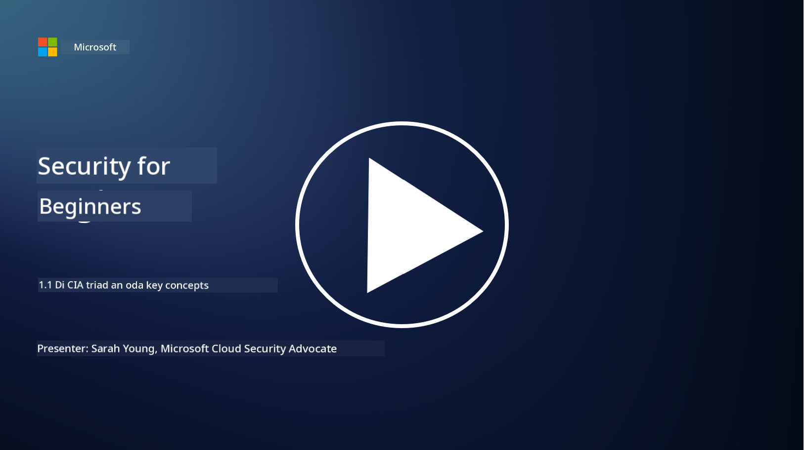
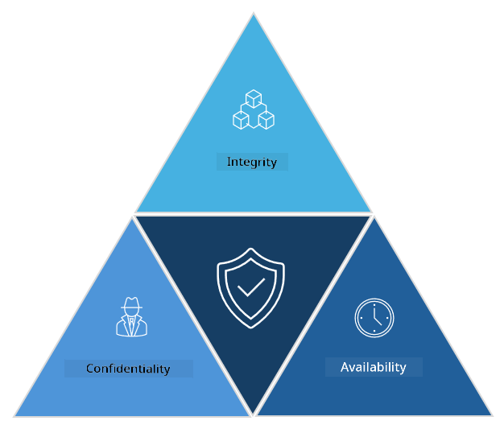

<!--
CO_OP_TRANSLATOR_METADATA:
{
  "original_hash": "16a76f9fa372fb63cffb6d76b855f023",
  "translation_date": "2025-11-18T18:04:56+00:00",
  "source_file": "1.1 The CIA triad and other key concepts.md",
  "language_code": "pcm"
}
-->
# The CIA triad and other key concepts

## Introduction

For dis lesson, we go talk about:

 - Wetin cybersecurity mean?
   
 
 - Wetin be cybersecurity CIA triad?

   

 - Wetin authenticity, nonrepudiation and privacy mean for cybersecurity matter?

## Wetin cybersecurity mean?

Cybersecurity, wey people dey also call information security, na di work wey dem dey do to protect computer systems, networks, devices, and data from digital attack, unauthorized access, damage, or theft. Di main goal of cybersecurity na to make sure say digital assets and information dey confidential, dey correct, and dey available. Cybersecurity professionals dey design and put security controls to protect assets, data and information. As e be say plenty things for our life don dey digital and online, cybersecurity don turn big matter for private people and organizations.

## Wetin be cybersecurity CIA triad?

Di cybersecurity triad na di model wey dey show di three main things wey dem dey consider for any cybersecurity work or when dem dey design system/environment:

### Confidentiality

Dis one na di thing wey most people go sabi when dem hear “cybersecurity”: confidentiality na di process wey dem dey use protect data and information from people wey no suppose see am i.e. na only di people wey need di information go fit access am. But no be all data dey di same level, so dem dey arrange data and protect am based on how e go affect things if wrong people see am.

### Integrity

Dis one mean say dem dey protect di accuracy and trustworthiness of data wey dey inside environment and dem no go allow di data make e change or person wey no suppose touch am go fit amend am. Example na if student change di date of birth for dia driver record for DMV so dem go fit make di person older, print new license wey get earlier date of birth to buy alcohol.

### Availability

Dis one na something wey dey important for operational IT, but e still dey important for cybersecurity. Some kind attacks dey wey dey target availability, and security professionals dey protect against dem (e.g. distributed denial of service – DDoS – attacks).

**Cybersecurity CIA Triad**

## Wetin be authenticity, nonrepudiation and privacy for cybersecurity matter?

Dis ones na extra important things wey dey help make sure say systems and data dey secure and trustworthy:

**Authenticity** - dis one mean say di information, communication, or di person wey you dey interact with na original and e never change or tamper by people wey no suppose touch am.

**Nonrepudiation** - na di idea wey mean say person no go fit deny say dem do something or send message or perform action wey dem do. E dey make sure say person no go fit talk say dem no send message or do di action when evidence dey show say dem do am.

**Privacy** - dis one mean say dem dey protect sensitive and personal information from people wey no suppose see am, use am, share am, or change am. E dey involve controlling who fit access personal data and how dem dey collect, store, and share di data.

## Additional reading

[What Is Information Security (InfoSec)? | Microsoft Security](https://www.microsoft.com/security/business/security-101/what-is-information-security-infosec#:~:text=Three%20pillars%20of%20information%20security%3A%20the%20CIA%20triad,as%20guiding%20principles%20for%20implementing%20an%20InfoSec%20plan.)

---

<!-- CO-OP TRANSLATOR DISCLAIMER START -->
**Disclaimer**:  
Dis document don use AI translation service [Co-op Translator](https://github.com/Azure/co-op-translator) take translate am. Even though we dey try make e accurate, abeg sabi say automated translations fit get mistake or no correct well. Di original document for di native language na di main correct source. For important information, e good make una use professional human translation. We no go dey responsible for any misunderstanding or wrong interpretation wey fit happen because of dis translation.
<!-- CO-OP TRANSLATOR DISCLAIMER END -->