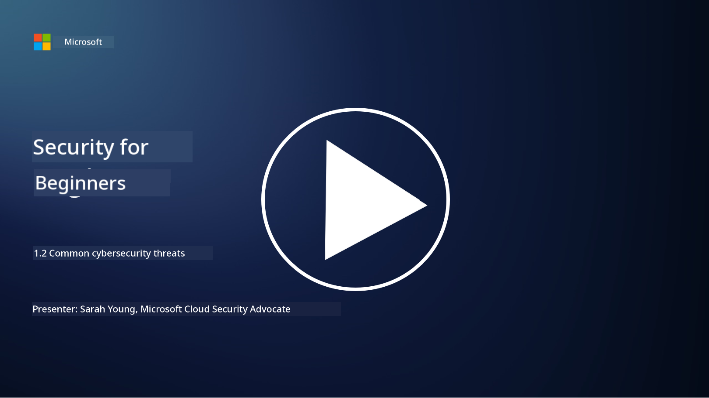

<!--
CO_OP_TRANSLATOR_METADATA:
{
  "original_hash": "6fc3030323139d7134a4ca9d03eccac9",
  "translation_date": "2025-11-18T18:13:48+00:00",
  "source_file": "1.2 Common cybersecurity threats.md",
  "language_code": "pcm"
}
-->
# Common cybersecurity threats

## Introduction

For dis lesson, we go talk about:

 - Wetin be cybersecurity threat?
   
   
 - Why bad people dey wan spoil data and IT systems?

   
   

 - Wetin be di common types of cybersecurity threats?

   
   

 - Wetin be di MITRE ATT&CK framework?

   
   

 - Where I fit dey follow di latest gist about cybersecurity threats?

## Wetin be cybersecurity threat?

Cybersecurity threat na any danger or wahala wey fit spoil di confidentiality, integrity, or availability of data or IT systems. Dis threats dey come from bad people wey dey try use di weak points for di system to enter anyhow, thief sensitive information, scatter operations, or cause wahala for people, companies, or even countries. Cybersecurity threats fit show for different ways and e fit target different parts of digital systems and data.

## Why bad people dey wan spoil data and IT systems?

Bad people dey spoil data and IT systems for plenty reasons, sometimes na because dem wan gain something, dem get belief wey dey push dem, or dem just wan cause wahala. If we sabi why dem dey do am, e go help us protect ourselves better. Some reasons why dem dey do cyberattacks na:

1. **To make money**: Plenty attacks na because dem wan make money. Dem fit thief sensitive information like credit card numbers, bank account details, or personal info to do fraud, steal identity, collect ransom, or sell di stolen data for dark web.

2. **Spy work**: Countries, competitors, or other people fit dey do cyber spying to thief sensitive government, company, or research data for political, economic, or military advantage.

3. **Scatter things and sabotage**: Some attacks na to scatter important infrastructure, services, or operations because of political or belief reasons. Dis kind attack fit cause big wahala, money loss, and spoil reputation.

4. **Belief reasons**: Hacktivists and groups wey get political or belief reasons fit attack systems to make people sabi di matter, promote wetin dem believe, or protest against some actions or companies.

5. **Mistake actions**: No be all bad actions na deliberate; some people fit unknowingly help cyber threats by falling for tricks or being part of compromised network.

At di end, di reasons why dem dey spoil data and IT systems dey plenty, and di wahala wey dis attacks fit cause na big one. Na why e dey important make people, companies, and governments take cybersecurity serious and put measures to protect against dis threats.

## Wetin be di common types of cybersecurity threats?

Plenty types of cybersecurity attacks dey wey bad people dey use to spoil systems, thief data, and cause wahala. Here na di common ones wey dey happen now:

1. **Phishing**:

Phishing na when dem send fake emails or messages wey look like say e come from correct source to make people give sensitive information like passwords, credit card numbers, or personal details. Phishing fit also lead people to bad websites or make dem download malware.

2. **Malware**:

Malware (bad software) na different types of bad programs wey dem design to infect systems, thief data, or cause damage. Types of malware include:

- **Ransomware**: E go lock files and ask for money to unlock am.

- **Trojans**: E go pretend like say e be correct software, but e go give attackers access wey dem no suppose get.

- **Viruses**: E dey copy itself join files and spread.

- **Worms**: E dey copy itself and spread through networks.

3. **Denial of Service (DoS) and Distributed Denial of Service (DDoS)**:

DoS attacks go overload di system wey dem dey target, so e no go fit work for users. DDoS attacks go use plenty compromised devices to flood di target with traffic, make di system no fit work well or e go stop di system completely.

4. **SQL Injection**:

For dis attack, bad people go use di input fields for web application to put bad SQL queries, fit gain access to databases and sensitive data.

5. **Cross-Site Scripting (XSS)**:

Bad people go put bad scripts inside web applications, di scripts go run for di browser of di users wey no sabi. Dis fit make dem thief user data or spread malware.

6. **Social Engineering**:

Social engineering na when dem use human psychology to trick people to give confidential information or do things wey go spoil security.

7. **Zero-Day (0day) Exploits**:

Dis attacks dey target weak points for software or hardware wey di vendor or public never sabi. Bad people go use di weak points before dem fit fix am. Plenty companies dey fear zero-days because no patch dey for am, but e no dey common like di other attacks for dis list. When dem discover zero-day, security researchers go rush to fix am, so zero-days no dey last long.

8. **Credential Attacks**:

Dis attacks include brute force attacks, where bad people go dey guess passwords anyhow, and credential stuffing attacks, where dem go use stolen credentials from one site to try enter other sites.

## Wetin be di MITRE ATT&CK framework?

Di [MITRE ATT&CK framework](https://attack.mitre.org/) (Adversarial Tactics, Techniques, and Common Knowledge) na framework wey dey list and arrange di tactics, techniques, and procedures (TTPs) wey bad people dey use for cyberattacks. MITRE Corporation, wey be not-for-profit organization, na dem create am.

Di MITRE ATT&CK framework dey give standard way to describe and analyze cyber threats, e dey help cybersecurity professionals understand and defend against different attack techniques. Security teams, threat hunters, and incident responders dey use am to:

1. **Understand how bad people dey behave**: Di framework dey show real-life attack behaviors, di steps wey attackers dey take from di time dem enter till dem achieve wetin dem wan do. E cover plenty attack techniques wey different bad groups dey use.

2. **Plan and put defense strategies**: Security teams fit use di framework to plan defense strategies wey go match di tactics and techniques wey bad people fit use.

3. **Respond to incidents and hunt threats**: When dem dey investigate incidents or dey find threats, security professionals fit use di framework to identify and stop di techniques wey attackers dey use.

Di MITRE ATT&CK framework dey arrange di attack techniques into matrices wey group di techniques based on di platform and environment, like Windows, macOS, Linux, and cloud services. Each matrix get tactics (di big goals) and techniques (di specific ways wey dem dey use to achieve di goals). For each technique, di framework dey explain how e dey work, how to stop am, and di real-life bad people wey don use am.

Di framework dey always update and expand as dem dey gather new threat intelligence and as di cybersecurity world dey change. E be better resource to help improve di cybersecurity of any organization by making dem understand how attackers dey operate and how to stop dem.

## Where I fit dey follow di latest gist about cybersecurity threats?

Plenty places dey wey you fit dey follow di latest gist about cybersecurity threats, here na some:

 -   [Open Web Application Security Project (OWASP) top 10 vulnerabilities](https://owasp.org/Top10/)
 - [Common Vulnerabilities and Exposures (CVEs)](https://www.bing.com/ck/a?!&&p=53df6007f017bca2JmltdHM9MTY5MjU3NjAwMCZpZ3VpZD0zYmY4N2RiYS1jYWI1LTYwMDgtMWY1YS02ZmYyY2JjNjYxZWUmaW5zaWQ9NTc2OQ&ptn=3&hsh=3&fclid=3bf87dba-cab5-6008-1f5a-6ff2cbc661ee&psq=cve&u=a1aHR0cHM6Ly9iaW5nLmNvbS9hbGluay9saW5rP3VybD1odHRwcyUzYSUyZiUyZmN2ZS5taXRyZS5vcmclMmYmc291cmNlPXNlcnAtcnImaD1BZXN4S0VBWTNnbGhNZEFpd3daMlNSZkZQNTlrODhIUnYxRUtlSkY1RTk0JTNkJnA9a2NvZmZjaWFsd2Vic2l0ZQ&ntb=1 "Common Vulnerabilities and Exposures")
 - [Microsoft Security Response Center blogs](https://msrc.microsoft.com/blog/)
 - [National Institute of Standards and Technology
   (NIST)](https://www.dhs.gov/topics/cybersecurity): NIST dey provide resources, alerts, and di latest updates about potential cybersecurity threats.
 - [Cybersecurity and Infrastructure Security Agency
   (CISA)](https://www.cisa.gov/resources-tools/resources/free-cybersecurity-services-and-tools): CISA dey provide cybersecurity resources and best practices for
   businesses, government agencies, and other organizations. CISA dey share
   di latest information about di big types of security wahala wey dey affect di community and deep analysis on new and
   changing cyber threats.
 - [National Cybersecurity Center of Excellence (NCCoE)](https://www.dhs.gov/topics/cybersecurity): NCCoE na hub wey dey provide practical cybersecurity solutions wey people fit use for real-life situations.
 - [US-CERT](https://www.cisa.gov/resources-tools/resources/free-cybersecurity-services-and-tools): Di United States Computer Emergency Readiness Team (US-CERT) dey provide plenty cybersecurity resources, including alerts, tips, and more.
 - Di Cyber Emergency Response Team (CERT) for your country

---

<!-- CO-OP TRANSLATOR DISCLAIMER START -->
**Disclaimer**:  
Dis dokyument don use AI transleshion service [Co-op Translator](https://github.com/Azure/co-op-translator) do di transleshion. Even as we dey try make am accurate, abeg make you sabi say transleshion wey machine do fit get mistake or no dey correct well. Di original dokyument for im native language na di main source wey you go fit trust. For important mata, e good make you use professional human transleshion. We no go fit take blame for any misunderstanding or wrong interpretation wey fit happen because you use dis transleshion.
<!-- CO-OP TRANSLATOR DISCLAIMER END -->