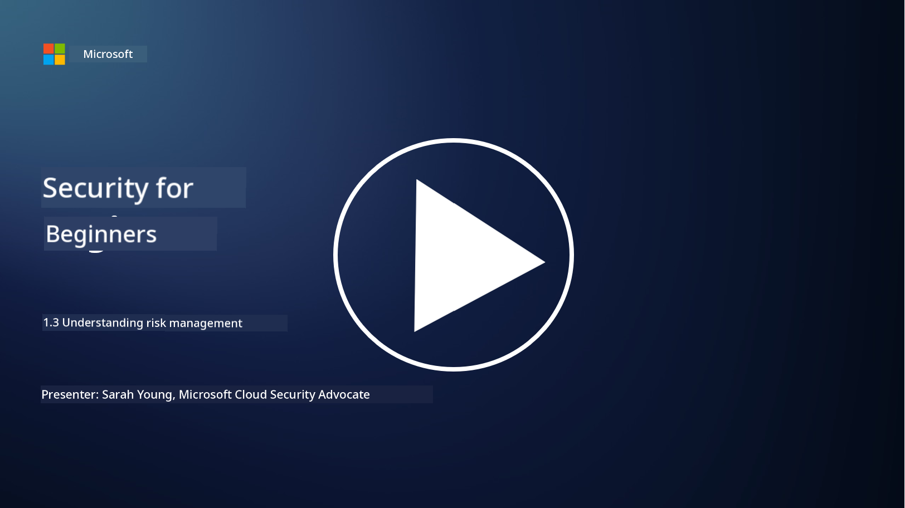
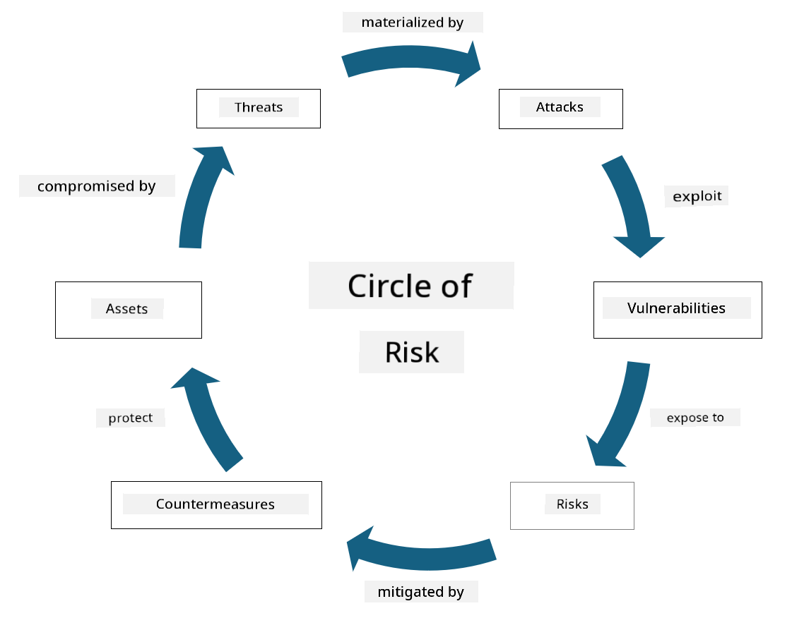

<!--
CO_OP_TRANSLATOR_METADATA:
{
  "original_hash": "fcca304f072cabf206388199e8e2e578",
  "translation_date": "2025-11-18T18:10:53+00:00",
  "source_file": "1.3 Understanding risk management.md",
  "language_code": "pcm"
}
-->
# Understanding risk management

## Introduction

For dis lesson, we go talk about:

 - Wetin some common security terms mean
   
 - Di kain security controls wey dey

 - How to check security risks

## Definitions of commonly used security terminology

Dis terms na di basic things wey dey for cybersecurity and risk management. Make we break dem down and see how dem connect:

1. **Threat Agent**:

Threat agent na person, group, organization, or system wey fit use di weak point for system or network take cause wahala or damage. E fit be hackers, malware creators, vexed workers, or anything wey fit bring risk to information and technology systems.

2. **Threat**:

Threat na di potential action or event wey fit use di weak point for system take cause harm to asset. E fit be hacking, data breach, denial-of-service attack, and others. Threat na di "wetin" wey fit cause harm to di organization assets.

3. **Vulnerability**:

Vulnerability na di weak point or mistake for system design, implementation, or configuration wey threat agent fit use take spoil di system security. E fit dey for software, hardware, process, or how people dey behave. To find and fix vulnerability dey important to reduce di chance of attack.

4. **Risk**:

Risk na di chance say harm or damage fit happen because threat and vulnerability dey interact. E mean di possibility say threat agent go use di weak point take cause bad thing. Risk dey usually check based on how e go affect di organization and di chance say e go happen.

5. **Asset**:

Asset na anything wey get value wey di organization wan protect. E fit be physical things like computers and servers, data like customer info, intellectual property like patents, or even di workers skills and knowledge. To protect asset na one big goal for cybersecurity.

6. **Exposure**:

Exposure na di state wey system dey open to threat because vulnerability dey. E dey show di risk wey dey when weak point dey for system or network.

7. **Control**:

Control na di measure wey dem put to reduce di risk wey threat and vulnerability fit cause. E fit be technical, procedural, or administrative. Controls dey help prevent, detect, or reduce di effect of threat and vulnerability. Example na firewall, access control, encryption, security policy, and training for workers.

To summarize: Threat agents dey use vulnerability take do threat, wey fit lead to risk wey fit harm di organization assets. Exposure dey happen when vulnerability dey, and controls dey help reduce di risk by stopping or reducing di effect of threat on assets. Dis na di foundation of cybersecurity risk management, wey dey help organizations know, check, and handle di risks wey fit affect their information systems and assets.

## Types of security controls

Security controls na di things wey dem dey use to protect information systems and assets from threat and vulnerability. Dem get different types based on wetin dem dey focus on. See di common types:

1. **Administrative Controls**:

Dis controls na di policies, procedures, and guidelines wey dey guide di organization security practices and how people dey behave.

- Security policies and procedures: Na di rules wey dem write down to show how security go dey for di organization.

- Security awareness and training: Programs wey dey teach workers about security best practices and di kind threat wey dey.

- Incident response and management: Plans wey dey show how to handle and reduce di effect of security wahala.

2. **Technical Controls**:

Technical controls na di use of technology to enforce security and protect systems and data. Example na:

- Access controls: Measures wey dey limit wetin people fit access based on their role and permission.

- Encryption: To change data to secure format so dat unauthorized people no go fit access am.

- Firewalls: Devices wey dey control di traffic wey dey enter and comot for network.

- Intrusion Detection and Prevention Systems (IDPS): Tools wey dey monitor network traffic for suspicious activity.

- Antivirus and anti-malware software: Programs wey dey find and remove bad software.

- Authentication mechanisms: Ways to confirm say na di right person dey access system, like password, biometrics, and multi-factor authentication.

- Patch management: To dey update software regularly to fix known weak points.

3. **Physical Controls**:

Physical controls na di measures wey dey protect physical assets and facilities.

- Security guards and access control personnel: People wey dey monitor and control who fit enter di premises.

- Surveillance cameras: Cameras wey dey record and monitor activities.

- Locks and physical barriers: Things wey dey stop people from entering sensitive areas.

- Environmental controls: Measures wey dey control temperature, humidity, and other things wey fit affect equipment and data centers.

4. **Operational Controls**:

Dis controls na di things wey dey happen everyday to make sure systems dey secure.

- Change management: Process wey dey track and approve changes to systems and configurations.

- Backup and disaster recovery: Plans wey dey make sure data dey safe and fit recover if system fail or disaster happen.

- Logging and auditing: To dey monitor and record system activities for security and compliance.

- Secure coding practices: Rules for writing software wey go reduce weak points.

5. **Legal and Regulatory Controls**:

Dis controls dey make sure di organization dey follow di laws, regulations, and industry standards wey dey apply to dem.

- Data protection regulations: To follow laws like GDPR, HIPAA, and CCPA.

- Industry-specific standards: To follow standards like PCI DSS for payment card data security.

Dis different types of security controls dey work together to give organizations better security, protect their systems, data, and assets from different threats.

## Assessing security risks

Some security professionals dey feel say na only risk professionals suppose dey handle risk management, but e dey important make security professionals sabi how to explain security risk in way wey di organization go understand and act on.

Organizations dey always check security risks and decide wetin dem go do (or no go do) about di risks wey dey affect di business. Below na overview of how dem dey usually do am. Note say different teams dey usually handle dis process, e no dey common for one team to manage di whole risk process.

1. **Identify Assets and Threats**:

Di organization go first identify di assets wey dem wan protect. Dis fit include data, systems, hardware, software, intellectual property, and others. After dat, dem go identify di kind threats wey fit affect dis assets.

2. **Assess Vulnerabilities**:

Di organization go then find di weak points or mistakes for systems or processes wey threats fit use. Dis weak points fit come from software problems, wrong configurations, lack of security controls, or human error.

3. **Likelihood Assessment**:

Dem go check di chance say each threat fit happen. Dis dey involve looking at past data, threat intelligence, industry trends, and internal factors. Dem fit rate di chance as low, medium, or high.

4. **Impact Assessment**:

Next, dem go check di kind damage wey each threat fit cause if e use di weak point. Dis damage fit be financial loss, operational wahala, reputation problem, legal issues, and more. Dem fit rate di impact as low, medium, or high.

5. **Risk Calculation**:

Di organization go combine di likelihood and impact assessment to calculate di overall risk level for each threat. Dem fit use risk matrix wey dey assign numbers or descriptions to di likelihood and impact levels. Di result go help dem know di risks wey need urgent attention.

6. **Prioritization and Decision-Making**:

Dem go focus on di risks wey get di highest likelihood and impact values. Dis go help dem use resources well and put controls where e dey important. High-risk threats go need quick action, while low-risk threats fit wait.

7. **Risk Treatment**:

Based on di risk assessment, di organization go decide how dem go handle each risk. Dis fit mean to put security controls, buy insurance, or even accept some risks if e no too serious or e go cost too much to fix.

8. **Continuous Monitoring and Review**:

Risk assessment no be one-time thing. Dem suppose dey do am regularly or anytime big change happen for di organization. Continuous monitoring go make sure new threats, vulnerabilities, or changes dey considered.

By checking security risks like dis, organizations fit make better decisions about how dem go use resources, put security controls, and manage risks. Di goal na to reduce di overall risk wey di organization dey face while making sure di security efforts dey align with di business goals and objectives.

---

<!-- CO-OP TRANSLATOR DISCLAIMER START -->
**Disclaimer**:  
Dis docu don dey translate wit AI translation service [Co-op Translator](https://github.com/Azure/co-op-translator). Even though we dey try make am correct, abeg sabi say automatic translation fit get mistake or no dey accurate well. Di original docu for im native language na di main correct source. For important information, e good make una use professional human translation. We no go fit take blame for any misunderstanding or wrong interpretation wey fit happen because of dis translation.
<!-- CO-OP TRANSLATOR DISCLAIMER END -->