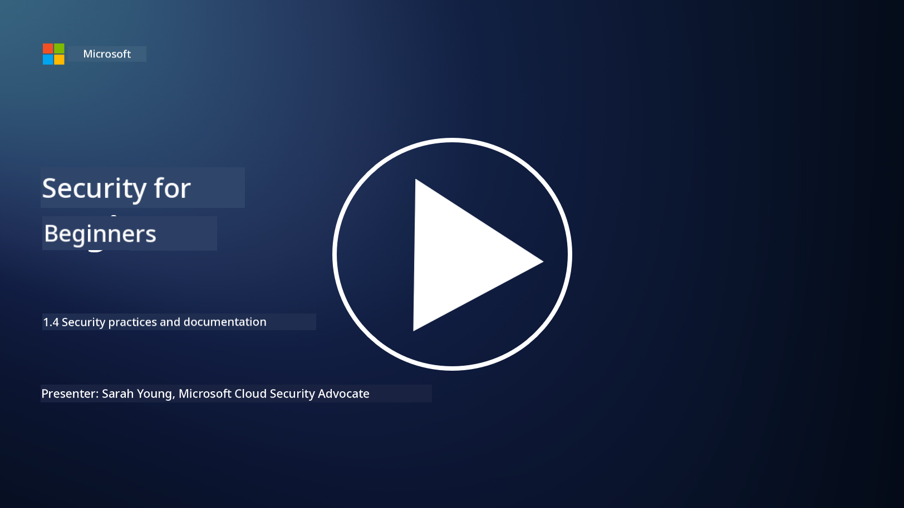

<!--
CO_OP_TRANSLATOR_METADATA:
{
  "original_hash": "d33500902124e52870935bdce4546fcc",
  "translation_date": "2025-11-18T18:01:00+00:00",
  "source_file": "1.4 Security practices and documentation.md",
  "language_code": "pcm"
}
-->
# Security practices and documentation

You fit don hear words like “security policy”, “security standard”, etc. before, but di truth be say many cybersecurity professionals no dey use dem well. So for dis section, we go explain wetin each of dis words mean and why organization go wan use dem.

## Introduction

For dis lesson, we go talk about:

- Wetin be security policy?

- Wetin be security standard?

- Wetin be security baseline?

- Wetin be security guideline?

- Wetin be security procedure?

- Wetin laws and regulations mean for cybersecurity?

Dis words dey usually show for cybersecurity matter to explain different levels of security documentation and practices wey dey inside organization. Make we clear am:

## Wetin be security policy?

Security policy na one high-level document wey dey show di organization big security goals, principles, and guidelines. E dey give framework for how dem go take make security decisions and e dey set di tone for di organization security level. Security policies dey usually cover things like acceptable use of resources, data protection, access control, incident response, and more. Policy no dey depend on solution or technology. Example of security policy wey people fit sabi na di organization acceptable use policy.

## Wetin be security standard?

Security standard na more detailed document wey dey give guidelines and requirements for how dem go take put security controls and measures for di organization. Standards dey more specific and technical pass policies, e dey give clear instructions and recommendations for how to configure and maintain systems, networks, and processes to meet security goals. Example of security standard fit be _“All internal data must be encrypted at rest and in transit.”_

## Wetin be security baseline?

Security baseline na di minimum security configuration wey dem believe say e dey important for one system, application, or environment at one particular time. E dey show di starting point for security wey dem suppose use for all di relevant places. Security baselines dey help make sure say di organization IT infrastructure get consistency and one level of security. Example of security baseline fit be _“Azure VMs must not have direct Internet access”._

## Wetin be security guideline?

Security guideline na document wey dey give advice and recommendations when di security standard no fit cover di matter well. Guidelines dey try handle di “gray areas” wey fit show when standard no dey or e no cover di matter finish.

## Wetin be security procedure?

Security procedure na detailed step-by-step guide wey dey show di specific actions and tasks wey dem suppose do to carry out one security-related process or task. Procedures dey practical and e dey give clear steps wey person go follow for things like incident response, system maintenance, user onboarding, and other security activities. Example of security procedure fit be _“When a P1 security incident is generated by Microsoft Sentinel, the security operations center (SOC) must immediately inform the on-call security manager and send the details of the incident to them.”_

To summarize, dis words dey represent different levels of documentation and guidance for di organization cybersecurity framework. Security policies dey set di big goals, standards dey give detailed requirements, baselines dey show minimum security configurations, guidelines dey give best practices, and procedures dey give actionable steps for security processes.

## Wetin laws/regulations mean for cybersecurity?

Laws and regulations na di legal rules wey government and regulatory bodies dey set to define and enforce rules, standards, and requirements for how to secure digital systems, data, and information. Dis laws and regulations dey different for each place and e dey focus on different parts of cybersecurity like data protection, privacy, incident reporting, and di security of critical infrastructure. Examples of cyber security-related laws and regulations na like General Data Protection Regulation (GDPR), Health Insurance Portability and Accountability Act (HIPAA), California Consumer Privacy Act (CCPA), Payment Card Industry Data Security Standard (PCI DSS).

## Further reading

[Information Security Policy Templates | SANS Institute](https://www.sans.org/information-security-policy/)

[Compliance with Cybersecurity and Privacy Laws and Regulations | NIST](https://www.nist.gov/mep/cybersecurity-resources-manufacturers/compliance-cybersecurity-and-privacy-laws-and-regulations)

---

<!-- CO-OP TRANSLATOR DISCLAIMER START -->
**Disclaimer**:  
Dis docu wey you dey see so, na AI translation service wey dem call [Co-op Translator](https://github.com/Azure/co-op-translator) translate am. Even though we dey try make sure say e correct well, abeg make you sabi say AI translation fit get mistake or no too accurate. Di original docu for di language wey dem first write am na di main correct one. If na important matter, e go better make you use professional human translation. We no go fit take blame for any misunderstanding or wrong interpretation wey fit happen because you use dis translation.
<!-- CO-OP TRANSLATOR DISCLAIMER END -->