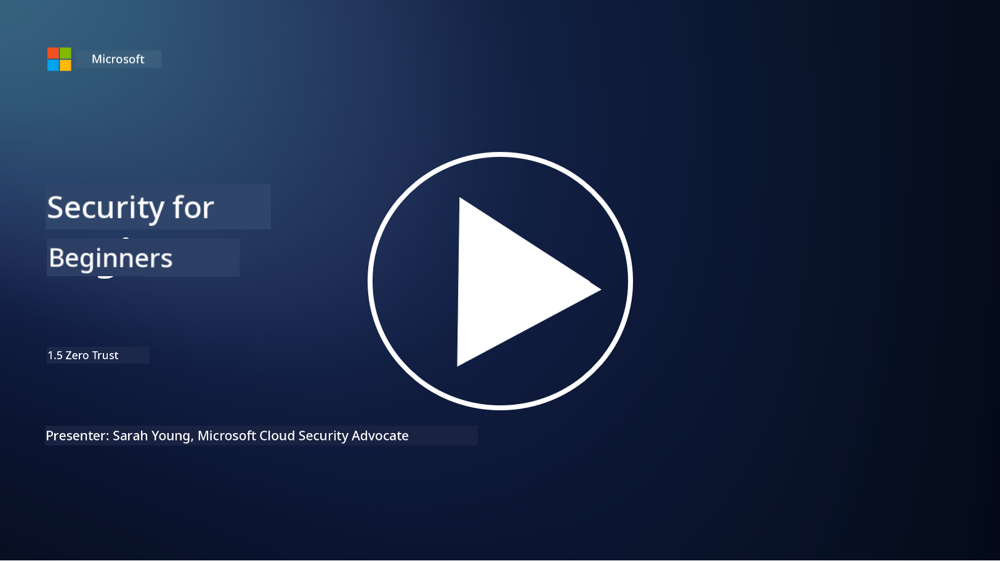
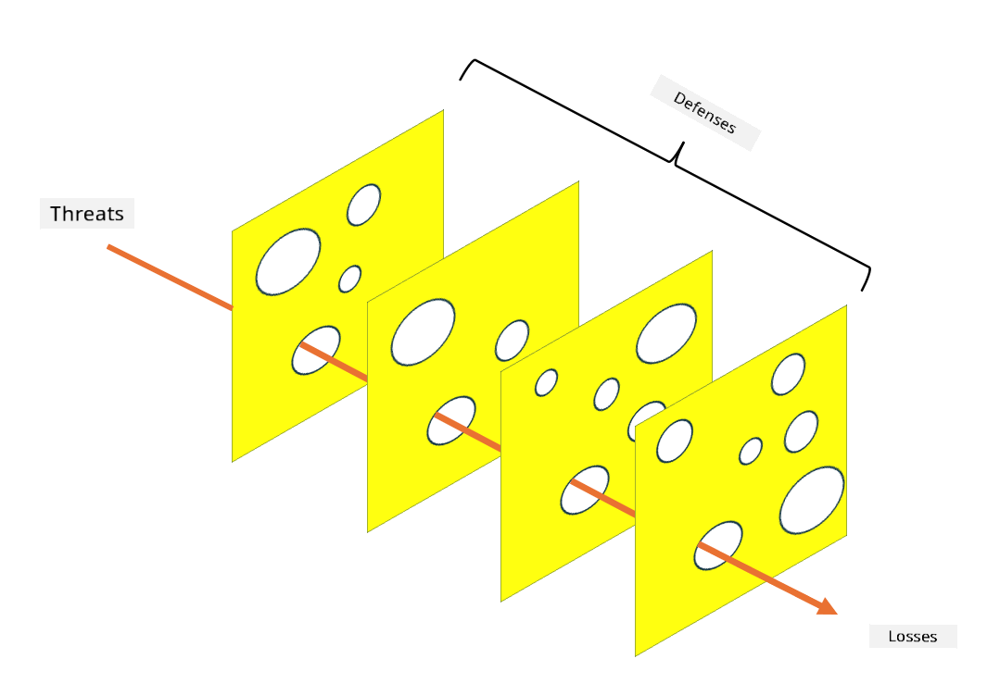

<!--
CO_OP_TRANSLATOR_METADATA:
{
  "original_hash": "75f77f972d2233c584f87c1eb96c983b",
  "translation_date": "2025-11-18T18:09:02+00:00",
  "source_file": "1.5 Zero trust.md",
  "language_code": "pcm"
}
-->
# Zero Trust

“Zero trust” na one word wey people dey use well well for security mata nowadays. But wetin e mean, e just be like one big grammar? For dis lesson, we go talk about wetin zero trust really mean.

## Introduction

- For dis lesson, we go talk about:

- Wetin be zero trust?

- How zero trust take different from the old way wey dem dey do security?

- Wetin be defense in depth?

## Zero Trust

Zero Trust na one way wey dem dey do cybersecurity wey no gree for the old idea of "trust but verify." E dey assume say nobody, whether dem dey inside or outside the network of the organization, suppose get trust just like dat. Instead, Zero Trust dey talk say make dem dey check every user, device, and app wey wan enter resources, no matter where dem dey. The main idea for Zero Trust na to make the "attack surface" small and reduce how security wahala fit affect things.

For Zero Trust model, dem dey focus on dis kind things:

1. **Verify Identity**: Dem dey make sure say dem check and confirm who be who for all users and devices, no matter where dem dey. Identity no mean say na only human; e fit be device, app, and so on.

2. **Least Privilege**: Dem dey give users and devices only the small access wey dem need to do their work, so if wahala happen, e no go too bad.

3. **Micro-Segmentation**: Dem dey divide network resources into small small parts so dat if wahala happen, e no go spread waka for the whole network.

4. **Continuous Monitoring**: Dem dey always dey monitor and check how users and devices dey behave to see if anything dey wrong or threat dey. Modern monitoring dey use machine learning, AI, and threat intelligence to add more detail and context.

5. **Data Encryption**: Dem dey make sure say data dey coded both when e dey move and when e dey rest so dat people wey no suppose see am no go fit touch am.

6. **Strict Access Control**: Dem dey use strong rules to control who fit enter based on things like user role, device health, and network location.

Microsoft dey divide zero trust into five pillars, and we go talk about am for another lesson.

## Differences from Traditional Security Architectures

Zero Trust no be like the old way wey dem dey do security, like perimeter-based models. E get how e take different:

1. **Perimeter vs. Identity-Centric**: The old way dey focus on protecting the edge of the network and dey assume say people and devices wey dey inside fit get trust. Zero Trust dey assume say wahala fit come from inside or outside the network, so e dey use strong identity-based rules.

2. **Implicit vs. Explicit Trust**: The old way dey trust people and devices inside the network until dem see say wahala dey. Zero Trust dey always dey check identity and dey monitor for anything wey no normal.

3. **Flat vs. Segmented Network**: The old way dey use flat network wey people inside fit get access to many things. Zero Trust dey divide the network into small small zones to stop wahala from spreading.

4. **Reactive vs. Proactive**: The old way dey wait for wahala to happen before dem act, like using firewalls and intrusion detection. Zero Trust dey act ahead by assuming say wahala fit happen and dey reduce how e go affect things.

## Defense in Depth

Defense in depth, wey people dey also call layered security, na one way wey dem dey use many layers of security to protect the things wey the organization get. The idea na to make sure say if one layer fail, the other layers go still dey protect. Each layer dey focus on different parts of security and e dey make the organization strong for security matter.

Defense in depth dey use different things like technical, procedural, and physical security. E fit include firewalls, intrusion detection systems, access controls, encryption, user training, security policies, and more. The idea na to make sure say attackers go find am hard to enter the organization system and network. People dey also call am "swiss cheese" model, wey dem dey use for accident prevention for other industries like transport.

## Further reading

[What is Zero Trust?](https://learn.microsoft.com/security/zero-trust/zero-trust-overview?WT.mc_id=academic-96948-sayoung)

[Evolving Zero Trust – Microsoft Position Paper](https://query.prod.cms.rt.microsoft.com/cms/api/am/binary/RWJJdT?WT.mc_id=academic-96948-sayoung)

[Zero Trust and BeyondCorp Google Cloud | Google Cloud Blog](https://cloud.google.com/blog/topics/developers-practitioners/zero-trust-and-beyondcorp-google-cloud)

---

<!-- CO-OP TRANSLATOR DISCLAIMER START -->
**Disclaimer**:  
Dis document don use AI translation service [Co-op Translator](https://github.com/Azure/co-op-translator) take translate am. Even though we dey try make e accurate, abeg sabi say automated translations fit get mistake or no dey 100% correct. Di original document for di language wey dem write am first na di main correct source. For important information, e better make una use professional human translation. We no go fit take responsibility for any misunderstanding or wrong interpretation wey fit happen because of dis translation.
<!-- CO-OP TRANSLATOR DISCLAIMER END -->