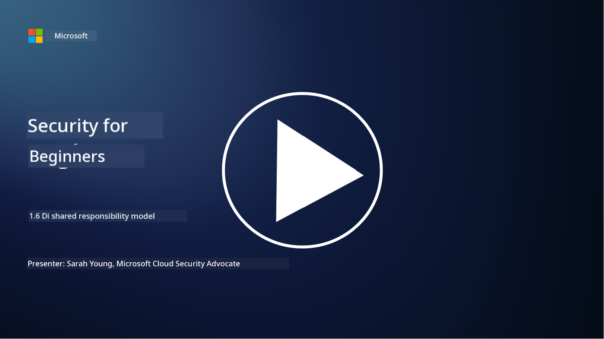

<!--
CO_OP_TRANSLATOR_METADATA:
{
  "original_hash": "a48db640d80c786b928ca178c414f084",
  "translation_date": "2025-11-18T18:07:49+00:00",
  "source_file": "1.6 Shared responsibility model.md",
  "language_code": "pcm"
}
-->
# Di shared responsibility model

Shared responsibility na new idea for IT wey start wen cloud computing show. For cybersecurity mata, e dey important to sabi who dey provide which security controls so dat no go dey any gap for defense.

## Introduction

For dis lesson, we go talk about:

 - Wetin be shared responsibility for cybersecurity mata?
   
 - Wetin be di difference for shared responsibility for security controls
   between IaaS, PaaS and SaaS?

   

 - Where you fit find di security controls wey your cloud platform dey 
   provide?

   
 

 - Wetin "trust but verify" mean?

## Wetin be shared responsibility for cybersecurity mata?

Shared responsibility for cybersecurity mean how dem dey share di work for security between di cloud service provider (CSP) and di customers. For cloud computing environment like Infrastructure as a Service (IaaS), Platform as a Service (PaaS), and Software as a Service (SaaS), both di CSP and di customer get role to play to make sure say di data, applications, and systems dey secure.

## Wetin be di difference for shared responsibility for security controls between IaaS, PaaS and SaaS?

How dem dey share di work depend on di type of cloud service wey you dey use:

 - **IaaS (Infrastructure as a Service)**: Di CSP dey provide di basic infrastructure (servers, networking, storage), but di customer go manage di operating systems, applications, and security settings for di infrastructure.
   
   
 - **PaaS (Platform as a Service):** Di CSP dey give platform wey customers fit use to build and deploy applications. Di CSP dey manage di infrastructure, and di customer go focus on di application development and data security.

   

 - **SaaS (Software as a Service)**: Di CSP dey provide complete applications wey you fit use through internet. For dis one, di CSP dey responsible for di application's security and infrastructure, while di customer go manage user access and how dem dey use di data.

To sabi shared responsibility well dey important because e go show wetin di CSP dey cover and wetin di customer suppose handle. E go help avoid misunderstanding and make sure say security dey complete.

## Where you fit find di security controls wey your cloud platform dey provide?

To sabi di security controls wey your cloud platform dey provide, you go need check di cloud service provider's documentation and resources. Dis one fit include:

 - **CSP’s website and documentation**: Di CSP website go get information about di security features and controls wey dem dey offer as part of their services. CSPs dey usually provide detailed documentation wey dey explain their security practices, controls, and advice. Dis one fit include whitepapers, security guides, and technical documentation.
   
 - **Security Assessments and Audits**: Most CSPs dey allow independent security experts and organizations to check their security controls. Dis reviews fit show di quality of di CSP’s security measures. Sometimes, di CSP fit get security compliance certificate (see di next point).
 - **Security compliance certifications**: Most CSPs dey get certifications like ISO:27001, SOC 2, and FedRAMP, etc. Dis certifications dey show say di provider dey meet specific security and compliance standards.

Make sure say di level of detail and di information wey dey available fit differ between cloud providers. Always make sure say you dey check di official and up-to-date resources wey di cloud service provider dey provide to make better decision about di security of your cloud-based assets.

## Wetin "trust but verify" mean?

For di context of using CSP, third-party software or other IT security service, organization fit first trust di provider's claims about security measures. But to make sure say their data and systems dey safe, dem go verify di claims through security assessments, penetration testing and review di external party’s security controls before dem go fully use di software or service for their operations. Everybody and organizations suppose trust but verify di security controls wey dem no dey responsible for.

## Shared responsibility inside organization
Make you remember say shared responsibility for security inside organization for different teams suppose dey considered too. Di security team no go fit implement all di controls by themselves, dem go need work with operations teams, developers and other parts of di business to make sure say all di security controls wey dem need to keep di organization secure dey in place.

## Further reading
- [Shared responsibility in the cloud - Microsoft Azure | Microsoft Learn](https://learn.microsoft.com/azure/security/fundamentals/shared-responsibility?WT.mc_id=academic-96948-sayoung)
- [What is shared responsibility model? – Definition from TechTarget.com](https://www.techtarget.com/searchcloudcomputing/definition/shared-responsibility-model)
- [The shared responsibility model explained and what it means for cloud security | CSO Online](https://www.csoonline.com/article/570779/the-shared-responsibility-model-explained-and-what-it-means-for-cloud-security.html)
- [Shared Responsibility for Cloud Security: What You Need to Know (cisecurity.org)](https://www.cisecurity.org/insights/blog/shared-responsibility-cloud-security-what-you-need-to-know)

---

<!-- CO-OP TRANSLATOR DISCLAIMER START -->
**Disclaimer**:  
Dis document don use AI translation service [Co-op Translator](https://github.com/Azure/co-op-translator) take translate am. Even though we dey try make e accurate, abeg sabi say automated translations fit get mistake or no correct well. Di original document for di native language na di main correct source. For important information, e good make una use professional human translation. We no go fit take blame for any misunderstanding or wrong interpretation wey fit happen because of dis translation.
<!-- CO-OP TRANSLATOR DISCLAIMER END -->