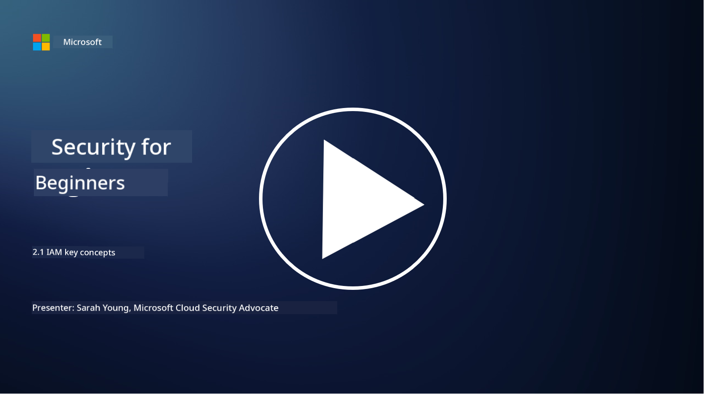

<!--
CO_OP_TRANSLATOR_METADATA:
{
  "original_hash": "2e3864e3d579f0dbb4ac2ec8c5f82acf",
  "translation_date": "2025-11-18T18:11:31+00:00",
  "source_file": "2.1 IAM key concepts.md",
  "language_code": "pcm"
}
-->
# IAM key concepts 

You don ever log into computer or website before? Of course, you don do am! That one mean say you don already dey use identity controls for your everyday life. Identity and access management (IAM) na one big part of security, we go learn more about am for the next lessons.

**Introduction**

For this lesson, we go talk about:

- Wetin we mean by identity and access management (IAM) for the 
  context of cybersecurity? 
  
- Wetin be the principle of least privilege?
  
- Wetin be segregation of duties?
- Wetin be authentication and authorization?

## Wetin we mean by identity and access management (IAM) for the context of cybersecurity?

Identity and Access Management (IAM) na set of processes, technologies, and policies wey dem put in place to make sure say the correct people get the right access to resources for inside one organization digital environment. IAM dey involve how dem dey manage digital identities (users, employees, partners) and their access to systems, applications, data, and networks. The main goal of IAM na to make security better, make user access easy, and make sure say dem dey follow organization policies and regulations. IAM solutions dey usually include user authentication, authorization, identity provisioning, access control, and user lifecycle management (to make sure say dem go delete accounts wey no dey use again).

## Wetin be the principle of least privilege?

The principle of least privilege na one important idea wey talk say make dem give users and systems only the small privileges wey dem need to do their work or role. This principle dey help reduce the kind damage wey fit happen if security breach or insider threat occur. If organization follow this principle, dem go reduce the attack surface and the risk of unauthorized access, data breaches, and accidental misuse of privileges. For real life, e mean say users go only get access to the specific resources and functionalities wey dem need for their job, nothing more. For example, if na only to read document you need, e no make sense to give you full admin privileges for the document.

## Wetin be segregation of duties?

Segregation of duties na principle wey dey try stop conflict of interest and reduce the risk of fraud and mistakes by sharing important tasks and responsibilities among different people for inside one organization. For cybersecurity, segregation of duties dey make sure say no single person go get control over all the parts of one important process or system. The goal na to create checks and balances wey go stop any single person from doing both the setup and approval part of one process. For example, for financial systems, e fit mean say the person wey dey enter transactions for the system no go be the same person wey go approve the transactions. This one go reduce the risk of unauthorized or fraudulent actions wey nobody go notice.

## Wetin be authentication and authorization?

Authentication and authorization na two important ideas for cybersecurity wey dey play big role to make sure say computer systems and data dey secure. Dem dey work together to control access to resources and protect sensitive information.

**1. Authentication**: Authentication na the process wey dem dey use to confirm say the identity of user, system, or entity wey wan access computer system or specific resource na true. E dey make sure say the identity wey dem claim na correct. Authentication methods dey usually involve one or more of these:

   a. Something you know: This one na passwords, PINs, or other secret things wey only the authorized user suppose sabi.
   
   b. Something you have: This one na physical tokens or devices like smart cards, security tokens, or mobile phones wey dem dey use to confirm the user identity.
   
   c. Something you are: This one na biometric things like fingerprints, facial recognition, or retinal scans wey dey unique to person.

Authentication dey help confirm say user na who dem talk say dem be before dem go allow access to system or resource. E dey stop unauthorized access and make sure say only legit users fit do things for system.

**2. Authorization**: Authorization na the process wey dem dey use to allow or deny specific permissions and privileges to authenticated users or entities after dem don confirm their identity. E dey decide wetin user fit do for system or specific resources. Authorization dey usually base on policies, access control rules, and roles wey dem assign to users.

Authorization fit answer the question, "Wetin authenticated user fit do?" E dey involve how dem dey define and enforce access control policies to protect sensitive data and resources from unauthorized access or changes.

**Summary:**

- Authentication dey confirm the identity of users or entities.
- Authorization dey decide wetin actions and resources authenticated users fit access or change.

## Further reading

- [Describe identity concepts - Training | Microsoft Learn](https://learn.microsoft.com/training/modules/describe-identity-principles-concepts/?WT.mc_id=academic-96948-sayoung)
- [Introduction to identity - Microsoft Entra | Microsoft Learn](https://learn.microsoft.com/azure/active-directory/fundamentals/identity-fundamental-concepts?WT.mc_id=academic-96948-sayoung)
- [What is Identity Access Management (IAM)? | Microsoft Security](https://www.microsoft.com/security/business/security-101/what-is-identity-access-management-iam?WT.mc_id=academic-96948-sayoung)
- [What is IAM? Identity and access management explained | CSO Online](https://www.csoonline.com/article/518296/what-is-iam-identity-and-access-management-explained.html)
- [What is IAM? (auth0.com)](https://auth0.com/blog/what-is-iam/)
- [Security+: implementing Identity and Access Management (IAM) controls [updated 2021] | Infosec (infosecinstitute.com)](https://resources.infosecinstitute.com/certifications/securityplus/security-implementing-identity-and-access-management-iam-controls/)
- [least privilege - Glossary | CSRC (nist.gov)](https://csrc.nist.gov/glossary/term/least_privilege)
- [Security: The Principle of Least Privilege (POLP) - Microsoft Community Hub](https://techcommunity.microsoft.com/t5/azure-sql-blog/security-the-principle-of-least-privilege-polp/ba-p/2067390?WT.mc_id=academic-96948-sayoung)
- [Principle of least privilege | CERT NZ](https://www.cert.govt.nz/it-specialists/critical-controls/principle-of-least-privilege/)
- [Why is separation of duties required by NIST 800-171 and CMMC? - (totem.tech)](https://www.totem.tech/cmmc-separation-of-duties/)

---

<!-- CO-OP TRANSLATOR DISCLAIMER START -->
**Disclaimer**:  
Dis docu don dey translate wit AI translation service [Co-op Translator](https://github.com/Azure/co-op-translator). Even though we dey try make am accurate, abeg sabi say automated translations fit get mistake or no dey 100% correct. Di original docu for di native language na di main correct source. For important information, e better make una use professional human translation. We no go fit take blame for any misunderstanding or wrong interpretation wey fit happen because of dis translation.
<!-- CO-OP TRANSLATOR DISCLAIMER END -->