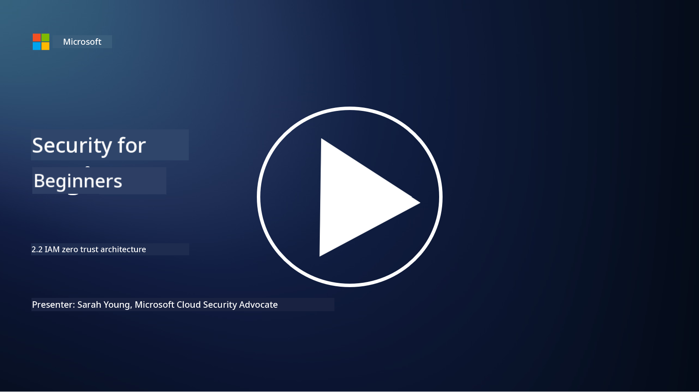

<!--
CO_OP_TRANSLATOR_METADATA:
{
  "original_hash": "4774a978af123f72ebb872199c4c4d4f",
  "translation_date": "2025-11-18T18:08:09+00:00",
  "source_file": "2.2 IAM zero trust architecture.md",
  "language_code": "pcm"
}
-->
# IAM Zero Trust Architecture

Identity na big part for how we fit take do zero trust architecture and build perimeter for any IT environment. For dis section, we go look why e dey important to use identity controls to do zero trust.

## Introduction

For dis lesson, we go talk about:

- Why e good make we use identity as our perimeter for modern IT environments?

- Wetin make dis one different from the traditional IT architectures?

- How we fit take use identity to do zero trust architecture?

## Why e good make we use identity as our perimeter for modern IT environments?

For modern IT environments, the old way wey dem dey use physical perimeter (like firewalls and network boundaries) as the main defense against cyber wahala no too dey work again. Dis na because technology don dey more complex, remote work don dey plenty, and people don dey use cloud services well well. So, companies don dey change to use identity as the new perimeter. Dis one mean say security go dey focus on how dem go dey verify and manage the identity of users, devices, and applications wey wan access resources, no matter where dem dey.

Why e important to use identity as perimeter for modern IT environments:

**Remote Workforce**: As remote work and mobile devices don dey normal, people fit access resources from anywhere and with any device. The old perimeter way no go work again because people no dey office alone.

**Cloud and Hybrid Environments**: Companies don dey use cloud services and hybrid environments plenty. Data and applications no dey only for company premises again, so the old perimeter defense no too make sense.

**Zero Trust Security**: Zero trust security dey talk say make we no trust anybody or anything automatically, whether dem dey inside or outside the network. Identity go be the base to verify access requests, no matter where e dey come from.

**Threat Landscape**: Cyber wahala don dey evolve, and bad people don dey find ways to pass the old perimeter defenses. Things like phishing, social engineering, and insider wahala dey target human weakness instead of network perimeter.

**Data-Centric Approach**: To protect sensitive data na the main thing. If we focus on identity, companies fit control who fit access which data, and e go reduce the chance of data wahala.

## Wetin make dis one different from the traditional IT architectures?

The old IT architectures dey depend well well on perimeter-based security models, where firewalls and network boundaries dey do the main work to stop wahala. The main difference between the old way and the identity-centric way be:

|      Aspect                 |      Traditional IT Architectures                                                                  |      Identity-Centric Approach                                                                             |
|-----------------------------|----------------------------------------------------------------------------------------------------|------------------------------------------------------------------------------------------------------------|
|     Focus                   |     Perimeter Focus: Dem dey depend on perimeter defenses like firewalls and access control.       |     Focus on Identity Verification: Dem don shift from network boundaries to verifying user/device identity.|
|     Location                |     Location Dependency: Security dey tied to physical office locations and network boundaries.    |     Location Independence: Security no dey tied to one place; people fit access from anywhere.             |
|     Trust Assumption        |     Assumed Trust: Dem dey assume say users/devices inside the network dey okay.                   |     Zero Trust Approach: Dem no dey assume trust; dem dey verify access based on identity and context.     |
|     Device Consideration    |     Device Diversity: Dem dey assume say devices inside the network dey secure.                    |     Device Awareness: Dem dey check device health and security, no matter where e dey.                     |
|     Data Protection         |     Data Protection: Dem dey focus on securing network perimeters to protect data.                 |     Data-Centric Protection: Dem dey focus on controlling data access based on identity and data sensitivity.|

## How we fit take use identity to do zero trust architecture?

For zero trust architecture, the main idea na say make we no trust anybody or anything automatically, whether dem dey inside or outside the network perimeter. Identity dey play big role for how we fit take do zero trust because e dey help us dey verify entities wey wan access resources every time. Modern identity security controls dey make sure say every user, device, application, and service wey wan access resources must first show who dem be and dem go authenticate well before dem go fit get access. Dis one dey involve things like username/password, multi-factor authentication (MFA), biometrics, and other strong authentication methods.

## Further Reading

- [Securing identity with Zero Trust | Microsoft Learn](https://learn.microsoft.com/security/zero-trust/deploy/identity?WT.mc_id=academic-96948-sayoung)
- [Zero Trust Principles and Guidance for Identity and Access | CSA (cloudsecurityalliance.org)](https://cloudsecurityalliance.org/artifacts/zero-trust-principles-and-guidance-for-iam/)
- [Zero Trust Identity Controls - Essentials Series - Episode 2 - YouTube](https://www.youtube.com/watch?v=fQZQznIKcGM&list=PLXtHYVsvn_b_gtX1-NB62wNervQx1Fhp4&index=13)

---

<!-- CO-OP TRANSLATOR DISCLAIMER START -->
**Disclaimer**:  
Dis document don use AI translation service [Co-op Translator](https://github.com/Azure/co-op-translator) take translate am. Even though we dey try make sure say e correct, make una sabi say automated translations fit get mistake or no dey accurate well. Di original document for di native language na im una go take as di main correct one. For important information, e better make una use professional human translation. We no go fit take responsibility for any misunderstanding or wrong interpretation wey fit happen because of dis translation.
<!-- CO-OP TRANSLATOR DISCLAIMER END -->