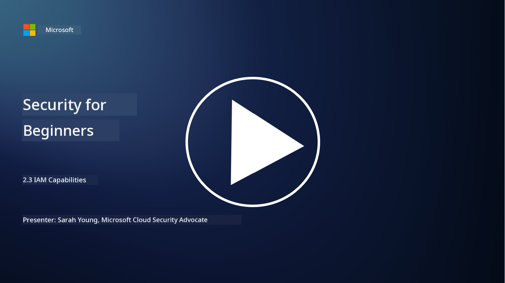

<!--
CO_OP_TRANSLATOR_METADATA:
{
  "original_hash": "bf0b8a54f2c69951744df5a94bc923f7",
  "translation_date": "2025-11-18T18:06:56+00:00",
  "source_file": "2.3 IAM capabilities.md",
  "language_code": "pcm"
}
-->
# IAM Capabilities

For dis section, we go talk more about di main tools and things wey dem dey use for identity security.

## Introduction

For dis lesson, we go talk about:

 - Wetin be directory service?
      
     
    
 - Wetin dem fit use to secure identities?
>
>        Multi-Factor Authentication (MFA)
> 
>        Single Sign-On (SSO)
> 
>        Role-Based Access Control (RBAC)
> 
>        Adaptive Authentication
> 
>        Biometric Authentication
> 
>        Privileged Access Management (PAM)
> 
>        Identity Governance and Administration (IGA)
> 
>        Behavioral Analytics

## Wetin be directory service?

Directory service na special database wey dey store and manage information about network resources like users, groups, devices, applications, and other objects. E dey act like central place wey dey keep identity and access-related data, so organizations fit manage and control user authentication, authorization, and other security tasks well.

Directory services dey very important for modern IT environments because dem dey provide foundation for identity and access management (IAM) solutions. Dem dey help secure access to resources, enforce access policies, and make admin work easy. One popular directory service na Microsoft Active Directory, but we get others like LDAP (Lightweight Directory Access Protocol) directories wey dey do similar work.

Di main functions and features of directory service for cybersecurity include:

 - **User Authentication**: Directory services dey check user credentials (like username and password) to make sure say na only authorized users fit enter di network and use di resources.
 - **User Authorization**: Dem dey decide di level of access wey each user go get based on di person role, group membership, and other attributes. Dis one dey make sure say users fit only access wetin dem suppose access.
 - **Group Management**: Directory services dey help admins arrange users into groups, so e go easy to manage access control. Permissions fit dey assign to groups instead of individual users.
 - **Password Policies**: Dem dey enforce password rules like complexity and expiration, so user accounts go dey more secure.
 - **Single Sign-On (SSO)**: Some directory services dey support SSO, wey go allow users access plenty applications and services with one set of credentials.
 - **Centralized User Management**: Directory services dey keep user information for one place, so e go easy to manage user accounts, profiles, and attributes.
 - **Auditing and Logging**: Dem fit record user authentication and access activities, wey go help for security audits and compliance.

## Wetin dem fit use to secure identities?

**Multi-Factor Authentication (MFA)**

MFA dey require users to provide different types of verification before dem go fit access. E dey include something wey di user sabi (password), something wey di user get (smartphone or security token), and something wey di user be (biometric data like fingerprint or face).

**Single Sign-On (SSO)**

SSO dey allow users access plenty applications and systems with one set of credentials. E dey make user experience better and reduce di wahala of managing plenty passwords.

**Role-Based Access Control (RBAC)**

RBAC dey assign permissions based on di roles wey dem don set. Users go get access based on di role wey dem get for di organization.

**Adaptive Authentication**

Adaptive authentication dey check risk factors like location, device, time of access, and user behavior to adjust di level of authentication wey dem need. If di request look somehow, dem fit add extra authentication steps.

**Biometric Authentication**

Biometric authentication dey use di unique biological things wey person get like fingerprints, face, voice, and even how person dey type to verify identity.

**Privileged Access Management (PAM)**

PAM dey focus on securing access to important systems and data by putting strict control for privileged accounts. E dey include things like just-in-time access and session monitoring.

**Identity Governance and Administration (IGA)**

IGA dey manage user identities and di access wey dem get to resources from di time dem start till di time dem stop. E include onboarding, provisioning, role-based access control, and deprovisioning.

**Behavioral Analytics**

Behavioral analytics dey monitor how users dey behave and dey set normal patterns. If person behavior change from di usual, e fit trigger alert for investigation.

# Further reading
- [Azure Active Directory fundamentals documentation - Microsoft Entra | Microsoft Learn](https://learn.microsoft.com/azure/active-directory/fundamentals/?WT.mc_id=academic-96948-sayoung)
- [What is Azure Active Directory? - Microsoft Entra | Microsoft Learn](https://learn.microsoft.com/azure/active-directory/fundamentals/whatis?WT.mc_id=academic-96948-sayoung)
- [Manage your multi-cloud identity infrastructure with Microsoft Entra - YouTube](https://www.youtube.com/watch?v=9qQiq3wTS2Y&list=PLXtHYVsvn_b_gtX1-NB62wNervQx1Fhp4&index=18)

---

<!-- CO-OP TRANSLATOR DISCLAIMER START -->
**Disclaimer**:  
Dis document don use AI translation service [Co-op Translator](https://github.com/Azure/co-op-translator) take translate am. Even though we dey try make e accurate, abeg sabi say automated translations fit get mistake or no correct well. Di original document for di native language na im you go take as di main correct one. For important information, e better make professional human translation dey involved. We no go fit take blame for any misunderstanding or wrong interpretation wey fit happen because you use dis translation.
<!-- CO-OP TRANSLATOR DISCLAIMER END -->