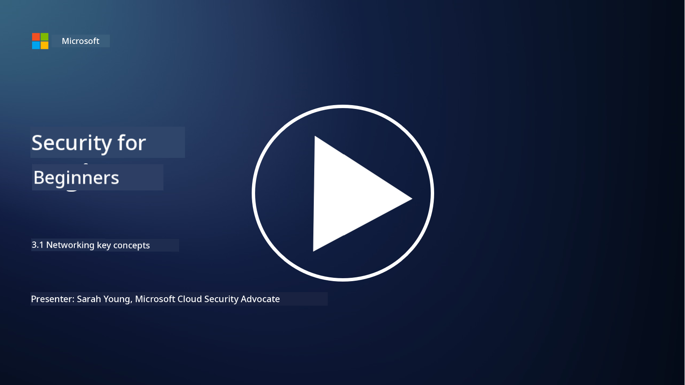
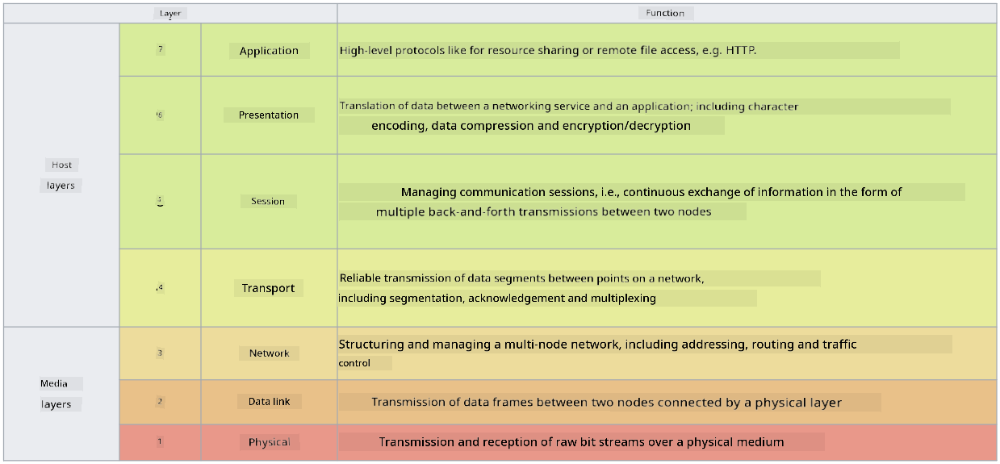

<!--
CO_OP_TRANSLATOR_METADATA:
{
  "original_hash": "252724eceeb183fb9018f88c5e1a3f0c",
  "translation_date": "2025-11-18T18:04:28+00:00",
  "source_file": "3.1 Networking key concepts.md",
  "language_code": "pcm"
}
-->
# Networking key concepts

If you don do any IT work before, e fit be say you don hear about networking concepts. Even though we dey use identity as our main way to protect modern environments, e no mean say network controls no dey important again. This topic big well well, but for this lesson, we go talk about some key networking concepts.

For this lesson, we go talk about:

 - Wetin be IP addressing?
   
 - Wetin be OSI model?

 

 - Wetin be TCP/UDP?

   
 

 - Wetin be port numbers?

   
  

 - Wetin be encryption at rest and in transit?

## Wetin be IP addressing?

IP addressing, or Internet Protocol addressing, na number wey dem dey give every device wey connect to computer network wey dey use Internet Protocol to communicate. E dey act like unique ID for devices inside network, so dem fit send and receive data for internet or other networks wey connect together. We get two main types of IP addressing: IPv4 (Internet Protocol version 4) and IPv6 (Internet Protocol version 6). IP address dey usually show for IPv4 format (e.g., 192.168.1.1) or IPv6 format (e.g., 2001:0db8:85a3:0000:0000:8a2e:0370:7334).

## Wetin be OSI Model?

The OSI (Open Systems Interconnection) model na idea wey dem use arrange how communication system dey work into seven different layers. Each layer get wetin e dey do and e dey work with the layer wey dey near am to make sure say data communication between devices for network dey smooth and correct. The layers, from bottom go top, na:

 1. Physical Layer
    
 
 2. Data Link Layer

    
    

 1. Network Layer

    
   

 1. Transport Layer

    

 1. Session Layer

    
   

 1. Presentation Layer

    
    

 1. Application Layer

The OSI model dey help us understand how networking protocols and technologies dey work together, no matter the hardware or software wey dem dey use.

_ref: https://en.wikipedia.org/wiki/OSI_model_

## Wetin be TCP/UDP?

TCP (Transmission Control Protocol) and UDP (User Datagram Protocol) na two main transport layer protocols wey computer networks dey use to make devices fit communicate for internet or local network. Dem dey break data into packets to send am and then join the packets back to the original data for the other side. But dem get different ways and reasons why people dey use dem.

**TCP (Transmission Control Protocol)**:

TCP na connection-oriented protocol wey dey make sure say data wey dem dey send go reach the other side complete and in order. E go first create connection between sender and receiver before dem start to send data. TCP dey make sure say data packets go reach in the correct order and e fit resend lost packets to make sure say the data complete. This one dey good for things wey need correct and complete data, like web browsing, email, file transfer (FTP), and database communication.

**UDP (User Datagram Protocol)**:

UDP na connectionless protocol wey dey send data fast but e no dey guarantee say the data go complete like TCP. E no dey create connection before e send data and e no dey resend lost packets. UDP dey good for things wey need speed and efficiency more than complete data, like real-time communication, streaming media, online gaming, and DNS queries.

To summarize, TCP dey focus on reliability and correct order, so e dey good for things wey need accurate data, while UDP dey focus on speed and efficiency, so e dey good for things wey no mind small data loss or order change if e go make am faster. The one wey you go choose depend on wetin the application or service need.

## Wetin be Port Numbers?

For networking, port number na number wey dem dey use to separate different services or applications wey dey run for one device inside network. Ports dey help direct incoming data to the correct application. Port numbers na 16-bit unsigned integers, so dem dey range from 0 to 65535. Dem dey divide into three groups:

- Well-Known Ports (0-1023): Dem reserve this one for standard services like HTTP (port 80) and FTP (port 21).

- Registered Ports (1024-49151): Dem dey use this one for applications and services wey no dey inside the well-known range but dem don officially register.

- Dynamic/Private Ports (49152-65535): Dem dey use this one for temporary or private use by applications.

## Wetin be encryption at rest and in transit?

Encryption na process wey dey change data into secure format to protect am from people wey no suppose see am or change am. You fit encrypt data when e dey "at rest" (when e dey store for device or server) and "in transit" (when e dey move between devices or networks).

Encryption at Rest: This one na when you encrypt data wey dey store for devices, servers, or storage systems. Even if person wey no suppose get access to the storage media, dem no go fit see the data unless dem get the encryption keys. This one dey important to protect sensitive data if dem thief device, data breach happen, or person wey no suppose get access try enter.

Encryption in Transit: This one na when you encrypt data wey dey move between devices or networks. E dey stop people wey wan spy or intercept data wey dey move. Common protocols for encryption in transit na HTTPS for web communication and TLS/SSL to secure different types of network traffic.

## Further reading
- [How Do IP Addresses Work? (howtogeek.com)](https://www.howtogeek.com/341307/how-do-ip-addresses-work/)
- [Understanding IP Address: An Introductory Guide (geekflare.com)](https://geekflare.com/understanding-ip-address/)
- [What is the OSI model? The 7 layers of OSI explained (techtarget.com)](https://www.techtarget.com/searchnetworking/definition/OSI)
- [The OSI Model – The 7 Layers of Networking Explained in Plain English (freecodecamp.org)](https://www.freecodecamp.org/news/osi-model-networking-layers-explained-in-plain-english/)
- [TCP/IP protocols - IBM Documentation](https://www.ibm.com/docs/en/aix/7.3?topic=protocol-tcpip-protocols)
- [Common Ports Cheat Sheet: The Ultimate Ports & Protocols List (stationx.net)](https://www.stationx.net/common-ports-cheat-sheet/)
- [Azure Data Encryption-at-Rest - Azure Security | Microsoft Learn](https://learn.microsoft.com/azure/security/fundamentals/encryption-atrest?WT.mc_id=academic-96948-sayoung)

---

<!-- CO-OP TRANSLATOR DISCLAIMER START -->
**Disclaimer**:  
Dis docu don dey translate wit AI translation service [Co-op Translator](https://github.com/Azure/co-op-translator). Even though we dey try make am correct, abeg sabi say automatic translation fit get mistake or no dey accurate well. Di original docu for im native language na di main correct source. For important information, e good make una use professional human translation. We no go fit take blame for any misunderstanding or wrong interpretation wey fit happen because of dis translation.
<!-- CO-OP TRANSLATOR DISCLAIMER END -->