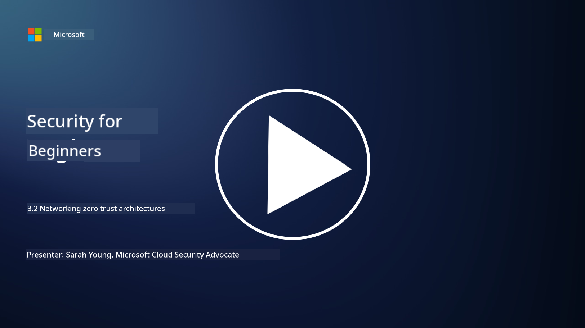

<!--
CO_OP_TRANSLATOR_METADATA:
{
  "original_hash": "680d6e14d9d33fc471c22f44679713f8",
  "translation_date": "2025-11-18T18:05:57+00:00",
  "source_file": "3.2 Networking zero trust architecture.md",
  "language_code": "pcm"
}
-->
# Networking Zero Trust Architectures

Network dey provide one important layer for zero trust controls. For dis lesson, we go learn more about dis things:

- Wetin be network segmentation?  
- How network segmentation dey help implement zero trust?  
- Wetin be end-to-end encryption?  

## Wetin be network segmentation?

Network segmentation na di way wey dem dey divide network into smaller, isolated parts or subnetworks. Each part dey separate from di others, and access between di parts dey controlled and restricted based on di security policies wey dem set. Dem dey use network segmentation to improve security by making sure say if breach happen, e no go spread, and attackers no go fit waka anyhow for di network.

If organization use network segmentation, dem fit create "zones" wey go separate different kain users, applications, and data. Dis one go reduce di attack surface and make di damage wey security incident fit cause small. Technologies like virtual LANs (VLANs), firewalls, and access controls fit help achieve network segmentation.

## How network segmentation dey help implement zero trust?

Network segmentation dey work well with di principles of Zero Trust model. For Zero Trust architecture, network segmentation dey help enforce di principle of "least privilege" by making sure say users and devices only get access to di specific resources and services wey dem need to do their work. If organization divide di network into smaller zones, dem fit put strict access controls, isolate important assets, and stop attackers from moving anyhow.

Network segmentation still dey help enforce identity-based access controls, where users and devices go dey properly authenticated and authorized before dem fit enter specific segments. Dis one dey stop unauthorized access to sensitive resources and reduce di wahala wey fit happen if credentials dey compromised.

## Wetin be end-to-end encryption?

End-to-end (E2E) encryption na security measure wey dey make sure say data go remain encrypted from di sender side reach di recipient side. For dis process, di data go dey encrypted for di sender side, and na only di recipient go get di decryption key to unlock and read di data. Di encryption and decryption dey happen for di endpoints, so e go hard well well for unauthorized people, including service providers and intermediaries, to see di plaintext data.

E2E encryption dey provide high level of confidentiality and security for data wey dey move, even if di data pass through different intermediary systems or networks. Dem dey use am for secure messaging apps, email services, and other communication platforms to protect sensitive information from interception and unauthorized access.

Dis encryption method dey make sure say even if attackers manage see di data wey dey transit, wetin dem go see na encrypted content wey no get meaning without di decryption key. End-to-end encryption dey very important to protect user privacy and make sure sensitive information no go dey exposed to unauthorized people.

## Wetin be SASE?

SASE mean "Secure Access Service Edge," and e be cybersecurity framework and architecture wey join network security and wide-area networking (WAN) capabilities together as one cloud-based service. SASE dey designed to provide secure and scalable access to network resources, applications, and data for remote and mobile users, while e dey simplify network management and reduce di wahala of traditional network and security architectures.

Di key features and components of SASE include:

1. **Cloud-Based:** SASE dey delivered as cloud service, meaning say di security and networking functions dey come from di cloud instead of di traditional on-premises hardware and appliances.  

2. **Integration of Security and Networking:** SASE dey join different security services like secure web gateways (SWG), firewall as a service (FWaaS), data loss prevention (DLP), zero-trust network access (ZTNA), and WAN optimization with wide-area networking capabilities. Dis integration dey help streamline security and networking operations.  

3. **Zero Trust:** SASE dey operate with di principle of zero trust, meaning say e dey enforce strict access controls and least-privilege access policies. Users and devices no dey trusted by default, dem must authenticate and authorize before dem fit access resources.  

4. **Identity-Centric:** SASE dey focus on user and device identities as di base for access control. Identity and context-based policies dey determine access permissions, and dis policies dey adapt dynamically based on user behavior and context.  

5. **Scalability and Flexibility:** SASE fit scale easily to handle plenty users and devices, making am good for organizations wey get different and changing networking and security needs.  

SASE dey very important for di modern time of remote work and cloud adoption, as e dey provide one complete and flexible way to secure and manage network access. E dey help organizations adapt to di changing security and networking needs while e still dey focus on user-centric and zero-trust security models.

## Further reading

- [What Is Network Segmentation? - Cisco](https://www.cisco.com/c/en/us/products/security/what-is-network-segmentation.html#~benefits)  
- [What Is Micro-Segmentation? - Cisco](https://www.cisco.com/c/en/us/products/security/what-is-microsegmentation.html)  
- [Implementing Network Segmentation and Segregation | Cyber.gov.au](https://www.cyber.gov.au/resources-business-and-government/maintaining-devices-and-systems/system-hardening-and-administration/network-hardening/implementing-network-segmentation-and-segregation)  
- [What Is Network Segmentation and Why It Matters | CompTIA](https://www.comptia.org/blog/security-awareness-training-network-segmentation)  
- [Network Segmentation: Concepts and Practices (cmu.edu)](https://insights.sei.cmu.edu/blog/network-segmentation-concepts-and-practices/)  
- [Secure networks with Zero Trust | Microsoft Learn](https://learn.microsoft.com/security/zero-trust/deploy/networks?WT.mc_id=academic-96948-sayoung)  
- [What is end-to-end encryption? | IBM](https://www.ibm.com/topics/end-to-end-encryption)  
- [What Is End-to-End Encryption, and Why Does It Matter? (howtogeek.com)](https://www.howtogeek.com/711656/what-is-end-to-end-encryption-and-why-does-it-matter/)  
- [Definition of Secure Access Service Edge (SASE) - Gartner Information Technology Glossary](https://www.gartner.com/en/information-technology/glossary/secure-access-service-edge-sase)  
- [What Is Secure Access Service Edge (SASE)? | Microsoft Security](https://www.microsoft.com/security/business/security-101/what-is-sase?WT.mc_id=academic-96948-sayoung)  

---

<!-- CO-OP TRANSLATOR DISCLAIMER START -->
**Disclaimer**:  
Dis dokyument don use AI translation service [Co-op Translator](https://github.com/Azure/co-op-translator) take translate am. Even though we dey try make am accurate, abeg sabi say automated translations fit get mistake or no dey 100% correct. Di original dokyument for di native language na di main correct source. For important information, e go beta make professional human translator check am. We no go fit take blame for any misunderstanding or wrong interpretation wey fit happen because of dis translation.
<!-- CO-OP TRANSLATOR DISCLAIMER END -->