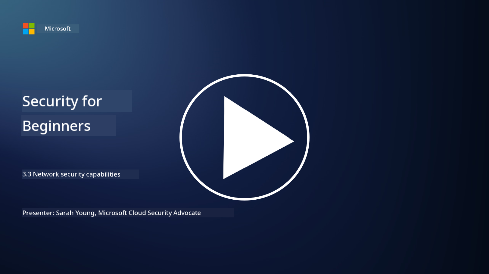

<!--
CO_OP_TRANSLATOR_METADATA:
{
  "original_hash": "c3aba077bb98eebc925dd58d870229ab",
  "translation_date": "2025-11-18T18:14:47+00:00",
  "source_file": "3.3 Network security capabilities.md",
  "language_code": "pcm"
}
-->
# Network security capabilities

For dis lesson, we go learn about di following things wey fit help secure network:

 - Traditional firewalls
 - Web application firewalls
 - Cloud security groups
 - CDN
 - Load balancers
 - Bastion hosts
 - VPNs
 - DDoS protection

## Traditional Firewalls

Traditional firewalls na security device wey dey control and monitor di traffic wey dey enter and comot for network based on di rules wey dem don set. E dey act like barrier between di internal network wey people trust and di external network wey people no trust, e dey filter traffic to stop unauthorized access and wahala.

## Web Application Firewalls

Web Application Firewalls (WAFs) na special firewalls wey dey protect web applications from different attacks like SQL injection, cross-site scripting, and other wahala. Dem dey check HTTP requests and responses to sabi and block bad traffic wey dey target web applications.

## Cloud security groups

Security groups na one important network security feature wey cloud service providers dey give. Dem dey act like virtual firewalls wey dey control di traffic wey dey enter and comot for cloud resources like virtual machines (VMs) and instances. Security groups dey allow organizations set rules wey go decide di kind traffic wey dem go allow or block, e dey add extra protection for cloud deployments.

## Content Delivery Network (CDN)

Content Delivery Network na network of servers wey dey different places for di world. CDNs dey help make websites fast and available by caching content and serving am from servers wey dey near di user. Dem still dey provide small protection against DDoS attacks by sharing traffic across plenty server locations.

## Load Balancers

Load balancers dey share di traffic wey dey enter network across plenty servers to make sure resources dey work well, di network dey available, and di application dey perform well. Dem dey help stop server overload and make sure response time dey fast, e dey make di network strong.

## Bastion Hosts

Bastion hosts na very secure and isolated servers wey dey give controlled access to network from external network wey people no trust (like internet). Dem dey act like entry point for administrators to enter internal systems securely. Bastion hosts dey usually get strong security setup to reduce di chance of attack.

## Virtual Private Networks (VPNs)

VPNs dey create encrypted tunnels between di user device and remote server, e dey make sure communication dey secure and private even if di network no dey safe like internet. People dey use VPNs wella to get remote access to internal networks, e dey allow dem access resources like say dem dey di same network.

## DDoS protection tooling

DDoS (Distributed Denial of Service) protection tools and services na tools wey dey stop di effect of DDoS attacks, where plenty compromised devices go flood network or service to make am crash. DDoS protection dey sabi and block bad traffic, e dey make sure say di good traffic fit still reach where e suppose go.

## Further reading

- [What Is a Firewall? - Cisco](https://www.cisco.com/c/en/us/products/security/firewalls/what-is-a-firewall.html#~types-of-firewalls)
- [What Does a Firewall Actually Do? (howtogeek.com)](https://www.howtogeek.com/144269/htg-explains-what-firewalls-actually-do/)
- [What is a Firewall? How Firewalls Work & Types of Firewalls (kaspersky.com)](https://www.kaspersky.com/resource-center/definitions/firewall)
- [Network security group - how it works | Microsoft Learn](https://learn.microsoft.com/azure/virtual-network/network-security-group-how-it-works)
- [Introduction to Azure Content Delivery Network (CDN) - Training | Microsoft Learn](https://learn.microsoft.com/training/modules/intro-to-azure-content-delivery-network/?WT.mc_id=academic-96948-sayoung)
- [What is a content delivery network (CDN)? - Azure | Microsoft Learn](https://learn.microsoft.com/azure/cdn/cdn-overview?WT.mc_id=academic-96948-sayoung)
- [What Is Load Balancing? How Load Balancers Work (nginx.com)](https://www.nginx.com/resources/glossary/load-balancing/)
- [Bastion hosts vs. VPNs · Tailscale](https://tailscale.com/learn/bastion-hosts-vs-vpns/)
- [What is VPN? How It Works, Types of VPN (kaspersky.com)](https://www.kaspersky.com/resource-center/definitions/what-is-a-vpn)
- [Introduction to Azure DDoS Protection - Training | Microsoft Learn](https://learn.microsoft.com/training/modules/introduction-azure-ddos-protection/?WT.mc_id=academic-96948-sayoung)
- [What Is a DDoS Attack? | Microsoft Security](https://www.microsoft.com/security/business/security-101/what-is-a-ddos-attack?WT.mc_id=academic-96948-sayoung)

---

<!-- CO-OP TRANSLATOR DISCLAIMER START -->
**Disclaimer**:  
Dis dokyument don translate wit AI translation service [Co-op Translator](https://github.com/Azure/co-op-translator). Even as we dey try make am accurate, abeg sabi say machine translation fit get mistake or no correct well. Di original dokyument wey dey for im native language na di main source wey you go fit trust. For important mata, e better make professional human translator check am. We no go fit take blame for any misunderstanding or wrong interpretation wey fit happen because you use dis translation.
<!-- CO-OP TRANSLATOR DISCLAIMER END -->