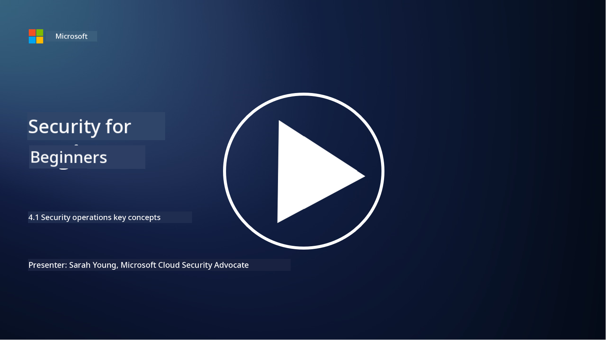

<!--
CO_OP_TRANSLATOR_METADATA:
{
  "original_hash": "6a55b31df9eebf550d040cef0ef7dff3",
  "translation_date": "2025-11-18T18:00:33+00:00",
  "source_file": "4.1 SecOps key concepts.md",
  "language_code": "pcm"
}
-->
# Security operations key concepts

Security operations na one important part of how business dey protect dia systems. For dis lesson, we go learn more about am:

 - Wetin security operations dey do for business?
   
 - Wetin security operations fit look like?
   
   - How security operations take different from normal IT operations?

## Wetin security operations dey do for business?

Security operations for business na team or department wey dey monitor, detect, investigate, and respond to cyber threats and wahala. Di main goal na to make sure say di organization digital assets dey safe, dey correct, and dey available by finding security risks early and handling security wahala well.

## Wetin security operations fit look like?

Security operations fit get different forms based on di size and complexity of di organization. Some common forms na:

**Security Operations Center (SOC):** Na one team wey dey monitor, analyze, and respond to security wahala 24/7. Dem dey use advanced tools and technology to find and handle threats quick.

**Incident Response Team:** Na team wey dey focus on handling security wahala and breaches. Dem dey investigate, organize response, and help di business recover.

**Threat Hunting Team:** Na team wey dey find advanced threats and hidden wahala wey normal security tools no fit detect.

**Red Team/Blue Team:** Red team dey act like attacker to find weak points, while blue team dey defend against di attack. Both teams dey work together to make security better.

**Managed Security Services Provider (MSSP):** Some businesses dey give dia security operations work to outside companies wey sabi security monitoring and incident response.

## How security operations take different from normal IT operations?

Security operations and normal IT operations dey related but dem no be di same:

**Focus:** IT operations dey focus on managing and maintaining di organization IT systems to make sure dem dey work well. Security operations dey focus on finding and handling security wahala.

**Responsibilities:** IT operations dey do things like system maintenance, software updates, and user support. Security operations dey handle threat detection, incident response, vulnerability management, and security monitoring.

**Timeliness:** IT operations dey focus on making sure systems dey available and dey work well immediately. Security operations dey focus on finding and fixing threats, even if e no align with immediate availability.

**Skillset:** Security operations need special skills for threat analysis, incident response, and cybersecurity tools. IT operations need skills for system administration, network management, and application support.

## Incident response workflow

Di NIST Cybersecurity Framework Core Functions list five main functions wey organization suppose dey do steady to reduce cybersecurity risk. 

E dey important to understand say dis activities suppose dey as part of di bigger circle wey connect and align with di organization wider cybersecurity processes. 

**Note:** You fit read more about di NIST Cybersecurity Framework for [https://www.nist.gov/cybersecurity](https://www.nist.gov/cybersecurity)

## Further reading

- [Security operations | Microsoft Learn](https://learn.microsoft.com/security/operations/overview?WT.mc_id=academic-96948-sayoung)
- [Implementing security operations processes | Microsoft Learn](https://learn.microsoft.com/security/operations/?WT.mc_id=academic-96948-sayoung)
- [What is a security operations center (SOC)? | Microsoft Security](https://www.microsoft.com/security/business/security-101/what-is-a-security-operations-center-soc?WT.mc_id=academic-96948-sayoung)
- [What Is a Security Operations Center | Cybersecurity | CompTIA](https://www.comptia.org/content/articles/what-is-a-security-operations-center)

---

<!-- CO-OP TRANSLATOR DISCLAIMER START -->
**Disclaimer**:  
Dis docu don use AI translation service [Co-op Translator](https://github.com/Azure/co-op-translator) take translate am. Even though we dey try make e accurate, abeg sabi say automated translations fit get mistake or no dey 100% correct. Di original docu for di language wey dem write am first na di main correct source. For important information, e good make una use professional human translation. We no go fit take blame for any misunderstanding or wrong interpretation wey fit happen because of dis translation.
<!-- CO-OP TRANSLATOR DISCLAIMER END -->