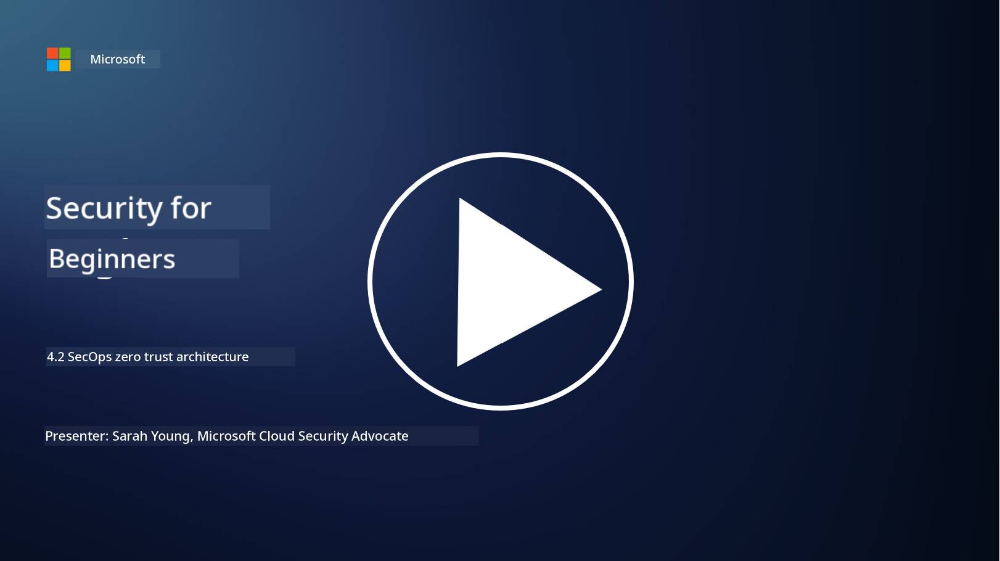

<!--
CO_OP_TRANSLATOR_METADATA:
{
  "original_hash": "45bbdc114e70936816b0b3e7c40189cf",
  "translation_date": "2025-11-18T18:13:29+00:00",
  "source_file": "4.2 SecOps zero trust architecture.md",
  "language_code": "pcm"
}
-->
# SecOps zero trust architecture

Security operations na two parts wey dey inside zero trust architecture, and for dis lesson we go learn about both:

- How IT architecture suppose dey build to make sure say log collection dey centralized?

- Wetin be di best practices for security operations for modern IT environments?

## How IT architecture suppose dey build to make sure say log collection dey centralized?

Centralized log collection na one important part of modern security operations. E dey help organizations gather logs and data from different sources, like servers, applications, network devices, and security tools, put am for one central place for analysis, monitoring, and incident response. Dis na some best practices to build IT architecture wey go support centralized log collection:

1. **Log Source Integration**:

- Make sure say all di devices and systems wey dey important dey configured to generate logs. Dis one include servers, firewalls, routers, switches, applications, and security appliances.

- Configure log sources to dey forward logs go centralized log collector or management system.

2. **Choose correct SIEM (Security Information and Event Management) tool**:

- Pick SIEM solution wey match your organization needs and size.

- Make sure say di solution wey you choose fit support log collection, aggregation, analysis, and reporting.

3. **Scalability and Redundancy**:

- Design di architecture make e fit grow as di number of log sources and log volume dey increase.

- Put redundancy for high availability so dat hardware or network failure no go cause wahala.

4. **Transport logs securely**:

- Use secure protocols like TLS/SSL or IPsec to carry logs from di sources go di centralized repository.

- Put authentication and access controls to make sure say na only authorized devices fit send logs.

5. **Normalization**:

- Standardize log formats and normalize data so dat e go dey consistent and easy to analyze.

6. **Storage and Retention**:

- Decide how long you go keep logs based on compliance and security requirements.

- Store logs well, protect am from unauthorized access and tampering.

## Wetin be di best practices for security operations for modern IT environments?

Apart from centralized log collection, dis na some best practices for security operations for modern IT environments:

1. **Continuous Monitoring**: Dey monitor network and system activities steady to fit detect and respond to threats quick.

2. **Threat Intelligence**: Dey follow up on new threats and vulnerabilities by using threat intelligence feeds and services.

3. **User Training**: Dey do regular security awareness training for workers to reduce risks wey dey come from social engineering and phishing attacks.

4. **Incident Response Plan**: Create and test incident response plan so dat you go fit respond to security incidents fast and well.

5. **Security Automation**: Use security automation and orchestration tools to make incident response and repetitive tasks easy.

6. **Backup and Recovery**: Put strong backup and disaster recovery solutions to make sure say data go dey available if data loss or ransomware attack happen.

## Further reading

- [Microsoft Security Best Practices module: Security operations | Microsoft Learn](https://learn.microsoft.com/security/operations/security-operations-videos-and-decks?WT.mc_id=academic-96948-sayoung)
- [Security operations - Cloud Adoption Framework | Microsoft Learn](https://learn.microsoft.com/azure/cloud-adoption-framework/secure/security-operations?WT.mc_id=academic-96948-sayoung)
- [What is Security Operations and Analytics Platform Architecture? A Definition of SOAPA, How It Works, Benefits, and More (digitalguardian.com)](https://www.digitalguardian.com/blog/what-security-operations-and-analytics-platform-architecture-definition-soapa-how-it-works#:~:text=All%20in%20all%2C%20security%20operations%20and%20analytics%20platform,become%20more%20efficient%20and%20operative%20with%20your%20security.)

---

<!-- CO-OP TRANSLATOR DISCLAIMER START -->
**Disclaimer**:  
Dis document don use AI translation service [Co-op Translator](https://github.com/Azure/co-op-translator) take translate am. Even though we dey try make e accurate, abeg sabi say automated translations fit get mistake or no dey 100% correct. Di original document for di native language na di main correct source. For important information, e better make una use professional human translation. We no go fit take responsibility for any misunderstanding or wrong interpretation wey fit happen because of dis translation.
<!-- CO-OP TRANSLATOR DISCLAIMER END -->