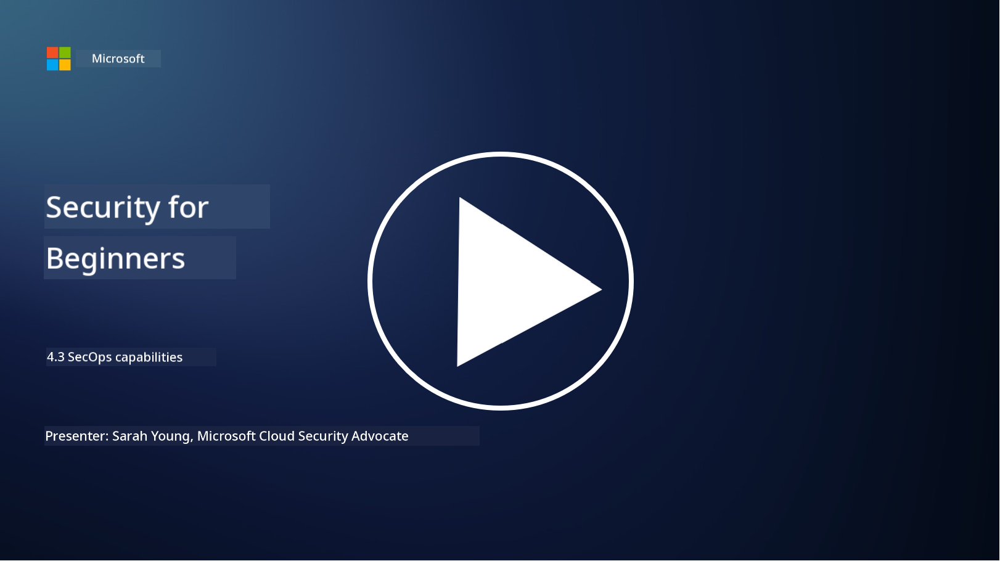

<!--
CO_OP_TRANSLATOR_METADATA:
{
  "original_hash": "553eb694c89f1caca0694e8d8ab89e0e",
  "translation_date": "2025-11-18T18:12:44+00:00",
  "source_file": "4.3 SecOps capabilities.md",
  "language_code": "pcm"
}
-->
# SecOps capabilities

For dis section, we go talk more about di main tools and wetin dem fit do for security operations.

For dis lesson, we go cover:

- Wetin be security information and event management (SIEM) tool?

- Wetin be XDR?

- Wetin dem fit use take make security operations better?

## Wetin be security information and event management (SIEM) tool?

Security Information and Event Management (SIEM) tool na tool wey dey help analyze security alerts wey dey come from di IT environment of one organization. Dem dey collect, join, compare, and analyze log data and security events from different sources like network devices, servers, applications, and security systems.

Di main things wey SIEM tools dey do include:

1. **Log Collection**: SIEM tools dey collect logs and security event data from plenty devices, systems, and applications like firewalls, intrusion detection systems, antivirus software, and others.

2. **Data Normalization**: Dem dey arrange log data into one common format so e go easy to analyze and compare.

3. **Event Correlation**: SIEM tools dey compare events to find patterns and things wey no normal wey fit mean say security wahala dey.

4. **Alerting and Notification**: SIEM tools dey send alerts and notifications quick quick when dem see suspicious activities or security wahala, so pipo fit act fast.

5. **Incident Detection**: Dem dey help detect security wahala like unauthorized access, data breaches, malware wahala, and insider threats.

6. **User and Entity Behavior Analytics (UEBA)**: Some SIEM tools dey use UEBA to find abnormal behavior from users or entities wey fit mean say account don compromise or insider wahala dey.

7. **Threat Intelligence Integration**: SIEM tools fit connect with threat intelligence feeds to make threat detection better by comparing known indicators of compromise (IOCs) with network activity.

8. **Automation and Orchestration**: Automation dey allow SIEMs to handle common security wahala by demself, so response go fast and e go reduce manual work.

9. **Dashboard and Visualization**: Dem dey provide dashboards and tools wey go help monitor security data and create reports.

10. **Integration with Other Security Tools**: SIEM tools dey work with other security tools like endpoint detection and response (EDR) solutions to give full view of di organization security.

## Wetin be XDR?

XDR (Extended Detection and Response) na technology wey dey expand di work wey Endpoint Detection and Response (EDR) dey do and join am with security data from different sources to give better view of di organization security. XDR dey help detect threats, respond to incidents, and make security better by fixing di wahala wey dey when pipo dey use only EDR, SIEM or other single security tools.

Di main things wey XDR dey do include:

1. **Data Integration**: XDR dey join data from different sources like endpoints, network traffic, cloud services, email, and others. Dis dey give better context for threat detection and analysis.

2. **Advanced Analytics**: XDR dey use advanced analytics, machine learning, and behavioral analysis to find and rank security threats. E dey look for patterns and things wey no normal inside di data.

3. **Automated Threat Detection**: XDR dey automate di detection of security threats and things wey no normal by joining information from different sources. E fit find complex attack chains wey dey use different methods.

4. **Incident Investigation and Response**: XDR dey provide tools wey go help security teams check di size and effect of incidents and take action.

5. **Threat Intelligence Integration**: E dey connect with threat intelligence feeds to make threat detection better by comparing known indicators of compromise (IOCs) with di organization network and endpoint activity.

6. **Unified Console**: XDR dey usually provide one dashboard wey security teams fit use manage security alerts and incidents from different sources.

7. **Cross-Platform Coverage**: XDR dey work for plenty platforms like endpoints, servers, cloud environments, and mobile devices, so e dey good for modern IT environments wey dey use different platforms.

## Wetin dem fit use take make security operations better?

To make security operations better, organizations fit use di following things apart from SIEM tools:

1. **Machine Learning and Artificial Intelligence**: Use advanced analytics, machine learning, and AI to find new threats and automate threat hunting.

2. **User and Entity Behavior Analytics (UEBA)**: Check user and entity behavior to find things wey no normal and insider wahala.

3. **Threat Intelligence Feeds**: Connect with threat intelligence feeds to know di latest threats and indicators of compromise.

4. **Security Orchestration, Automation, and Response (SOAR)**: Use SOAR platforms to automate incident response and make security operations workflows easy.

5. **Deception Technologies**: Use deception technologies to confuse attackers and catch dem inside di network.

## Further reading

- [What is SIEM? | Microsoft Security](https://www.microsoft.com/security/business/security-101/what-is-siem?WT.mc_id=academic-96948-sayoung)
- [What Is SIEM? - Security Information and Event Management - Cisco](https://www.cisco.com/c/en/us/products/security/what-is-siem.html)
- [Security information and event management - Wikipedia](https://en.wikipedia.org/wiki/Security_information_and_event_management)
- [What Is XDR? | Microsoft Security](https://www.microsoft.com/security/business/security-101/what-is-xdr?WT.mc_id=academic-96948-sayoung)
- [XDR & XDR Security (kaspersky.com.au)](https://www.kaspersky.com.au/resource-center/definitions/what-is-xdr)
- [The Power of SecOps: Redefining Core Security Capabilities - The New Stack](https://thenewstack.io/the-power-of-secops-redefining-core-security-capabilities/)
- [Seven Steps to Improve Your Security Operations and Response (securityintelligence.com)](https://securityintelligence.com/seven-steps-to-improve-your-security-operations-and-response/)

---

<!-- CO-OP TRANSLATOR DISCLAIMER START -->
**Disclaimer**:  
Dis dokyument don use AI translation service [Co-op Translator](https://github.com/Azure/co-op-translator) take translate am. Even though we dey try make sure say e correct, abeg sabi say automated translations fit get mistake or no dey accurate well. Di original dokyument for im native language na di main correct source. For important information, e go beta make professional human translator check am. We no go fit take blame for any misunderstanding or wrong interpretation wey fit happen because of dis translation.
<!-- CO-OP TRANSLATOR DISCLAIMER END -->